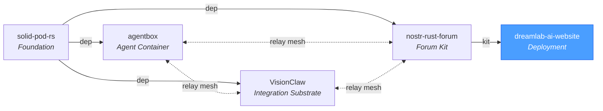
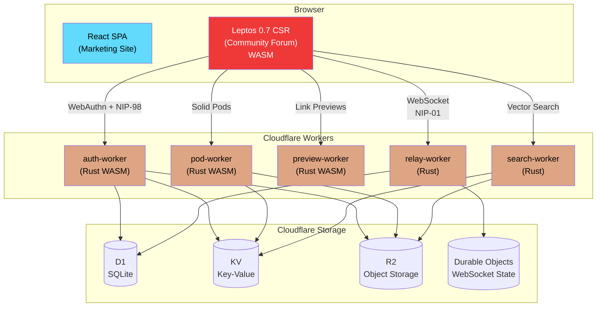
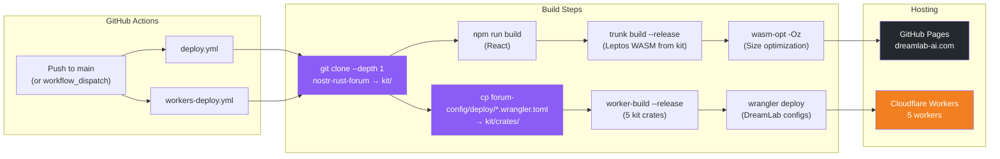

# DreamLab AI

**Premium AI training and consulting platform with a decentralized, end-to-end encrypted community forum.**

[](https://www.rust-lang.org/)
[](https://leptos.dev/)
[](https://webassembly.org/)
[](https://nostr.com/)
[](https://workers.cloudflare.com/)
[](https://react.dev/)

**Website**: [dreamlab-ai.com](https://dreamlab-ai.com) | **Repository**: [DreamLab-AI/dreamlab-ai-website](https://github.com/DreamLab-AI/dreamlab-ai-website)

---

## Ecosystem

dreamlab-ai-website consumes the [nostr-rust-forum](https://github.com/DreamLab-AI/nostr-rust-forum) kit as its forum backend, with DreamLab-specific branding and configuration in `forum-config/`. It is part of the DreamLab open-source ecosystem.



| Repository | Role | Key Technology |
|---|---|---|
| [solid-pod-rs](https://github.com/DreamLab-AI/solid-pod-rs) | Foundation library | Solid Protocol, DID:Nostr, WAC |
| [nostr-rust-forum](https://github.com/DreamLab-AI/nostr-rust-forum) | Forum kit | 11 `nostr-bbs-*` Rust crates, CF Workers |
| [agentbox](https://github.com/DreamLab-AI/agentbox) | Agent container | Nix, nostr-rs-relay, mesh peer |
| [VisionClaw](https://github.com/DreamLab-AI/VisionClaw) | Integration substrate | Knowledge graph, GPU physics, XR |
| **[dreamlab-ai-website](https://github.com/DreamLab-AI/dreamlab-ai-website)** | **Branded deployment** | **React SPA, WASM forum, `forum-config/`** |

---

## Architecture

The platform consists of a React marketing site, a Rust/Leptos WASM community forum powered by the upstream [nostr-rust-forum](https://github.com/DreamLab-AI/nostr-rust-forum) kit, and five Cloudflare Workers providing backend services. All communication is built on the Nostr protocol with end-to-end encryption. DreamLab-specific branding and operator configuration live in `forum-config/`.



## Features

- **Passkey-first authentication** -- WebAuthn PRF derives a secp256k1 private key deterministically via HKDF. The key is never stored; it exists only in a Rust closure and is zeroized on page unload.
- **End-to-end encrypted DMs** -- NIP-59 Gift Wrap protocol (Rumor, Seal, Wrap) with NIP-44 ChaCha20-Poly1305 encryption. The relay and server never see plaintext.
- **Zone-based access control** -- Three access zones (Home, DreamLab, Minimoonoir) enforced at both the relay and client layers with cohort-based gating.
- **Agent Control Surface** -- Governance dashboard at `/governance` powered by custom Nostr event kinds 31400-31405. AI agents publish interactive control panels; human operators approve/reject actions via NIP-98 signed responses. Gated behind `governance = true` feature flag in `forum-config/dreamlab.toml`.
- **Solid pods with LDP compliance** -- Full Linked Data Platform containers, WAC ACL inheritance, conditional requests (ETags), Range streaming, JSON Patch (RFC 6902), per-user quotas, WebID profiles, content negotiation, and pod provisioning.
- **Agent micropayments** -- HTTP 402 Payment Required with Web Ledgers spec, Bitcoin TXO deposit via mempool verification, per-request satoshi cost for pay-gated resources.
- **Federation-ready** -- WebFinger discovery (remoteStorage + Solid), NIP-05 verification, Solid Notifications (webhooks), `.well-known/solid` discovery document.
- **WASM vector search** -- RuVector WASM microkernel (42KB) with `.rvf` container format, running in a Cloudflare Worker at 490K vectors/sec. Cmd/K global semantic search.
- **Smart auth UX** -- Progressive disclosure login (auto-detects NIP-07 extensions), friendly labels with optional technical mode toggle, forum-first navigation.
- **Security hardened** -- XSS sanitization on all markdown rendering, NIP-98 body hash verification, rate limiting on all HTTP workers, env-based CORS, hibernation-safe relay subscriptions.
- **457 tests, 0 warnings** -- Comprehensive test coverage across all 7 crates including property-based tests for cryptographic operations.
- **3D visualizations** -- Three.js + React Three Fiber powering golden ratio Voronoi, 4D tesseract, and torus knot hero scenes on the marketing site.

## Tech Stack

| Layer | Technology |
|-------|-----------|
| Marketing Site | React 18.3 + TypeScript 5.5 + Vite 5.4 |
| Styling | Tailwind CSS 3.4 + shadcn/ui (Radix UI) |
| 3D | Three.js 0.156 + React Three Fiber |
| Community Forum | **Rust / Leptos 0.7** (CSR, WASM, amber/gray theme, 19 routes incl. `/governance`, 58+ components) |
| Nostr Protocol | nostr-core (Rust) — NIP-01/07/09/29/33/40/42/45/50/52/98 + kinds 31400-31405 (governance) |
| Auth | WebAuthn PRF via passkey-rs + NIP-98 + NIP-07 extension |
| Encryption | NIP-44 (ChaCha20-Poly1305) + NIP-59 Gift Wrap |
| Backend | 5 Cloudflare Workers (Rust) via `worker` 0.7.5 |
| Storage | Cloudflare D1, KV, R2, Durable Objects |
| Solid Pods | LDP containers, WAC ACL inheritance, JSON Patch, quotas, WebID, micropayments |
| Hosting | GitHub Pages (static) + Cloudflare Workers (API) |
| WASM Search | RuVector microkernel + `.rvf` format + Cmd/K semantic search |
| Crypto | k256, chacha20poly1305, hkdf, sha2 (NCC-audited) |
| Tests | **457 tests**, 0 failures, 0 compiler warnings |

## Quick Start

### Prerequisites

```bash
# Node.js 20+ (for React marketing site)
npm install -g wrangler
```

The WASM forum is pre-built and deployed to GitHub Pages via CI. For local React site development, only Node.js is required.

### Clone and Develop

```bash
git clone https://github.com/DreamLab-AI/dreamlab-ai-website.git
cd dreamlab-ai-website

# Install Node dependencies (React site + Tailwind)
npm install

# React marketing site (http://localhost:5173)
npm run dev
```

### Commands

| Command | Description |
|---------|-------------|
| `npm run dev` | React marketing site with HMR |
| `npm run build` | Production build of React site |
| `npm run lint` | ESLint code quality checks |

## Project Structure

```
dreamlab-ai-website/
  src/                          React SPA (13 lazy-loaded routes)
    pages/                      Route pages (Index, Team, Workshops, Contact, ...)
    components/                 70+ React components (shadcn/ui primitives in ui/)
    hooks/                      Custom React hooks
    lib/                        Utilities, Supabase client

  forum-config/                 Operator overlay for nostr-rust-forum kit
    Cargo.toml                  Depends on nostr-bbs-{core,config,mesh} from crates.io
    dreamlab.toml               DreamLab-specific operator config
    src/                        Branding + per-worker entry shims
    deploy/                     Per-worker wrangler.toml with DreamLab CF resource IDs

  wasm-voronoi/                 Rust WASM for 3D Voronoi hero effect
  public/data/                  Runtime content (team profiles, workshops, media)
  scripts/                      Build and utility scripts
  docs/                         Full documentation suite
```

## Documentation

All documentation lives in the [`docs/`](docs/README.md) directory. Start there for the full navigation hub.

| Document | Description |
|----------|-------------|
| [Documentation Hub](docs/README.md) | Central navigation for all project docs |
| [PRD: Rust Port v2.0.0](docs/prd-rust-port.md) | Accepted architecture baseline |
| [PRD: Rust Port v2.1.0](docs/prd-rust-port-v2.1.md) | Refined delivery plan with tranche-based execution |
| [Architecture Decision Records](docs/adr/README.md) | 25 ADRs tracking every major decision |
| [Domain-Driven Design](docs/ddd/README.md) | Domain model, bounded contexts, aggregates, events |
| [API Reference](docs/api/AUTH_API.md) | Auth, Pod, Relay, and Search API docs |
| [Security Overview](docs/security/SECURITY_OVERVIEW.md) | Compile-time safety, crypto stack, access control |
| [Authentication](docs/security/AUTHENTICATION.md) | Passkey PRF flow, NIP-98, session management |
| [Deployment](docs/deployment/README.md) | CI/CD pipelines, environments, DNS |
| [Getting Started](docs/developer/GETTING_STARTED.md) | Prerequisites, setup, local development |
| [Rust Style Guide](docs/developer/RUST_STYLE_GUIDE.md) | Coding standards, error handling, module patterns |
| [Benchmarks](docs/benchmarks/baseline-native.md) | nostr-core native performance baseline |
| [Feature Parity Matrix](docs/tranche-1/feature-parity-matrix.md) | SvelteKit-to-Rust migration tracking |
| [Route Parity Matrix](docs/tranche-1/route-parity-matrix.md) | Route-by-route migration status |

## Deployment

This repo is a **consumer** of the [nostr-rust-forum](https://github.com/DreamLab-AI/nostr-rust-forum) kit. It does not contain forum source code. All Rust worker and forum-client source lives upstream in the kit repo. CI workflows shallow-clone the kit at build time and overlay DreamLab-specific wrangler.toml configs from `forum-config/deploy/`.



### Kit Consumer Architecture

The separation follows **PRD-012** (kit adoption) and **ADR-085** (forum-config package):

| Concern | Location | Owned by |
|---------|----------|----------|
| Worker source code | `nostr-rust-forum` (kit repo, crates.io) | Kit maintainers |
| Forum client (Leptos WASM) | `nostr-rust-forum` (kit repo) | Kit maintainers |
| CF resource IDs (D1, KV, R2) | `forum-config/deploy/*.wrangler.toml` | **This repo** |
| Operator config (branding, vars) | `forum-config/dreamlab.toml` | **This repo** |
| React marketing site | `src/` | **This repo** |
| Test suites | `tests/` | **This repo** |

To upgrade the kit version, update `KIT_REF` in the workflow env (currently tracks `main`). For pinned releases, set it to a tag like `v3.0.0`.

All workflows are guarded with `if: github.repository == 'DreamLab-AI/dreamlab-ai-website'`.

| Target | Domain | Source |
|--------|--------|--------|
| React marketing site | `dreamlab-ai.com` | GitHub Pages (`gh-pages` branch) |
| Leptos forum client | `dreamlab-ai.com/community/` | GitHub Pages (WASM in `dist/community/`) |
| auth-worker | `api.dreamlab-ai.com` | Cloudflare Worker (Rust WASM) |
| pod-worker | `pods.dreamlab-ai.com` | Cloudflare Worker (Rust WASM) |
| preview-worker | `preview.dreamlab-ai.com` | Cloudflare Worker (Rust WASM) |
| relay-worker | `relay.dreamlab-ai.com` | Cloudflare Worker (Rust) |
| search-worker | `search.dreamlab-ai.com` | Cloudflare Worker (Rust) |

## Security Highlights

- **XSS sanitization** -- All user markdown rendered via `sanitize_markdown()` with comrak `unsafe_=false` + `tagfilter=true`; zero raw `inner_html` injection
- **NCC Group-audited cryptography** -- `k256` (secp256k1/Schnorr), `chacha20poly1305` (NIP-44 AEAD)
- **Key never stored** -- WebAuthn PRF output fed through HKDF; private key lives only in a Rust `Option<SecretKey>` closure, zeroized via the `zeroize` crate on page unload
- **NIP-98 body verification** -- All POST/PUT workers verify SHA-256 payload hash in the NIP-98 token against the actual request body
- **Rate limiting** -- KV-backed sliding window on all HTTP workers (auth: 20/min, preview: 30/min, search: 100/min)
- **Env-based CORS** -- No hardcoded localhost origins in production; `ALLOWED_ORIGINS` env var
- **SSRF protection** -- Link preview Worker blocks private/loopback/metadata IP ranges (20+ tests)
- **Relay-level enforcement** -- Whitelist, rate limits (10 events/sec), connection limits (20/IP), size limits (64KB), hibernation-safe subscription persistence
- **457 tests, 0 warnings** -- Comprehensive test suite including property-based tests for cryptographic operations

## Licence

Proprietary. Copyright 2024-2026 DreamLab AI Consulting Ltd. All rights reserved.

---

*Last updated: 2026-05-12*
