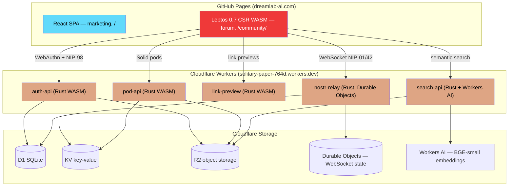

# DreamLab AI

**The DreamLab AI company website — the commercial face of the ecosystem. A dual-SPA Cloudflare-edge deployment with a decentralised four-zone community forum — end-to-end encrypted where it matters (Family zone and DMs via NIP-59 gift wrap).**

[](https://www.rust-lang.org/)
[](https://leptos.dev/)
[](https://webassembly.org/)
[](https://nostr.com/)
[](https://workers.cloudflare.com/)
[](https://react.dev/)

**Website**: [dreamlab-ai.com](https://dreamlab-ai.com) · **Forum**: [dreamlab-ai.com/community/](https://dreamlab-ai.com/community/) · **Repository**: [DreamLab-AI/dreamlab-ai-website](https://github.com/DreamLab-AI/dreamlab-ai-website)

**Maintainer**: [John O'Hare](https://github.com/jjohare) · **Upstream IP**: [Melvin Carvalho](https://github.com/melvincarvalho) ([JSS](https://github.com/JavaScriptSolidServer/JavaScriptSolidServer), [DID:Nostr](https://github.com/nicholasgasior/did-nostr)) · [MAINTAINERS.md](MAINTAINERS.md)

Two SPAs, one origin: a React marketing site at `/` and a Rust/Leptos 0.7 CSR WASM forum at `/community/`, backed by five Rust Cloudflare Workers (auth, pod, preview, relay, search). Identity is `did:nostr` — WebAuthn PRF passkeys, NIP-07 extension, or private key. Access is organised into four zones (public MiniMooNoir landing plus locked Friends, Family, and DreamLab business zones), authored once in `forum-config/dreamlab.toml` and enforced at both the relay and the client. This repo is a **thin consumer of the [nostr-rust-forum](https://github.com/DreamLab-AI/nostr-rust-forum) kit**, not a protocol owner: the forum source, workers, and Nostr crates live upstream; DreamLab branding, zone configuration, and Cloudflare resource IDs live here in `forum-config/`.

---

## Screenshots


*Marketing site hero at [dreamlab-ai.com](https://dreamlab-ai.com) — canvas-rendered golden-ratio Voronoi scene.*


*MiniMooNoir forum landing (signed out) — passkey-first onboarding, Nostr identity, E2E encryption.*


*The four-zone model as a friends-cohort member: Public and Friends zones open; Family and DreamLab render as visible-but-locked tiles.*


*Live chat in the Friends zone — display names resolved from kind-0 profiles (NIP-05 and short-key fallback).*


*NIP-52 calendar privacy tiers: a friends-visible event in full detail alongside redacted free/busy blocks.*

---

## Ecosystem

DreamLab AI is the commercial front door of the [VisionFlow](https://github.com/DreamLab-AI/VisionFlow) ecosystem — a federated architecture for human–AI intelligence built on `did:nostr` identity, OWL 2 EL reasoning, and Nostr message passing. This website is a deliberately thin, edge-deployed consumer: it draws its community substrate from **nostr-rust-forum** and its identity/data layer, via the kit, from **solid-pod-rs**.

| Repository | Role in the ecosystem |
|---|---|
| [VisionFlow](https://github.com/DreamLab-AI/VisionFlow) | Ecosystem canon — vision report, pitch decks, marketing site, coordination architecture |
| [VisionClaw](https://github.com/DreamLab-AI/VisionClaw) | Flagship engine — ontology-grounded immersive 3D knowledge-graph platform, GPU physics, XR |
| [agentbox](https://github.com/DreamLab-AI/agentbox) | Sovereign agent runtime — Nix container, `did:nostr` agent identities, skills, RuVector memory, mesh peer |
| [solid-pod-rs](https://github.com/DreamLab-AI/solid-pod-rs) | Personal-data-sovereignty layer — Rust Solid pod server (LDP, WAC, DID:Nostr) |
| [nostr-rust-forum](https://github.com/DreamLab-AI/nostr-rust-forum) | Human+agent communication substrate — Nostr-native forum + relay in Rust (the kit this repo consumes) |
| [knowledgeGraph](https://github.com/DreamLab-AI/knowledgeGraph) | narrativegoldmine.com — the published public knowledge graph, the corpus VisionClaw renders in 3D |
| **[dreamlab-ai-website](https://github.com/DreamLab-AI/dreamlab-ai-website)** | **This repo — the commercial face; Cloudflare-deployed with a workers Nostr relay + D1 identity whitelist** |

**Industry convergence.** In July 2026 Block (Jack Dorsey) launched [Buzz](https://github.com/block/buzz), a self-hosted, Nostr-native team-chat + AI-agent + git platform in Rust. It independently arrives at the same substrate this ecosystem has run since 2022 — Nostr events as source of truth, agents as first-class signed participants, NIP-42/98 auth, kind-based extensibility. This deployment's differentiation is the Solid-pod identity/data layer and the ontology-grounded sibling repos (VisionClaw) that Buzz does not have. Buzz is ahead on its end-to-end NIP-42 relay gate; this repo's relay currently uses a pubkey allowlist rather than enforced NIP-42 challenge/response.

---

## Architecture

A dual-SPA deployment served from GitHub Pages — a React marketing site and a Rust/Leptos WASM forum — plus five Rust Cloudflare Workers over Nostr; the Family zone and DMs are end-to-end encrypted (NIP-59), other zones are relay-gated. The forum source lives upstream in the kit; only DreamLab operator configuration lives here.



### Four-zone access model

Zones are authored once in `forum-config/dreamlab.toml` (`[[zones]]`) and projected into two enforcement points that must stay in sync: the relay's `ZONE_CONFIG` var (server-side, deny-by-default) and the client's `window.__ENV__.ZONE_CONFIG` (rendered zone tiles). Cohorts (`family`, `friends`, `business`, `agent`, plus admin pubkeys) are assigned via the NIP-98-authenticated whitelist API backed by D1.

| Zone | Slug | Read | Write | Non-members see | Encryption |
|---|---|---|---|---|---|
| **MiniMooNoir landing** | `public` | everyone | `friends`, `agent`, admin | — (public) | none |
| **Friends** | `friends` | `friends`, admin | `friends`, admin | visible-but-locked tile | relay-ACL |
| **Family** | `family` | `family`, admin | `family`, admin | visible-but-locked tile | **NIP-44** |
| **DreamLab (business)** | `business` | `business`, admin | `business`, admin | visible-but-locked tile | relay-ACL |

Tiered NIP-52 calendar events carry a zone tag; the relay projects each event per viewer tier on read (full detail, redacted free/busy, or omission). Full cohort taxonomy, calendar matrix, and rationale: [Forum Org Redesign](docs/architecture/forum-org-redesign.md).

---

## Features

- **Passkey-first authentication** — WebAuthn PRF derives a secp256k1 key deterministically via HKDF; the key is never stored, exists only in a Rust closure, and is zeroized on page unload. NIP-07 extension and direct key entry are also supported.
- **Four-zone access control** — config-driven from `forum-config/dreamlab.toml`, enforced at the relay (`ZONE_CONFIG`) and rendered client-side as visible-but-locked zone tiles.
- **Tiered NIP-52 calendar** — per-cohort event projection at the relay: full detail, redacted free/busy, or omission.
- **Display names everywhere** — pubkeys resolve to kind-0 profile names, then NIP-05, then a short-key fallback, across chat, forums, events, and DMs.
- **Semantic search** — Workers AI `@cf/baai/bge-small-en-v1.5` embeddings (384-dim) over an RVF vector store in R2; Cmd/K global search.
- **End-to-end encrypted DMs** — NIP-59 Gift Wrap (Rumor, Seal, Wrap) with NIP-44 ChaCha20-Poly1305. The relay and server never see plaintext.
- **Agent Control Surface** — a governance dashboard at `/governance` (Nostr kinds 31400–31405, shipped in the 2026-05-12 sprint): agents publish interactive control panels, operators approve/reject via NIP-98 signed responses. Gated behind `governance = true`.
- **Solid pods with LDP compliance** — Linked Data Platform containers, WAC ACL inheritance, conditional requests (ETags), Range streaming, JSON Patch (RFC 6902), per-user quotas, WebID profiles.
- **Federation-ready** — WebFinger discovery, NIP-05 verification, Solid Notifications, `.well-known/solid` discovery document.

## Tech Stack

| Layer | Technology |
|-------|-----------|
| Marketing site | React 18.3 + TypeScript 5.9 + Vite 5.4, Tailwind 3.4 + shadcn/ui |
| Hero scenes | Canvas 2D golden-ratio Voronoi (zero-dependency, no WebGL) |
| Community forum | Rust / Leptos 0.7 (CSR, WASM, 19 routes incl. `/governance`) |
| Nostr protocol | `nostr-bbs-core` / upstream `nostr` crate — NIP-01/05/07/09/28/29/33/40/42/44/45/50/52/59/98 + kinds 31400–31405 |
| Auth | WebAuthn PRF via `passkey-rs` + NIP-98 + NIP-07 |
| Encryption | NIP-44 (ChaCha20-Poly1305) + NIP-59 Gift Wrap |
| Backend | 5 Cloudflare Workers (Rust) via the `worker` crate |
| Storage | Cloudflare D1, KV, R2, Durable Objects |
| Search | Workers AI BGE-small-en-v1.5 (384-dim) + RVF vector store on R2 |
| Crypto | `k256`, `chacha20poly1305`, `hkdf`, `sha2` (NCC-audited) |

Security posture (XSS sanitisation, NIP-98 replay protection, KV-backed rate limiting, env-based CORS, SSRF protection, relay-level zone enforcement) is summarised in [Security Overview](docs/security/SECURITY_OVERVIEW.md) and [Authentication](docs/security/AUTHENTICATION.md).

## Quick Start

```bash
# Node.js 20+ (React site, seed/probe scripts); Rust 1.90 only for forum-config overlay tests
git clone https://github.com/DreamLab-AI/dreamlab-ai-website.git
cd dreamlab-ai-website
npm install
npm run dev          # React marketing site (http://localhost:5173)
```

The WASM forum is pre-built and deployed to GitHub Pages via CI; local React development needs only Node.js. `npm install -g wrangler` is required only for worker operations.

| Command | Description |
|---------|-------------|
| `npm run dev` | React marketing site with HMR |
| `npm run build` | Production build of the React site |
| `npm run lint` | ESLint checks |
| `cd forum-config && cargo test` | Operator-overlay tests (config parsing, branding, deploy manifests) |

Operator seed/probe tooling for the live four-zone deployment lives in `scripts/seed/` (`seed-forum-zones.mjs`, `probe-calendar.mjs`, `probe42.mjs`, `probe-etag.mjs`, `find-admin-key.mjs`). The admin key is read from the operator's environment and never printed.

## Deployment

CI clones the kit at a pinned commit and overlays DreamLab-specific `wrangler.toml` configs from `forum-config/deploy/`. The React site builds to `gh-pages`; the five Rust workers deploy to Cloudflare. Full pipeline, environments, and DNS: [Deployment](docs/deployment/README.md).

### Live targets

| Target | URL |
|--------|-----|
| React marketing site | `dreamlab-ai.com` (GitHub Pages, `gh-pages` branch) |
| Leptos forum client | `dreamlab-ai.com/community/` (WASM in `dist/community/`) |
| auth / pod / preview / relay / search workers | `dreamlab-{auth-api,pod-api,link-preview,nostr-relay,search-api}.solitary-paper-764d.workers.dev` |

The branded custom domains (`relay.`/`api.`/`pods.`/`search.`/`preview.dreamlab-ai.com`) are the documented end-state but are **not yet provisioned in DNS**; the client's `window.__ENV__` points at the live `workers.dev` hosts.

### Kit pinning

The kit source is pinned at commit `672b7c36bcef8a5c9f297523ec8986f7e1d7ffda` (branch `main`, tag `soak-fix-2026-07-23`, kit **v1.0.0-beta.6**, re-pinned 2026-07-23). Since beta.6 the git-SHA pin on the library crates was retired: the four `nostr-bbs-*` crates now come from **crates.io by version string** (`1.0.0-beta.6`), and only the source-clone build still pins a SHA. Five pin sites must stay in lockstep, machine-checked by the `pin-check` job in `.github/workflows/ci.yml`:

1. `KIT_REF` in `.github/workflows/deploy.yml` (forum client build)
2. `KIT_REF` in `.github/workflows/workers-deploy.yml` (worker builds)
3. `KIT_REF` in `.github/workflows/rust-ci.yml` (kit-level fmt/clippy/test gates)
4. `CANONICAL_KIT_SHA` / `CANONICAL_KIT_VERSION` in [`docs/architecture/kit-compatibility-record.md`](docs/architecture/kit-compatibility-record.md)
5. The `nostr-bbs-*` crates.io version strings in [`forum-config/Cargo.toml`](forum-config/Cargo.toml)

The compatibility record is the living source of truth for the current pin — consult it rather than this README, which does not need a manual bump on each kit move. Governed by [ADR-038 Kit-Ref Pin Governance](docs/adr/038-kit-ref-pin-governance.md); the thin-consumer cutover is [ADR-040](docs/adr/040-gap-close-edge-decisions.md) and operator/kit separation is [ADR-037](docs/adr/037-config-single-source-of-truth.md).

### Federation transports

The relay-worker (Durable Objects) bridges browser clients to the Nostr relay and surfaces governance events (kinds 31400–31405). A `[mesh]` block in `forum-config/dreamlab.toml` declares cross-peer federation (`peer_relays` currently empty; populated when agentbox/VisionClaw peers come online). When `[native_pod]` is enabled, the auth-worker reaches an agentbox-hosted `solid-pod-rs` server over a Cloudflare Tunnel. As a GitHub Pages + Workers deployment this repo cannot join a Tailscale tailnet. Detail: [Forum Org Redesign](docs/architecture/forum-org-redesign.md).

## Documentation

All docs start at the [documentation hub](docs/README.md).

| Document | Description |
|----------|-------------|
| [Documentation Hub](docs/README.md) | Central navigation for all project docs |
| [Forum Org Redesign](docs/architecture/forum-org-redesign.md) | Four-zone model, cohort taxonomy, calendar visibility matrix |
| [Kit Compatibility Record](docs/architecture/kit-compatibility-record.md) | Living source of truth for the current kit pin |
| [Architecture Decision Records](docs/adr/README.md) | ADRs tracking every major decision |
| [Domain-Driven Design](docs/ddd/README.md) | Domain model, bounded contexts, aggregates, events |
| [Auth API Reference](docs/api/AUTH_API.md) | Auth, pod, relay, and search API docs |
| [Security Overview](docs/security/SECURITY_OVERVIEW.md) · [Authentication](docs/security/AUTHENTICATION.md) | Crypto stack, access control, passkey PRF flow, NIP-98 |
| [Deployment](docs/deployment/README.md) | CI/CD pipelines, environments, DNS |
| [Getting Started](docs/developer/GETTING_STARTED.md) · [Rust Style Guide](docs/developer/RUST_STYLE_GUIDE.md) | Onboarding and coding standards |
| [Gap-Close Edge PRD](docs/prd/prd-gap-close-edge-v1.0.md) | Maturity ledger — the register of record for remaining work |

## Status & remaining work

*As of 2026-07-22. Maturity words follow the ADR-002 ladder. The [gap-close edge PRD](docs/prd/prd-gap-close-edge-v1.0.md) maturity ledger is the register of record — figures there will drift, so consult it rather than restating counts here.*

- **Thin kit consumer** — `integrated` (done). Live pin `2d693ed2…` (beta.6, re-pinned 2026-07-21), five-site pin-check green.
- **Agent Control Surface at `/governance`** (kinds 31400–31405) — shipped (2026-05-12 sprint), distinct from the *unshipped* upstream disclosure badge and Agents roster tab below.
- **Upstream disclosure badge (COM-13) and Agents roster tab (F8)** — `planned`. Blocked on nostr-rust-forum shipping those components, not on this repo. Do not treat as delivered.
- **Roster legibility** (`authorised_by` field, visionclaw-server dual-admin-role bug) — `planned`.
- **Kit compatibility-record mechanism** — `integrated`.

## Licence

This repository is **dual-licensed by surface**:

**1. Branded React site (proprietary).** The branded React/WASM application —
everything outside `forum-config/` and the forum surfaces — is proprietary.
Copyright 2024-2026 DreamLab AI Consulting Ltd. All rights reserved. The root
`package.json` is marked `UNLICENSED` and applies to this React site.

**2. Forum surfaces (AGPL-3.0-only).** The forum surfaces — `forum-config/`, the
deployed Cloudflare workers (auth/pod/relay/preview/search), and the Leptos forum
client — are **combined works** of the AGPL-3.0-only
[nostr-rust-forum](https://github.com/DreamLab-AI/nostr-rust-forum) kit, whose
AGPL crates `forum-config` statically links. They are therefore licensed under
**AGPL-3.0-only**. Per **AGPL §13**, users who interact with these surfaces over
a network are entitled to the corresponding source: the canonical source offer is
the upstream kit repository (pinned at the rev recorded in
[`forum-config/Cargo.toml`](forum-config/Cargo.toml)), and the local operator
overlay source lives in [`forum-config/`](forum-config/) (see
[`forum-config/LICENSE`](forum-config/LICENSE)).

---

*Maintainers: [MAINTAINERS.md](MAINTAINERS.md). For the current state of any pin, figure, or dated claim, see git history and the linked docs — they move faster than this front page.*
