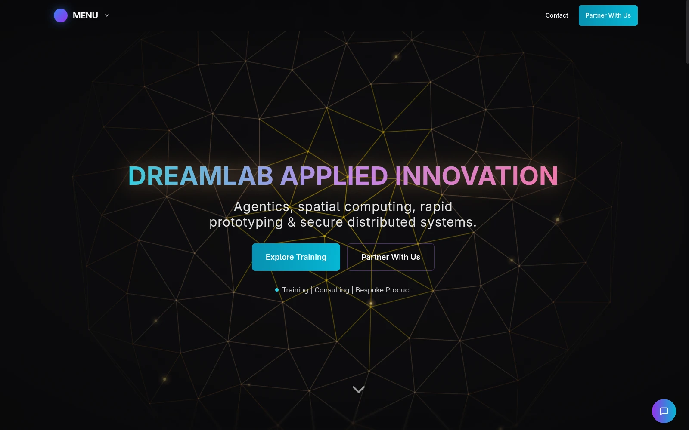
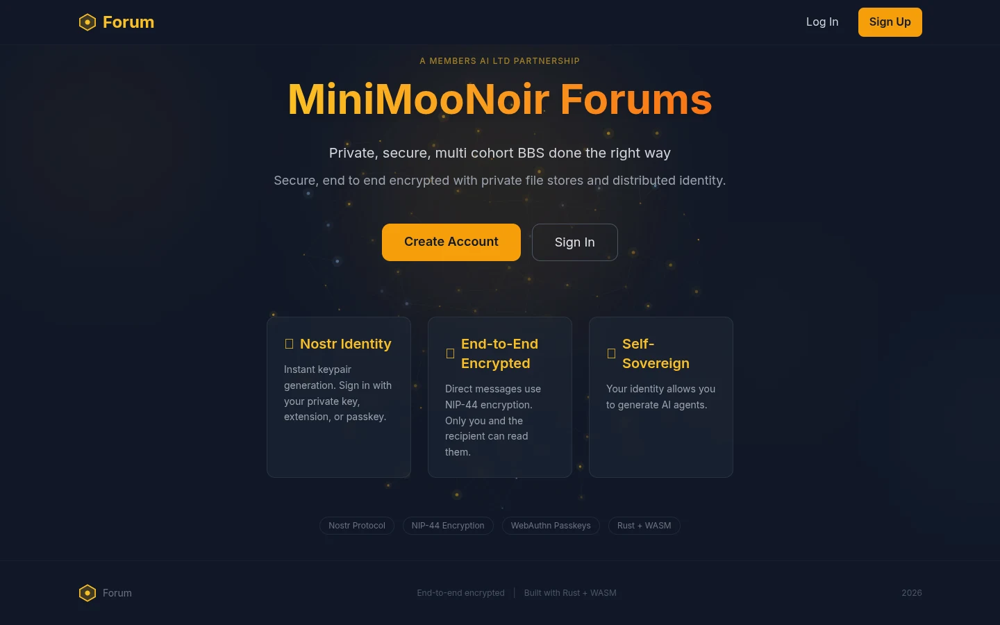
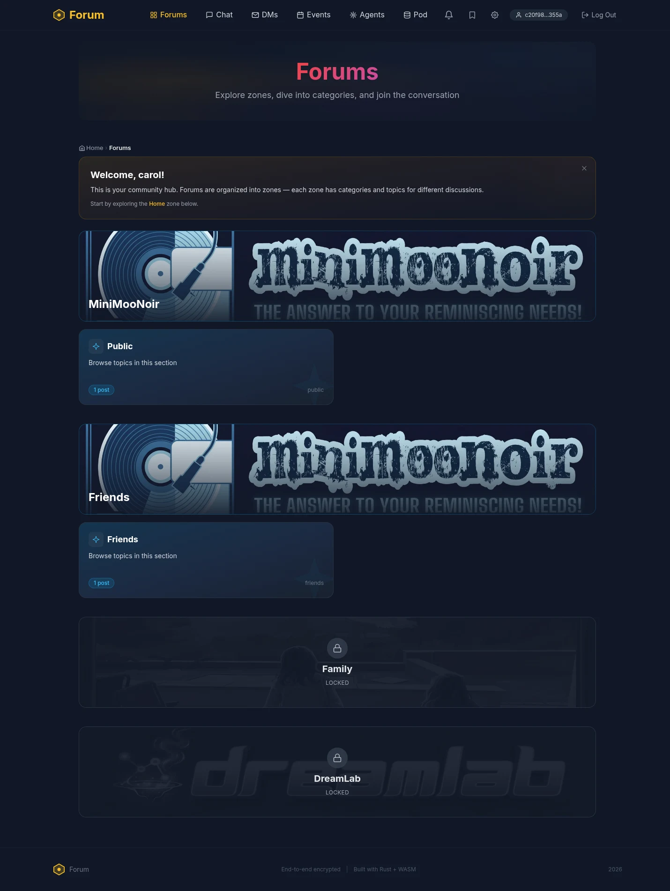
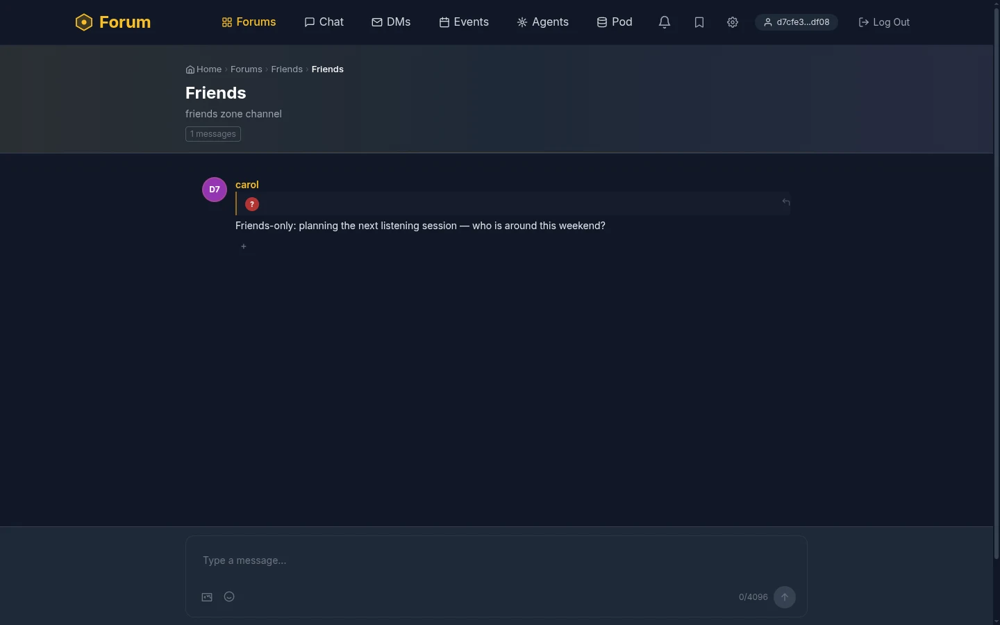
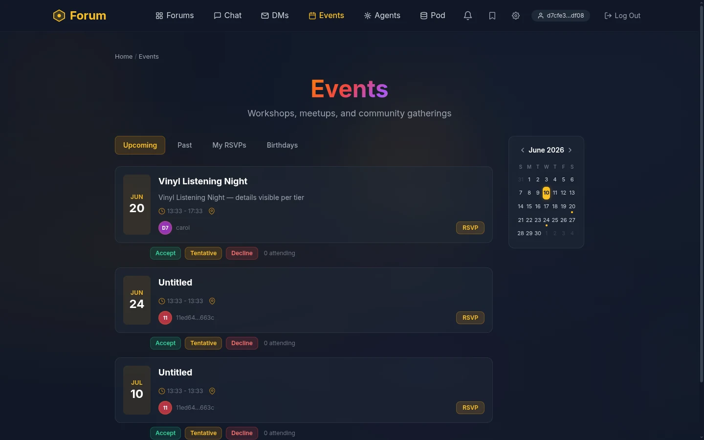
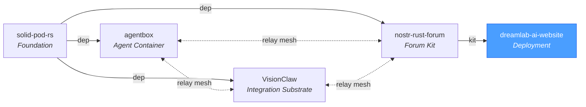
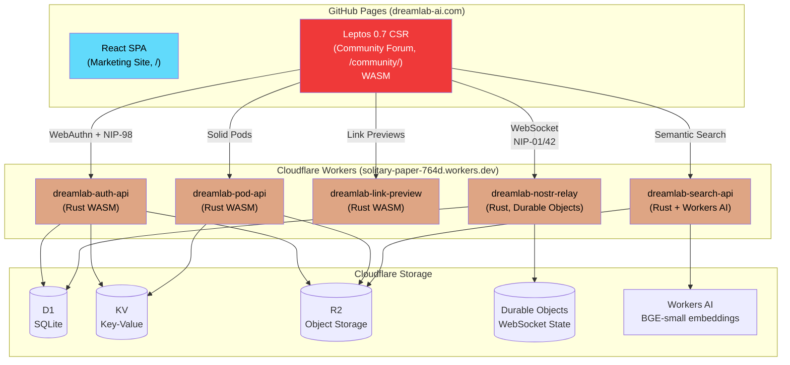
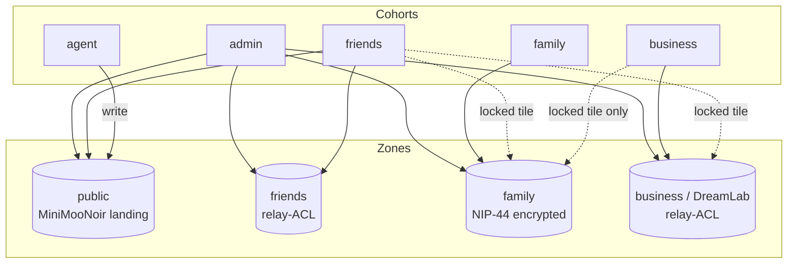
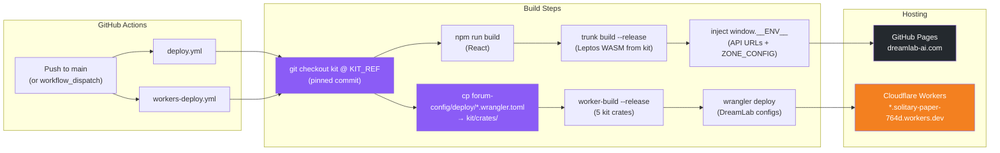

# DreamLab AI

**Premium AI training and consulting platform with a decentralized, end-to-end encrypted, four-zone community forum.**

[](https://www.rust-lang.org/)
[](https://leptos.dev/)
[](https://webassembly.org/)
[](https://nostr.com/)
[](https://workers.cloudflare.com/)
[](https://react.dev/)

**Website**: [dreamlab-ai.com](https://dreamlab-ai.com) | **Forum**: [dreamlab-ai.com/community/](https://dreamlab-ai.com/community/) | **Repository**: [DreamLab-AI/dreamlab-ai-website](https://github.com/DreamLab-AI/dreamlab-ai-website)

**Maintainer**: [John O'Hare](https://github.com/jjohare) · **Upstream IP**: [Melvin Carvalho](https://github.com/melvincarvalho) ([JSS](https://github.com/JavaScriptSolidServer/JavaScriptSolidServer), [DID:Nostr](https://github.com/nicholasgasior/did-nostr)) · [MAINTAINERS.md](MAINTAINERS.md)

Two SPAs, one origin: a React marketing site at `/` and a Rust/Leptos WASM forum at `/community/`, backed by five Rust Cloudflare Workers. Identity is `did:nostr` (passkey, extension, or private key); access is organised into four zones — a public MiniMooNoir landing plus locked Friends, Family, and DreamLab business zones — enforced at the relay and rendered as visible-but-locked tiles in the client. Calendar events project per viewer tier: full detail for some cohorts, redacted free/busy blocks for others.

---

## Screenshots


*Marketing site hero at [dreamlab-ai.com](https://dreamlab-ai.com) — canvas-rendered golden-ratio Voronoi scene.*


*MiniMooNoir forum landing (signed out) — passkey-first onboarding, Nostr identity, E2E encryption.*


*The four-zone model as a friends-cohort member: Public and Friends zones open with per-zone hero banners; Family and DreamLab render as visible-but-locked tiles.*


*Live chat in the Friends zone — display names resolved from kind-0 profiles (NIP-05 and short-key fallback).*


*NIP-52 calendar privacy tiers: a friends-visible event in full detail alongside redacted free/busy blocks projected from family/business venue events.*

---

## Ecosystem

dreamlab-ai-website consumes the [nostr-rust-forum](https://github.com/DreamLab-AI/nostr-rust-forum) kit as its forum backend, with DreamLab-specific branding and configuration in `forum-config/`. It is part of the DreamLab open-source ecosystem.



| Repository | Role | Key Technology |
|---|---|---|
| [solid-pod-rs](https://github.com/DreamLab-AI/solid-pod-rs) | Foundation library | Solid Protocol, DID:Nostr, WAC |
| [nostr-rust-forum](https://github.com/DreamLab-AI/nostr-rust-forum) | Forum kit | `nostr-bbs-*` Rust crates, CF Workers |
| [agentbox](https://github.com/DreamLab-AI/agentbox) | Agent container | Nix, nostr-rs-relay, mesh peer |
| [VisionClaw](https://github.com/DreamLab-AI/VisionClaw) | Integration substrate | Knowledge graph, GPU physics, XR |
| **[dreamlab-ai-website](https://github.com/DreamLab-AI/dreamlab-ai-website)** | **Branded deployment** | **React SPA, WASM forum, `forum-config/`** |

---

## Architecture

The platform is a dual-SPA deployment: a React marketing site and a Rust/Leptos WASM community forum, both served from GitHub Pages, plus five Rust Cloudflare Workers providing backend services. All communication is built on the Nostr protocol with end-to-end encryption. DreamLab-specific branding and operator configuration live in `forum-config/` — the forum source itself lives upstream in the [nostr-rust-forum](https://github.com/DreamLab-AI/nostr-rust-forum) kit.



### Four-zone org model

Zones are authored once in `forum-config/dreamlab.toml` (`[[zones]]`) and projected into both enforcement points: the relay's `ZONE_CONFIG` var (`forum-config/deploy/relay-worker.wrangler.toml`) gates reads/writes server-side, and `deploy.yml` injects the same JSON into the client's `window.__ENV__.ZONE_CONFIG` to render the zone tiles. Cohorts (`family`, `friends`, `business`, `agent`, plus admin pubkeys) are assigned via the NIP-98-authenticated whitelist API.



| Zone | Slug | Read | Write | Non-members see | Encryption |
|---|---|---|---|---|---|
| **MiniMooNoir landing** | `public` | everyone (incl. unauthenticated) | `friends`, `agent`, admin | — (public) | none |
| **Friends** | `friends` | `friends`, admin | `friends`, admin | visible-but-locked tile | relay-ACL |
| **Family** | `family` | `family`, admin | `family`, admin | visible-but-locked tile | **NIP-44** |
| **DreamLab (business)** | `business` | `business`, admin | `business`, admin | visible-but-locked tile | relay-ACL |

### Tiered calendar (NIP-52)

Calendar events carry a zone tag; the relay projects each event per viewer tier on read. "Free/busy" means start/end plus a busy flag for family/business events at the fairfield/dreamlab venues — titles, notes, and offsite events are never leaked. Business users are entirely unaware of the family and friends calendars.

| Viewer ↓ / Event → | Family events | Business events | Friends events | Their own |
|---|---|---|---|---|
| **admin** | full detail | full detail | full detail | full |
| **family** | full detail | full detail | full detail | full |
| **friends** | **free/busy only** | **free/busy only** | full detail | full |
| **business** | none (unaware) | full detail | none (unaware) | full |

## Features

- **Passkey-first authentication** -- WebAuthn PRF derives a secp256k1 private key deterministically via HKDF. The key is never stored; it exists only in a Rust closure and is zeroized on page unload. NIP-07 extensions and direct key entry are also supported.
- **Four-zone access control** -- Public / Friends / Family / Business zones, config-driven from `forum-config/dreamlab.toml`, enforced at the relay (`ZONE_CONFIG`) and rendered client-side as zone tiles with per-zone hero banners; locked zones stay visible-but-locked.
- **Tiered NIP-52 calendar** -- Per-cohort event projection at the relay: full detail, redacted free/busy, or omission, per the matrix above.
- **Display names everywhere** -- Pubkeys resolve to kind-0 profile names, then NIP-05, then a short-key fallback, across chat, forums, events, and DMs; claimed usernames surface in the nav.
- **Semantic search** -- Workers AI `@cf/baai/bge-small-en-v1.5` embeddings (384-dim) over an RVF vector store in R2, served by the search worker. Cmd/K global semantic search.
- **End-to-end encrypted DMs** -- NIP-59 Gift Wrap protocol (Rumor, Seal, Wrap) with NIP-44 ChaCha20-Poly1305 encryption. The relay and server never see plaintext.
- **Agent Control Surface** -- Governance dashboard at `/governance` powered by custom Nostr event kinds 31400-31405. AI agents publish interactive control panels; human operators approve/reject actions via NIP-98 signed responses. Gated behind `governance = true` feature flag in `forum-config/dreamlab.toml`.
- **Solid pods with LDP compliance** -- Full Linked Data Platform containers, WAC ACL inheritance, conditional requests (ETags), Range streaming, JSON Patch (RFC 6902), per-user quotas, WebID profiles, content negotiation, and pod provisioning.
- **Agent micropayments** -- HTTP 402 Payment Required with Web Ledgers spec, Bitcoin TXO deposit via mempool verification, per-request satoshi cost for pay-gated resources.
- **Federation-ready** -- WebFinger discovery (remoteStorage + Solid), NIP-05 verification, Solid Notifications (webhooks), `.well-known/solid` discovery document.
- **JSS v0.0.197 Solid alignment (May 2026)** -- Verified identity (federated NIP-05 with pod fallback), authenticated `POST /.pods` pod creation, JSS-compatible CORS/auth headers, TypeIndex/media provisioning. See [CHANGELOG.md](CHANGELOG.md).
- **Smart auth UX** -- Progressive disclosure login (auto-detects NIP-07 extensions), friendly labels with optional technical mode toggle, forum-first navigation.
- **Security hardened** -- XSS sanitization on all markdown rendering, NIP-98 body hash verification with D1-backed replay protection, rate limiting on all HTTP workers, env-based CORS, hibernation-safe relay subscriptions.
- **Generative hero scenes** -- canvas-rendered golden-ratio Voronoi tessellation on the marketing site (no WebGL dependency).

## Tech Stack

| Layer | Technology |
|-------|-----------|
| Marketing Site | React 18.3 + TypeScript 5.9 + Vite 5.4 |
| Styling | Tailwind CSS 3.4 + shadcn/ui (Radix UI) |
| Hero scenes | Canvas 2D golden-ratio Voronoi (zero-dependency) |
| Community Forum | **Rust / Leptos 0.7** (CSR, WASM, amber/gray theme, 19 routes incl. `/governance`) |
| Nostr Protocol | nostr-bbs-core / upstream `nostr` crate — NIP-01/05/07/09/28/29/33/40/42/44/45/50/52/59/98 + kinds 31400-31405 (governance) |
| Auth | WebAuthn PRF via passkey-rs + NIP-98 + NIP-07 extension |
| Encryption | NIP-44 (ChaCha20-Poly1305) + NIP-59 Gift Wrap |
| Backend | 5 Cloudflare Workers (Rust) via `worker` crate |
| Storage | Cloudflare D1, KV, R2, Durable Objects |
| Search | Workers AI BGE-small-en-v1.5 (384-dim) + RVF vector store on R2 |
| Solid Pods | LDP containers, WAC ACL inheritance, JSON Patch, quotas, WebID, micropayments |
| Hosting | GitHub Pages (static) + 5 Cloudflare Workers on `solitary-paper-764d.workers.dev` |
| Crypto | k256, chacha20poly1305, hkdf, sha2 (NCC-audited) |
| Tests | Kit-owned suite upstream; `forum-config/` overlay tests + `tests/` smoke/integration in this repo |

## Quick Start

### Prerequisites

```bash
# Node.js 20+ (React marketing site, seed/probe scripts)
# Rust 1.90 (only for forum-config overlay tests)
npm install -g wrangler   # only needed for worker operations
```

The WASM forum is pre-built and deployed to GitHub Pages via CI. For local React site development, only Node.js is required.

### Clone and Develop

```bash
git clone https://github.com/DreamLab-AI/dreamlab-ai-website.git
cd dreamlab-ai-website

npm install
npm run dev          # React marketing site (http://localhost:5173)
```

### Commands

| Command | Description |
|---------|-------------|
| `npm run dev` | React marketing site with HMR |
| `npm run build` | Production build of React site |
| `npm run lint` | ESLint code quality checks |
| `cd forum-config && cargo test` | Operator-overlay tests (config parsing, branding, deploy manifests) |

### Seed & probe scripts (`scripts/seed/`)

Operator tooling for exercising the live four-zone deployment. The admin key is read from the operator's environment and never printed; generated test keypairs land in `scripts/seed/.test-keys.json` (gitignored).

| Script | Purpose |
|---|---|
| `seed-forum-zones.mjs` | Seed the four-zone fixture: whitelist tier users into cohorts, create one NIP-28 channel per zone, post kind-42 messages as each tier (validates write gates), publish NIP-52 events exercising the calendar projection matrix, re-index search with real BGE embeddings |
| `probe-calendar.mjs` | Verify per-tier calendar projection (full / free-busy / omitted) against the relay |
| `probe42.mjs` | Probe NIP-42 AUTH + zone read gates over WebSocket |
| `probe-etag.mjs` | Pod conditional-request (ETag) probe |
| `find-admin-key.mjs` | Locate which env var holds the admin privkey without printing secret material |

## Project Structure

```
dreamlab-ai-website/
  src/                          React SPA (lazy-loaded routes)
    pages/                      Route pages (Index, Programmes, CoCreate, Research, ...)
    components/                 React components (shadcn/ui primitives in ui/)
    hooks/                      Custom React hooks
    lib/                        Utilities (Supabase, OG meta, markdown, GDPR erasure)
    data/                       skills.json + generated workshop-list/testimonials JSON

  forum-config/                 Operator overlay for nostr-rust-forum kit
    Cargo.toml                  Pins nostr-bbs-* crates from nostr-rust-forum git
    dreamlab.toml               Operator config incl. [[zones]] (source of truth)
    src/                        Branding + per-worker entry shims
    deploy/                     Per-worker wrangler.toml with DreamLab CF resource IDs

  public/images/                Site imagery by category (heroes, partners,
                                portfolio, showcase, team, venue)
  public/data/                  Runtime content (team bios, workshops, research videos)
  content/                      site-content.yaml (testimonials source)
  scripts/                      Build and utility scripts
    seed/                       Zone seeding + relay/calendar/pod probes
  tests/                        Operator-owned smoke + integration tests
  docs/                         Full documentation suite (start at docs/README.md)
    adr/  api/  architecture/   Decision records, API reference, zone model
    ddd/  prd/  sprint/         Domain model, PRDs, sprint plans & audits
    security/  deployment/      Security docs, CI/CD pipelines
    developer/  benchmarks/     Onboarding, perf baselines
    tranche-1/                  Rust-port parity matrices
    images/screenshots/         README screenshots
```

## Documentation

All documentation lives in the [`docs/`](docs/README.md) directory. Start there for the full navigation hub.

| Document | Description |
|----------|-------------|
| [Documentation Hub](docs/README.md) | Central navigation for all project docs |
| [Forum Org Redesign](docs/architecture/forum-org-redesign.md) | Four-zone model, cohort taxonomy, calendar visibility matrix |
| [Architecture Decision Records](docs/adr/README.md) | ADRs tracking every major decision |
| [Domain-Driven Design](docs/ddd/README.md) | Domain model, bounded contexts, aggregates, events |
| [API Reference](docs/api/AUTH_API.md) | Auth, Pod, Relay, and Search API docs |
| [Security Overview](docs/security/SECURITY_OVERVIEW.md) | Compile-time safety, crypto stack, access control |
| [Authentication](docs/security/AUTHENTICATION.md) | Passkey PRF flow, NIP-98, session management |
| [Deployment](docs/deployment/README.md) | CI/CD pipelines, environments, DNS |
| [Getting Started](docs/developer/GETTING_STARTED.md) | Prerequisites, setup, local development |
| [Rust Style Guide](docs/developer/RUST_STYLE_GUIDE.md) | Coding standards, error handling, module patterns |

## Deployment

This repo is a **consumer** of the [nostr-rust-forum](https://github.com/DreamLab-AI/nostr-rust-forum) kit. It does not contain forum source code. All Rust worker and forum-client source lives upstream in the kit repo. CI workflows clone the kit at a pinned commit and overlay DreamLab-specific wrangler.toml configs from `forum-config/deploy/`.



### Kit pinning — the dual-pin rule

The kit is pinned at commit `6f9c2d0` in **three places that must move together**:

1. `KIT_REF` in `.github/workflows/deploy.yml` (forum client build)
2. `KIT_REF` in `.github/workflows/workers-deploy.yml` (worker builds)
3. The `rev = "6f9c2d0"` pins on every `nostr-bbs-*` dependency in `forum-config/Cargo.toml` (overlay tests compile against the same kit)

Bumping one without the others ships a client/worker/test skew. Always update all three in a single commit.

### ZONE_CONFIG flow

`forum-config/dreamlab.toml` `[[zones]]` is the authored source for the zone model. It is projected into two enforcement points that must stay in sync:

- **Relay (server-side enforcement)**: `ZONE_CONFIG` in `forum-config/deploy/relay-worker.wrangler.toml` `[vars]` — deny-by-default if absent.
- **Client (rendering)**: `ZONE_CONFIG_JSON` in `deploy.yml`, injected into `window.__ENV__.ZONE_CONFIG` at build time.

### Kit Consumer Architecture

The separation follows **PRD-012** (kit adoption) and **ADR-085** (forum-config package):

| Concern | Location | Owned by |
|---------|----------|----------|
| Worker source code | `nostr-rust-forum` (kit repo) | Kit maintainers |
| Forum client (Leptos WASM) | `nostr-rust-forum` (kit repo) | Kit maintainers |
| CF resource IDs (D1, KV, R2, AI) | `forum-config/deploy/*.wrangler.toml` | **This repo** |
| Operator config (branding, zones, vars) | `forum-config/dreamlab.toml` | **This repo** |
| React marketing site | `src/` | **This repo** |
| Test suites | `forum-config/`, `tests/` | **This repo** |

All workflows are guarded with `if: github.repository == 'DreamLab-AI/dreamlab-ai-website'`.

### Live targets

| Target | URL | Source |
|--------|-----|--------|
| React marketing site | `dreamlab-ai.com` | GitHub Pages (`gh-pages` branch) |
| Leptos forum client | `dreamlab-ai.com/community/` | GitHub Pages (WASM in `dist/community/`) |
| auth-worker | `dreamlab-auth-api.solitary-paper-764d.workers.dev` | Cloudflare Worker (Rust WASM) |
| pod-worker | `dreamlab-pod-api.solitary-paper-764d.workers.dev` | Cloudflare Worker (Rust WASM) |
| preview-worker | `dreamlab-link-preview.solitary-paper-764d.workers.dev` | Cloudflare Worker (Rust WASM) |
| relay-worker | `dreamlab-nostr-relay.solitary-paper-764d.workers.dev` | Cloudflare Worker (Rust, DO) |
| search-worker | `dreamlab-search-api.solitary-paper-764d.workers.dev` | Cloudflare Worker (Rust + Workers AI) |

The branded custom domains (`relay.`/`api.`/`pods.`/`search.`/`preview.dreamlab-ai.com`) are the documented end-state but are **not provisioned in DNS** — the apex is on GitHub Pages. The client's `window.__ENV__` points at the live `workers.dev` hosts; when the operator provisions the custom domains, flip the `VITE_*` URLs in `deploy.yml` in one commit.

## Security Highlights

- **XSS sanitization** -- All user markdown rendered via `sanitize_markdown()` with comrak `unsafe_=false` + `tagfilter=true`; zero raw `inner_html` injection
- **NCC Group-audited cryptography** -- `k256` (secp256k1/Schnorr), `chacha20poly1305` (NIP-44 AEAD)
- **Key never stored** -- WebAuthn PRF output fed through HKDF; private key lives only in a Rust `Option<SecretKey>` closure, zeroized via the `zeroize` crate on page unload
- **NIP-98 body verification + replay protection** -- All POST/PUT workers verify the SHA-256 payload hash in the NIP-98 token; replays detected atomically across workers via a shared D1 table
- **Rate limiting** -- KV-backed sliding window on all HTTP workers (auth: 20/min, preview: 30/min, search: 100/min)
- **Env-based CORS** -- No hardcoded localhost origins in production; `ALLOWED_ORIGINS` env var
- **SSRF protection** -- Link preview Worker blocks private/loopback/metadata IP ranges
- **Relay-level enforcement** -- Cohort allowlist + `ZONE_CONFIG` zone gates (deny-by-default), rate limits, connection limits, size limits, hibernation-safe subscription persistence
- **Calendar privacy at the relay** -- Free/busy projection happens server-side; redacted event titles/notes never reach unauthorised clients

---

## Federation Transports

dreamlab-ai-website participates in two of the three DreamLab federation transport strata. As a GitHub Pages + Workers deployment, it cannot join a Tailscale tailnet.

### Stratum 2: Nostr relays

The forum's relay-worker (Durable Objects WebSocket) connects browser clients to the Nostr relay. Governance events (kinds 31400-31405) surface in the forum UI. All events are authenticated via NIP-98/NIP-42 `did:nostr` Schnorr signatures.

The `[mesh]` block in `forum-config/dreamlab.toml` declares the federation mesh (PRD-010 Phase 3 / ADR-073). `peer_relays` is currently empty and is populated when mesh peers come online, at which point governance events from agentbox and VisionClaw propagate through to the forum.

### Stratum 3: Cloudflare Tunnel to the native pod tier

When the `[native_pod]` section is enabled, the auth-worker forwards provisioning requests to an agentbox-hosted `solid-pod-rs` server fronted by a Cloudflare Tunnel at `pods-native.dreamlab-ai.com`. The CF Workers pod tier (pod-worker) stores pod data directly in R2 and does not tunnel out.

| Worker | Target | Purpose |
|---|---|---|
| auth-worker | `pods-native.dreamlab-ai.com` (CF Tunnel) | Native pod provisioning via `/_admin/provision`, NIP-05 resolution |
| pod-worker | Cloudflare R2 | CF-tier pod reads/writes, `.pods` creation |

The tunnel provides transport security; `did:nostr` NIP-98 signatures provide request-level authentication.

### Transport matrix

| Stratum | dreamlab-ai-website | Why |
|---|---|---|
| 1: Tailscale | Not applicable | GitHub Pages/CF Workers cannot join a tailnet |
| 2: Nostr relays | relay-worker (DO) | Browser-to-relay bridge, governance events |
| 3: CF Tunnel | auth-worker (when `[native_pod]` enabled) | Reach the agentbox native pod tier |

---

## Part of VisionFlow

dreamlab-ai-website is the **branded edge deployment** of the [VisionFlow](https://github.com/DreamLab-AI/VisionFlow) coordination platform — a federated architecture for human–AI intelligence built on `did:nostr` identity, OWL 2 EL reasoning, and Nostr message passing.

| Substrate | Repository | Role |
|:----------|:-----------|:-----|
| **VisionFlow** | [DreamLab-AI/VisionFlow](https://github.com/DreamLab-AI/VisionFlow) | Ecosystem guide and coordination architecture |
| **VisionClaw** | [DreamLab-AI/VisionClaw](https://github.com/DreamLab-AI/VisionClaw) | Knowledge engineering — OWL 2 EL, 92 CUDA kernels, XR |
| **Agentbox** | [DreamLab-AI/agentbox](https://github.com/DreamLab-AI/agentbox) | Harness engineering — Nix, 90+ skills, sovereign pods |
| **solid-pod-rs** | [DreamLab-AI/solid-pod-rs](https://github.com/DreamLab-AI/solid-pod-rs) | Cryptographic foundation — JSS Rust port, DID:Nostr |
| **nostr-rust-forum** | [DreamLab-AI/nostr-rust-forum](https://github.com/DreamLab-AI/nostr-rust-forum) | Forum kit — passkey auth, zones, governance events |
| **dreamlab-ai-website** | **[DreamLab-AI/dreamlab-ai-website](https://github.com/DreamLab-AI/dreamlab-ai-website)** | **Branded deployment — React, WASM, Cloudflare Workers** |

## Licence

This repository is **dual-licensed by surface**:

**1. Branded React site (proprietary).** The branded React/WASM application —
everything outside `forum-config/` and the forum surfaces — is proprietary.
Copyright 2024-2026 DreamLab AI Consulting Ltd. All rights reserved. The root
`package.json` is marked `UNLICENSED` and applies to this React site.

**2. Forum surfaces (AGPL-3.0-only).** The forum surfaces — `forum-config/`, the
deployed Cloudflare workers (auth/pod/relay/preview/search), and the Leptos forum
client — are **combined works** of the AGPL-3.0-only
[nostr-rust-forum](https://github.com/DreamLab-AI/nostr-rust-forum) kit, whose
AGPL crates `forum-config` statically links. They are therefore licensed under
**AGPL-3.0-only**. Per **AGPL §13**, users who interact with these surfaces over
a network are entitled to the corresponding source: the canonical source offer is
the upstream kit repository (pinned at the rev recorded in
[`forum-config/Cargo.toml`](forum-config/Cargo.toml)), and the local operator
overlay source lives in [`forum-config/`](forum-config/) (see
[`forum-config/LICENSE`](forum-config/LICENSE)).

---

*Last updated: 2026-06-11*
