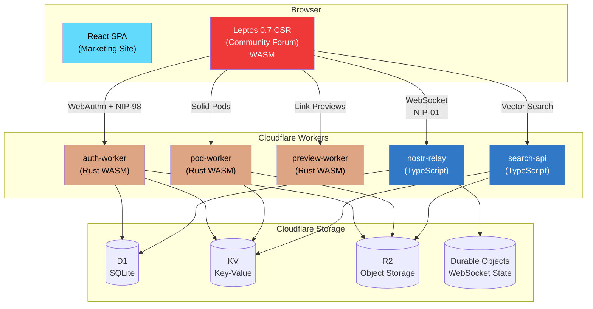
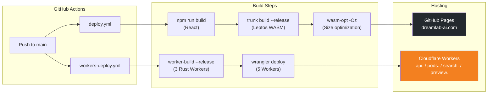

# DreamLab AI

**Premium AI training and consulting platform with a decentralized, end-to-end encrypted community forum.**

[](https://www.rust-lang.org/)
[](https://leptos.dev/)
[](https://webassembly.org/)
[](https://nostr.com/)
[](https://workers.cloudflare.com/)
[](https://react.dev/)

**Website**: [dreamlab-ai.com](https://dreamlab-ai.com) | **Repository**: [DreamLab-AI/dreamlab-ai-website](https://github.com/DreamLab-AI/dreamlab-ai-website)

---

## Architecture

The platform consists of a React marketing site, a Rust/Leptos WASM community forum, and five Cloudflare Workers providing backend services. All communication is built on the Nostr protocol with end-to-end encryption.



## Features

- **Passkey-first authentication** -- WebAuthn PRF derives a secp256k1 private key deterministically via HKDF. The key is never stored; it exists only in a Rust closure and is zeroized on page unload.
- **End-to-end encrypted DMs** -- NIP-59 Gift Wrap protocol (Rumor, Seal, Wrap) with NIP-44 ChaCha20-Poly1305 encryption. The relay and server never see plaintext.
- **Zone-based access control** -- Four access zones (Public Lobby, Cohort Channels, Staff Lounge, Admin Zone) enforced at both the relay and client layers.
- **Solid pods** -- User media stored in Cloudflare R2 with WAC (Web Access Control) ACL per pod, addressable via `did:nostr:{pubkey}`.
- **WASM vector search** -- RuVector WASM microkernel (42KB) with `.rvf` container format, running in a Cloudflare Worker at 490K vectors/sec.
- **Compile-time safety** -- All Rust crates enforce `#![deny(unsafe_code)]`. Zero `unsafe` blocks. NCC Group-audited cryptographic primitives.
- **3D visualizations** -- Three.js + React Three Fiber powering golden ratio Voronoi, 4D tesseract, and torus knot hero scenes on the marketing site.

## Tech Stack

| Layer | Technology |
|-------|-----------|
| Marketing Site | React 18.3 + TypeScript 5.5 + Vite 5.4 |
| Styling | Tailwind CSS 3.4 + shadcn/ui (Radix UI) |
| 3D | Three.js 0.156 + React Three Fiber |
| Community Forum | **Rust / Leptos 0.7** (CSR, WASM, amber/gray theme) |
| Nostr Protocol | nostr-sdk 0.44 (Rust) + NDK 2.13 (legacy TS relay) |
| Auth | WebAuthn PRF via passkey-rs 0.3 + NIP-98 |
| Encryption | NIP-44 (ChaCha20-Poly1305) + NIP-59 Gift Wrap |
| Backend (Rust) | 3 Cloudflare Workers via `worker` 0.7.5 |
| Backend (TS) | 2 Cloudflare Workers (nostr-relay, search-api) |
| Storage | Cloudflare D1, KV, R2, Durable Objects |
| Hosting | GitHub Pages (static) + Cloudflare Workers (API) |
| WASM Search | RuVector microkernel + `.rvf` format |
| Crypto | k256, chacha20poly1305, hkdf, sha2 (NCC-audited) |

## Quick Start

### Prerequisites

```bash
# Rust toolchain + WASM target
rustup target add wasm32-unknown-unknown
cargo install trunk wasm-bindgen-cli worker-build wasm-opt

# Node.js 20+ (for React site, Tailwind, TS Workers)
npm install -g wrangler
```

### Clone and Build

```bash
git clone https://github.com/DreamLab-AI/dreamlab-ai-website.git
cd dreamlab-ai-website

# Verify Rust workspace compiles (native + WASM)
cargo check --workspace
cargo check --workspace --target wasm32-unknown-unknown

# Install Node dependencies (React site + Tailwind)
npm install
```

### Development Servers

```bash
# React marketing site (http://localhost:5173)
npm run dev

# Leptos community forum (http://localhost:8080)
cd community-forum-rs && trunk serve

# Cloudflare Workers (local dev with D1/KV/R2 simulators)
cd community-forum-rs/crates/auth-worker && worker-build --dev && wrangler dev
```

### Commands

| Command | Description |
|---------|-------------|
| `npm run dev` | React marketing site with HMR |
| `npm run build` | Production build of React site |
| `npm run lint` | ESLint code quality checks |
| `trunk serve` | Leptos forum dev server with hot reload |
| `trunk build --release` | Production WASM build of forum |
| `cargo test --workspace` | Run all Rust tests (native) |
| `cargo test --workspace --target wasm32-unknown-unknown` | Run WASM tests |
| `cargo clippy --workspace -- -D warnings` | Lint all Rust code |

## Project Structure

```
dreamlab-ai-website/
  src/                          React SPA (13 lazy-loaded routes)
    pages/                      Route pages (Index, Team, Workshops, Contact, ...)
    components/                 70+ React components (shadcn/ui primitives in ui/)
    hooks/                      Custom React hooks
    lib/                        Utilities, Supabase client

  community-forum-rs/           Rust/Leptos workspace (6 crates)
    Cargo.toml                  Workspace root
    Trunk.toml                  trunk build configuration
    index.html                  Leptos SPA entry point
    crates/
      nostr-core/               Shared crypto + protocol (NIP-01, NIP-44, NIP-59, NIP-98)
      forum-client/             Leptos 0.7 CSR app (WASM, Tailwind, amber/gray theme)
      auth-worker/              CF Worker (Rust) -- WebAuthn + NIP-98 + pod provisioning
      pod-worker/               CF Worker (Rust) -- Solid pods on R2 with WAC ACL
      preview-worker/           CF Worker (Rust) -- OG metadata / link preview
      relay-worker/             CF Worker (Rust) -- Nostr relay stub

  workers/                      TypeScript Cloudflare Workers
    nostr-relay-api/            Nostr relay (D1 + Durable Objects, WebSocket)
    search-api/                 RuVector WASM vector search (.rvf format)
    shared/                     Shared modules (nip98.ts, types)

  wasm-voronoi/                 Rust WASM for 3D Voronoi hero effect
  public/data/                  Runtime content (team profiles, workshops, media)
  scripts/                      Build and utility scripts
  docs/                         Full documentation suite (28 files)
```

## Documentation

All documentation lives in the [`docs/`](docs/README.md) directory. Start there for the full navigation hub.

| Document | Description |
|----------|-------------|
| [Documentation Hub](docs/README.md) | Central navigation for all project docs |
| [PRD: Rust Port v2.0.0](docs/prd-rust-port.md) | Accepted architecture baseline |
| [PRD: Rust Port v2.1.0](docs/prd-rust-port-v2.1.md) | Refined delivery plan with tranche-based execution |
| [Architecture Decision Records](docs/adr/README.md) | 19 ADRs tracking every major decision |
| [Domain-Driven Design](docs/ddd/README.md) | Domain model, bounded contexts, aggregates, events |
| [API Reference](docs/api/AUTH_API.md) | Auth, Pod, Relay, and Search API docs |
| [Security Overview](docs/security/SECURITY_OVERVIEW.md) | Compile-time safety, crypto stack, access control |
| [Authentication](docs/security/AUTHENTICATION.md) | Passkey PRF flow, NIP-98, session management |
| [Deployment](docs/deployment/README.md) | CI/CD pipelines, environments, DNS |
| [Getting Started](docs/developer/GETTING_STARTED.md) | Prerequisites, setup, local development |
| [Rust Style Guide](docs/developer/RUST_STYLE_GUIDE.md) | Coding standards, error handling, module patterns |
| [Benchmarks](docs/benchmarks/baseline-native.md) | nostr-core native performance baseline |
| [Feature Parity Matrix](docs/tranche-1/feature-parity-matrix.md) | SvelteKit-to-Rust migration tracking |
| [Route Parity Matrix](docs/tranche-1/route-parity-matrix.md) | Route-by-route migration status |

## Deployment



All workflows are guarded with `if: github.repository == 'DreamLab-AI/dreamlab-ai-website'`.

| Target | Domain | Source |
|--------|--------|--------|
| React marketing site | `dreamlab-ai.com` | GitHub Pages (`gh-pages` branch) |
| Leptos forum client | `dreamlab-ai.com/community/` | GitHub Pages (WASM in `dist/community/`) |
| auth-worker | `api.dreamlab-ai.com` | Cloudflare Worker (Rust WASM) |
| pod-worker | `pods.dreamlab-ai.com` | Cloudflare Worker (Rust WASM) |
| preview-worker | `preview.dreamlab-ai.com` | Cloudflare Worker (Rust WASM) |
| nostr-relay | Cloudflare Worker route | Cloudflare Worker (TypeScript) |
| search-api | `search.dreamlab-ai.com` | Cloudflare Worker (TypeScript) |

## Security Highlights

- **Zero `unsafe`** -- All crates enforce `#![deny(unsafe_code)]` at the crate root
- **NCC Group-audited cryptography** -- `k256` (secp256k1/Schnorr), `chacha20poly1305` (NIP-44 AEAD)
- **Key never stored** -- WebAuthn PRF output fed through HKDF; private key lives only in a Rust `Option<SecretKey>` closure, zeroized via the `zeroize` crate on page unload
- **Compile-time schema enforcement** -- All API boundaries use `serde` deserialization + `validator` runtime checks
- **SSRF protection** -- Link preview Worker blocks private/loopback/metadata IP ranges
- **Relay-level enforcement** -- Whitelist, rate limits (10 events/sec), connection limits (20/IP), size limits (64KB)
- **`cargo audit`** runs in CI on every push; `cargo clippy -- -D warnings` must pass with zero warnings

## Licence

Proprietary. Copyright 2024-2026 DreamLab AI Consulting Ltd. All rights reserved.

---

*Last updated: 2026-03-08*
