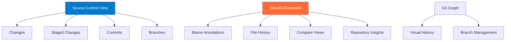
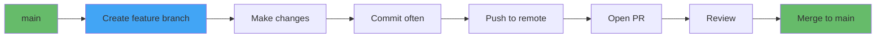

# Git Integration Deep Dive

## Learning Objectives

- Master VS Code's built-in Git interface
- Use GitLens for advanced Git visualization
- Handle merge conflicts visually
- Implement Git workflows without touching the terminal
- Understand staging, committing, and branching in VS Code
- Configure Git for optimal VS Code experience

## Core Concepts

### VS Code Git Architecture



## Built-in Git Features

### Source Control View

**Access:**
```
Ctrl+Shift+G (Cmd+Shift+G on Mac)
```

**Interface Components:**

| Section | Purpose | Actions |
|---------|---------|---------|
| **Changes** | Unstaged modifications | Stage, discard, view diff |
| **Staged Changes** | Ready to commit | Unstage, view diff |
| **Commit Message** | Commit description | Write message, commit |
| **Branches** | Branch management | Switch, create, merge |

### Basic Git Operations

#### 1. Viewing Changes

**File Status Indicators:**
```
M  = Modified (orange bar)
U  = Untracked (green bar)
D  = Deleted (red bar)
C  = Conflict (red exclamation)
```

**View Diff:**
```
- Click file in Changes → Side-by-side diff opens
- Ctrl+Shift+P → "Git: Open Changes"
```

**Inline Diff:**
```json
{
  "scm.diffDecor​ations": "all", // Shows change indicators in gutter
  "scm.diffDecorationsGutterWidth": 4
}
```

#### 2. Staging Files

**Methods:**
```
1. Click + next to file → Stage individual file
2. Click + next to "Changes" → Stage all
3. Right-click file → "Stage Changes"
4. Ctrl+Enter → Stage current file
```

**Stage Hunks (Partial Staging):**
```
1. Open file diff view
2. Hover over changed section
3. Click "Stage This Change" (+ icon)
4. Now only that section is staged
```

**Example Use Case:**
```javascript
// You changed two things in one file:
// 1. Fixed a bug (want to commit)
// 2. Added debug console.logs (don't want to commit)

// Stage only the bug fix hunk!
```

#### 3. Committing

**Quick Commit:**
```
1. Type commit message in box
2. Ctrl+Enter → Commit staged changes
3. Or click ✓ (checkmark) button
```

**Commit Options:**
```
Click ✓ dropdown:
- Commit (commits staged)
- Commit All (stages and commits all)
- Commit Staged (commits only staged)
- Commit Staged (Amend) → Amend last commit
```

**Good Commit Message Template:**
```
<type>: <subject>

<body>

<footer>
```

**Example:**
```
feat: add user authentication

- Implement JWT token generation
- Add login/logout endpoints
- Create auth middleware

Closes #123
```

**Settings for Better Commits:**
```json
{
  "git.enableCommitSigning": true,
  "git.confirmSync": false,
  "git.autofetch": true,
  "git.enableSmartCommit": true, // Commit all when no staged changes
  "git.postCommitCommand": "none"
}
```

#### 4. Branch Management

**Create Branch:**
```
1. Bottom left: Click branch name
2. Select "Create new branch"
3. Type branch name
4. Press Enter
```

**Switch Branch:**
```
1. Bottom left: Click branch name
2. Select branch to switch to
```

**Branch from VS Code:**
```
Ctrl+Shift+P:
- "Git: Create Branch"
- "Git: Checkout to..."
- "Git: Merge Branch"
- "Git: Rebase Branch"
- "Git: Delete Branch"
```

#### 5. Push/Pull/Sync

**Status Bar Git Actions:**
```
Bottom left corner shows:
- Current branch
- ↑ Number of commits to push
- ↓ Number of commits to pull
```

**Sync:**
```
- Click ↻ (sync icon) → Pull then push
- Or: Ctrl+Shift+P → "Git: Sync"
```

**Push/Pull Separately:**
```
Ctrl+Shift+P:
- "Git: Push"
- "Git: Pull"
- "Git: Pull (Rebase)"
```

## GitLens - Supercharged Git

### Installation

```bash
code --install-extension eamodio.gitlens
```

### Key Features

#### 1. Inline Blame Annotations

**See who changed each line:**
```
Automatically appears at end of current line:
John Doe, 3 days ago • feat: add login feature
```

**Configuration:**
```json
{
  "gitlens.currentLine.enabled": true,
  "gitlens.currentLine.pullRequests.enabled": true,
  "gitlens.hovers.currentLine.over": "line",
  "gitlens.hovers.currentLine.details": true
}
```

**Hover for Details:**
- Hover over blame annotation → Full commit details
- Shows: Author, date, commit message, files changed

#### 2. File History

**View File History:**
```
1. Right-click file
2. "Open File History"
3. See all commits that touched this file
```

**Or:**
```
Click GitLens icon in sidebar → File History view
```

#### 3. Line History

**View specific line's history:**
```
1. Place cursor on line
2. Right-click → "Open Line History"
3. See all commits that changed this line
```

#### 4. Compare Views

**Compare with:**
```
Right-click file:
- Compare with HEAD
- Compare with Working Tree
- Compare with Previous Revision
- Compare with Branch/Tag/Ref
```

**Compare Branches:**
```
1. Click GitLens sidebar icon
2. "Compare" section
3. Choose two branches
4. See all differences
```

#### 5. Repository Insights

**Commit Graph:**
```
GitLens → Commits view
Visual commit history with branches
```

**Contributors:**
```
GitLens → Contributors view
See who contributes most
```

**File Blame:**
```
Right-click file → "Toggle File Blame"
See blame for every line in gutter
```

## Git Graph Extension

### Installation

```bash
code --install-extension mhutchie.git-graph
```

### Features

**Visual Commit History:**
```
1. Source Control view → Click "Git Graph" button
2. See interactive graph of all commits and branches
```

**Actions in Git Graph:**
- Click commit → View details
- Right-click commit → Cherry-pick, revert, reset
- Right-click branch → Merge, rebase, delete
- Drag branch to another → Merge/rebase visually

**Configuration:**
```json
{
  "git-graph.showStatusBarItem": true,
  "git-graph.date.format": "ISO Date & Time",
  "git-graph.showCommitsOnlyReferencedByTags": false
}
```

## Merge Conflict Resolution

### Handling Conflicts Visually

When merge conflicts occur:

```
1. VS Code detects conflicts
2. Files marked with "C" in Source Control
3. Open conflicted file
4. VS Code shows visual conflict resolution
```

**Conflict Markers:**
```javascript
<<<<<<< HEAD (Current Change)
const greeting = "Hello World";
=======
const greeting = "Hi Universe";
>>>>>>> feature-branch (Incoming Change)
```

**Resolution Options:**
```
Above each conflict, VS Code shows buttons:
- Accept Current Change
- Accept Incoming Change
- Accept Both Changes
- Compare Changes
```

**Steps:**
```
1. Click "Accept Current Change" (or other option)
2. Conflict markers removed automatically
3. Repeat for all conflicts in file
4. Save file
5. Stage file (conflict resolved)
6. Commit the merge
```

**Compare Changes View:**
```
Click "Compare Changes" →
Side-by-side view:
- Left: Current (HEAD)
- Right: Incoming (branch)
- Bottom: Result (edit manually)
```

## Advanced Git Workflows

### Feature Branch Workflow



**In VS Code:**
```
1. Create branch: main → feature/new-feature
2. Make changes, commit frequently
3. Push: Click sync icon
4. Open PR: GitLens → "Create Pull Request"
5. Merge via GitHub (or GitLens extension)
```

### Git Stash

**Stash Changes:**
```
Ctrl+Shift+P → "Git: Stash"
Or: Source Control view → "..." → "Stash"
```

**Why Stash?**
```
You're working on feature A
Urgent bug fix needed on main
Stash changes, switch to main, fix bug
Switch back to feature, apply stash
```

**Apply Stash:**
```
Ctrl+Shift+P → "Git: Apply Stash"
Choose stash from list
```

**Stash with Message:**
```
Ctrl+Shift+P → "Git: Stash (Include Untracked)"
Type message: "WIP: feature A half done"
```

### Interactive Rebase

**Rewrite Commit History:**
```
1. GitLens → Commits view
2. Right-click commit → "Rebase to Here (Interactive)"
3. Choose action for each commit:
   - Pick (keep)
   - Squash (combine with previous)
   - Reword (change message)
   - Drop (remove)
```

**Use Case:**
```
Before PR, clean up messy commits:
- "WIP"
- "fix typo"
- "fix again"
- "actually fix it"

Squash into one clean commit:
- "feat: add user authentication"
```

## Git Configuration for VS Code

### Global Git Config

```bash
# Set name and email
git config --global user.name "Your Name"
git config --global user.email "your.email@example.com"

# Better diff algorithm
git config --global diff.algorithm histogram

# Reuse recorded conflict resolutions
git config --global rerere.enabled true

# Default branch name
git config --global init.defaultBranch main

# Auto-stash before rebase
git config --global rebase.autoStash true
```

### VS Code Git Settings

```json
{
  // Auto-fetch from remote
  "git.autofetch": true,
  "git.autofetchPeriod": 180, // seconds

  // Confirmations
  "git.confirmSync": false,
  "git.confirmForcePush": true,
  "git.allowForcePush": false,

  // Smart commit
  "git.enableSmartCommit": true,
  "git.smartCommitChanges": "all",

  // Branch protection
  "git.branchProtection": ["main", "master", "production"],

  // Diff editor
  "diffEditor.ignoreTrimWhitespace": false,
  "diffEditor.renderSideBySide": true,

  // Merge editor
  "merge-conflict.autoNavigateNextConflict.enabled": true
}
```

### .gitignore in VS Code

**Create .gitignore:**
```
1. Create .gitignore file
2. Add patterns
3. VS Code respects it immediately
```

**Common .gitignore for Node.js:**
```
node_modules/
dist/
build/
.env
.env.local
*.log
.DS_Store
.vscode/settings.json  # If you don't want to share
```

**GitIgnore Extension:**
```bash
code --install-extension codezombiech.gitignore
```
**Usage:**
```
Ctrl+Shift+P → "Add gitignore"
Choose template (Node, Python, etc.)
```

## Pro Tips

### Tip 1: Commit from Anywhere

```
No need to open Source Control view:
Ctrl+Shift+P → "Git: Commit All"
Type message → Enter → Done!
```

### Tip 2: Quick Branch Switching

```
Ctrl+Shift+P → Type branch name → Enter
No need to navigate through menus
```

### Tip 3: View File on Remote

```
GitLens → Right-click file → "Open File on Remote"
Opens file on GitHub/GitLab in browser
```

### Tip 4: Keyboard Shortcuts for Git

```json
// keybindings.json
[
  {
    "key": "ctrl+g ctrl+c",
    "command": "git.commit"
  },
  {
    "key": "ctrl+g ctrl+p",
    "command": "git.push"
  },
  {
    "key": "ctrl+g ctrl+f",
    "command": "git.fetch"
  }
]
```

### Tip 5: Timeline View

**See file history inline:**
```
1. Open file
2. Click "Timeline" in Explorer (bottom)
3. See all commits for this file
4. Click commit → View that version
```

## Common Pitfalls

### Pitfall 1: Committing Too Much

**Problem**: Staging `node_modules` or `.env`
**Solution**: Use .gitignore

```
1. Create .gitignore
2. Add: node_modules/
3. VS Code excludes from changes
```

### Pitfall 2: Merge Conflicts Confusion

**Problem**: Don't understand conflict markers
**Solution**: Use visual conflict resolution

```
Don't manually edit <<<< ==== >>>>
Use VS Code's "Accept Current/Incoming/Both" buttons
```

### Pitfall 3: Lost Work After Reset

**Problem**: `git reset --hard` loses changes
**Solution**: Stash instead

```
Never: Reset to discard changes
Always: Stash or commit to temp branch
```

### Pitfall 4: Force Push to Protected Branch

**Problem**: Accidentally force push to main
**Solution**: Enable branch protection

```json
{
  "git.branchProtection": ["main", "master"],
  "git.allowForcePush": false
}
```

### Pitfall 5: Not Using GitLens Features

**Problem**: Missing powerful history tools
**Solution**: Learn GitLens shortcuts

```
- Hover any line → See last change
- Right-click file → File History
- GitLens sidebar → Explore repository
```

## Assessment

### Knowledge Check

**Question 1**: How do you stage only part of a file's changes?

<details>
<summary>Answer</summary>
1. Open file in diff view
2. Hover over changed section (hunk)
3. Click "Stage This Change" (+ icon)
4. Only that hunk is staged
</details>

**Question 2**: What's the difference between "Commit" and "Commit All"?

<details>
<summary>Answer</summary>
- **Commit**: Commits only staged changes
- **Commit All**: Stages ALL changes, then commits them (if smartCommit is enabled)
</details>

**Question 3**: How do you view who last modified a specific line?

<details>
<summary>Answer</summary>
With GitLens installed:
- Inline blame appears at end of line
- Or: Right-click line → "Open Line History"
- Or: Hover over line → Blame annotation shows
</details>

### Practical Exercise

**Complete Git Workflow:**

1. **Create Feature Branch:**
   - From main, create branch: feature/user-profile
   - Make 3 commits with good messages

2. **Handle Conflict:**
   - Switch to main, make overlapping change
   - Switch back to feature, merge main
   - Resolve conflict visually
   - Complete merge

3. **Clean History:**
   - Interactive rebase to squash commits
   - Create single clean commit
   - Push to remote

4. **Create PR:**
   - Use GitLens to create PR
   - Review diff before submitting

**Success Criteria:**
- [ ] Clean commit history (1-3 commits max)
- [ ] All conflicts resolved
- [ ] Good commit messages
- [ ] PR created successfully

## Next Steps

Master Git in VS Code, ready for:
- **Module 6**: Remote development with Git
- **Module 8**: Task automation with Git hooks

## Additional Resources

- [VS Code Git Documentation](https://code.visualstudio.com/docs/sourcecontrol/overview)
- [GitLens Documentation](https://help.gitkraken.com/gitlens/)
- [Git Graph Extension](https://github.com/mhutchie/vscode-git-graph)
- [Oh My Git! (Game to Learn Git)](https://ohmygit.org/)

---

**Estimated Time**: 4 hours
**Difficulty**: Intermediate
**Prerequisites**: Basic Git knowledge
