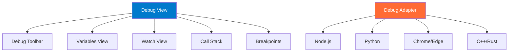

# Debugging Mastery

## Learning Objectives

- Master VS Code's integrated debugger for multiple languages
- Set up debug configurations for various scenarios
- Use breakpoints, watch expressions, and call stacks effectively
- Debug remotely (SSH, containers, cloud)
- Implement advanced debugging techniques
- Troubleshoot common debugging issues

## Core Debugging Concepts

### The VS Code Debugger Architecture



## Quick Start: Debugging Basics

### Starting a Debug Session

**Method 1: Auto-Configuration**
```
1. Open file to debug
2. Press F5
3. Select environment (Node.js, Python, etc.)
4. VS Code creates launch.json
5. Debugging starts
```

**Method 2: Manual Configuration**
```
1. Run & Debug view (Ctrl+Shift+D)
2. "create a launch.json file"
3. Select environment
4. Customize configuration
```

### Essential Keyboard Shortcuts

| Action | Shortcut | Purpose |
|--------|----------|---------|
| Start/Continue | `F5` | Start or continue debugging |
| Step Over | `F10` | Execute current line, step over functions |
| Step Into | `F11` | Step into function calls |
| Step Out | `Shift+F11` | Step out of current function |
| Restart | `Ctrl+Shift+F5` | Restart debug session |
| Stop | `Shift+F5` | Stop debugging |
| Toggle Breakpoint | `F9` | Add/remove breakpoint on current line |

## Breakpoints

### Types of Breakpoints

**1. Line Breakpoints**
```
Click in gutter (left of line numbers)
Or: Press F9 on line
Red dot appears = breakpoint active
```

**2. Conditional Breakpoints**
```javascript
// Break only when condition is true
// Right-click breakpoint → Edit Breakpoint → Expression

for (let i = 0; i < 100; i++) {
  processItem(i); // Breakpoint: i === 50
}

// Breaks only when i is 50
```

**3. Logpoints**
```javascript
// Log message without stopping
// Right-click gutter → Add Logpoint

function calculateTotal(items) {
  // Logpoint: "Total items: {items.length}"
  return items.reduce((sum, item) => sum + item.price, 0);
}

// Logs to Debug Console without breaking
```

**4. Hit Count Breakpoints**
```
Right-click breakpoint → Edit Breakpoint → Hit Count

Example: "= 10" (break on 10th hit)
         "> 5" (break after 5th hit)
         "% 3" (break every 3rd hit)
```

## Launch Configurations

### JavaScript/TypeScript (Node.js)

**Basic Node.js:**
```json
{
  "version": "0.2.0",
  "configurations": [
    {
      "type": "node",
      "request": "launch",
      "name": "Launch Program",
      "skipFiles": ["<node_internals>/**"],
      "program": "${workspaceFolder}/src/index.js"
    }
  ]
}
```

**With TypeScript:**
```json
{
  "type": "node",
  "request": "launch",
  "name": "Launch TypeScript",
  "preLaunchTask": "npm: build",
  "program": "${workspaceFolder}/src/index.ts",
  "outFiles": ["${workspaceFolder}/dist/**/*.js"],
  "sourceMaps": true
}
```

**Attach to Running Process:**
```json
{
  "type": "node",
  "request": "attach",
  "name": "Attach to Process",
  "processId": "${command:PickProcess}",
  "skipFiles": ["<node_internals>/**"]
}
```

**Debug Jest Tests:**
```json
{
  "type": "node",
  "request": "launch",
  "name": "Jest Current File",
  "program": "${workspaceFolder}/node_modules/.bin/jest",
  "args": ["${fileBasename}", "--config", "jest.config.js"],
  "console": "integratedTerminal",
  "internalConsoleOptions": "neverOpen"
}
```

### Python

**Basic Python:**
```json
{
  "version": "0.2.0",
  "configurations": [
    {
      "name": "Python: Current File",
      "type": "python",
      "request": "launch",
      "program": "${file}",
      "console": "integratedTerminal",
      "justMyCode": true
    }
  ]
}
```

**Flask Application:**
```json
{
  "name": "Python: Flask",
  "type": "python",
  "request": "launch",
  "module": "flask",
  "env": {
    "FLASK_APP": "app.py",
    "FLASK_DEBUG": "1"
  },
  "args": ["run", "--no-debugger", "--no-reload"],
  "jinja": true
}
```

**Django:**
```json
{
  "name": "Python: Django",
  "type": "python",
  "request": "launch",
  "program": "${workspaceFolder}/manage.py",
  "args": ["runserver"],
  "django": true,
  "justMyCode": true
}
```

**Pytest:**
```json
{
  "name": "Python: Pytest Current File",
  "type": "python",
  "request": "launch",
  "module": "pytest",
  "args": ["${file}", "-v"],
  "console": "integratedTerminal"
}
```

### Browser (Chrome/Edge)

**Launch Chrome:**
```json
{
  "type": "chrome",
  "request": "launch",
  "name": "Launch Chrome",
  "url": "http://localhost:3000",
  "webRoot": "${workspaceFolder}/src",
  "sourceMaps": true
}
```

**Attach to Chrome:**
```json
{
  "type": "chrome",
  "request": "attach",
  "name": "Attach to Chrome",
  "port": 9222,
  "webRoot": "${workspaceFolder}"
}
```

### Compound Configurations

**Debug Full-Stack (Frontend + Backend):**
```json
{
  "version": "0.2.0",
  "configurations": [
    {
      "name": "Backend",
      "type": "node",
      "request": "launch",
      "program": "${workspaceFolder}/server/index.js"
    },
    {
      "name": "Frontend",
      "type": "chrome",
      "request": "launch",
      "url": "http://localhost:3000",
      "webRoot": "${workspaceFolder}/client"
    }
  ],
  "compounds": [
    {
      "name": "Full Stack",
      "configurations": ["Backend", "Frontend"],
      "stopAll": true
    }
  ]
}
```

## Debug Views

### Variables View

Shows all variables in current scope:
```
Local variables
Function parameters
this/self context
Global variables
```

**Right-click variable:**
- Copy Value
- Copy as Expression
- Add to Watch
- Set Value (modify during debug!)

### Watch View

**Add expressions to monitor:**
```
1. Click "+" in Watch view
2. Enter expression: user.email
3. Updates as you step through code
```

**Useful watch expressions:**
```javascript
// Object properties
user.profile.settings

// Array operations
items.length
items.filter(i => i.active).length

// Comparisons
count > threshold
```

### Call Stack

**Shows execution path:**
```
processOrder (order.js:45)
  ↑ called by
validateOrder (order.js:23)
  ↑ called by
createOrder (api.js:12)
  ↑ called by
handleRequest (server.js:78)
```

**Click any frame to:**
- View variables at that level
- See code context
- Navigate execution history

### Debug Console

**Execute code during debugging:**
```javascript
// Evaluate expressions
> user.name
"John Doe"

// Call functions
> calculateTotal(items)
150.25

// Modify variables
> discount = 0.2
0.2

// Complex expressions
> items.filter(i => i.price > 50)
[{...}, {...}]
```

## Advanced Debugging Techniques

### Debugging with Source Maps

**TypeScript/Webpack Setup:**
```json
// tsconfig.json
{
  "compilerOptions": {
    "sourceMap": true,
    "inlineSourceMap": false,
    "inlineSources": false
  }
}
```

```json
// launch.json
{
  "type": "node",
  "sourceMaps": true,
  "outFiles": ["${workspaceFolder}/dist/**/*.js"],
  "resolveSourceMapLocations": [
    "${workspaceFolder}/**",
    "!**/node_modules/**"
  ]
}
```

### Remote Debugging

**Debug on Remote Server:**
```bash
# On remote server
node --inspect=0.0.0.0:9229 server.js
```

```json
// Local launch.json
{
  "type": "node",
  "request": "attach",
  "name": "Attach to Remote",
  "address": "192.168.1.100",
  "port": 9229,
  "localRoot": "${workspaceFolder}",
  "remoteRoot": "/app"
}
```

**Debug in Docker Container:**
```dockerfile
# Dockerfile
EXPOSE 9229
CMD ["node", "--inspect=0.0.0.0:9229", "index.js"]
```

```json
// launch.json
{
  "type": "node",
  "request": "attach",
  "name": "Docker: Attach to Node",
  "port": 9229,
  "address": "localhost",
  "localRoot": "${workspaceFolder}",
  "remoteRoot": "/usr/src/app",
  "protocol": "inspector"
}
```

### Debugging Tests

**Jest with Breakpoints:**
```json
{
  "type": "node",
  "request": "launch",
  "name": "Jest Debug",
  "program": "${workspaceFolder}/node_modules/.bin/jest",
  "args": ["--runInBand", "--no-cache"],
  "console": "integratedTerminal"
}
```

**Pytest with Breakpoints:**
```json
{
  "name": "Pytest Debug",
  "type": "python",
  "request": "launch",
  "module": "pytest",
  "args": ["-s", "${file}"],
  "console": "integratedTerminal"
}
```

### Multi-Target Debugging

**Debug Multiple Processes:**
```json
{
  "version": "0.2.0",
  "configurations": [
    {
      "name": "Worker 1",
      "type": "node",
      "request": "launch",
      "program": "${workspaceFolder}/worker.js",
      "env": { "WORKER_ID": "1" }
    },
    {
      "name": "Worker 2",
      "type": "node",
      "request": "launch",
      "program": "${workspaceFolder}/worker.js",
      "env": { "WORKER_ID": "2" }
    }
  ],
  "compounds": [
    {
      "name": "All Workers",
      "configurations": ["Worker 1", "Worker 2"]
    }
  ]
}
```

## Pro Tips

### Tip 1: Skip Files

**Don't step into libraries:**
```json
{
  "skipFiles": [
    "<node_internals>/**",
    "**/node_modules/**",
    "**/dist/**/*.js"
  ]
}
```

### Tip 2: Debug Current File

**Quick debug without config:**
```
1. Open file
2. F5
3. Select "Node.js" (or language)
4. Debugs current file immediately
```

### Tip 3: Restart Frame

```
Right-click call stack frame → "Restart Frame"
Rewinds execution to start of function
Useful for re-testing with different values
```

### Tip 4: Exception Breakpoints

```
Debug view → Breakpoints section
Check "Uncaught Exceptions"
Check "Caught Exceptions" (breaks on all errors)
```

### Tip 5: Inline Values

```json
{
  "debug.inlineValues": true
}
```
Shows variable values inline as you step through code!

## Common Pitfalls

### Pitfall 1: Source Maps Not Working

**Problem**: Breakpoints don't hit
**Solution**: Verify source map configuration

```json
{
  "sourceMaps": true,
  "outFiles": ["${workspaceFolder}/dist/**/*.js"],
  // Add this if still not working:
  "resolveSourceMapLocations": [
    "${workspaceFolder}/**",
    "!**/node_modules/**"
  ]
}
```

### Pitfall 2: Can't Attach to Process

**Problem**: "Cannot connect to runtime process"
**Solution**: Ensure process started with debug flag

```bash
# Node.js
node --inspect=9229 app.js

# Python
python -m debugpy --listen 5678 --wait-for-client app.py
```

### Pitfall 3: Breakpoints Unverified (Gray)

**Problem**: Breakpoint is gray, not red
**Solutions**:
1. Check source maps enabled
2. Verify file paths match
3. Ensure code is transpiled
4. Try "Restart Frame"

### Pitfall 4: Variables Show "<optimized away>"

**Problem**: Can't see variable values
**Solution**: Disable optimizations

```json
// For Node.js
{
  "runtimeArgs": ["--no-lazy"]
}

// For TypeScript
// tsconfig.json
{
  "compilerOptions": {
    "optimization": false
  }
}
```

### Pitfall 5: Too Many Breakpoints

**Problem**: Debug session overwhelming
**Solution**: Use conditional breakpoints and logpoints

```
Instead of: 10 breakpoints in loop
Use: 1 conditional breakpoint: i === targetValue
Or: Logpoint to track progress
```

## Assessment

### Practical Exercise

**Debug a Bug:**

```javascript
// Bug: This function doesn't correctly calculate average
function calculateAverage(numbers) {
  let sum = 0;
  for (let i = 0; i <= numbers.length; i++) {
    sum += numbers[i];
  }
  return sum / numbers.length;
}

console.log(calculateAverage([1, 2, 3, 4, 5])); // Should be 3, but returns NaN
```

**Debugging steps:**
1. Set breakpoint on line 2
2. Start debugging
3. Watch `sum`, `i`, `numbers[i]`
4. Step through loop
5. Notice `i <= numbers.length` (should be `<`)
6. Notice accessing `numbers[5]` = undefined
7. Fix bug
8. Retest

**Success Criteria:**
- [ ] Identified bug using debugger
- [ ] Used watch expressions
- [ ] Stepped through code
- [ ] Fixed and verified

## Next Steps

- **Module 8**: Automate debugging with tasks
- **Module 12**: Advanced debugging patterns

## Resources

- [VS Code Debugging Guide](https://code.visualstudio.com/docs/editor/debugging)
- [Node.js Debugging](https://code.visualstudio.com/docs/nodejs/nodejs-debugging)
- [Python Debugging](https://code.visualstudio.com/docs/python/debugging)

---

**Time**: 3-4 hours
**Difficulty**: Intermediate
**Prerequisites**: Programming experience
