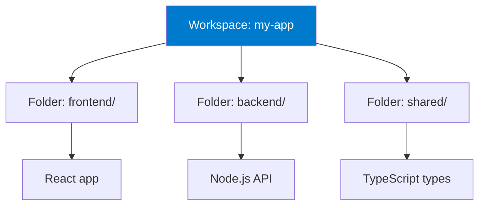

# Multi-root Workspaces and Advanced Organization

## Learning Objectives

- Create and manage multi-root workspaces
- Organize large monorepos effectively
- Configure workspace-specific settings
- Master workspace recommendations
- Implement advanced project organization

## What are Multi-root Workspaces?

**Single Folder:**
```
Open one project folder at a time
```

**Multi-root Workspace:**
```
Open multiple folders simultaneously
Each with independent settings
Share extensions and terminal
```



## Creating Workspaces

### Method 1: Save Current Folder

```
1. File → "Save Workspace As..."
2. Choose location
3. Name: myproject.code-workspace
4. Save
```

### Method 2: From Scratch

```
1. File → "Add Folder to Workspace"
2. Select first folder
3. Repeat for additional folders
4. File → "Save Workspace As..."
```

## Workspace File Structure

**myproject.code-workspace:**
```json
{
  "folders": [
    {
      "name": "Frontend",
      "path": "./frontend"
    },
    {
      "name": "Backend",
      "path": "./backend"
    },
    {
      "name": "Shared",
      "path": "./shared"
    }
  ],
  "settings": {
    // Workspace-wide settings
    "files.exclude": {
      "**/node_modules": true,
      "**/.git": true
    }
  },
  "extensions": {
    "recommendations": [
      "dbaeumer.vscode-eslint",
      "esbenp.prettier-vscode"
    ]
  }
}
```

## Advanced Workspace Configuration

### Per-Folder Settings

```json
{
  "folders": [
    {
      "name": "Frontend",
      "path": "./frontend",
      "settings": {
        "typescript.tsdk": "node_modules/typescript/lib",
        "eslint.workingDirectories": ["./frontend"]
      }
    },
    {
      "name": "Backend (Python)",
      "path": "./backend",
      "settings": {
        "python.defaultInterpreterPath": ".venv/bin/python",
        "[python]": {
          "editor.defaultFormatter": "ms-python.black-formatter"
        }
      }
    }
  ]
}
```

### Remote Folders

**Mix local and remote:**
```json
{
  "folders": [
    {
      "name": "Local Frontend",
      "path": "./frontend"
    },
    {
      "name": "Remote Backend",
      "uri": "vscode-remote://ssh-remote+server/home/user/backend"
    }
  ]
}
```

## Monorepo Organization

### Scenario: Full-Stack Monorepo

**Structure:**
```
myapp/
├── packages/
│   ├── frontend/       (React)
│   ├── backend/        (Node.js)
│   ├── mobile/         (React Native)
│   └── shared/         (TypeScript types)
├── tools/
│   └── scripts/
└── myapp.code-workspace
```

**Workspace Config:**
```json
{
  "folders": [
    {
      "name": "📱 Frontend",
      "path": "./packages/frontend"
    },
    {
      "name": "⚙️ Backend",
      "path": "./packages/backend"
    },
    {
      "name": "📲 Mobile",
      "path": "./packages/mobile"
    },
    {
      "name": "🔧 Shared",
      "path": "./packages/shared"
    },
    {
      "name": "🛠️ Tools",
      "path": "./tools"
    }
  ],
  "settings": {
    "search.exclude": {
      "**/node_modules": true,
      "**/dist": true,
      "**/.next": true
    },
    "typescript.tsdk": "packages/frontend/node_modules/typescript/lib"
  },
  "extensions": {
    "recommendations": [
      "dbaeumer.vscode-eslint",
      "esbenp.prettier-vscode",
      "eamodio.gitlens"
    ]
  },
  "tasks": {
    "version": "2.0.0",
    "tasks": [
      {
        "label": "Build All",
        "dependsOn": [
          "Build Frontend",
          "Build Backend",
          "Build Shared"
        ]
      }
    ]
  }
}
```

## Workspace Features

### Scoped Search

**Search specific folder:**
```
1. Ctrl+Shift+F (search)
2. "files to include": packages/frontend/**
3. Search only in frontend
```

**Or right-click folder → "Find in Folder"**

### Scoped Extensions

**Enable extension for specific folder:**
```
1. Extensions view
2. Click extension gear
3. "Enable (Workspace)" → Choose folder
```

### Workspace Tasks

**Tasks across folders:**
```json
{
  "tasks": [
    {
      "label": "Install Frontend",
      "type": "shell",
      "command": "npm install",
      "options": {
        "cwd": "${workspaceFolder:Frontend}"
      }
    },
    {
      "label": "Install Backend",
      "type": "shell",
      "command": "npm install",
      "options": {
        "cwd": "${workspaceFolder:Backend}"
      }
    },
    {
      "label": "Install All",
      "dependsOn": ["Install Frontend", "Install Backend"]
    }
  ]
}
```

### Workspace Launch Configs

**Debug multiple services:**
```json
{
  "version": "0.2.0",
  "configurations": [
    {
      "name": "Frontend",
      "type": "chrome",
      "request": "launch",
      "url": "http://localhost:3000",
      "webRoot": "${workspaceFolder:Frontend}/src"
    },
    {
      "name": "Backend",
      "type": "node",
      "request": "launch",
      "program": "${workspaceFolder:Backend}/src/index.js"
    }
  ],
  "compounds": [
    {
      "name": "Full Stack",
      "configurations": ["Backend", "Frontend"]
    }
  ]
}
```

## Advanced Organization Patterns

### Feature-Based Structure

```
myapp.code-workspace:
  - features/auth/       (All auth code)
  - features/payments/   (All payment code)
  - features/analytics/
  - shared/
  - tools/
```

### Microservices

```
services.code-workspace:
  - services/user-service/
  - services/order-service/
  - services/payment-service/
  - shared/contracts/
  - infrastructure/
```

### Client Projects

```
client-projects.code-workspace:
  - clients/acme-corp/
  - clients/globex/
  - templates/
  - shared/components/
```

## Pro Tips

### Tip 1: Workspace Variables

**Use in settings:**
```json
{
  "eslint.workingDirectories": [
    "${workspaceFolder:Frontend}",
    "${workspaceFolder:Backend}"
  ]
}
```

**Available variables:**
- `${workspaceFolder}` - First folder path
- `${workspaceFolder:NAME}` - Specific folder
- `${workspaceFolderBasename}` - Folder name

### Tip 2: Color-Code Folders

```json
{
  "folders": [
    {
      "name": "Frontend 🔵",
      "path": "./frontend"
    },
    {
      "name": "Backend 🔴",
      "path": "./backend"
    }
  ]
}
```

Emojis help visually distinguish folders!

### Tip 3: Collapse Folders

**Hide folders temporarily:**
```
Right-click folder in Explorer → "Remove Folder from Workspace"
(Doesn't delete, just hides)

Re-add: File → "Add Folder to Workspace"
```

### Tip 4: Relative Paths

```json
{
  "folders": [
    { "path": "./frontend" },      // Relative to workspace file
    { "path": "../other-project" } // Can go up directories
  ]
}
```

### Tip 5: Workspace Recommendations

**Suggest extensions for project:**
```json
{
  "extensions": {
    "recommendations": [
      "dbaeumer.vscode-eslint",
      "esbenp.prettier-vscode"
    ],
    "unwantedRecommendations": [
      "ms-vscode.vscode-typescript-tslint-plugin"
    ]
  }
}
```

Team members get notified to install!

## Common Pitfalls

### Pitfall 1: Conflicting Settings

**Problem:** Settings from different folders conflict
**Solution:** Use folder-specific settings

```json
{
  "folders": [
    {
      "name": "Frontend",
      "path": "./frontend",
      "settings": {
        "editor.tabSize": 2  // Frontend uses 2
      }
    },
    {
      "name": "Backend",
      "path": "./backend",
      "settings": {
        "editor.tabSize": 4  // Backend uses 4
      }
    }
  ]
}
```

### Pitfall 2: Extension Confusion

**Problem:** Extension doesn't work in subfolder
**Solution:** Configure extension scope

```json
{
  "eslint.workingDirectories": [
    "./frontend",
    "./backend"
  ]
}
```

### Pitfall 3: Search Too Broad

**Problem:** Searching entire workspace is slow
**Solution:** Use scoped search

```
Ctrl+Shift+F → "files to include" → specific folder
```

### Pitfall 4: Git Issues

**Problem:** Multiple Git repos cause conflicts
**Solution:** One workspace = One Git repo recommended

**If must have multiple repos:**
```json
{
  "git.enabled": true,
  "git.repositoryScanMaxDepth": 2
}
```

## Assessment

**Create a Multi-Root Workspace:**

1. Choose a project with multiple parts (frontend/backend, or 2+ related projects)
2. Create .code-workspace file
3. Add folders with custom names
4. Configure folder-specific settings
5. Add workspace tasks
6. Test debugging compound config

**Success Criteria:**
- [ ] Multiple folders visible
- [ ] Settings apply correctly per folder
- [ ] Tasks work across folders
- [ ] Can debug multiple services
- [ ] Team can use same workspace

## Resources

- [Multi-root Workspaces Docs](https://code.visualstudio.com/docs/editor/multi-root-workspaces)
- [Workspace Settings](https://code.visualstudio.com/docs/getstarted/settings#_workspace-settings)

---

**Time**: 2 hours
**Difficulty**: Intermediate
