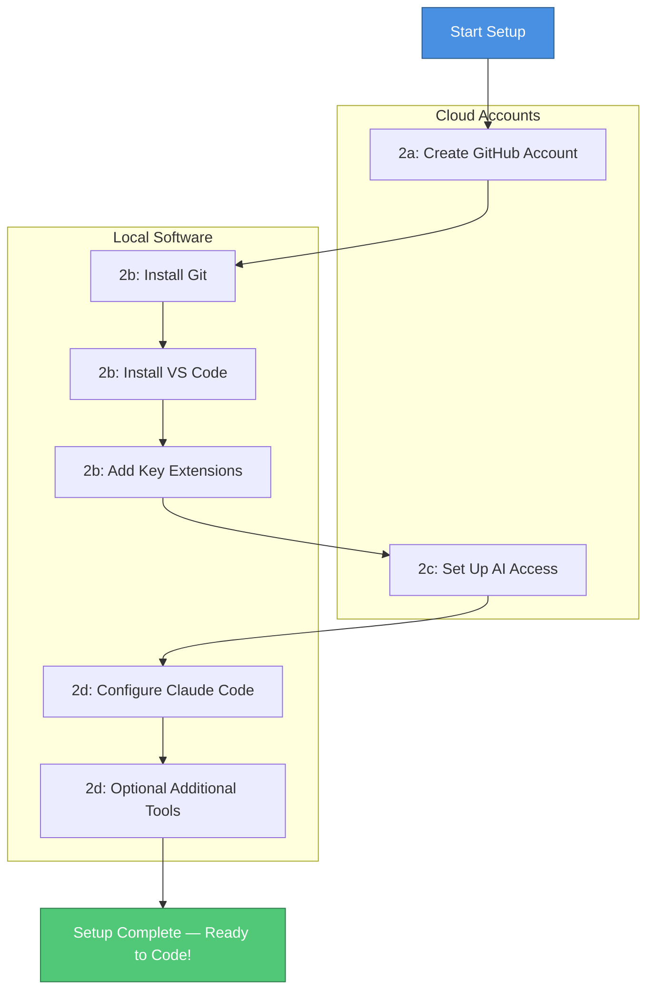

# Chapter 2: Essential Setup: Accounts & Installations

⏱️ **Time:** 5 minutes (this page) + 45-60 minutes (sub-chapters) | 🎯 **Difficulty:** 🟢 Beginner

This chapter guides you through the essential setup required to establish your digital toolkit. Although the initial configuration involves several steps, it is primarily a one-time process. Completing this setup provides a robust, free, and powerful environment for your creative technology projects.

> **💡 Tip:** Work through the sub-chapters in order. Each step builds on the previous one, and the whole process should take under an hour.

## What You Will Set Up

The setup process is divided into four sub-chapters, each covering a distinct piece of the toolkit:

### 2a. [Creating Your GitHub Account](./02_a_github_account.md)
- Register on GitHub (the cloud platform for code hosting and collaboration)
- Choose a professional username
- Configure your profile and email settings
- Set up SSH keys for secure, password-free access to your repositories

### 2b. [Installing Git & VS Code](./02_b_install_git_vscode.md)
- Install Git (the version control software that runs locally on your machine)
- Configure your Git identity (name and email)
- Install Visual Studio Code, a free and powerful code editor
- Add essential VS Code extensions for Git visualisation and AI integration

### 2c. [Setting Up AI API Keys (2026 Edition)](./02_c_gcp_api_key.md)
- Understand the AI provider landscape (Anthropic, Google, OpenAI, GitHub Copilot)
- Set up Claude Code with your free claude.ai account (no API key needed)
- Optionally obtain API keys from providers for advanced or third-party tool use
- Learn to store API keys securely using environment variables and `.gitignore`

### 2d. [Configuring AI Coding Assistants in VS Code (2026 Edition)](./02_d_roo_code_config.md)
- Install and authenticate Claude Code
- Create your first CLAUDE.md project configuration file
- Optionally set up GitHub Copilot, Continue.dev, or Cursor alongside Claude Code
- Learn best practices for combining multiple AI tools

## Setup Workflow

The following diagram summarises the setup path from start to finish:

## Pre-Flight Checklist

Use this checklist to track your progress. Tick each item as you complete it:

- [ ] **GitHub account** created and email verified
- [ ] **SSH key** generated and added to your GitHub account (or HTTPS access confirmed)
- [ ] **Git** installed and `git --version` returns 2.40 or newer
- [ ] **Git identity** configured (`git config --global user.name` and `user.email`)
- [ ] **VS Code** installed and launching correctly
- [ ] **Essential extensions** installed (Git Graph, Markdown Preview Mermaid Support)
- [ ] **Claude Code** installed (`npm install -g @anthropic-ai/claude-code`) and authenticated
- [ ] **Test prompt** works — run `claude` in a project directory and ask a simple question

### Optional (but recommended)

- [ ] GitHub Copilot activated (free for students and educators)
- [ ] CLAUDE.md file created in a test project
- [ ] `.gitignore` configured to exclude `.env` and credential files

## Time Estimates

| Sub-Chapter | Estimated Time | Requires Internet |
|:------------|:--------------:|:-----------------:|
| 2a. GitHub Account | 5-10 minutes | Yes |
| 2b. Git & VS Code | 10-15 minutes | Yes (downloads) |
| 2c. AI API Keys | 15-20 minutes | Yes |
| 2d. AI Assistant Config | 20-30 minutes | Yes |

## What If Something Goes Wrong?

Setup can sometimes hit snags — a download that fails, a version mismatch, or an authentication error. Here are some general strategies:

- **Read the error message carefully.** Most installation errors tell you exactly what went wrong.
- **Search the error message.** Copy the key part of the error and search for it online. Stack Overflow and GitHub Issues are reliable sources.
- **Ask Claude Code.** Once it is installed, Claude Code is excellent at diagnosing setup problems. Describe what you tried and paste the error message.
- **Ask a colleague or instructor.** Fresh eyes often spot the issue immediately.

> **📝 Note:** Every developer encounters setup frustrations. It is a normal part of the process, not a reflection of your ability.

## Ready?

Take your time with each step. Once completed, you will have a fully functional development environment ready for productive work — and you will not need to repeat this process.

---

**First up**: [Chapter 2a: Creating Your GitHub Account](./02_a_github_account.md)
