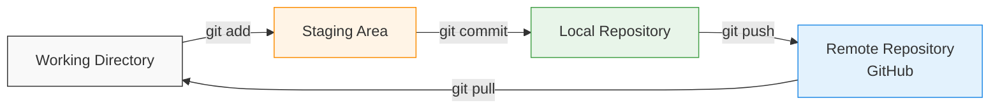
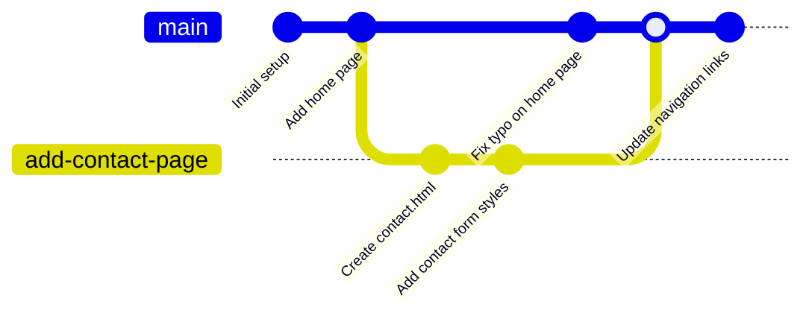

# Chapter 3: The Core Git Workflow

⏱️ **Time:** 30 minutes | 🎯 **Difficulty:** 🟢 Beginner

With your environment configured, this chapter introduces the fundamental Git workflow — the daily cycle of making changes, recording them, and sharing them. These commands are the ones you will use most often, and mastering them is the single most important skill in this workshop.

## 3.1 Cloning a Repository

Cloning creates a local copy of an existing repository on your machine, including all files and their complete history.

### Steps to Clone

1. **Find the Repository URL:**
   - On GitHub, navigate to the repository page.
   - Click the green **"<> Code"** button.
   - Copy the URL. Use the **SSH** tab if you set up SSH keys in [Chapter 2a](./02_a_github_account.md#2a4-setting-up-ssh-keys-recommended), or the **HTTPS** tab otherwise.

2. **Clone Using the Command Line:**
   ```bash
   git clone git@github.com:yourusername/your-repo.git
   ```
   Or with HTTPS:
   ```bash
   git clone https://github.com/yourusername/your-repo.git
   ```

3. **Open in VS Code:**
   ```bash
   cd your-repo
   code .
   ```

4. **Clone Using VS Code (Alternative):**
   - Open VS Code and select **"Clone Git Repository..."** from the welcome screen (or press `Ctrl+Shift+P` / `Cmd+Shift+P` and search "Git: Clone").
   - Paste the repository URL and press Enter.
   - Choose a local folder and click "Open" when prompted.

## 3.2 The Core Cycle: Edit, Stage, Commit, Push

This is the heart of everyday Git usage. Think of it as a four-step rhythm:

```
┌──────────────────────────────────────────────────────────────┐
│                                                              │
│   1. EDIT         2. STAGE        3. COMMIT      4. PUSH    │
│   ─────────       ──────────      ──────────     ─────────  │
│   Change your     Select which    Record a       Upload to  │
│   files           changes to      snapshot       GitHub     │
│                   include         with a                    │
│                                   message                   │
│                                                              │
│   (your editor)   git add         git commit     git push   │
│                                                              │
└──────────────────────────────────────────────────────────────┘
```

### Step 1: Edit Your Files

Make changes to your project files using VS Code (or any editor). Git is watching your working directory and knows which files have been modified.

### Step 2: Check What Has Changed

Before staging, review what Git has detected:

```bash
git status
```

This shows you:
- **Modified files** — files that exist in the repository but have been changed.
- **Untracked files** — new files Git has not seen before.
- **Staged files** — files ready to be committed (shown in green).

> **💡 Tip:** Run `git status` frequently. It is your compass — it tells you exactly where you are in the workflow.

You can also see the specific changes within files:

```bash
git diff
```

This shows a line-by-line comparison of what has changed since the last commit.

### Step 3: Stage Your Changes

Staging tells Git which changes you want to include in your next commit. This is an intentional step — it gives you control over exactly what gets recorded.

```bash
# Stage a specific file
git add index.html

# Stage multiple specific files
git add index.html styles/main.css

# Stage all changes in the current directory and below
git add .
```

> **📝 Note:** `git add .` stages everything. This is convenient but can accidentally include files you did not intend to commit (such as `.env` files or large binaries). For important commits, stage files individually.

### Step 4: Commit Your Changes

A commit records a snapshot of your staged changes with a descriptive message:

```bash
git commit -m "Add navigation bar to home page"
```

**Writing good commit messages matters.** Your future self (and collaborators) will rely on them to understand what changed and why.

**Good commit messages:**
```
Add responsive navigation menu
Fix broken link on about page
Update team photos for 2026
Remove unused CSS from footer styles
```

**Poor commit messages:**
```
fix stuff
update
asdfgh
changes
```

> **💡 Tip:** Write commit messages in the imperative mood ("Add feature" not "Added feature"). Think of each message as completing the sentence: "If applied, this commit will..."

### Step 5: Push to GitHub

Upload your local commits to the remote repository on GitHub:

```bash
git push
```

If this is the first push for a new branch:

```bash
git push -u origin main
```

The `-u` flag sets up tracking between your local branch and the remote branch, so future pushes only need `git push`.

### Step 6: Pull Changes from GitHub

If you (or a collaborator) have made changes on GitHub that are not yet on your local machine:

```bash
git pull
```

This fetches the latest changes from the remote and merges them into your current branch.

> **⚠️ Important:** Always pull before you push if you are working on a shared repository. This prevents conflicts and rejected pushes.

## 3.3 Essential Git Commands Reference

| Command | Description |
| ------- | ----------- |
| `git status` | Shows current changes, staged files, and untracked files |
| `git add <file>` | Stages a specific file for commit |
| `git add .` | Stages all changes in the current directory |
| `git commit -m "message"` | Records staged changes with a descriptive message |
| `git push` | Uploads local commits to the remote repository |
| `git pull` | Fetches and merges remote changes into your local branch |
| `git log` | Displays commit history |
| `git log --oneline` | Displays commit history in a compact single-line format |
| `git diff` | Shows unstaged changes (what you have modified but not yet staged) |
| `git diff --staged` | Shows staged changes (what will be included in the next commit) |

### The Git Workflow Diagram



## 3.4 Branching Basics

Branches let you work on new features or experiments without affecting the main codebase. Think of them as parallel timelines for your project.

### Creating and Switching Branches

```bash
# Create a new branch and switch to it
git checkout -b my-new-feature

# Switch back to main
git checkout main

# List all branches (the asterisk marks your current branch)
git branch
```

### A Typical Branch Workflow

1. **Create a branch** for your work:
   ```bash
   git checkout -b add-contact-page
   ```

2. **Make your changes**, stage, and commit as normal:
   ```bash
   # ... edit files ...
   git add contact.html styles/contact.css
   git commit -m "Add contact page with form"
   ```

3. **Push the branch** to GitHub:
   ```bash
   git push -u origin add-contact-page
   ```

4. **Merge back to main** when the work is complete:
   ```bash
   git checkout main
   git merge add-contact-page
   git push
   ```

5. **Delete the branch** (optional, keeps things tidy):
   ```bash
   git branch -d add-contact-page
   ```



> **💡 Tip:** For collaborative projects, merging is usually done via a Pull Request on GitHub rather than a local `git merge`. This allows others to review your changes before they are incorporated. See [Chapter 4](./04_collaboration_recovery.md) for details.

## 3.5 The .gitignore File

Not everything in your project directory should be tracked by Git. The `.gitignore` file tells Git which files and directories to ignore.

Create a `.gitignore` file in your project root:

```bash
# Dependencies
node_modules/

# Environment variables (NEVER commit these)
.env
.env.local
.env.*.local

# Build output
dist/
build/

# Operating system files
.DS_Store
Thumbs.db

# Editor settings (usually personal preference)
.vscode/settings.json

# API keys and credentials
*.key
credentials.json
```

> **⚠️ Critical:** Always add `.env` to your `.gitignore` before making your first commit. If you accidentally commit a file containing API keys, the key is in your Git history even if you delete the file later. See [Chapter 2c](./02_c_gcp_api_key.md#2c6-storing-api-keys-securely) for more on this.

## 3.6 Using VS Code's Git Integration

VS Code has excellent built-in Git support that provides a visual alternative to the command line.

### The Source Control Panel

Click the branch icon in the Activity Bar (or press `Ctrl+Shift+G` / `Cmd+Shift+G`) to open the Source Control panel. Here you can:

- **See modified files** — they appear in the "Changes" section.
- **Stage files** — click the `+` icon next to a file to stage it (equivalent to `git add`).
- **Unstage files** — click the `-` icon next to a staged file.
- **Write commit messages** — type your message in the input box at the top and click the tick icon (or press `Ctrl+Enter` / `Cmd+Enter`).
- **Push and pull** — use the `...` menu or the sync button in the status bar.

### Viewing Diffs

Click any modified file in the Source Control panel to see a side-by-side diff showing exactly what has changed.

### The Status Bar

The bottom-left of VS Code shows your current branch name. Click it to switch branches or create new ones.

## 3.7 Guided Exercise: Your First Git Project

Practise the complete Git workflow from scratch:

**1. Create a Project Folder and Initialise Git:**

```bash
mkdir ~/my-first-project
cd ~/my-first-project
git init
```

**2. Create Your First File:**

```bash
# Create a README.md file
echo "# My First Git Project" > README.md
echo "" >> README.md
echo "This is my first project managed with Git." >> README.md
```

**3. Stage and Commit:**

```bash
git add README.md
git commit -m "Initial commit: add README"
```

**4. Make a Change and Commit Again:**

Open `README.md` in VS Code and add a line:
```markdown
## About
This project demonstrates the core Git workflow.
```

```bash
git add README.md
git commit -m "Add about section to README"
```

**5. Create a Branch, Make Changes, and Merge:**

```bash
git checkout -b add-hello-page
echo "<h1>Hello, World!</h1>" > hello.html
git add hello.html
git commit -m "Add hello page"
git checkout main
git merge add-hello-page
```

**6. View Your History:**

```bash
git log --oneline
```

You should see three commits. In VS Code, use Git Graph to visualise the branch and merge.

**7. (Optional) Push to GitHub:**

Create a new repository on GitHub (click the `+` icon > "New repository"), then:

```bash
git remote add origin git@github.com:yourusername/my-first-project.git
git push -u origin main
```

<details>
<summary>🎯 Knowledge Check</summary>

Before moving forward, ensure you can answer:
1. What is the difference between `git add` and `git commit`?
2. What does `git status` show you?
3. Why should you pull before you push on a shared repository?
4. What goes in a `.gitignore` file?
5. What is a branch, and why would you use one?

**Answers:**
1. `git add` stages changes (selects them for the next commit); `git commit` records the staged changes as a permanent snapshot.
2. Which files have been modified, which are staged for commit, and which are untracked.
3. To incorporate any changes made by collaborators, preventing conflicts and rejected pushes.
4. Patterns for files and directories that Git should ignore — typically dependencies, build output, environment variables, and OS-specific files.
5. A branch is a parallel line of development. You use branches to work on features or experiments without affecting the main codebase.

</details>

---

**Next**: [Chapter 4: Collaboration & Recovery](./04_collaboration_recovery.md)
