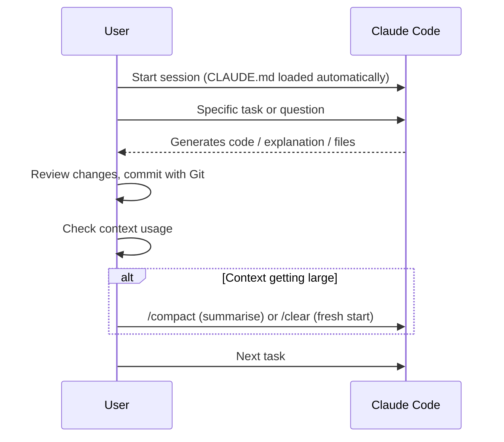

# Chapter 6: AI-Powered Workflows with Claude Code

This chapter brings together the [Git](https://git-scm.com/)/[GitHub](https://github.com/) foundation and your [VS Code](https://code.visualstudio.com/) setup with the power of Artificial Intelligence. We will focus on using [Claude Code](./02_d_roo_code_config.md), Anthropic's AI coding agent, to create an AI-powered workflow integrated directly into your development environment.

The workshop described this as the point where "suddenly what you've got is the world's strongest AI... connected through a coding agent into GitHub. Then you've got absolutely everything you need to build projects."

## 6.1 What is Claude Code?

[Claude Code](https://docs.anthropic.com/en/docs/claude-code) is Anthropic's official AI coding agent. Unlike simple autocomplete tools, Claude Code is an agentic assistant that can:

*   **Understand your entire project** -- it reads your files, understands your codebase, and navigates between files automatically.
*   **Generate Code** -- ask it to write functions, classes, or boilerplate based on descriptions.
*   **Explain Code** -- point it at any file and ask for a plain English explanation.
*   **Refactor Code** -- get suggestions to improve or restructure existing code.
*   **Debug** -- ask for help identifying and fixing bugs; it can read error messages and trace through your code.
*   **Run commands** -- it can execute terminal commands (with your permission) to test, build, and verify its work.
*   **Generate Documentation** -- create docstrings, comments, README files, or entire documentation suites.

Claude Code runs in your terminal and communicates with Claude's AI models. It has deep access to your local file system (with checks and safeguards), making it far more capable than a web-based chat interface for project work.

### How Claude Code Differs from Chat-Based AI

| Feature | Web Chat (e.g., claude.ai) | Claude Code |
|---------|---------------------------|-------------|
| Reads your files | No (you must paste them in) | Yes, automatically |
| Writes/edits files | No | Yes (with your permission) |
| Runs terminal commands | No | Yes (with your permission) |
| Understands project structure | No | Yes |
| Persistent project context | No | Yes, via CLAUDE.md |
| Works offline | No | No (needs internet for AI) |

## 6.2 Getting Started: Your First Claude Code Session

### Step 1: Launch Claude Code

Open your terminal (or VS Code's integrated terminal), navigate to your project, and start Claude Code:

```bash
cd ~/my-project
claude
```

Claude Code will greet you and begin understanding your project by reading key files.

### Step 2: Ask Your First Question

Start with something simple to see how it works:

```
> What does this project do?
```

Claude Code will scan your files and give you a summary. This is a great way to orient yourself in an unfamiliar codebase too.

### Step 3: Try a Creative Task

```
> Create a new file called "about.html" with a professional about page
  that matches the style of index.html
```

Claude Code will:
1. Read `index.html` to understand your existing style
2. Create `about.html` with matching structure and styling
3. Show you what it has created and ask for confirmation before writing

### Step 4: Use Git After Each Significant Change

This is critical. After Claude Code makes changes you are happy with:

```bash
git add .
git commit -m "Add about page (AI-generated)"
```

As the workshop emphasised: "You can't work with AI unless you're using version control because it will smash up everything it made before all the time... So you need to be doing source control."

## 6.3 Essential Claude Code Commands

### Slash Commands

Claude Code has built-in slash commands for common operations:

| Command | What it Does |
|---------|-------------|
| `/help` | Show all available commands and tips |
| `/fast` | Switch to a faster, cheaper model for quick tasks |
| `/clear` | Clear the conversation and start fresh |
| `/compact` | Summarise the conversation to free up context space |
| `/init` | Create a CLAUDE.md file for your project |

### The CLAUDE.md File

The `CLAUDE.md` file is how you teach Claude Code about your project. Create one in your project root:

```bash
claude
> /init
```

Or create it manually. Here is an example:

```markdown
# My Portfolio Website

## Overview
A personal portfolio site built with HTML, CSS, and vanilla JavaScript.
Hosted on GitHub Pages.

## Structure
- index.html -- home page
- about.html -- about page
- projects/ -- individual project pages
- styles/ -- CSS files
- scripts/ -- JavaScript files
- images/ -- all imagery

## Conventions
- Use British English in all content
- Mobile-first responsive design
- Semantic HTML5 elements
- No frameworks -- vanilla JS only
- All images must have alt text

## Build & Deploy
- No build step -- static files served directly
- Deploy by pushing to main branch (GitHub Pages)
```

Claude Code reads this file automatically at the start of every session, giving it persistent knowledge about your project.

### MCP Servers (Connecting External Tools)

Model Context Protocol (MCP) servers let Claude Code interact with external services. Some useful examples:

*   **GitHub** -- create issues, open pull requests, review code
*   **File system** -- access files outside your current project
*   **Web search** -- look up documentation and references

MCP configuration lives in your project's `.mcp.json` or your global Claude Code settings. This is an advanced feature -- you do not need it to get started.

## 6.4 The "Vibe Coding" Approach

"Vibe coding" was a central theme in the workshop -- an iterative, exploratory, and conversational way of working with the AI.

1.  **Start with a broad request:**
    ```
    > Lay out a project in this git directory for eye tracking in Python
      with a readme and all of the best directories
    ```

2.  **Iterate on the result:**
    ```
    > The README needs more detail in the installation section.
      Add step-by-step instructions for beginners.
    ```

3.  **Ask for explanations when needed:**
    ```
    > Why did you choose this directory structure?
      What is the purpose of the tests/ folder?
    ```

4.  **Commit frequently:**
    After each meaningful change, commit with Git so you can always roll back.

5.  **Reset when the conversation gets long:**
    Use `/compact` to summarise the conversation, or `/clear` to start fresh. Long conversations can lead to the AI losing track of earlier instructions.

The key is experimentation. "Think of something off the cuff... Honestly, you don't know what ballpark you're in until you've tried it."

## 6.5 Prompt Ideas for Creative Technologists

Here are practical examples to try:

*   **Project Scaffolding:**
    "Lay out a project structure for an academic research paper, including directories for data, figures, LaTeX source, and a Makefile for building the PDF."

*   **Documentation:**
    "Refactor this README into a beginner-friendly tutorial with step-by-step instructions."

*   **Creative Asset Work:**
    "Suggest colour-blind-safe palette variations for the colours used in styles/main.css."

*   **Complex Document Creation:**
    "Create a directory called horizon-bid and populate it with a project structure for an academic funding bid, including Mermaid Gantt charts and costing plan templates."

*   **Diagrams as Code:**
    "Create a Mermaid sequence diagram showing the authentication flow for this application."

*   **Understanding Existing Code:**
    "Describe this project" (after navigating to any codebase -- even one you did not write).

## 6.6 Context Management and Cost Control

Working effectively with Claude Code involves understanding how AI processes information.

### Understanding Context Windows

AI models operate within a "context window" -- a limit on the amount of information they can consider at once. As your conversation grows, so does the context. When the context fills up, the AI may start forgetting earlier instructions or producing less focused output.

**Key practices:**

*   **Use `/compact` regularly** -- this asks Claude Code to summarise the conversation, freeing up context space while retaining the key points.
*   **Use `/clear` for fresh starts** -- when switching to a completely different task, start a new session.
*   **Use CLAUDE.md for persistent context** -- information in CLAUDE.md is loaded at the start of every session, so you never lose project-level knowledge.

### Cost Management

*   **Claude.ai authentication:** If you use Claude Code with your claude.ai account, usage is included in your subscription tier. Check [claude.ai](https://claude.ai/) for current plan details.
*   **API key usage:** If you use an API key, costs are per-token. Use `/fast` for routine tasks (switches to a faster, cheaper model). Monitor your usage at [console.anthropic.com](https://console.anthropic.com/).
*   **The `/fast` toggle:** Use `/fast` for simple questions and quick tasks. Use the default mode (Opus) for complex reasoning, architecture decisions, and large refactoring tasks.

### The Core Interaction Loop

A sustainable workflow for complex tasks follows this pattern:



### Choosing the Right Tool for the Job

| Task | Best Tool |
|------|-----------|
| Complex refactoring across multiple files | Claude Code |
| Quick inline code completion while typing | GitHub Copilot |
| Exploring a new codebase you have never seen | Claude Code |
| Writing a single function | Claude Code or Copilot |
| Understanding what code does | Claude Code (can read whole files) |
| Generating project scaffolding | Claude Code |
| Experimenting with different AI models | Continue.dev |

## 6.7 The Power of AI with Local File Access

A significant advantage of using Claude Code over web-based AI chat interfaces is its ability to read from and write to your local file system (with your permission).

*   **Contextual Understanding:** It can read multiple files in your project to understand the broader context, leading to more relevant and accurate suggestions.
*   **Bulk Operations:** It can generate entire directory structures, fill them with template files, or refactor code across multiple files.
*   **Persistent Memory:** The CLAUDE.md file gives Claude Code persistent knowledge about your project across sessions.

This local integration, combined with robust version control via Git, creates a highly dynamic and powerful development environment. "The whole of the AI is connected to the whole of the documents, the whole of the time on your own system in a private way, connected to the version management system, connected to the rest of the team."

---

Next: [Chapter 7: Reference Cheat Sheet](./07_cheat_sheet.md)
