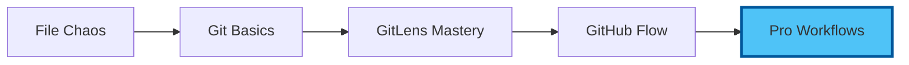
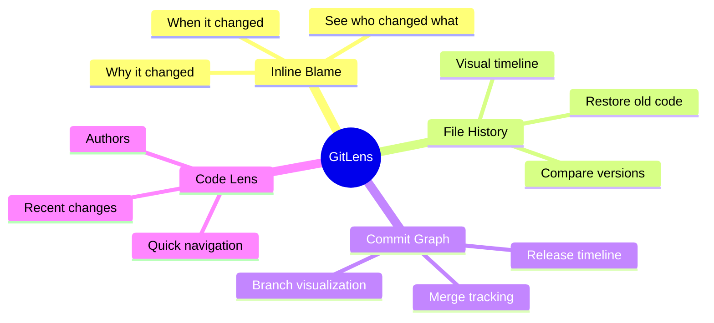
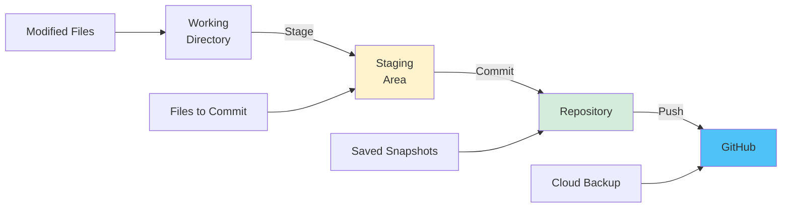
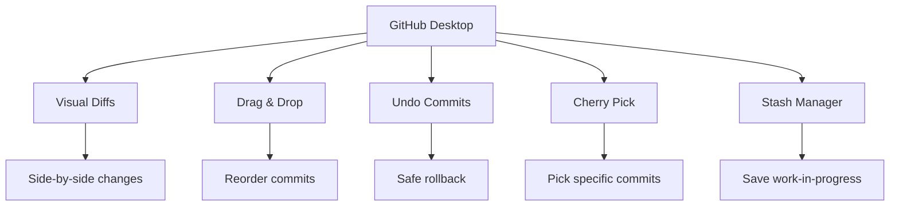
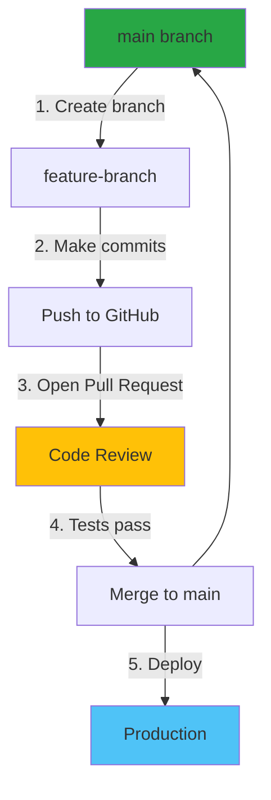

# Chapter 2: Hands-On Visual Version Control - Mastering Git the Modern Way

⏱️ **Estimated Time**: 90 minutes
🎯 **Difficulty**: Beginner to Intermediate
📋 **Prerequisites**: VS Code with GitLens installed, GitHub account

## Your Git Mastery Journey

Transform from manual file saving chaos to professional version control workflows using modern visual tools.



---

## 2.1 GitLens - Your Git Superpower

### Understanding GitLens Features

GitLens transforms Git from command-line intimidation to visual clarity.

#### Key Features Overview



### 2.1.1 Inline Blame - Know Who Changed What

💡 **Most powerful feature**: See author and date of every line

**Enable Inline Blame:**
1. Open settings: `Ctrl+,`
2. Search: "gitlens blame"
3. Enable: `Gitlens: Current Line > Enabled`

**What You'll See:**
```javascript
function calculateTotal(items) {  // John Doe, 3 days ago - Add tax calculation
  return items.reduce((sum, item) => sum + item.price, 0);
}
```

**Customization:**
```json
{
  "gitlens.currentLine.enabled": true,
  "gitlens.currentLine.format": "${author}, ${date} - ${message}",
  "gitlens.currentLine.dateFormat": "MMM D, YYYY",
  "gitlens.hovers.currentLine.over": "line"
}
```

<details>
<summary>🎯 <strong>Exercise: Find Change History</strong></summary>

**Task**: Investigate when a specific line was changed

1. Open any file in your project
2. Place cursor on interesting line
3. Look at inline blame annotation
4. Click annotation for full details
5. View commit, see all changes in that commit

**Pro Tip**: Hover over any line to see detailed change history!

</details>

### 2.1.2 File History - Time Travel for Files

**View File History:**
- **Method 1**: Right-click file → "GitLens: Open File History"
- **Method 2**: Click GitLens icon in sidebar → "File History"
- **Method 3**: `Ctrl+Shift+P` → "GitLens: Show File History"

**Visual Timeline View:**
```
📅 Today, 2:30 PM      Fix validation bug            You
📅 Yesterday, 4:15 PM  Add user authentication       Jane
📅 2 days ago, 10:00 AM Initial user model           John
📅 Last week          Project setup                  You
```

**Compare Any Two Versions:**
1. Open File History
2. Click first commit
3. Click "Compare with..."
4. Select second commit
5. See side-by-side diff!

### 2.1.3 Visual Commit Graph

💡 **Best for**: Understanding branch strategy, release planning

**Open Commit Graph:**
- **Keyboard**: `Ctrl+Shift+P` → "GitLens: Show Commit Graph"
- **Sidebar**: Click GitLens → "Commit Graph"

**What You'll See:**
```
* Commit 3 (main, origin/main)
|\
| * Commit 2 (feature-branch)
|/
* Commit 1
```

**Features:**
- Click commit to see details
- Right-click to compare, cherry-pick, revert
- Visual branch merges
- Tag and release tracking

<details>
<summary>📝 <strong>Note: Reading the Graph</strong></summary>

**Lines mean:**
- **Vertical line**: Same branch
- **Diagonal split**: New branch created
- **Diagonal merge**: Branches merged

**Colors indicate:**
- **Blue**: Current branch
- **Green**: Other branches
- **Red**: Tags/releases

</details>

### 2.1.4 Side Bar Views

**GitLens Sidebar Panels:**

1. **Commits View**
   - Recent commits
   - Quick access to changes
   - Search commits

2. **Branches View**
   - All branches
   - Local and remote
   - Quick checkout

3. **Stashes View**
   - Saved work-in-progress
   - Quick restore
   - Named stashes

4. **Contributors View**
   - Team members
   - Contribution stats
   - Filter by author

---

## 2.2 VS Code Source Control Panel

### Mastering the Built-in Git Interface

**Open Source Control:** `Ctrl+Shift+G`

### 2.2.1 The Three-Stage Workflow



**Visual Indicators:**
- **M** (Modified): Changed file
- **U** (Untracked): New file
- **D** (Deleted): Removed file
- **C** (Conflict): Merge conflict

### 2.2.2 Staging Changes

**Stage Individual Files:**
1. Hover over file in Source Control panel
2. Click `+` icon to stage

**Stage All Changes:**
- Click `+` icon next to "Changes" header

**Stage Specific Lines:**
1. Open file
2. Select lines in diff view
3. Right-click → "Stage Selected Ranges"

<details>
<summary>🎯 <strong>Exercise: Selective Staging</strong></summary>

**Scenario**: You changed 3 files but only want to commit 2

1. Make changes to 3 files
2. Stage only files related to feature A
3. Commit with message: "Add feature A"
4. Stage remaining file
5. Commit with message: "Fix unrelated typo"

**Why?** Keeps history clean and commits focused!

</details>

### 2.2.3 Writing Great Commit Messages

**Conventional Commits Format:**

```
<type>[optional scope]: <description>

[optional body]

[optional footer]
```

**Types:**
- `feat:` New feature
- `fix:` Bug fix
- `docs:` Documentation
- `style:` Formatting
- `refactor:` Code restructure
- `test:` Adding tests
- `chore:` Maintenance

**Examples:**

✅ **Good:**
```
feat(auth): add password reset functionality

Users can now request password reset via email. Implements secure
token generation and expiration.

Closes #42
```

❌ **Bad:**
```
update
```

```
fixed stuff
```

```
changes
```

💡 **Pro Tips:**
- First line: 50 chars max
- Body: 72 chars per line
- Use imperative mood: "Add" not "Added"
- Explain WHY, not WHAT (code shows what)

<details>
<summary>⚠️ <strong>Warning: Commit Message Tools</strong></summary>

**Install commitizen for structured commits:**

```bash
npm install -g commitizen
npm install -g cz-conventional-changelog
```

**Then use:** `git cz` instead of `git commit`

**Interactive prompts guide you to perfect commits!**

</details>

---

## 2.3 GitHub Desktop Integration

### Visual Git for Non-Command-Line Users

**Download:** [desktop.github.com](https://desktop.github.com)

### Why GitHub Desktop?



### Key Features

**1. Beautiful Diffs:**
- Color-coded changes
- Word-level highlighting
- Image diffs (before/after)

**2. Branch Management:**
- Visual branch switcher
- Create from any commit
- Drag-drop to merge

**3. Collaboration:**
- Pull request creation
- Review changes
- Resolve conflicts visually

💡 **When to use:**
- Learning Git concepts
- Complex merge conflicts
- Visual code review
- Teaching teammates

---

## 2.4 Git Graph Extension

### Visualize Your Repository

**Extension ID:** `mhutchie.git-graph`

**Features:**
```
🌳 Beautiful branch visualization
🔍 Search commits
🏷️ Tag management
🔀 Visual merge/rebase
📊 Contribution stats
```

**Open Git Graph:**
- Status bar → "Git Graph" button
- `Ctrl+Shift+P` → "Git Graph: View Git Graph"

**Use Cases:**

1. **Understand Branch Strategy:**
   ```
   main:     ●───●───●───●
              \     /
   feature:    ●───●
   ```

2. **Find Merge Points:**
   - See where branches merged
   - Identify merge conflicts
   - Track feature integration

3. **Release Planning:**
   - Tag releases
   - See version history
   - Plan next version

<details>
<summary>🎯 <strong>Exercise: Navigate Your History</strong></summary>

**Using Git Graph:**

1. Open Git Graph
2. Find your first commit
3. Right-click → "Checkout"
4. See project in initial state!
5. Return to latest: Checkout `main`

**Reflection**: How has project evolved?

</details>

---

## 2.5 Modern Git Workflows

### GitHub Flow (Recommended for Teams)



**Rules:**
1. `main` is always deployable
2. Create branch for each feature
3. Push early, push often
4. Use pull requests for review
5. Merge only when tests pass
6. Deploy immediately after merge

### Feature Branch Workflow

**Step-by-Step:**

**1. Create Feature Branch:**
```bash
# In VS Code terminal
git checkout -b feature/user-authentication
```

**2. Make Changes & Commit:**
```bash
# Make changes
git add .
git commit -m "feat(auth): implement login endpoint"
```

**3. Push to GitHub:**
```bash
git push -u origin feature/user-authentication
```

**4. Create Pull Request:**
- Go to GitHub
- Click "Compare & pull request"
- Add description
- Request reviewers

**5. Address Review Feedback:**
```bash
# Make changes
git add .
git commit -m "fix(auth): handle edge case"
git push
```

**6. Merge:**
- Squash commits (clean history)
- Delete feature branch
- Pull latest main

<details>
<summary>💡 <strong>Tip: Branch Naming Conventions</strong></summary>

**Good branch names:**
```
feature/user-profile
bugfix/login-timeout
hotfix/security-patch
docs/api-documentation
refactor/payment-service
```

**Bad branch names:**
```
my-branch
test
fixes
update
temporary
```

**Pattern:** `type/short-description`

</details>

---

## 2.6 Pre-commit Hooks with Husky

### Automate Quality Checks

**What are hooks?** Scripts that run before/after Git actions

### Setup Husky (2025 Best Practices)

**1. Install Husky:**
```bash
npm install --save-dev husky
npx husky init
```

**2. Add pre-commit hook:**
```bash
# .husky/pre-commit
npm run lint
npm run test
npm run format
```

**3. Add commit-msg hook:**
```bash
# .husky/commit-msg
npx --no -- commitlint --edit $1
```

### Common Hooks

**Pre-commit:**
- Run linters
- Format code
- Run tests
- Check types
- Validate file sizes

**Commit-msg:**
- Enforce commit format
- Check message length
- Prevent swear words

**Pre-push:**
- Run full test suite
- Build project
- Security scans

<details>
<summary>⚠️ <strong>Warning: Bypass Hooks Carefully</strong></summary>

**Skip hooks (emergency only):**
```bash
git commit --no-verify -m "hotfix: critical bug"
```

**Why avoid:**
- Breaks automation
- Skips quality checks
- Team inconsistency

**When okay:**
- Hotfix deployment
- Reverting broken commit
- Temporary work-in-progress

</details>

---

## 2.7 Advanced GitLens Features

### Code Lens Annotations

**Inline code insights:**
```javascript
function processPayment(amount) {  // 👤 3 authors | 📝 12 changes
  // Calculate tax
  const tax = amount * 0.2;        // 👤 Sarah Jones, 2 days ago
  return amount + tax;
}
```

**Enable Code Lens:**
```json
{
  "gitlens.codeLens.enabled": true,
  "gitlens.codeLens.authors.enabled": true,
  "gitlens.codeLens.recentChange.enabled": true
}
```

### Interactive Rebase Editor

💡 **Rewrite history safely**

**Use case**: Clean up commits before merging

**Steps:**
1. GitLens sidebar → Right-click commits
2. "Rebase commits..."
3. Visual editor appears
4. Drag to reorder
5. Mark commits to squash/edit
6. Apply!

**Operations:**
- **Pick**: Keep commit
- **Reword**: Change message
- **Squash**: Combine with previous
- **Drop**: Remove commit
- **Edit**: Modify commit

⚠️ **Never rebase shared branches!**

### Compare Branches

**Visual branch comparison:**
1. GitLens → Branches view
2. Right-click branch
3. "Compare with..."
4. Select another branch
5. See all differences!

---

## 2.8 Resolving Merge Conflicts

### Visual Conflict Resolution

**When conflicts happen:**
```
<<<<<<< HEAD
const API_URL = "https://api.production.com";
=======
const API_URL = "https://api.staging.com";
>>>>>>> feature-branch
```

**VS Code conflict tools:**

1. **Inline Actions:**
   - Accept Current Change
   - Accept Incoming Change
   - Accept Both Changes
   - Compare Changes

2. **3-Way Merge Editor:**
   - Left: Your changes
   - Right: Their changes
   - Bottom: Result
   - Visual merge!

**Enable 3-way merge:**
```json
{
  "git.mergeEditor": true
}
```

<details>
<summary>🎯 <strong>Exercise: Practice Conflict Resolution</strong></summary>

**Create intentional conflict:**

1. Create branch: `conflict-test`
2. Change line 1 to "Version A"
3. Commit and push
4. Checkout `main`
5. Change same line to "Version B"
6. Commit
7. Try to merge `conflict-test`
8. Resolve conflict!
9. Commit resolution

**Skills practiced**: Merging, conflict resolution, branch management

</details>

---

## 2.9 GitHub Integration Features

### Work with Pull Requests in VS Code

**Extension:** GitHub Pull Requests and Issues

**Features:**
- View PRs in sidebar
- Comment on code
- Request changes
- Merge from VS Code
- Track PR status

**Setup:**
1. Install extension
2. Sign in to GitHub
3. See PRs in sidebar
4. Comment inline!

### GitHub Copilot for Git

**AI-powered commit messages:**

```
Extension: GitHub Copilot

Feature: Suggest commit messages based on changes

Usage:
1. Stage changes
2. Click sparkle icon ✨ in commit message box
3. AI suggests message!
4. Edit and commit
```

---

## 2.10 Git Best Practices Checklist

### Professional Git Habits

**Daily Workflow:**
- [ ] Pull latest changes before starting work
- [ ] Create feature branch for each task
- [ ] Commit frequently with clear messages
- [ ] Push to backup your work
- [ ] Review diff before committing
- [ ] Run tests before pushing

**Commit Hygiene:**
- [ ] One logical change per commit
- [ ] Descriptive commit messages
- [ ] No secrets in commits
- [ ] Follow conventional commits
- [ ] Squash WIP commits before merging

**Branch Management:**
- [ ] Delete merged branches
- [ ] Keep `main` stable
- [ ] Sync with remote regularly
- [ ] Use descriptive branch names
- [ ] Never force push shared branches

**Code Review:**
- [ ] Review your own changes first
- [ ] Add PR description and context
- [ ] Link related issues
- [ ] Address all feedback
- [ ] Thank reviewers!

---

## 2.11 Troubleshooting Common Issues

### "Detached HEAD" State

**Problem**: Checked out specific commit, now lost

**Solution:**
```bash
git checkout main  # Return to main branch
git branch my-work <commit-hash>  # Create branch from commit
```

### Accidentally Committed to Wrong Branch

**Problem**: Committed to `main` instead of feature branch

**Solution:**
```bash
git branch feature-branch  # Create branch with changes
git reset --hard origin/main  # Reset main
git checkout feature-branch  # Switch to new branch
```

### Need to Undo Last Commit

**Keep changes:**
```bash
git reset --soft HEAD~1
```

**Discard changes:**
```bash
git reset --hard HEAD~1
```

### Pushed Sensitive Data

**Emergency procedure:**
1. Remove from repository
2. Use `git filter-branch` or BFG Repo Cleaner
3. Force push (team coordination!)
4. Rotate compromised secrets immediately

⚠️ **Prevention:** Use pre-commit hooks to scan for secrets!

---

## 🎉 Achievement Unlocked!

**You now master:**
✅ GitLens visual Git superpowers
✅ VS Code Source Control panel
✅ Modern Git workflows (GitHub Flow)
✅ Conventional commits
✅ Pre-commit automation
✅ Visual conflict resolution
✅ Professional Git habits

### Next Level Skills

**Continue learning:**
1. **Git rebase** interactive mode
2. **Git bisect** for bug hunting
3. **Git submodules** for dependencies
4. **Git worktrees** for parallel work
5. **Advanced GitLens** features

---

**Pro Tips:**

💡 **Daily Git Ritual:**
```bash
# Morning
git pull origin main

# Throughout day
git add .
git commit -m "feat: ..."
git push

# Before leaving
git push --all
```

📝 **Keyboard Shortcuts to Master:**
- `Ctrl+Shift+G`: Source Control
- `Ctrl+Enter`: Commit changes
- `Ctrl+K Ctrl+P`: Compare with...
- `Alt+Left/Right`: Navigate history

🚀 **You're now a Git visualization master!**

---

**Next**: [Chapter 3: Practical Exercises](./03_exercises.md)

[Back to Concepts](./01_concepts.md) | [Back to Module Overview](README.md)
