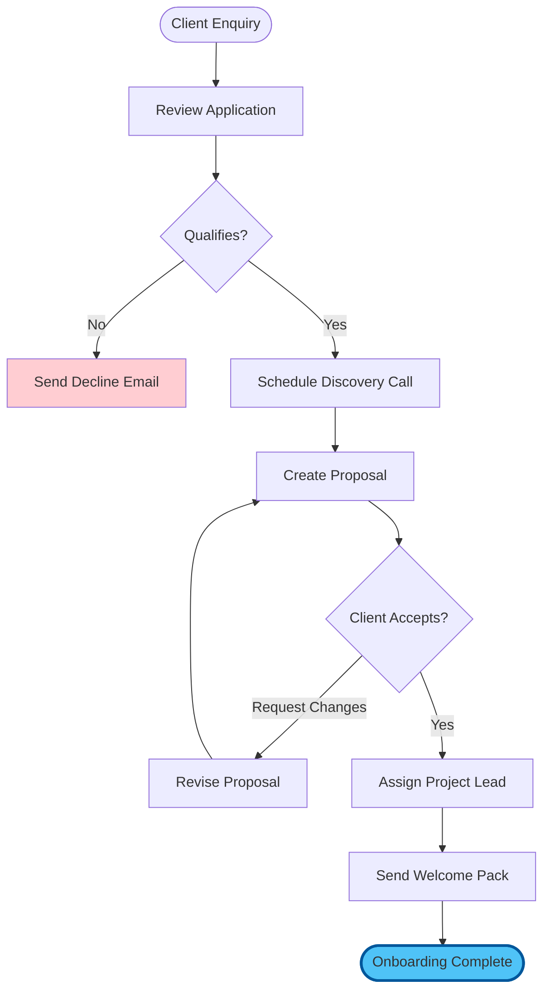
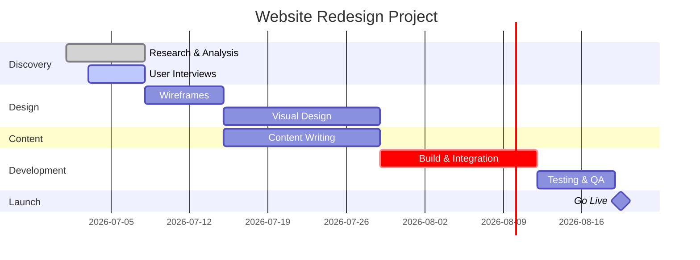
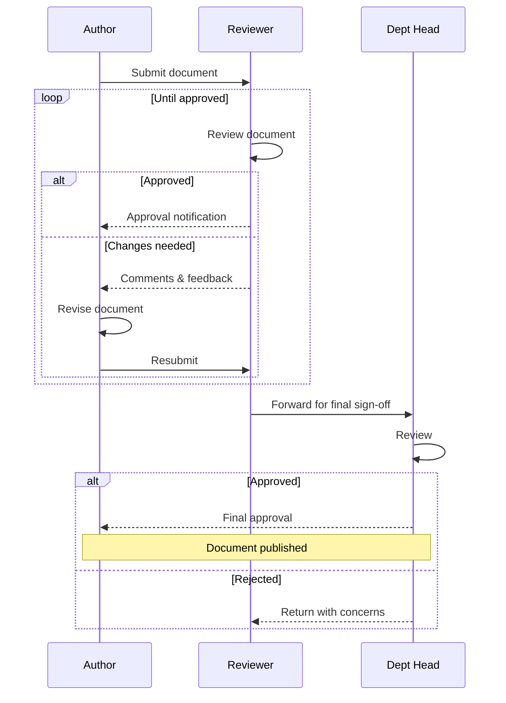

# Chapter 3: Practical Exercises — Sharpen Your Visual Version Control Skills

## 30 Minutes to Cement Your New Skills

These exercises progress from basic to advanced, reinforcing the Mermaid diagramming and Git version control skills from the hands-on session. Complete them in order for maximum learning.

---

## Exercise 1: Mermaid Flowchart from Description (5 minutes)

### Objective
Translate a written process into a professional flowchart without any diagramming software.

### Difficulty: Beginner

### Scenario
Your manager sends you this email:

> "We need to document our client onboarding process. New clients fill in an enquiry form. We review it within 24 hours. If they qualify, we schedule a discovery call. If not, we send a polite decline email. After the discovery call, we create a proposal. The client either accepts (we begin onboarding) or requests changes (we revise and resubmit). Once accepted, we assign a project lead and send a welcome pack."

### Steps

1. **Create a new file**: `exercises/onboarding-flow.md`

2. **Write the Mermaid flowchart** based on the description above. Start with:
   ```mermaid
   flowchart TD
       A([Client Enquiry]) --> B[Review Application]
       B --> C{Qualifies?}
   ```

3. **Complete the diagram** by adding all remaining steps, decisions, and connections

4. **Preview** your diagram: right-click the file and select "Open Preview" (or `Ctrl+Shift+V`)

5. **Refine**: Add styling to highlight the happy path:
   ```
   style G fill:#4fc3f7,stroke:#01579b,stroke-width:3px
   ```

### Expected Result

A complete flowchart with at least 8 nodes, 2 decision diamonds, and clear paths for all outcomes.

### Reflection
- How long would this take in PowerPoint or Visio?
- What happens when the process changes — how easy is it to update?

<details>
<summary><strong>Hint: Complete Solution</strong></summary>



</details>

---

## Exercise 2: Project Gantt Chart (5 minutes)

### Objective
Create a realistic project timeline using Mermaid Gantt chart syntax.

### Difficulty: Beginner to Intermediate

### Scenario
You're managing a 6-week website redesign project with these phases:

| Phase | Duration | Dependencies |
|-------|----------|-------------|
| Discovery & Research | 1 week | None (starts immediately) |
| User Interviews | 5 days | Starts during week 1 |
| Wireframes | 1 week | After research complete |
| Visual Design | 2 weeks | After wireframes |
| Content Writing | 2 weeks | Starts with visual design |
| Development | 2 weeks | After visual design |
| Testing | 1 week | After development |
| Launch | 1 day | After testing |

### Steps

1. **Create file**: `exercises/project-timeline.md`

2. **Build the Gantt chart**:
   ```mermaid
   gantt
       title Website Redesign Project
       dateFormat YYYY-MM-DD
       section Discovery
       Research & Analysis    :done, d1, 2026-07-01, 7d
       User Interviews        :active, d2, 2026-07-03, 5d
   ```

3. **Add remaining sections**: Design, Content, Development, and Launch

4. **Use status markers**: `done`, `active`, `crit` (critical path), or leave blank for future tasks

5. **Preview** and verify the timeline makes sense

### Expected Result

A complete Gantt chart showing all 8 tasks across 4 sections with proper dependencies.

<details>
<summary><strong>Hint: Complete Solution</strong></summary>



</details>

### Reflection
- How would you update this when timelines shift?
- What advantage does text-based diagramming have over drag-and-drop tools?

---

## Exercise 3: Git Workflow Practice (7 minutes)

### Objective
Execute a complete Git workflow using VS Code's visual tools — from initial commit through branching and merging.

### Difficulty: Intermediate

### Steps

1. **Initialise a new repository**:
   - Create a folder: `exercises/my-documentation-project/`
   - Open it in VS Code
   - Open Source Control panel (`Ctrl+Shift+G`)
   - Click "Initialize Repository"

2. **Create your first file and commit**:
   - Create `README.md` with:
     ```markdown
     # My Documentation Project
     
     A version-controlled documentation repository.
     
     ## Contents
     - Project overview (this file)
     ```
   - In Source Control panel, click `+` to stage the file
   - Type commit message: `docs: initial project setup with README`
   - Click the tick icon (or press `Ctrl+Enter`) to commit

3. **Create a feature branch**:
   - Click the branch name in the bottom-left status bar (it says `main`)
   - Select "Create new branch..."
   - Name it: `feature/add-process-diagram`
   - Confirm you're now on the new branch

4. **Add content on the branch**:
   - Create `process-diagram.md` with a Mermaid flowchart of any process you choose
   - Stage and commit: `feat: add process workflow diagram`

5. **Switch back to main and merge**:
   - Click the branch name again, switch to `main`
   - Open terminal (`Ctrl+``): `git merge feature/add-process-diagram`
   - Verify the merge succeeded — your diagram file should now be on `main`

6. **View your history in GitLens**:
   - Open the GitLens Commit Graph (`Ctrl+Shift+P` > "GitLens: Show Commit Graph")
   - See both commits and the branch/merge structure

### Success Criteria
- [ ] Repository initialised with at least 2 commits
- [ ] Feature branch created and merged
- [ ] Commit graph shows the branch structure
- [ ] All commit messages follow conventional format

### Reflection
- How does this compare to saving files as "v1", "v2", "v3"?
- When would you create a branch in your real work?

---

## Exercise 4: Sequence Diagram for a Real Workflow (6 minutes)

### Objective
Document a real interaction or approval process from your work using a Mermaid sequence diagram.

### Difficulty: Intermediate

### Scenario
Choose ONE of these scenarios (or use your own):

**Option A — Document Approval:**
An author submits a document to a reviewer. The reviewer either approves it or sends comments. If comments are sent, the author revises and resubmits. Once approved, the document goes to the department head for final sign-off.

**Option B — Expense Claim:**
An employee submits an expense claim through a web portal. The system validates the amount. Claims under 100 pounds are auto-approved. Claims over 100 pounds go to a manager. The manager approves or rejects. Approved claims are sent to finance for payment.

### Steps

1. **Create file**: `exercises/workflow-sequence.md`

2. **Write the sequence diagram**. Here's a starter for Option A:
   ```mermaid
   sequenceDiagram
       participant Author
       participant Reviewer
       participant Head as Dept Head
       
       Author->>Reviewer: Submit document
   ```

3. **Add all interactions** including:
   - Alternative paths (use `alt` / `else` blocks)
   - Loop for revision cycles (use `loop`)
   - Notes for important details (use `Note over`)

4. **Preview** and verify the flow matches the scenario

5. **Commit your work**: Stage and commit with message `feat: add workflow sequence diagram`

<details>
<summary><strong>Hint: Option A Complete Solution</strong></summary>



</details>

### Reflection
- How many people in your organisation could benefit from seeing this diagram?
- What processes in your work would be clearer as sequence diagrams?

---

## Exercise 5: Full Documentation Mini-Project (7 minutes)

### Objective
Combine everything: create a multi-file, diagram-rich, version-controlled documentation project.

### Difficulty: Advanced

### Steps

1. **Create project structure**:
   ```
   exercises/team-handbook/
   ├── README.md
   ├── onboarding/
   │   └── process.md
   ├── workflows/
   │   └── project-lifecycle.md
   └── tools/
       └── recommended-stack.md
   ```

2. **README.md** — Write a brief handbook introduction with a Mermaid mind map showing the handbook sections:
   ```mermaid
   mindmap
     root((Team Handbook))
       Onboarding
         New starter process
         First week checklist
       Workflows
         Project lifecycle
         Approval gates
       Tools
         Recommended stack
         Setup guides
   ```

3. **onboarding/process.md** — Create a flowchart showing the new starter journey (first day through to first month)

4. **workflows/project-lifecycle.md** — Create a Gantt chart showing a typical project lifecycle for your team

5. **tools/recommended-stack.md** — List recommended tools with a Mermaid graph showing how they connect

6. **Version-control the entire project**:
   - Initialise a Git repo (if not already in one)
   - Commit each file separately with meaningful messages:
     - `docs: add team handbook structure and README`
     - `docs: add onboarding process flowchart`
     - `docs: add project lifecycle Gantt chart`
     - `docs: add recommended tools overview`

7. **Push to GitHub** (optional but recommended):
   - Create a new repository on GitHub
   - Push your local repository:
     ```bash
     git remote add origin https://github.com/YOUR-USERNAME/team-handbook.git
     git push -u origin main
     ```

### Success Criteria
- [ ] 4 files created, each containing at least one Mermaid diagram
- [ ] 4 separate commits with conventional commit messages
- [ ] Diagrams render correctly in preview
- [ ] Project structure is logical and navigable
- [ ] (Stretch) Pushed to GitHub and visible on your profile

### Reflection
- How long did this take compared to creating the same content in Word/PowerPoint?
- Could you hand this to a colleague and have them continue your work?
- What would you add to make this a real team resource?

---

## Exercise Summary

| Exercise | Skill Practised | Difficulty | Time |
|----------|----------------|------------|------|
| 1. Onboarding Flowchart | Mermaid flowcharts | Beginner | 5 min |
| 2. Project Gantt Chart | Mermaid Gantt charts | Beginner–Intermediate | 5 min |
| 3. Git Workflow | Branching, merging, committing | Intermediate | 7 min |
| 4. Sequence Diagram | Mermaid sequences, real scenarios | Intermediate | 6 min |
| 5. Full Mini-Project | All skills combined | Advanced | 7 min |

## Patterns You've Practised

### The Diagram-from-Description Pattern
```
Written description --> Identify actors & steps --> Mermaid syntax --> Preview & refine
```

### The Feature Branch Pattern
```
Create branch --> Make changes --> Commit --> Merge back to main
```

### The Documentation Project Pattern
```
Plan structure --> Create files with diagrams --> Commit each piece --> Push to GitHub
```

## Common Mistakes to Avoid

1. **Mermaid syntax errors**: Check for missing arrows (`-->` not `->`) and proper node IDs (no spaces in IDs)
2. **Forgetting to stage**: Files must be staged before committing — look for the `+` icon
3. **Vague commit messages**: "update" tells you nothing in 6 months; "docs: add onboarding flowchart" tells the whole story
4. **Not previewing diagrams**: Always check the rendered output before committing
5. **One massive commit**: Commit logical units separately for clean history

## Pro Tips from the Exercises

1. **Start simple, then refine** — get the basic diagram working before adding styling
2. **Use the Mermaid Live Editor** (https://mermaid.live/) for complex diagrams — it gives instant feedback
3. **Commit early and often** — small commits are easier to understand and revert
4. **Read your Git history** — use GitLens to review what you've built; it reinforces the workflow
5. **Ask Claude Code to generate Mermaid** — describe what you want in plain English and let AI draft the syntax

---

Next: [Chapter 4: Real Project Application](./04_project.md)

[Back to Hands-On Practice](./02_hands_on.md) | [Back to Workshop Overview](README.md)
