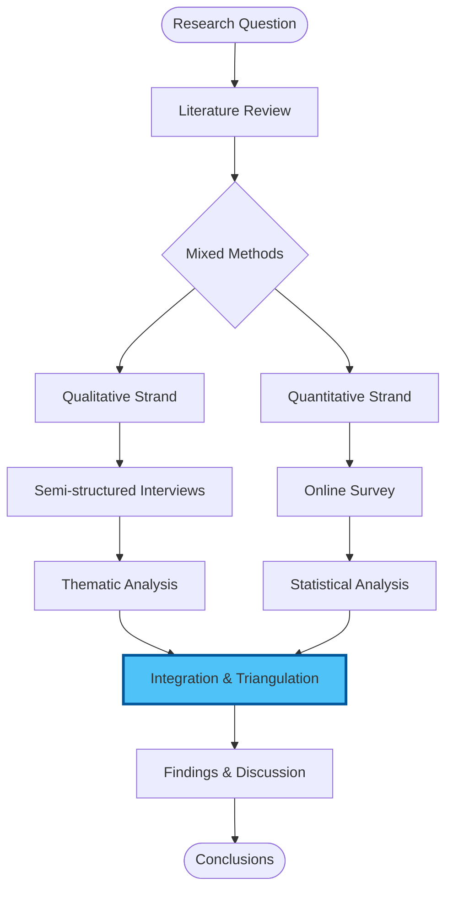
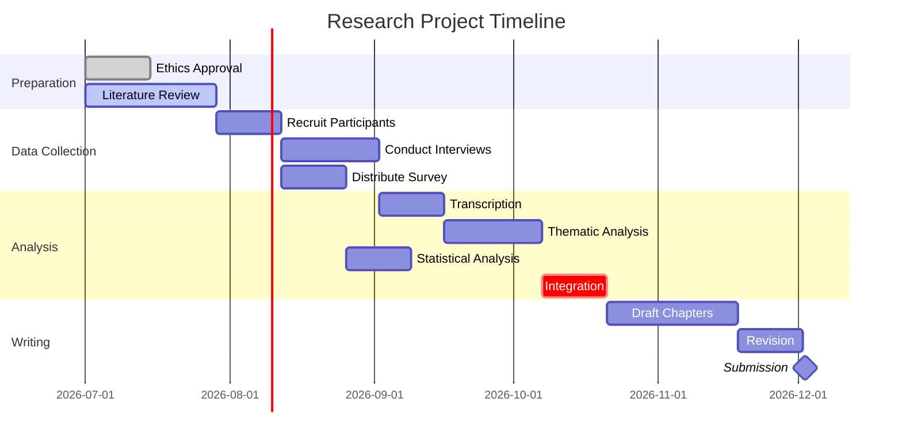
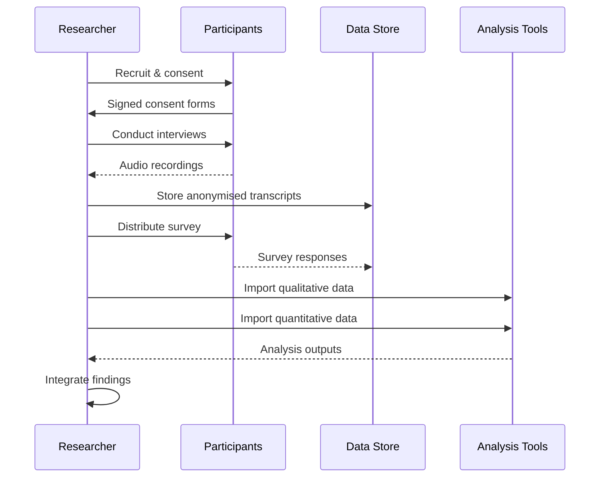
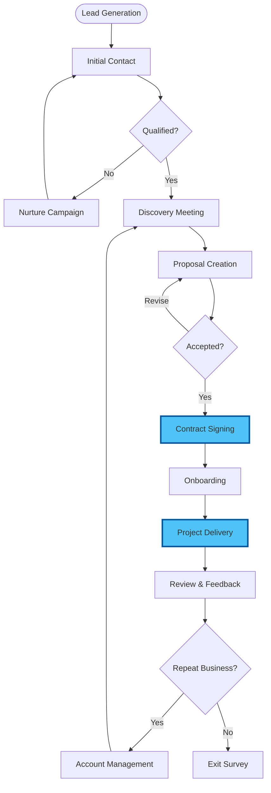
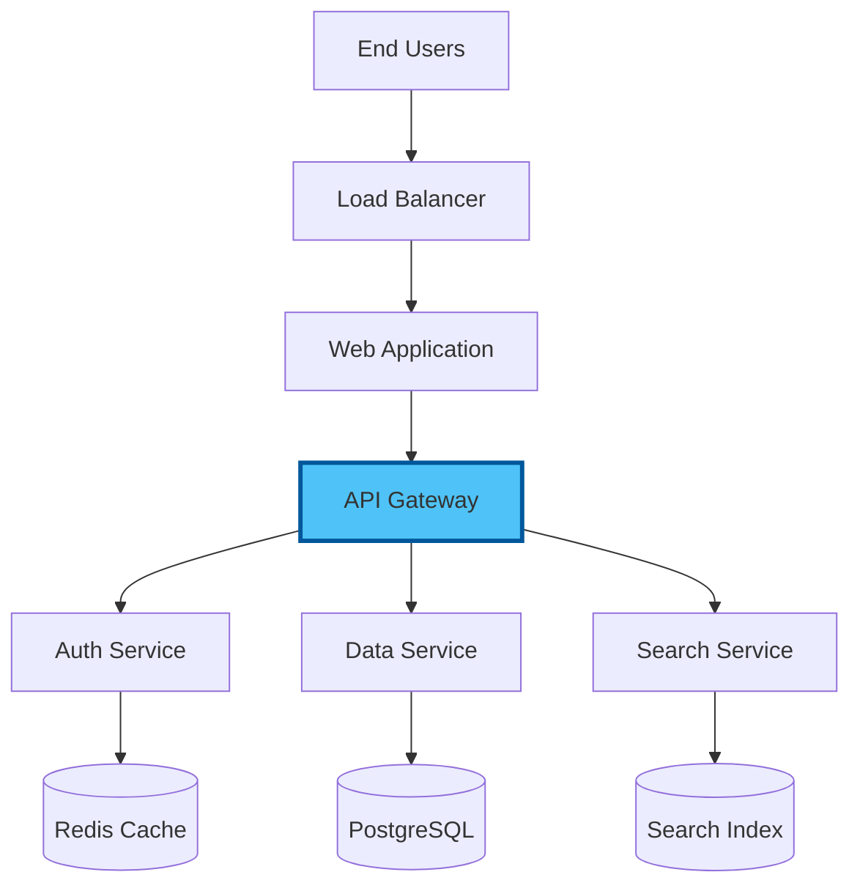
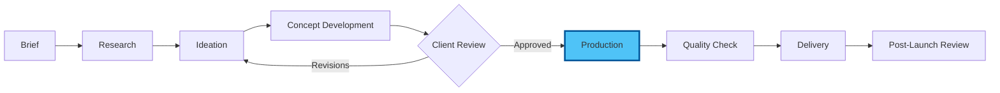
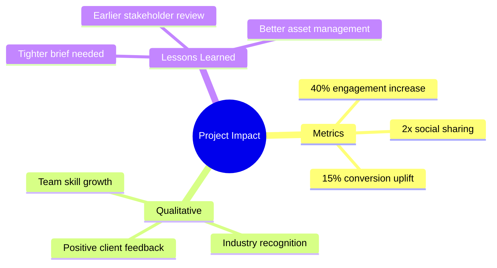

# Chapter 4: Real Project Application — Your First Visual, Version-Controlled Deliverable

## 20 Minutes to Professional Results

Now we apply everything — Mermaid diagrams, Git version control, and visual tools — to create a real deliverable from your actual work. Choose a project path that matches your needs.

## Choose Your Project Path

Select the project most relevant to your work:

### Path A: Research Documentation Package
Perfect for: Academics, Researchers, PhD Students

### Path B: Business Process & Reporting
Perfect for: Executives, Consultants, Project Managers

### Path C: Technical System Documentation
Perfect for: Engineers, IT Professionals, Analysts

### Path D: Creative Project Portfolio
Perfect for: Designers, Writers, Marketing Professionals

---

## Path A: Research Documentation Package

### Project: Visualised Research Methodology with Full Version History

### Step 1: Project Setup (2 minutes)

Create this structure in VS Code and initialise Git:

```bash
research-docs/
├── methodology/
│   └── approach.md
├── timeline/
│   └── project-plan.md
├── analysis/
│   └── data-flow.md
└── README.md
```

```bash
cd research-docs
git init
```

### Step 2: Research Methodology Diagram (5 minutes)

**File**: `methodology/approach.md`

Write a brief description of your research approach, then create a Mermaid flowchart:

```markdown
# Research Methodology

## Overview
This study uses a mixed-methods approach combining qualitative 
interviews with quantitative survey data.

## Methodology Flow



**Commit**: `docs: add research methodology flowchart`

### Step 3: Project Timeline (5 minutes)

**File**: `timeline/project-plan.md`

Create a Gantt chart for your research schedule:



**Commit**: `docs: add research project Gantt timeline`

### Step 4: Data Flow Diagram (5 minutes)

**File**: `analysis/data-flow.md`

Create a sequence diagram showing data collection and analysis:



**Commit**: `docs: add data collection sequence diagram`

### Step 5: Push to GitHub (3 minutes)

```bash
git remote add origin https://github.com/YOUR-USERNAME/research-docs.git
git push -u origin main
```

### Deliverable
A complete, version-controlled research documentation package with three professionally rendered diagrams.

---

## Path B: Business Process & Reporting

### Project: Visual Quarterly Review with Version-Tracked Documentation

### Step 1: Project Setup (2 minutes)

```bash
business-review/
├── processes/
│   └── client-journey.md
├── planning/
│   └── q3-roadmap.md
├── reporting/
│   └── team-workflow.md
└── README.md
```

Initialise Git and commit the structure.

### Step 2: Client Journey Flowchart (5 minutes)

**File**: `processes/client-journey.md`

```markdown
# Client Journey Map

## End-to-End Process



**Commit**: `docs: add client journey flowchart`

### Step 3: Quarterly Roadmap (5 minutes)

**File**: `planning/q3-roadmap.md`

Create a Gantt chart for the quarter's major initiatives. Use real or realistic project names from your work.

**Commit**: `docs: add Q3 roadmap Gantt chart`

### Step 4: Team Workflow Diagram (5 minutes)

**File**: `reporting/team-workflow.md`

Create a sequence diagram showing how a deliverable moves through your team (e.g., from request through review to delivery).

**Commit**: `docs: add team workflow sequence diagram`

### Step 5: Push to GitHub (3 minutes)

Create a private repository on GitHub and push your work.

### Deliverable
A professional business documentation suite demonstrating process clarity and project planning.

---

## Path C: Technical System Documentation

### Project: System Architecture with Visual Documentation

### Step 1: Project Setup (2 minutes)

```bash
system-docs/
├── architecture/
│   └── overview.md
├── workflows/
│   └── deployment.md
├── integrations/
│   └── data-flow.md
└── README.md
```

### Step 2: Architecture Overview (5 minutes)

**File**: `architecture/overview.md`

Document a system you work with using a Mermaid graph:



**Commit**: `docs: add system architecture overview diagram`

### Step 3: Deployment Workflow (5 minutes)

**File**: `workflows/deployment.md`

Create a sequence diagram showing your deployment or release process.

**Commit**: `docs: add deployment workflow sequence diagram`

### Step 4: Data Flow (5 minutes)

**File**: `integrations/data-flow.md`

Create a flowchart showing how data moves through your system, including decision points and error handling.

**Commit**: `docs: add data flow integration diagram`

### Step 5: Push to GitHub (3 minutes)

Push to a private repository.

### Deliverable
Technical documentation suitable for onboarding new team members or presenting to stakeholders.

---

## Path D: Creative Project Portfolio

### Project: Visual Case Study with Version History

### Step 1: Project Setup (2 minutes)

```bash
portfolio-case/
├── process/
│   └── creative-workflow.md
├── timeline/
│   └── project-phases.md
├── outcomes/
│   └── impact-summary.md
└── README.md
```

### Step 2: Creative Workflow Visualisation (5 minutes)

**File**: `process/creative-workflow.md`

Document a creative process (e.g., brand design, campaign development, content creation):



**Commit**: `docs: add creative workflow diagram`

### Step 3: Project Phases (5 minutes)

**File**: `timeline/project-phases.md`

Create a Gantt chart showing a real or example project timeline with creative phases (research, concepts, production, delivery).

**Commit**: `docs: add project phases Gantt chart`

### Step 4: Impact Summary (5 minutes)

**File**: `outcomes/impact-summary.md`

Use a mind map to visualise the outcomes and impact of the project:



**Commit**: `docs: add project impact mind map`

### Step 5: Push to GitHub (3 minutes)

Create a public repository (this is portfolio content!) and push.

### Deliverable
A portfolio-ready case study demonstrating your creative process and measurable outcomes.

---

## Universal Project Completion Checklist

Regardless of path chosen:

- [ ] Project folder structure created and logical
- [ ] At least 3 Mermaid diagrams (different types) included
- [ ] Git repository initialised with at least 4 meaningful commits
- [ ] Commit messages follow conventional format (`docs:`, `feat:`, etc.)
- [ ] Diagrams render correctly in VS Code Markdown preview
- [ ] README.md provides clear project overview
- [ ] (Stretch) Pushed to GitHub and visible on your profile

## Time Analysis

Calculate your efficiency gain:

1. **Traditional approach** (Word/PowerPoint/Visio): ___ hours estimated
2. **Visual version control approach**: 20 minutes actual
3. **Time saved**: ___ hours
4. **Quality comparison**: Which approach produces more maintainable documentation?

## Reflection Questions

1. Which diagram type was most useful for your work?
2. How does having a commit history change your confidence in making edits?
3. What other projects from your work could benefit from this approach?
4. Would you share this repository with a colleague? Why or why not?
5. How could you use Claude Code to generate the initial Mermaid diagrams even faster?

## What You've Demonstrated

In 20 minutes, you've created what traditionally takes hours:
- **Professional diagrams** that update when you edit text
- **Complete version history** showing every change you made
- **Cloud backup** (if pushed to GitHub) ensuring nothing is lost
- **Shareable documentation** that anyone can read and contribute to

This isn't about replacing your expertise — it's about removing friction so you spend more time on substance and less on formatting.

---

Next: [Chapter 5: Assessment & Mastery Validation](./05_assessment.md)

[Back to Exercises](./03_exercises.md) | [Back to Workshop Overview](README.md)
