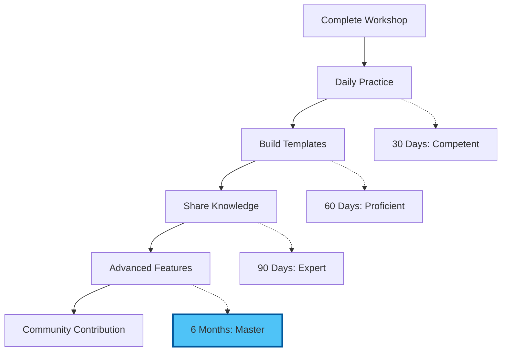

# Chapter 6: Resources & Continued Learning

## Introduction: Your Learning Library

This comprehensive resource collection supports your ongoing journey from AI consumer to AI commander. Organized by skill level and use case.

## Official Documentation

### VS Code Core

**Essential Reading:**
- 📚 [VS Code Official Docs](https://code.visualstudio.com/docs) - Start here
- ⌨️ [Keyboard Shortcuts Reference](https://code.visualstudio.com/shortcuts/keyboard-shortcuts-windows.pdf)
- 🎨 [Themes and Customization](https://code.visualstudio.com/docs/getstarted/themes)
- 🔧 [Settings Sync Guide](https://code.visualstudio.com/docs/editor/settings-sync)

**Video Tutorials:**
- [VS Code in 100 Seconds](https://www.youtube.com/watch?v=KMxo3T_MTvY) - Quick overview
- [VS Code Tips and Tricks](https://www.youtube.com/watch?v=tnSnVlbKtMk) - Official tutorial
- [VS Code Power User Guide](https://www.youtube.com/watch?v=ifTF3ags0XI) - Advanced features

### AI Integration

**Continue (Free AI)**
- 📖 [Continue Documentation](https://continue.dev/docs)
- 💬 [Continue Discord Community](https://discord.gg/vapESyrFmJ)
- 🎥 [Continue Setup Tutorial](https://continue.dev/docs/quickstart)
- 📝 [Model Provider Comparison](https://continue.dev/docs/models)

**GitHub Copilot**
- 📖 [Copilot Documentation](https://docs.github.com/en/copilot)
- 🎓 [Copilot Learning Path](https://learn.microsoft.com/en-us/training/modules/introduction-to-github-copilot/)
- 💡 [Copilot Best Practices](https://github.blog/2023-06-20-how-to-write-better-prompts-for-github-copilot/)

**Codeium**
- 📖 [Codeium Docs](https://codeium.com/docs)
- 🚀 [Getting Started Guide](https://codeium.com/docs/getting-started/overview)
- 📊 [Enterprise Features](https://codeium.com/docs/enterprise/overview)

## Extension Recommendations

### By Profession

#### For Academics & Researchers

```json
{
  "essential": [
    "yzhang.markdown-all-in-one",
    "streetsidesoftware.code-spell-checker",
    "james-yu.latex-workshop",
    "notZaki.pandocciter"
  ],
  "recommended": [
    "znck.grammarly",
    "mushan.vscode-paste-image",
    "bierner.markdown-mermaid",
    "hediet.vscode-drawio"
  ],
  "advanced": [
    "tomoki1207.pdf",
    "genieai.chatgpt-vscode",
    "dotjoshjohnson.xml"
  ]
}
```

**Installation Command:**
```bash
code --install-extension yzhang.markdown-all-in-one \
     --install-extension james-yu.latex-workshop \
     --install-extension notZaki.pandocciter
```

#### For Business Professionals

```json
{
  "essential": [
    "yzhang.markdown-all-in-one",
    "mechatroner.rainbow-csv",
    "hediet.vscode-drawio",
    "gruntfuggly.todo-tree"
  ],
  "recommended": [
    "marp-team.marp-vscode",
    "johnpapa.vscode-peacock",
    "eamodio.gitlens",
    "bierner.markdown-preview-github-styles"
  ],
  "advanced": [
    "RandomFractalsInc.vscode-data-preview",
    "GrapeCity.gc-excelviewer",
    "janisdd.vscode-edit-csv"
  ]
}
```

#### For Creative Professionals

```json
{
  "essential": [
    "bierner.markdown-mermaid",
    "yzhang.markdown-all-in-one",
    "naumovs.color-highlight",
    "christian-kohler.path-intellisense"
  ],
  "recommended": [
    "marp-team.marp-vscode",
    "oderwat.indent-rainbow",
    "formulahendry.auto-rename-tag",
    "pranaygp.vscode-css-peek"
  ],
  "advanced": [
    "kisstkondoros.vscode-gutter-preview",
    "pnp.polacode",
    "pflannery.vscode-versionlens"
  ]
}
```

#### For Technical Writers

```json
{
  "essential": [
    "yzhang.markdown-all-in-one",
    "streetsidesoftware.code-spell-checker",
    "davidanson.vscode-markdownlint",
    "bierner.markdown-mermaid"
  ],
  "recommended": [
    "yzane.markdown-pdf",
    "shd101wyy.markdown-preview-enhanced",
    "shuworks.vscode-table-formatter",
    "jebbs.plantuml"
  ],
  "advanced": [
    "redhat.vscode-yaml",
    "tamasfe.even-better-toml",
    "timonwong.shellcheck"
  ]
}
```

## Learning Paths

### Beginner Path (Weeks 1-2)

**Week 1: Foundation**
- [ ] Complete VS Code basics tutorial
- [ ] Install and configure essential extensions
- [ ] Create first AI-enhanced document
- [ ] Master 10 keyboard shortcuts
- [ ] Set up project structure template

**Resources:**
- 📺 [VS Code Crash Course](https://www.youtube.com/watch?v=WPqXP_kLzpo)
- 📖 [Markdown Guide](https://www.markdownguide.org/)
- 💻 Practice: Create daily standup notes template

**Week 2: AI Integration**
- [ ] Configure AI assistant (Continue/Copilot)
- [ ] Practice effective prompting
- [ ] Complete 5 real documents with AI
- [ ] Create 3 custom snippets
- [ ] Join VS Code community forum

**Resources:**
- 📺 [Effective Prompting Guide](https://www.youtube.com/watch?v=jC4v5AS4RIM)
- 📖 [Prompt Engineering Handbook](https://www.promptingguide.ai/)
- 💻 Practice: Transform old document with AI

### Intermediate Path (Weeks 3-4)

**Week 3: Automation**
- [ ] Build custom snippet library
- [ ] Set up workspace templates
- [ ] Learn regex for find/replace
- [ ] Configure task automation
- [ ] Master multi-cursor editing

**Resources:**
- 📺 [VS Code Advanced Features](https://www.youtube.com/watch?v=u21W_tfPVrY)
- 📖 [Regex Tutorial](https://regexone.com/)
- 💻 Practice: Batch process 10 documents

**Week 4: Version Control**
- [ ] Git basics in VS Code
- [ ] GitLens mastery
- [ ] Branch management
- [ ] Collaboration workflows
- [ ] GitHub integration

**Resources:**
- 📺 [Git & GitHub for Beginners](https://www.youtube.com/watch?v=RGOj5yH7evk)
- 📖 [Git Documentation](https://git-scm.com/doc)
- 💻 Practice: Version control real project

### Advanced Path (Month 2+)

**Advanced Skills:**
- [ ] Custom extension development
- [ ] Advanced AI integrations
- [ ] Workspace configuration mastery
- [ ] Build team templates
- [ ] Contribute to open source

**Resources:**
- 📺 [Extension Development Tutorial](https://code.visualstudio.com/api)
- 📖 [TypeScript Documentation](https://www.typescriptlang.org/docs/)
- 💻 Project: Build custom workflow extension

## Community Resources

### Forums & Communities

**Official:**
- 💬 [VS Code Discord](https://aka.ms/vscode-discord)
- 📧 [VS Code Mailing List](https://code.visualstudio.com/updates)
- 🐛 [GitHub Issues](https://github.com/microsoft/vscode/issues)

**Third-Party:**
- 🌐 [Reddit r/vscode](https://reddit.com/r/vscode)
- 💡 [Stack Overflow](https://stackoverflow.com/questions/tagged/visual-studio-code)
- 📱 [VS Code Twitter](https://twitter.com/code)

### Newsletters & Blogs

**Must-Follow:**
- 📰 [VS Code Blog](https://code.visualstudio.com/blogs)
- 📬 [VS Code Newsletter](https://code.visualstudio.com/updates)
- ✍️ [Smashing Magazine VS Code Articles](https://www.smashingmagazine.com/category/vs-code)

## Tools & Utilities

### Productivity Enhancers

**Essential Tools:**
```bash
# Code formatter
npm install -g prettier

# Markdown processor
npm install -g markdown-cli

# PDF converter
npm install -g markdown-pdf

# Spell checker
npm install -g cspell
```

**Diagram Tools:**
- 🎨 [Mermaid Live Editor](https://mermaid.live/) - Test diagrams
- 📐 [Draw.io](https://app.diagrams.net/) - Complex diagrams
- 🔷 [PlantUML](https://plantuml.com/) - UML diagrams

### Templates & Boilerplates

**Document Templates:**
- 📄 [Awesome README Templates](https://github.com/matiassingers/awesome-readme)
- 📋 [Markdown Templates](https://github.com/othneildrew/Best-README-Template)
- 📊 [Project Documentation Templates](https://github.com/kylelobo/The-Documentation-Compendium)

**VS Code Configurations:**
- ⚙️ [Settings Gist Collection](https://gist.github.com/bradtraversy/b28a0a361880141af928ada800a671d9)
- 🎨 [Theme Gallery](https://vscodethemes.com/)
- 🔧 [Awesome VS Code](https://github.com/viatsko/awesome-vscode)

## Cheat Sheets

### Essential Keyboard Shortcuts

**Download/Print:**
- 🖨️ [Windows Shortcuts PDF](https://code.visualstudio.com/shortcuts/keyboard-shortcuts-windows.pdf)
- 🖨️ [macOS Shortcuts PDF](https://code.visualstudio.com/shortcuts/keyboard-shortcuts-macos.pdf)
- 🖨️ [Linux Shortcuts PDF](https://code.visualstudio.com/shortcuts/keyboard-shortcuts-linux.pdf)

**Quick Reference:**
```ascii
┌─────────────────────────────────────────┐
│        ESSENTIAL SHORTCUTS              │
├─────────────────────────────────────────┤
│ Command Palette    Ctrl+Shift+P         │
│ Quick Open         Ctrl+P               │
│ Find in Files      Ctrl+Shift+F         │
│ Terminal           Ctrl+`               │
│ AI Assistant       Ctrl+I               │
│ Save All           Ctrl+K S             │
│ Split Editor       Ctrl+\               │
│ Close File         Ctrl+W               │
│ Format Document    Shift+Alt+F          │
│ Multi-Cursor       Alt+Click            │
└─────────────────────────────────────────┘
```

### Markdown Reference

```markdown
# Headings
## Subheading

**Bold** and *Italic*

- Bullet list
1. Numbered list

[Link](https://example.com)


`Inline code` and
```
Code blocks
```

> Blockquote

| Table | Header |
|-------|--------|
| Cell  | Data   |
```

### Mermaid Diagram Quick Reference

```mermaid
# Flowchart
graph TD
    A --> B

# Sequence
sequenceDiagram
    Alice->>Bob: Hello

# Gantt
gantt
    title Project
    Task 1 :a1, 2024-01-01, 30d

# Pie Chart
pie
    "Cats" : 85
    "Dogs" : 15

# State Diagram
stateDiagram-v2
    [*] --> Active
```

## Cost Management

### AI API Pricing (2025)

**Free Tiers:**
| Provider | Free Tier | Best For |
|----------|-----------|----------|
| Groq | 14,400 req/day | Speed |
| Google Gemini | 60 req/minute | Context |
| Claude (Free) | Limited | Quality |

**Paid Options:**
| Provider | Cost | Pro/Con |
|----------|------|---------|
| OpenAI GPT-4 | $0.03/1K tokens | Expensive, high quality |
| Anthropic Claude | $0.01/1K tokens | Good value, smart |
| OpenAI GPT-3.5 | $0.002/1K tokens | Cheap, good enough |

**Cost Optimization Tips:**
1. Use free tiers for experimentation
2. GPT-3.5 for simple tasks
3. GPT-4/Claude for complex work
4. Local models (Ollama) for privacy
5. Monitor usage with budgets

## Troubleshooting Guide

### Common Issues & Solutions

**Issue: Extensions Won't Install**
```bash
# Solution 1: Reset extension cache
rm -rf ~/.vscode/extensions
code --install-extension <extension-id>

# Solution 2: Install manually
# Download .vsix from marketplace
# Extensions panel → ... → Install from VSIX
```

**Issue: AI Not Responding**
```bash
# Check API key
# Open settings.json
# Verify key format: "api-key": "sk-..."

# Check internet connection
ping api.openai.com

# Restart VS Code
# Ctrl+Shift+P → "Reload Window"
```

**Issue: Slow Performance**
```json
{
  "files.exclude": {
    "**/node_modules": true,
    "**/.git": true
  },
  "search.exclude": {
    "**/node_modules": true
  },
  "extensions.autoUpdate": false
}
```

## Next Steps

### Immediate Actions (Today)

- [ ] Bookmark this resource page
- [ ] Join VS Code Discord
- [ ] Install one new extension
- [ ] Create your templates folder
- [ ] Share with a colleague

### This Week

- [ ] Complete beginner learning path
- [ ] Create 3 custom snippets
- [ ] Use VS Code exclusively for documents
- [ ] Track time savings
- [ ] Write reflection notes

### This Month

- [ ] Master keyboard shortcuts
- [ ] Build template library
- [ ] Help colleague get started
- [ ] Contribute to community
- [ ] Explore advanced features

## Getting Help

**Workshop Support:**
- 📧 Email: workshop@dreamlab.ai
- 💬 Discord: [Workshop Channel]
- 📅 Office Hours: Fridays 2-3pm GMT

**Technical Issues:**
- 🐛 [Report Bug](https://github.com/microsoft/vscode/issues)
- 💡 [Feature Request](https://github.com/microsoft/vscode/issues)
- 📖 [Documentation](https://code.visualstudio.com/docs)

## Contributing Back

### Share Your Knowledge

**Ways to Contribute:**
1. **Write a blog post** about your workflow
2. **Create templates** for your profession
3. **Answer questions** in forums
4. **Report bugs** and suggest features
5. **Build extensions** for your use case

**Template for Sharing:**
```markdown
# My VS Code Workflow for [Profession]

## Problem
[What challenge did you face?]

## Solution
[How did VS Code + AI solve it?]

## Implementation
[Step-by-step guide]

## Results
[Time saved, quality improved, etc.]

## Resources
[Links to your templates, configs]
```

## Staying Current

**Monthly Checklist:**
- [ ] Read VS Code release notes
- [ ] Try one new extension
- [ ] Update AI models
- [ ] Review new features
- [ ] Optimize workflows

**Annual Review:**
- [ ] Reassess tool stack
- [ ] Calculate ROI
- [ ] Update templates
- [ ] Share success stories
- [ ] Plan advanced training

## Your Learning Journey



## Conclusion

Your transformation from AI consumer to AI commander doesn't end with this workshop—it's just beginning. These resources will support your continued growth.

**Remember:**
- Learning is continuous
- Community is valuable
- Sharing multiplies impact
- Excellence requires practice

**Final Encouragement:**

You now possess tools that 99% of professionals don't know exist. Use them responsibly, share generously, and continue pushing the boundaries of what's possible with AI-enhanced productivity.

Welcome to the elite ranks of AI commanders. 🚀

---

**Workshop Complete!**

[Back to Assessment](./05_assessment.md) | [Back to Module Overview](README.md) | [Proceed to Afternoon Session →](../workshop-01-afternoon-visual-version-control/README.md)

