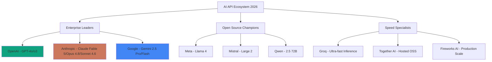
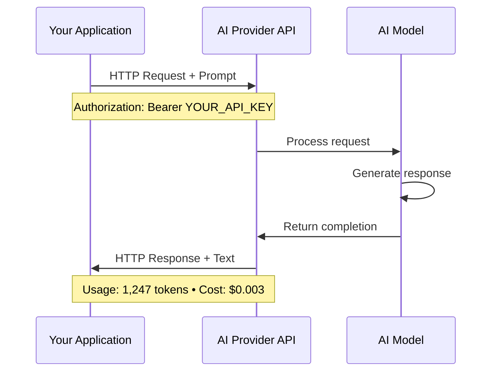
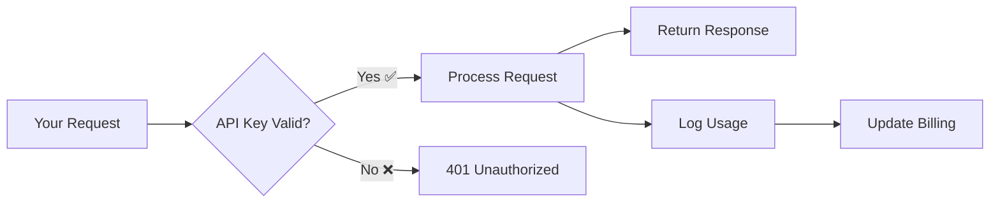
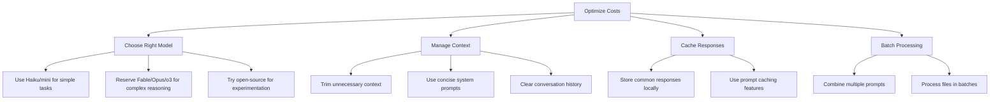
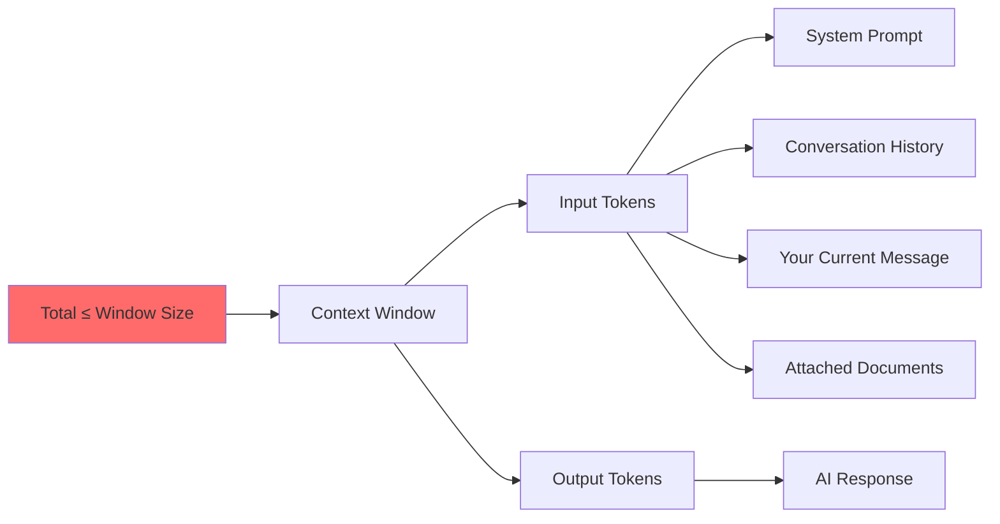
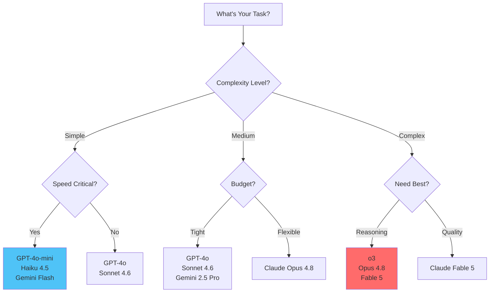

# Chapter 1: Core Concepts - Understanding AI APIs in 2026

## The Modern AI API Landscape

The AI API ecosystem has matured dramatically. Understanding these fundamentals empowers you to harness cutting-edge models with precision and control.

💡 **Tip**: Think of APIs as your direct line to the world's most powerful AI models—no intermediaries, no limitations.



## What Is an API? (The Simple Truth)

### The Restaurant Analogy 🍽️

An API is like ordering at a restaurant:

- **You (Client)**: Place your order (send a request)
- **Waiter (API)**: Takes order, brings food (handles communication)
- **Kitchen (AI Model)**: Prepares your meal (processes your request)

You don't need to know how the kitchen works—just order what you want and receive results.

### Technical Definition (For the Curious)

An **API (Application Programming Interface)** allows software to communicate. For AI services:



⚠️ **Warning**: Never share your API keys publicly—treat them like passwords!

## REST APIs: The Universal Language

### What is REST?

**REST (Representational State Transfer)** is how web services talk:

- Uses HTTP methods: `GET`, `POST`, `PUT`, `DELETE`
- Stateless: Each request is independent
- Returns structured data (JSON format)

### Anatomy of an AI API Request

```bash
curl https://api.openai.com/v1/chat/completions \
  -H "Content-Type: application/json" \
  -H "Authorization: Bearer YOUR_API_KEY" \
  -d '{
    "model": "gpt-4o",
    "messages": [
      {
        "role": "system",
        "content": "You are a helpful AI assistant."
      },
      {
        "role": "user",
        "content": "Explain quantum computing in simple terms"
      }
    ],
    "temperature": 0.7,
    "max_tokens": 500
  }'
```

**Breaking it down:**
- **Endpoint**: Where to send the request
- **Headers**: Authentication and content type
- **Body**: Your configuration and prompt
- **Response**: JSON with AI-generated text

📝 **Note**: Most developers use SDKs (libraries) that handle this complexity for you.

## Authentication: API Keys Explained

### What is an API Key?

Your API key is your unique identifier—like a password that:
- Authenticates your requests
- Tracks your usage
- Enables billing
- Sets rate limits



### API Key Security Best Practices (2026 Edition)

**DO:**
✅ Store keys in environment variables (`.env` files)
✅ Use secrets managers (AWS Secrets Manager, 1Password)
✅ Rotate keys every 90 days
✅ Set spending limits on all accounts
✅ Enable MFA on provider accounts
✅ Use separate keys for dev/prod environments

**DON'T:**
❌ Hardcode keys in source code
❌ Commit keys to Git repositories
❌ Share keys in Slack/Discord/email
❌ Use the same key across all projects
❌ Skip setting up budget alerts

### Example: Secure Key Management

```python
# ❌ WRONG - Never do this!
api_key = "sk-proj-abc123xyz..."

# ✅ CORRECT - Use environment variables
import os
from dotenv import load_dotenv

load_dotenv()
api_key = os.getenv("OPENAI_API_KEY")

if not api_key:
    raise ValueError("Missing OPENAI_API_KEY environment variable")
```

```typescript
// ✅ TypeScript/Node.js example
import * as dotenv from 'dotenv';
dotenv.config();

const apiKey = process.env.OPENAI_API_KEY;
if (!apiKey) {
  throw new Error('Missing OPENAI_API_KEY');
}
```

```bash
# .env file (NEVER commit this!)
OPENAI_API_KEY=sk-proj-abc123...
ANTHROPIC_API_KEY=sk-ant-api03-xyz...
GEMINI_API_KEY=AIzaSy...
```

## Token Economics: Understanding Costs

### What Are Tokens? 🪙

Tokens are pieces of text. Think of them as:
- **~4 characters** per token
- **~0.75 words** per token
- Both input AND output count

**Example:**
```
"Hello, how are you today?" = 6 tokens
"I am doing great, thanks for asking!" = 8 tokens
Total conversation cost = 14 tokens
```

💡 **Tip**: Use [OpenAI's tokenizer](https://platform.openai.com/tokenizer) to see exact token counts.

### 2026 Pricing Comparison (USD per 1M tokens)

Pricing changes frequently. The table below gives a rough sense of relative costs — always check the provider's own pricing page for current rates.

| Provider | Model | Input | Output | Context | Best For |
|----------|-------|--------|---------|---------|----------|
| **OpenAI** | GPT-4o | ~$2.50 | ~$10.00 | 128K | General purpose |
| | GPT-4o-mini | ~$0.15 | ~$0.60 | 128K | High volume |
| | o3 | Check [platform.openai.com](https://platform.openai.com) | | 200K | Complex reasoning |
| **Anthropic** | Fable 5 | Check [console.anthropic.com](https://console.anthropic.com) | | 200K | Latest & most capable |
| | Opus 4.8 | Check console | | 200K | Top-tier reasoning |
| | Sonnet 4.6 | ~$3.00 | ~$15.00 | 200K | Best value premium |
| | Haiku 4.5 | ~$0.25 | ~$1.25 | 200K | Speed champion |
| **Google** | Gemini 2.5 Flash | Check [aistudio.google.dev](https://aistudio.google.dev) | | 1M | Massive context, cheap |
| | Gemini 2.5 Pro | Check console | | 2M | Entire codebases |
| **Groq** | Llama 4 | Check [console.groq.com](https://console.groq.com) | | 128K | Fast & free tier |

📝 **Note**: Prices as of mid-2026. Models and pricing evolve rapidly — always check the provider console for current rates before budgeting.

### Real-World Cost Thinking

The key principle: **match the model to the task**. You do not need the most expensive model for every job.

**Scenario 1: Blog Article Generation**
```
Task: Generate 1,500-word article
Input: ~500 tokens (prompt + outline)
Output: ~2,000 tokens (article)

A mid-tier model (GPT-4o, Sonnet 4.6): pennies per article
A budget model (Gemini Flash, Haiku 4.5): fractions of a penny

For 100 articles/month, expect under £5 with mid-tier models.
```

**Scenario 2: Entire Codebase Analysis**
```
Task: Review 50,000 tokens of code
Input: 50,000 tokens
Output: 3,000 tokens (review)

Gemini 2.5 Pro (2M context) handles this in a single pass.
Claude Sonnet 4.6 (200K) is excellent for detailed code review.

For 50 reviews/month, expect under £10 with either approach.
```

**Scenario 3: Complex Reasoning Task**
```
Task: Strategic business analysis
Input: 1,000 tokens (data)
Output: 5,000 tokens (analysis)

Premium models (Fable 5, Opus 4.8, o3) cost more but
justify it for tasks where reasoning quality matters.

⚠️ Reserve premium models for complex tasks — the difference is real!
```

### Cost Optimization Strategies



💡 **Tip**: Start with cheaper models, upgrade only when needed. Most tasks don't require Fable 5 or Claude Opus!

## Rate Limits: Staying Within Bounds

### What Are Rate Limits?

Providers limit how fast you can make requests:

- **RPM**: Requests Per Minute
- **TPM**: Tokens Per Minute
- **TPD**: Tokens Per Day

### 2026 Rate Limits (Typical Free/Tier 1)

Rate limits change as providers adjust tiers. Check each provider's documentation for the latest figures. Typical patterns:

| Provider | Free Tier | Paid Tier | Notes |
|----------|-----------|-----------|-------|
| **OpenAI** | Low RPM (~3-5) | Scales with spend | Tiers unlock at $5, $50, $100+ spend |
| **Anthropic** | Low RPM (~5) | Scales with deposit | Build tier at $5+, Scale by approval |
| **Google** | Generous free tier | High throughput | Free tier includes 1.5M+ tokens/day |
| **Groq** | Free with limits | Pay-as-you-go | Ultra-fast but lower daily caps |

⚠️ **Warning**: Rate limits reset based on time windows. Plan batch operations accordingly!

### Handling Rate Limit Errors (Best Practices)

```python
import time
from openai import OpenAI, RateLimitError
from tenacity import retry, stop_after_attempt, wait_exponential

client = OpenAI()

@retry(
    stop=stop_after_attempt(3),
    wait=wait_exponential(multiplier=1, min=2, max=10)
)
def make_api_call(prompt: str):
    """Makes API call with automatic retry and exponential backoff."""
    try:
        response = client.chat.completions.create(
            model="gpt-4o",
            messages=[{"role": "user", "content": prompt}],
            timeout=30  # Prevent hanging
        )
        return response
    except RateLimitError as e:
        print(f"⚠️ Rate limited: {e}. Retrying with backoff...")
        raise  # Let tenacity handle the retry
```

```typescript
// TypeScript with exponential backoff
import OpenAI from 'openai';

const client = new OpenAI();

async function callWithRetry(
  prompt: string,
  maxRetries = 3
): Promise<string> {
  for (let attempt = 0; attempt < maxRetries; attempt++) {
    try {
      const response = await client.chat.completions.create({
        model: 'gpt-4o',
        messages: [{ role: 'user', content: prompt }],
      });
      return response.choices[0].message.content;
    } catch (error: any) {
      if (error.status === 429 && attempt < maxRetries - 1) {
        const waitTime = Math.pow(2, attempt) * 1000;
        console.log(`⏳ Rate limited. Waiting ${waitTime}ms...`);
        await new Promise(resolve => setTimeout(resolve, waitTime));
      } else {
        throw error;
      }
    }
  }
  throw new Error('Max retries exceeded');
}
```

## Context Windows: Memory Capacity

### What is a Context Window?

The maximum text an AI can "remember" in one conversation:



### 2026 Context Window Comparison

| Model | Context Window | ~Pages | Best Use Case |
|-------|----------------|--------|---------------|
| GPT-4o | 128K | ~300 | Standard documents |
| o3 | 200K | ~500 | Complex reasoning |
| Claude Fable 5 | 200K | ~500 | Latest & most capable |
| Claude Opus 4.8 | 200K | ~500 | Top-tier reasoning |
| Claude Sonnet 4.6 | 200K | ~500 | Best value large context |
| Claude Haiku 4.5 | 200K | ~500 | Speed + large files |
| Gemini 2.5 Flash | 1M | ~2,500 | Large documents |
| Gemini 2.5 Pro | 2M | ~5,000 | **Entire codebases!** |
| Llama 4 | 128K+ | ~300+ | Open source |

🎯 **Exercise**: Need to analyse a 1,000-page manual? Gemini 2.5 Pro can read it all at once!

### Managing Long Conversations

```python
from anthropic import Anthropic

class ConversationManager:
    """Manages conversation history with context window limits."""

    def __init__(self, max_tokens=100_000):
        self.max_tokens = max_tokens
        self.messages = []
        self.client = Anthropic()

    def add_message(self, role: str, content: str):
        """Add message and trim if needed."""
        self.messages.append({"role": role, "content": content})
        self._trim_if_needed()

    def _estimate_tokens(self, text: str) -> int:
        """Rough estimate: 1 token ≈ 0.75 words"""
        return int(len(text.split()) * 1.3)

    def _trim_if_needed(self):
        """Keep system message + recent context only."""
        total = sum(self._estimate_tokens(m["content"])
                   for m in self.messages)

        while total > self.max_tokens and len(self.messages) > 2:
            # Always keep system message (index 0)
            self.messages.pop(1)
            total = sum(self._estimate_tokens(m["content"])
                       for m in self.messages)

    def get_response(self, user_message: str) -> str:
        """Send message and get AI response."""
        self.add_message("user", user_message)

        response = self.client.messages.create(
            model="claude-sonnet-4-6",
            max_tokens=4096,
            messages=self.messages
        )

        ai_message = response.content[0].text
        self.add_message("assistant", ai_message)
        return ai_message
```

## Model Selection: The Decision Matrix

### Choosing the Right Model



### Model Strengths (2026 Edition)

| Model | Best For | Strengths | Watch Out For |
|-------|----------|-----------|---------------|
| **GPT-4o** | Balanced tasks | Reliable, fast, good at everything | Not specialised |
| **GPT-4o-mini** | High volume | Much cheaper, very fast | Less creative |
| **o3** | Reasoning | Top-tier problem-solving, maths | Slower, pricier |
| **Claude Fable 5** | Latest & best | Anthropic's most capable model | Premium pricing |
| **Claude Opus 4.8** | Premium reasoning | Top-tier analysis and code | Expensive output |
| **Claude Sonnet 4.6** | Coding/writing | Excellent code, natural prose, best balance | Mid-tier cost |
| **Claude Haiku 4.5** | Speed + quality | Fastest premium model | Not for complex tasks |
| **Gemini 2.5 Flash** | Large docs | 1M context, very cheap | Check latest capabilities |
| **Gemini 2.5 Pro** | Massive context | 2M window, code analysis | Higher cost than Flash |
| **Llama 4** | Open source | Free (via Groq), flexible | Needs more prompting |

### Real-World Selection Examples

**Writing a blog post?**
→ Start with **Claude Sonnet 4.6** (best prose)
→ Edit with **GPT-4o-mini** (cheap proofreading)

**Analysing a large codebase?**
→ Use **Gemini 2.5 Pro** (2M context window)
→ Get detailed review from **Claude Sonnet 4.6**

**Complex maths problem?**
→ **o3** or **Claude Opus 4.8** (specialised reasoning)

**Quick customer support responses?**
→ **GPT-4o-mini** or **Haiku 4.5** (fast + cheap)

**Creative storytelling?**
→ **Claude Fable 5** or **Sonnet 4.6** (most natural)

## Key Parameters Explained

### Temperature (0.0 - 2.0)

Controls randomness:

```python
# Deterministic, factual (0.0-0.3)
response = client.chat.completions.create(
    model="gpt-4o",
    temperature=0.2,  # Consistent answers
    messages=[{"role": "user", "content": "What is 2+2?"}]
)

# Balanced creativity (0.7-0.9)
response = client.chat.completions.create(
    model="gpt-4o",
    temperature=0.8,  # More creative
    messages=[{"role": "user", "content": "Write a poem about AI"}]
)

# Wild creativity (1.5-2.0)
response = client.chat.completions.create(
    model="gpt-4o",
    temperature=1.8,  # Very unpredictable!
    messages=[{"role": "user", "content": "Invent a new language"}]
)
```

### Max Tokens

Limits response length:

```python
# Short summary
response = client.chat.completions.create(
    model="gpt-4o",
    max_tokens=150,  # ~100 words
    messages=[{"role": "user", "content": "Summarize quantum computing"}]
)

# Detailed explanation
response = client.chat.completions.create(
    model="gpt-4o",
    max_tokens=2000,  # ~1,500 words
    messages=[{"role": "user", "content": "Explain quantum computing in detail"}]
)
```

### Streaming Responses

Show text as it's generated:

```python
from openai import OpenAI

client = OpenAI()

print("AI: ", end="", flush=True)
for chunk in client.chat.completions.create(
    model="gpt-4o",
    messages=[{"role": "user", "content": "Write a haiku"}],
    stream=True
):
    if chunk.choices[0].delta.content:
        print(chunk.choices[0].delta.content, end="", flush=True)
print()  # New line at end
```

## Key Takeaways

✅ **APIs provide direct access** to AI models—no web interface needed
✅ **API keys authenticate you**—protect them like passwords
✅ **Tokens = cost**—input and output both count
✅ **Rate limits exist**—implement exponential backoff
✅ **Context windows vary**—choose model based on document size
✅ **Different models excel at different tasks**—select strategically
✅ **Parameters control behaviour**—temperature, max_tokens, streaming
✅ **2026 brings incredible value**—Gemini 2.5 Flash, Haiku 4.5, and fierce competition across providers

---

**Next**: [Chapter 2: Hands-On - Setting Up Your Multi-Model Command Centre](./02_hands_on.md)

[← Previous: Introduction](./00_introduction.md) | [Skip to Exercises →](./03_exercises.md)
