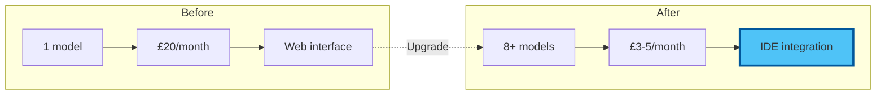

# Chapter 2: Hands-On API Setup - Building Your Multi-Model Command Centre (2026)

⏱️ **Estimated time**: 90 minutes
🎯 **Difficulty**: Beginner-friendly
💡 **What you'll achieve**: Direct access to 5+ leading AI models via Claude Code and VS Code

## Your Journey to AI Mastery

Transform from AI consumer to AI commander. We'll set up multiple providers, configure Claude Code and your editor, and start saving money immediately.


## Preparation Checklist

Before we begin:

- [x] VS Code open and running
- [x] Claude Code CLI or Continue extension installed
- [x] Internet browser ready
- [x] Email access for verifications
- [x] 90 minutes of focused time
- [x] Credit/debit card for API billing (start with $5-10)

💡 **Tip**: You'll spend ~$3-5/month vs £60/month for subscriptions. The ROI is immediate!

## Option A: Claude Code (Recommended for 2026)

Claude Code is Anthropic's AI coding agent. It runs in your terminal, understands your entire project, and can read, write, and run code on your behalf. It is also available as a desktop app, a web app at claude.ai/code, and as extensions for VS Code and JetBrains.

### Setting Up Claude Code

```bash
# Install Claude Code globally (requires Node.js 18+)
npm install -g @anthropic-ai/claude-code

# Verify installation
claude --version

# Launch Claude Code in your project directory
cd your-project
claude
```

On first launch, Claude Code will walk you through authentication with your Anthropic account. It uses Claude Sonnet 4.6 by default — use `/fast` inside a session for quicker responses.

### Key Features to Know

- **CLAUDE.md** — drop a `CLAUDE.md` file in your project root to give Claude Code persistent instructions about your codebase
- **Slash commands** — `/fast` for speed, `/cost` to check spend, `/model` to switch models
- **MCP servers** — connect external tools (databases, APIs, browsers) via the Model Context Protocol
- **Hooks** — automate actions before/after tasks (linting, testing, formatting)
- **Subagents** — Claude Code can spawn background agents for parallel work

### Test Your Setup

```bash
# Start a session and ask something
claude

# Inside the session, try:
> Explain what an API is in two sentences
> /fast
> Now explain it again (this response will be faster)
```

## Option B: Continue Extension (Alternative for VS Code)

Continue is a free, open-source extension that connects VS Code to multiple AI providers. It is a good option if you want a model-switcher inside your editor alongside Claude Code.

### Opening Continue Settings

1. Click the Continue icon in the VS Code sidebar (`>>`)
2. Click the gear icon (settings)
3. `config.json` opens automatically

### Complete 2026 Configuration

```json
{
  "models": [
    {
      "title": "Claude Sonnet 4.6 ⭐",
      "provider": "anthropic",
      "model": "claude-sonnet-4-6",
      "apiKey": "YOUR_ANTHROPIC_KEY"
    },
    {
      "title": "Claude Opus 4.8 (Premium)",
      "provider": "anthropic",
      "model": "claude-opus-4-8",
      "apiKey": "YOUR_ANTHROPIC_KEY"
    },
    {
      "title": "Claude Haiku 4.5 (Fast)",
      "provider": "anthropic",
      "model": "claude-haiku-4-5",
      "apiKey": "YOUR_ANTHROPIC_KEY"
    },
    {
      "title": "GPT-4o",
      "provider": "openai",
      "model": "gpt-4o",
      "apiKey": "YOUR_OPENAI_KEY"
    },
    {
      "title": "GPT-4o Mini (Cheap)",
      "provider": "openai",
      "model": "gpt-4o-mini",
      "apiKey": "YOUR_OPENAI_KEY"
    },
    {
      "title": "o3 (Reasoning)",
      "provider": "openai",
      "model": "o3",
      "apiKey": "YOUR_OPENAI_KEY"
    },
    {
      "title": "Gemini 2.5 Flash ⚡",
      "provider": "gemini",
      "model": "gemini-2.5-flash",
      "apiKey": "YOUR_GEMINI_KEY"
    },
    {
      "title": "Gemini 2.5 Pro (2M Context)",
      "provider": "gemini",
      "model": "gemini-2.5-pro",
      "apiKey": "YOUR_GEMINI_KEY"
    },
    {
      "title": "Llama 4 (Free via Groq)",
      "provider": "groq",
      "model": "llama-4-70b",
      "apiKey": "YOUR_GROQ_KEY"
    }
  ],
  "tabAutocompleteModel": {
    "title": "Haiku 4.5 Autocomplete",
    "provider": "anthropic",
    "model": "claude-haiku-4-5",
    "apiKey": "YOUR_ANTHROPIC_KEY"
  },
  "embeddingsProvider": {
    "provider": "openai",
    "model": "text-embedding-3-small",
    "apiKey": "YOUR_OPENAI_KEY"
  }
}
```

📝 **Note**: Check each provider's documentation for current model IDs — they update regularly.

## Provider Setup Guide (2026 Edition)

### 1. OpenAI (GPT-4o, o3)

**Why start here?**
- Industry standard
- Reliable performance
- Great documentation
- Wide model selection

#### Step-by-Step Setup

**A. Create Account**
1. Visit: https://platform.openai.com/signup
2. Sign up with email or Google
3. Verify email address

**B. Get API Key**
1. Go to: https://platform.openai.com/api-keys
2. Click "Create new secret key"
3. Name it: "VS Code - Workshop 02"
4. Copy key immediately (starts with `sk-proj-...`)

⚠️ **Critical**: You can't view this key again after closing!

**C. Set Up Billing**
1. Navigate to: https://platform.openai.com/settings/organization/billing
2. Add payment method
3. Set monthly limit: Start with **$10**
4. Enable usage alerts at 50% and 80%

**D. Understand Tiers**

| Tier | How to Reach | Benefits |
|------|--------------|----------|
| Free | Default | 3 RPM, 40K TPM |
| Tier 1 | Spend $5 | 500 RPM, 200K TPM |
| Tier 2 | Spend $50 | 5,000 RPM, 2M TPM |
| Tier 3 | Spend $1,000 | Higher limits |

💡 **Tip**: You'll automatically upgrade as you spend. Start small!

### 2. Anthropic (Claude Fable 5 / Opus 4.8 / Sonnet 4.6 / Haiku 4.5)

**Why add Claude?**
- Best-in-class writing quality and coding assistance
- Full model range from Haiku (fast/cheap) to Fable (most capable)
- 200K context window (all models)
- Claude Code — a standalone AI coding agent for your terminal
- Agent SDK for building custom AI agents

#### Setup Steps

**A. Create Account**
1. Visit: https://console.anthropic.com
2. Sign up with email
3. Verify email

**B. Get API Key**
1. Navigate to: API Keys section
2. Click "Create Key"
3. Name: "Workshop 02"
4. Copy key (starts with `sk-ant-api03-...`)

**C. Add Credits**
1. Go to Billing
2. Add $10 minimum
3. Set auto-refill (optional)

**D. Current Models**

| Model | Speed | Use Case |
|-------|-------|----------|
| Fable 5 | Standard | Latest and most capable |
| Opus 4.8 | Standard | Top-tier reasoning |
| Sonnet 4.6 | Fast | **Best balance of speed/quality/cost** ⭐ |
| Haiku 4.5 | Fastest | High volume, cheapest |

Check [console.anthropic.com](https://console.anthropic.com) for current pricing.

🎯 **Recommendation**: Start with Sonnet 4.6 for most tasks — it offers the best balance of quality, speed, and cost.

### 3. Google (Gemini 2.5 Flash/Pro)

**Why add Gemini?**
- **Massive 1M-2M context windows**
- Very competitive pricing
- Generous free tier available
- Excellent multimodal capabilities (text, images, video, audio)

#### Setup Steps

**A. Get Free API Key**
1. Visit: https://aistudio.google.dev/apikey
2. Sign in with Google account
3. Click "Create API Key"
4. Select "Create API key in new project"
5. Copy key (starts with `AIzaSy...`)

**B. Free Tier Limits**

Google offers a generous free tier — check [aistudio.google.dev](https://aistudio.google.dev) for current limits (typically 15+ RPM, 1.5M+ tokens/day).

💡 **Tip**: Gemini's free tier is VERY generous. Perfect for experimentation!

**C. Enable Pay-as-you-go (Optional)**
1. Go to Google Cloud Console
2. Enable billing
3. Activate Gemini API
4. Set budget alerts

**D. Model Comparison**

| Model | Context | Special Feature |
|-------|---------|----------------|
| 2.5 Flash | 1M | Fastest, cheapest |
| 2.5 Pro | **2M** | Entire codebases! |

Check [aistudio.google.dev](https://aistudio.google.dev) for current pricing.

🎯 **Use case**: Gemini 2.5 Pro can analyse your ENTIRE project in one prompt!

### 4. Groq (Free Fast Inference)

**Why add Groq?**
- **Free tier** with generous limits
- Ultra-fast inference (150+ tokens/sec)
- Access to Llama 4 and other open models
- No credit card required

#### Setup Steps

**A. Create Account**
1. Visit: https://console.groq.com
2. Sign up (no payment needed!)
3. Verify email

**B. Get API Key**
1. Go to API Keys
2. Create new key
3. Copy (starts with `gsk_...`)

**C. Free Tier Limits**

- 30 requests per minute
- 14,400 tokens per minute
- 14,400 tokens per day

⚠️ **Note**: Lower daily limits, but FAST. Perfect for quick tasks!

**D. Available Models**

Groq's model lineup changes frequently. Check [console.groq.com](https://console.groq.com) for the latest available models. Typical offerings include Llama 4 variants and other popular open-source models.

### 5. Together AI (Optional - More Open Models)

**Bonus provider** for advanced users:

1. Visit: https://api.together.xyz
2. Sign up, get $5 free credits
3. Access 50+ open-source models
4. Pay-as-you-go after credits

## Testing Your Multi-Model Setup

### Quick Test Protocol

Create `test-models.md`:

```markdown
# Multi-Model API Test

## Prompt
Explain quantum computing in exactly 2 sentences.

### Claude Sonnet 4.6:
[Select prompt, Ctrl+I, choose model, test]

### GPT-4o:
[Test here]

### Gemini 2.5 Flash:
[Test here]

### Llama 4 (Groq):
[Test here]

## Speed Test Results
- Fastest: ___
- Most detailed: ___
- Most natural: ___
```

### Model Comparison Exercise

Test each model with:

1. **Creative task**: "Write a haiku about coffee"
2. **Technical task**: "Explain async/await in JavaScript"
3. **Analysis task**: "List pros/cons of remote work"

📝 **Note**: Notice how models differ in style, speed, and depth!

## Cost Monitoring Setup

### OpenAI Dashboard

1. Visit: https://platform.openai.com/usage
2. View real-time costs
3. Set up email alerts

### Anthropic Console

1. Visit: https://console.anthropic.com/settings/billing
2. Monitor credit balance
3. Set auto-refill threshold

### Create Cost Tracking Spreadsheet

```markdown
# AI API Cost Tracking - June 2026

| Date | OpenAI | Anthropic | Google | Groq | Total | Notes |
|------|--------|-----------|--------|------|-------|-------|
| Jan 25 | $0.12 | $0.08 | $0.00 | $0.00 | $0.20 | Blog posts |
| Jan 26 | $0.05 | $0.15 | $0.01 | $0.00 | $0.21 | Code review |

## Monthly Budget
- Target: $10/month
- Current: $0.41
- Remaining: $9.59

## Model Preferences
- Writing: Claude Sonnet 4.6 (best prose)
- Coding: Claude Sonnet 4.6 or GPT-4o
- Research: Gemini 2.5 Pro (massive context)
- Quick tasks: Haiku 4.5 or GPT-4o-mini
- Free testing: Llama 4 via Groq
```

## Security Best Practices (2026 Edition)

### Environment Variables Method

**Step 1**: Create `.env` file

```bash
# In your project root
touch .env
```

**Step 2**: Add keys

```bash
# .env file
OPENAI_API_KEY=sk-proj-abc123...
ANTHROPIC_API_KEY=sk-ant-api03-xyz...
GOOGLE_API_KEY=AIzaSy...
GROQ_API_KEY=gsk_...
```

**Step 3**: Add to `.gitignore`

```bash
# .gitignore
.env
.env.local
*.key
```

**Step 4**: Reference in config

```json
{
  "models": [
    {
      "title": "Claude Sonnet",
      "provider": "anthropic",
      "model": "claude-sonnet-4-6",
      "apiKey": "${ANTHROPIC_API_KEY}"
    }
  ]
}
```

### API Key Rotation Schedule

📅 **Recommended schedule**:
- Every 90 days: Rotate all keys
- Monthly: Review usage patterns
- Weekly: Check spending
- Daily: Monitor for unusual activity

## Productivity Shortcuts

### Continue Extension Shortcuts

| Shortcut | Action |
|----------|--------|
| `Ctrl+I` (Windows/Linux) | Open AI chat |
| `Cmd+I` (Mac) | Open AI chat |
| `Ctrl+Shift+M` | Switch model |
| `Ctrl+L` | Clear conversation |

### Custom Commands (Advanced)

```json
{
  "customCommands": [
    {
      "name": "improve",
      "prompt": "Improve this text for clarity, professionalism, and impact",
      "description": "Enhance writing quality"
    },
    {
      "name": "summarize",
      "prompt": "Summarize this in 3 concise bullet points",
      "description": "Quick summary"
    },
    {
      "name": "explain-code",
      "prompt": "Explain this code line-by-line for a beginner",
      "description": "Code explanation"
    },
    {
      "name": "refactor",
      "prompt": "Refactor this code for better readability and performance",
      "description": "Improve code quality"
    },
    {
      "name": "tests",
      "prompt": "Generate comprehensive unit tests for this code",
      "description": "Create test suite"
    }
  ]
}
```

## Troubleshooting Common Issues

### Error: "Invalid API Key"

**Solutions**:
- ✅ Check for extra spaces when copying
- ✅ Ensure key hasn't been revoked
- ✅ Verify billing is set up
- ✅ Try regenerating key

### Error: "Rate Limit Exceeded"

**Solutions**:
- ⏸️ Wait 60 seconds
- 🔄 Switch to different model/provider
- 📊 Check usage dashboard
- 💳 Upgrade tier if needed frequently

### Error: "Model Not Found"

**Solutions**:
- 📝 Check model name spelling
- 🔄 Update to latest model IDs
- 📚 Consult provider documentation
- ⬆️ Update Continue extension

### Error: "Context Length Exceeded"

**Solutions**:
- ✂️ Trim conversation history
- 📉 Reduce input text size
- 🔄 Switch to model with larger context (Gemini 2.5 Pro)
- 🧹 Clear old messages

## Your Achievements Unlocked!

### You Now Have:

✅ **Multi-Model Access**: 5+ leading AI models at your fingertips
✅ **Cost Control**: 90% savings vs subscriptions
✅ **Direct Integration**: No more copy-paste workflows
✅ **Model Comparison**: Know which AI excels at what
✅ **Professional Setup**: Enterprise-grade configuration
✅ **Security**: Proper API key management

### Before vs After



## Next Steps

🎯 **Immediate**: Test each model with real work tasks
📊 **This week**: Track costs for 7 days
🧪 **Ongoing**: Experiment with different models for different tasks

### Pro Tips

1. **Bookmark** all provider dashboards
2. **Export** your config.json as backup
3. **Document** which models work best for your needs
4. **Set calendar reminder** for 90-day key rotation
5. **Join communities**: r/ClaudeAI, r/OpenAI for tips

---

**Next**: [Chapter 3: Practical Exercises - Model Mastery](./03_exercises.md)

[← Back to Concepts](./01_concepts.md) | [Workshop Overview](README.md)
