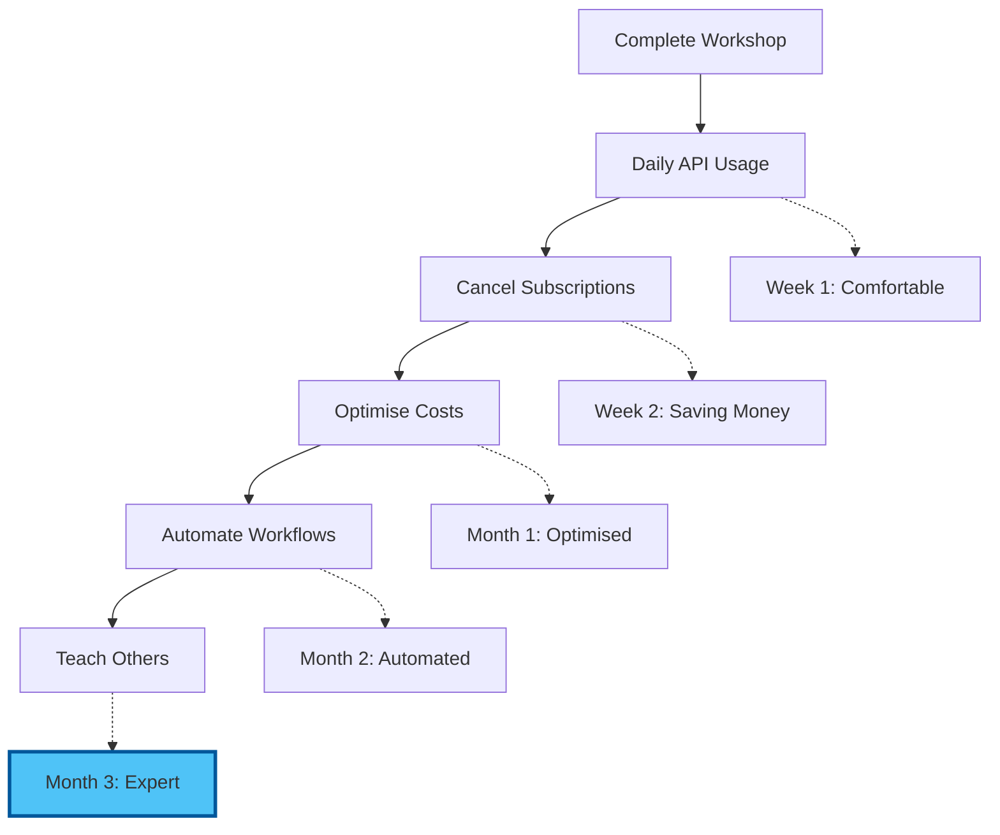

# Chapter 6: Resources & Continued Learning

## Introduction: Your AI API Reference Library

This resource collection supports your ongoing journey with direct AI API access. Bookmark this page — you'll return to it whenever you need a provider console link, a code snippet, a pricing update, or guidance on a new model.

## Provider Consoles & Documentation

### Anthropic (Claude Models)

**Consoles & Dashboards:**
- 🏠 [Anthropic Console](https://console.anthropic.com) — API keys, billing, usage
- 📊 [Usage Dashboard](https://console.anthropic.com/settings/billing) — Real-time spend tracking
- 🔑 [API Keys](https://console.anthropic.com/settings/keys) — Create and manage keys

**Documentation:**
- 📖 [API Reference](https://docs.anthropic.com/en/api) — Complete endpoint documentation
- 📝 [Messages API Guide](https://docs.anthropic.com/en/docs/build-with-claude/messages) — How to send requests
- 🧪 [Model Overview](https://docs.anthropic.com/en/docs/about-claude/models) — Current models, context windows, pricing
- 💡 [Prompt Engineering Guide](https://docs.anthropic.com/en/docs/build-with-claude/prompt-engineering) — Official best practices
- 🔒 [API Key Security](https://docs.anthropic.com/en/docs/initial-setup) — Setup and security guidance

**Tools:**
- 🖥️ [Claude Code](https://docs.anthropic.com/en/docs/claude-code) — Terminal-based AI coding agent
- 🧰 [Anthropic SDK (Python)](https://github.com/anthropics/anthropic-sdk-python) — Official Python library
- 🧰 [Anthropic SDK (TypeScript)](https://github.com/anthropics/anthropic-sdk-typescript) — Official Node.js library

**Current Models (mid-2026):**

| Model | ID | Context | Best For |
|-------|-----|---------|----------|
| Fable 5 | `claude-fable-5` | 200K | Latest and most capable |
| Opus 4.8 | `claude-opus-4-8` | 200K | Top-tier reasoning |
| Sonnet 4.6 | `claude-sonnet-4-6` | 200K | Best balance of quality/speed/cost |
| Haiku 4.5 | `claude-haiku-4-5` | 200K | Speed champion, lowest cost |

Check [console.anthropic.com](https://console.anthropic.com) for current pricing — it changes as new models launch.

### OpenAI (GPT Models)

**Consoles & Dashboards:**
- 🏠 [OpenAI Platform](https://platform.openai.com) — Main dashboard
- 📊 [Usage Dashboard](https://platform.openai.com/usage) — Cost tracking
- 🔑 [API Keys](https://platform.openai.com/api-keys) — Key management
- 💳 [Billing Settings](https://platform.openai.com/settings/organization/billing) — Limits and alerts

**Documentation:**
- 📖 [API Reference](https://platform.openai.com/docs/api-reference) — Complete endpoint docs
- 📝 [Chat Completions Guide](https://platform.openai.com/docs/guides/text-generation) — Core API usage
- 🧪 [Models Overview](https://platform.openai.com/docs/models) — Available models and pricing
- 💡 [Best Practices](https://platform.openai.com/docs/guides/prompt-engineering) — Prompt engineering
- 🔢 [Tokenizer Tool](https://platform.openai.com/tokenizer) — Count tokens interactively

**Tools:**
- 🧰 [OpenAI SDK (Python)](https://github.com/openai/openai-python) — Official Python library
- 🧰 [OpenAI SDK (Node.js)](https://github.com/openai/openai-node) — Official JavaScript library
- 🎮 [Playground](https://platform.openai.com/playground) — Test prompts in the browser

**Current Models (mid-2026):**

| Model | ID | Context | Best For |
|-------|-----|---------|----------|
| GPT-4o | `gpt-4o` | 128K | Reliable general purpose |
| GPT-4o-mini | `gpt-4o-mini` | 128K | High volume, very cheap |
| o3 | `o3` | 200K | Complex reasoning, maths |

Check [platform.openai.com/docs/models](https://platform.openai.com/docs/models) for current pricing.

### Google (Gemini Models)

**Consoles & Dashboards:**
- 🏠 [Google AI Studio](https://aistudio.google.dev) — API keys, playground, docs
- 🔑 [API Keys](https://aistudio.google.dev/apikey) — Create and manage keys
- 📊 [Google Cloud Console](https://console.cloud.google.com) — Billing (if using paid tier)

**Documentation:**
- 📖 [Gemini API Reference](https://ai.google.dev/gemini-api/docs) — Complete docs
- 📝 [Quickstart Guide](https://ai.google.dev/gemini-api/docs/quickstart) — Get started fast
- 🧪 [Models Overview](https://ai.google.dev/gemini-api/docs/models/gemini) — Available models
- 💡 [Prompt Design Guide](https://ai.google.dev/gemini-api/docs/prompting-intro) — Google's prompt engineering

**Tools:**
- 🧰 [Google Generative AI SDK (Python)](https://github.com/google-gemini/generative-ai-python) — Official Python library
- 🧰 [Google Generative AI SDK (JavaScript)](https://github.com/google-gemini/generative-ai-js) — Official JS library
- 🎮 [AI Studio Playground](https://aistudio.google.dev) — Test in browser with free tier

**Current Models (mid-2026):**

| Model | ID | Context | Best For |
|-------|-----|---------|----------|
| Gemini 2.5 Pro | `gemini-2.5-pro` | 2M | Massive context, code analysis |
| Gemini 2.5 Flash | `gemini-2.5-flash` | 1M | Fast, cheap, generous free tier |

Check [aistudio.google.dev](https://aistudio.google.dev) for current free-tier limits and pricing.

### Groq (Open-Source Models, Free Tier)

**Consoles & Dashboards:**
- 🏠 [Groq Console](https://console.groq.com) — Dashboard and API keys
- 🔑 [API Keys](https://console.groq.com/keys) — Key management
- 📊 [Usage](https://console.groq.com/settings/usage) — Track free-tier usage

**Documentation:**
- 📖 [Groq API Docs](https://console.groq.com/docs) — API reference
- 📝 [Quickstart](https://console.groq.com/docs/quickstart) — Get started
- 🧪 [Supported Models](https://console.groq.com/docs/models) — Available models

**Key Advantage:** Ultra-fast inference, free tier, no credit card required. Models available change frequently — check the console for the latest offerings including Llama 4 variants.

## Quick Reference: API Calls

### Anthropic Claude (curl)

```bash
curl https://api.anthropic.com/v1/messages \
  -H "Content-Type: application/json" \
  -H "x-api-key: $ANTHROPIC_API_KEY" \
  -H "anthropic-version: 2023-06-01" \
  -d '{
    "model": "claude-sonnet-4-6",
    "max_tokens": 1024,
    "messages": [
      {
        "role": "user",
        "content": "Explain API access in plain English, under 50 words."
      }
    ]
  }'
```

### Anthropic Claude (Python)

```python
from anthropic import Anthropic

client = Anthropic()  # reads ANTHROPIC_API_KEY from environment

message = client.messages.create(
    model="claude-sonnet-4-6",
    max_tokens=1024,
    messages=[
        {"role": "user", "content": "Explain API access in plain English, under 50 words."}
    ]
)

print(message.content[0].text)
print(f"Tokens used: {message.usage.input_tokens} in, {message.usage.output_tokens} out")
```

### OpenAI GPT (curl)

```bash
curl https://api.openai.com/v1/chat/completions \
  -H "Content-Type: application/json" \
  -H "Authorization: Bearer $OPENAI_API_KEY" \
  -d '{
    "model": "gpt-4o",
    "messages": [
      {
        "role": "user",
        "content": "Explain API access in plain English, under 50 words."
      }
    ],
    "max_tokens": 200
  }'
```

### OpenAI GPT (Python)

```python
from openai import OpenAI

client = OpenAI()  # reads OPENAI_API_KEY from environment

response = client.chat.completions.create(
    model="gpt-4o",
    messages=[
        {"role": "user", "content": "Explain API access in plain English, under 50 words."}
    ],
    max_tokens=200
)

print(response.choices[0].message.content)
print(f"Tokens used: {response.usage.prompt_tokens} in, {response.usage.completion_tokens} out")
```

### Google Gemini (curl)

```bash
curl "https://generativelanguage.googleapis.com/v1beta/models/gemini-2.5-flash:generateContent?key=$GEMINI_API_KEY" \
  -H "Content-Type: application/json" \
  -d '{
    "contents": [
      {
        "parts": [
          {"text": "Explain API access in plain English, under 50 words."}
        ]
      }
    ]
  }'
```

### Google Gemini (Python)

```python
import google.generativeai as genai
import os

genai.configure(api_key=os.getenv("GEMINI_API_KEY"))

model = genai.GenerativeModel("gemini-2.5-flash")
response = model.generate_content("Explain API access in plain English, under 50 words.")

print(response.text)
print(f"Tokens used: {response.usage_metadata.prompt_token_count} in, "
      f"{response.usage_metadata.candidates_token_count} out")
```

## Environment Setup Reference

### The `.env` File

```bash
# .env — NEVER commit this file to version control
ANTHROPIC_API_KEY=sk-ant-api03-your-key-here
OPENAI_API_KEY=sk-proj-your-key-here
GEMINI_API_KEY=AIzaSy-your-key-here
GROQ_API_KEY=gsk_your-key-here
```

### The `.gitignore` Entry

```bash
# Add to .gitignore
.env
.env.local
.env.*.local
```

### Loading Keys in Python

```python
import os
from dotenv import load_dotenv

load_dotenv()  # reads .env file

anthropic_key = os.getenv("ANTHROPIC_API_KEY")
openai_key = os.getenv("OPENAI_API_KEY")
gemini_key = os.getenv("GEMINI_API_KEY")

# Verify keys are loaded
for name, key in [("Anthropic", anthropic_key), ("OpenAI", openai_key), ("Gemini", gemini_key)]:
    if key:
        print(f"{name}: configured ({key[:8]}...)")
    else:
        print(f"{name}: NOT CONFIGURED")
```

### Installing Python SDKs

```bash
# Create a virtual environment (optional but recommended)
python3 -m venv ai-env
source ai-env/bin/activate  # Linux/Mac
# ai-env\Scripts\activate   # Windows

# Install all provider SDKs
pip install anthropic openai google-generativeai python-dotenv groq
```

## Cost Calculators & Tracking

### Quick Cost Estimation Formula

```
Cost = (input_tokens / 1,000,000) x input_price + (output_tokens / 1,000,000) x output_price
```

**Token estimation rules of thumb:**
- 1 token is roughly 4 characters or 0.75 words in English
- A typical A4 page of text is approximately 500-600 tokens
- A 1,500-word blog post is approximately 2,000 tokens

### Monthly Cost Tracking Template

```markdown
# AI API Cost Tracker — [Month] 2026

## Weekly Breakdown

| Week | Anthropic | OpenAI | Google | Groq | Total |
|------|-----------|--------|--------|------|-------|
| 1 | $ | $ | Free | Free | $ |
| 2 | $ | $ | Free | Free | $ |
| 3 | $ | $ | Free | Free | $ |
| 4 | $ | $ | Free | Free | $ |
| **Total** | **$** | **$** | **Free** | **Free** | **$** |

## vs Subscriptions
- ChatGPT Plus: £20/month
- Claude Pro: £18/month
- Gemini Advanced: £19/month
- **Subscription total: £57/month**
- **API total: £___/month**
- **Saving: £___/month (____%)**

## Model Usage Log
| Date | Task | Model | ~Tokens | ~Cost | Quality (1-5) |
|------|------|-------|---------|-------|---------------|
| | | | | | |
```

### Provider Billing Pages (Bookmark These)

- **Anthropic**: https://console.anthropic.com/settings/billing
- **OpenAI**: https://platform.openai.com/usage
- **Google Cloud**: https://console.cloud.google.com/billing (if using paid tier)
- **Groq**: https://console.groq.com/settings/usage

## Model Selection Decision Tree

### Quick Reference Card

```
TASK: Quick email, summary, simple question
  --> GPT-4o-mini or Haiku 4.5 (cheapest, fastest)

TASK: Professional writing, blog post, creative content
  --> Claude Sonnet 4.6 (best prose, natural voice)

TASK: Long document analysis (50+ pages)
  --> Gemini 2.5 Pro (2M context) or Gemini 2.5 Flash (1M, cheaper)

TASK: Complex reasoning, strategy, maths
  --> o3, Claude Opus 4.8, or Claude Fable 5

TASK: Rapid experimentation, prototyping
  --> Llama 4 via Groq (free, ultra-fast)

TASK: Code generation and review
  --> Claude Sonnet 4.6 or GPT-4o

TASK: Proofreading, formatting, simple edits
  --> Haiku 4.5 or GPT-4o-mini (no need for premium)
```

### Context Window Guide

```
Under 50 pages:    Any model works
50-300 pages:      Claude models (200K) or GPT-4o (128K)
300-2,500 pages:   Gemini 2.5 Flash (1M context)
2,500-5,000 pages: Gemini 2.5 Pro (2M context) — only option
```

## Learning Paths

### Week 1-2: Foundation

**Focus:** Daily API usage, model preference formation

- [ ] Use API access instead of web interfaces for all AI tasks
- [ ] Track costs daily (use the template above)
- [ ] Test each model on 3 different task types from your work
- [ ] Identify your go-to model for each task category
- [ ] Cancel or pause one AI subscription

**Resources:**
- 📖 [Anthropic Prompt Engineering Guide](https://docs.anthropic.com/en/docs/build-with-claude/prompt-engineering)
- 📖 [OpenAI Prompt Engineering](https://platform.openai.com/docs/guides/prompt-engineering)
- 📺 [Prompt Engineering Basics (YouTube)](https://www.youtube.com/results?search_query=prompt+engineering+basics+2026)

### Week 3-4: Optimisation

**Focus:** Cost reduction, workflow automation

- [ ] Refine model routing based on 2 weeks of data
- [ ] Explore prompt caching (Anthropic, Google) for repeated tasks
- [ ] Build 5 reusable prompt templates for your common tasks
- [ ] Try the Python or TypeScript SDK for one provider
- [ ] Experiment with temperature and max_tokens settings

**Resources:**
- 📖 [Anthropic Prompt Caching](https://docs.anthropic.com/en/docs/build-with-claude/prompt-caching)
- 📖 [OpenAI Function Calling](https://platform.openai.com/docs/guides/function-calling)
- 📖 [Gemini Context Caching](https://ai.google.dev/gemini-api/docs/caching)

### Month 2+: Advanced Techniques

**Focus:** Automation, integration, teaching others

- [ ] Build a multi-model script that routes tasks automatically
- [ ] Explore structured output (JSON mode) for data extraction
- [ ] Investigate tool use / function calling for AI agents
- [ ] Set up automated batch processing for recurring tasks
- [ ] Help a colleague set up their own multi-model access

**Resources:**
- 📖 [Claude Tool Use](https://docs.anthropic.com/en/docs/build-with-claude/tool-use)
- 📖 [OpenAI Structured Outputs](https://platform.openai.com/docs/guides/structured-outputs)
- 📖 [Gemini Function Calling](https://ai.google.dev/gemini-api/docs/function-calling)
- 📖 [Claude Code Documentation](https://docs.anthropic.com/en/docs/claude-code)

## Community & Support

### Provider Communities

**Anthropic:**
- 💬 [Anthropic Discord](https://discord.gg/anthropic)
- 📧 [Developer Newsletter](https://www.anthropic.com/newsletter)
- 🐦 [Anthropic on X](https://x.com/AnthropicAI)

**OpenAI:**
- 💬 [OpenAI Community Forum](https://community.openai.com)
- 📧 [OpenAI Blog](https://openai.com/blog)
- 🐦 [OpenAI on X](https://x.com/OpenAI)

**Google AI:**
- 💬 [Google AI Discord](https://discord.gg/google-dev-community)
- 📧 [Google AI Blog](https://blog.google/technology/ai/)
- 🐦 [Google AI on X](https://x.com/GoogleAI)

### General AI Communities

- 🌐 [Reddit r/ClaudeAI](https://reddit.com/r/ClaudeAI) — Claude-specific discussions
- 🌐 [Reddit r/OpenAI](https://reddit.com/r/OpenAI) — GPT discussions
- 🌐 [Reddit r/LocalLLaMA](https://reddit.com/r/LocalLLaMA) — Open-source models
- 🌐 [Hacker News](https://news.ycombinator.com) — AI industry news
- 💬 [AI Discord Servers](https://discord.gg/) — Search for "AI" communities

### DreamLab Workshop Support

- 📧 Email: workshop@dreamlab.ai
- 💬 Discord: Workshop Channel
- 📅 Office Hours: Fridays 2-3pm GMT
- 📖 Documentation: This workshop and all linked resources

## Troubleshooting Reference

### Common Errors and Solutions

**401 Unauthorized / Invalid API Key**
```
Cause: Key is wrong, expired, or has leading/trailing whitespace
Fix:
  1. Regenerate key from provider console
  2. Check for spaces when copying
  3. Verify key is in .env file (not hardcoded)
  4. Restart your editor after changing .env
```

**429 Rate Limited**
```
Cause: Too many requests in a short time window
Fix:
  1. Wait 60 seconds and retry
  2. Switch to a different provider temporarily
  3. Check your tier level — higher tiers have higher limits
  4. Implement exponential backoff in scripts
```

**400 Bad Request / Context Length Exceeded**
```
Cause: Input + expected output exceeds model's context window
Fix:
  1. Trim your input (remove unnecessary context)
  2. Reduce max_tokens in the request
  3. Switch to a model with a larger context window
  4. Split the task across multiple smaller requests
```

**402 Payment Required / Insufficient Credits**
```
Cause: Account balance is zero or card declined
Fix:
  1. Top up credits on the provider console
  2. Check payment method is valid
  3. Switch to a free-tier provider (Google, Groq) temporarily
```

**500/503 Server Error**
```
Cause: Provider is experiencing issues (rare but happens)
Fix:
  1. Wait 2-3 minutes and retry
  2. Check provider status page
  3. Switch to a different provider
  4. These are transient — don't change your setup
```

### Provider Status Pages

Bookmark these to check during outages:
- **Anthropic**: https://status.anthropic.com
- **OpenAI**: https://status.openai.com
- **Google Cloud**: https://status.cloud.google.com
- **Groq**: https://status.groq.com

## Security Checklist

### Monthly Review

- [ ] Rotate API keys (every 90 days minimum)
- [ ] Review spending across all providers
- [ ] Check for any unusual usage patterns
- [ ] Verify `.env` is still in `.gitignore`
- [ ] Confirm MFA is enabled on all provider accounts
- [ ] Review which keys are active — revoke any unused ones

### Key Rotation Procedure

1. Log into the provider console
2. Create a new API key
3. Update your `.env` file with the new key
4. Restart your editor / Claude Code session
5. Verify the new key works with a test prompt
6. Revoke the old key from the provider console

**Calendar Reminder:** Set a recurring event every 90 days: "Rotate AI API keys"

## Staying Current

### What Changes Frequently

AI APIs evolve fast. Here is what to watch for:

- **New models** — Providers launch new models every few months. Check the model overview pages quarterly.
- **Pricing changes** — Competition drives prices down. Recheck pricing before budgeting.
- **New features** — Tool use, caching, structured outputs, and batch APIs emerge regularly.
- **Rate limit changes** — Tiers and limits adjust as providers scale.
- **Context window increases** — These tend to grow over time, expanding what's possible.

### How to Stay Informed

- 📧 Subscribe to provider newsletters (Anthropic, OpenAI, Google AI)
- 🐦 Follow provider accounts on X
- 🌐 Check r/ClaudeAI and r/OpenAI weekly
- 📖 Read release notes when you see "new model available" in your console
- 📅 Set a monthly calendar reminder: "Check AI model updates"

## Your Ongoing Journey



## Conclusion

Direct AI API access is a professional skill that compounds over time. The setup effort is one morning. The savings, flexibility, and capability improvements last indefinitely.

**What you've gained today:**
- Access to the world's best AI models at wholesale prices
- The knowledge to choose the right model for any task
- Secure, professional API key management
- A multi-model workflow that outperforms any single subscription
- A foundation for automation and advanced AI integration

**What to do next:**
1. Use API access for every AI task this week
2. Track your costs and compare to your old subscriptions
3. Refine your model preferences based on real work
4. Share this knowledge with a colleague
5. Return to this resource page whenever you need a reference

Welcome to professional AI access. The models are waiting.

---

**Workshop Complete!**

[Back to Assessment](./05_assessment.md) | [Back to Workshop Overview](README.md) | [Proceed to Next Phase -->](../workshop-02-afternoon-content-creation/README.md)
