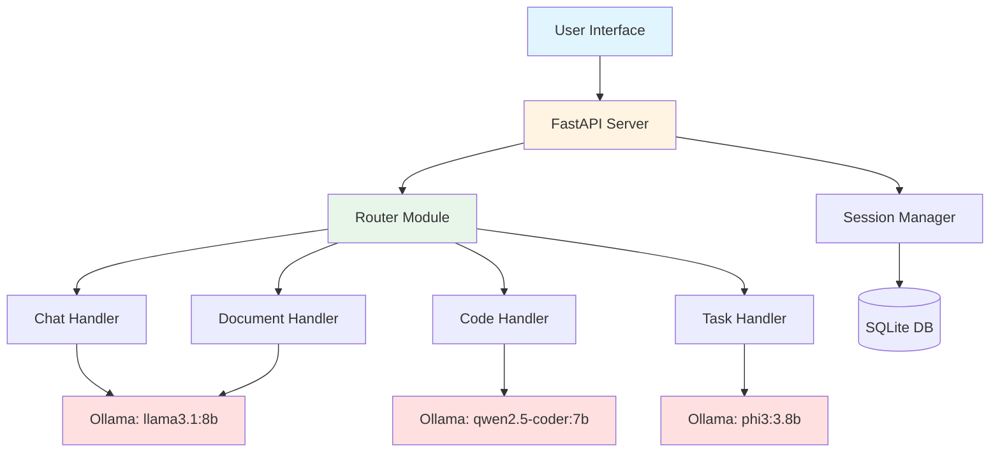

# Project: Build a Local AI Assistant

## Project Overview

Build a fully-featured AI assistant that runs entirely on your local machine. This project combines everything you've learned into a practical, deployable application.

**What You'll Build:**
- Multi-functional AI assistant with specialized modes
- Voice-to-text and text-to-voice capabilities (optional)
- Document analysis and Q&A
- Code generation and review
- Task scheduling and reminders
- Web interface with real-time chat

**Technology Stack:**
- **Backend**: Python + FastAPI
- **AI Engine**: Ollama (multiple models)
- **Frontend**: HTML + JavaScript (or React)
- **Optional**: Speech recognition, document processing

## Architecture



## Part 1: Project Setup

### Directory Structure

```bash
local-ai-assistant/
├── app/
│   ├── __init__.py
│   ├── main.py              # FastAPI application
│   ├── router.py            # Model routing logic
│   ├── handlers/
│   │   ├── __init__.py
│   │   ├── chat.py          # Chat functionality
│   │   ├── code.py          # Code assistance
│   │   ├── documents.py     # Document Q&A
│   │   └── tasks.py         # Task management
│   ├── models/
│   │   ├── __init__.py
│   │   └── schemas.py       # Pydantic models
│   └── utils/
│       ├── __init__.py
│       ├── db.py            # Database utilities
│       └── session.py       # Session management
├── static/
│   ├── css/
│   │   └── style.css
│   ├── js/
│   │   └── app.js
│   └── index.html
├── data/
│   └── sessions.db          # SQLite database
├── requirements.txt
├── config.py
└── README.md
```

### Initialize Project

```bash
# Create directory structure
mkdir -p local-ai-assistant/{app/{handlers,models,utils},static/{css,js},data}
cd local-ai-assistant

# Create __init__.py files
touch app/__init__.py app/handlers/__init__.py app/models/__init__.py app/utils/__init__.py
```

### Requirements File

Create `requirements.txt`:

```
fastapi==0.104.1
uvicorn[standard]==0.24.0
python-multipart==0.0.6
pydantic==2.5.0
pydantic-settings==2.1.0
ollama==0.1.6
sqlalchemy==2.0.23
aiosqlite==0.19.0
python-jose[cryptography]==3.3.0
passlib[bcrypt]==1.7.4
python-dateutil==2.8.2
```

Install dependencies:
```bash
pip install -r requirements.txt
```

## Part 2: Core Implementation

### Configuration (`config.py`)

```python
"""Configuration settings for Local AI Assistant."""

from pydantic_settings import BaseSettings
from typing import Dict

class Settings(BaseSettings):
    """Application settings."""

    # Application
    app_name: str = "Local AI Assistant"
    app_version: str = "1.0.0"
    debug: bool = True

    # Server
    host: str = "0.0.0.0"
    port: int = 8000

    # Ollama
    ollama_host: str = "http://localhost:11434"

    # Models for different tasks
    models: Dict[str, str] = {
        "chat": "llama3.1:8b",
        "code": "qwen2.5-coder:7b",
        "fast": "phi3:3.8b",
        "reasoning": "qwen2.5:7b"
    }

    # Database
    database_url: str = "sqlite+aiosqlite:///./data/sessions.db"

    # Security
    secret_key: str = "your-secret-key-change-in-production"
    algorithm: str = "HS256"
    access_token_expire_minutes: int = 30

    class Config:
        env_file = ".env"

settings = Settings()
```

### Data Models (`app/models/schemas.py`)

```python
"""Pydantic models for request/response schemas."""

from pydantic import BaseModel, Field
from typing import List, Optional, Dict, Any
from datetime import datetime
from enum import Enum

class MessageRole(str, Enum):
    """Message roles."""
    SYSTEM = "system"
    USER = "user"
    ASSISTANT = "assistant"

class Message(BaseModel):
    """Chat message."""
    role: MessageRole
    content: str
    timestamp: Optional[datetime] = None

class ChatRequest(BaseModel):
    """Request for chat completion."""
    message: str
    session_id: Optional[str] = None
    model: Optional[str] = None
    stream: bool = False
    options: Dict[str, Any] = Field(default_factory=dict)

class ChatResponse(BaseModel):
    """Response from chat completion."""
    message: str
    session_id: str
    model: str
    tokens: Optional[int] = None
    duration: Optional[float] = None

class CodeRequest(BaseModel):
    """Request for code assistance."""
    task: str  # 'generate', 'explain', 'review', 'debug'
    language: Optional[str] = None
    code: Optional[str] = None
    description: Optional[str] = None
    error: Optional[str] = None

class CodeResponse(BaseModel):
    """Response from code assistance."""
    result: str
    language: Optional[str] = None
    model: str

class DocumentRequest(BaseModel):
    """Request for document Q&A."""
    document: str
    question: str
    session_id: Optional[str] = None

class DocumentResponse(BaseModel):
    """Response from document Q&A."""
    answer: str
    session_id: str
    model: str

class TaskRequest(BaseModel):
    """Request for task management."""
    task: str
    action: str  # 'create', 'list', 'complete', 'delete'

class TaskResponse(BaseModel):
    """Response from task management."""
    result: str
    tasks: Optional[List[Dict[str, Any]]] = None

class SessionInfo(BaseModel):
    """Session information."""
    session_id: str
    created_at: datetime
    last_activity: datetime
    message_count: int
    model: str
```

### Database Utilities (`app/utils/db.py`)

```python
"""Database utilities for session management."""

from sqlalchemy.ext.asyncio import create_async_engine, AsyncSession, async_sessionmaker
from sqlalchemy.orm import declarative_base
from sqlalchemy import Column, String, DateTime, Integer, JSON
from datetime import datetime
from config import settings
import uuid

Base = declarative_base()

class Session(Base):
    """Session model."""
    __tablename__ = "sessions"

    id = Column(String, primary_key=True, default=lambda: str(uuid.uuid4()))
    created_at = Column(DateTime, default=datetime.utcnow)
    last_activity = Column(DateTime, default=datetime.utcnow, onupdate=datetime.utcnow)
    model = Column(String)
    messages = Column(JSON, default=list)
    metadata = Column(JSON, default=dict)

# Create async engine
engine = create_async_engine(
    settings.database_url,
    echo=settings.debug
)

# Create session maker
AsyncSessionLocal = async_sessionmaker(
    engine,
    class_=AsyncSession,
    expire_on_commit=False
)

async def init_db():
    """Initialize database."""
    async with engine.begin() as conn:
        await conn.run_sync(Base.metadata.create_all)

async def get_db():
    """Get database session."""
    async with AsyncSessionLocal() as session:
        try:
            yield session
        finally:
            await session.close()
```

### Model Router (`app/router.py`)

```python
"""Smart router to select best model for each query."""

import re
from typing import Literal
from config import settings

class ModelRouter:
    """Route queries to appropriate models."""

    def __init__(self):
        self.models = settings.models

    def classify_query(self, query: str) -> str:
        """Classify query to determine best model."""

        query_lower = query.lower()

        # Code-related keywords
        code_keywords = [
            'code', 'function', 'python', 'javascript', 'programming',
            'debug', 'algorithm', 'class', 'method', 'import', 'api',
            'write a program', 'script', 'implementation'
        ]

        # Fast query indicators (simple questions)
        fast_indicators = [
            'what is', 'who is', 'when', 'where', 'define',
            'meaning of', 'translate'
        ]

        # Reasoning indicators
        reasoning_keywords = [
            'why', 'explain', 'analyze', 'compare', 'evaluate',
            'how does', 'reason', 'solve', 'proof'
        ]

        # Check for code
        if any(keyword in query_lower for keyword in code_keywords):
            return 'code'

        # Check for simple questions
        if len(query.split()) < 15 and any(ind in query_lower for ind in fast_indicators):
            return 'fast'

        # Check for reasoning
        if any(keyword in query_lower for keyword in reasoning_keywords):
            return 'reasoning'

        # Default to general chat
        return 'chat'

    def get_model(self, category: str = None, query: str = None) -> str:
        """Get model name for category or query."""

        if category:
            return self.models.get(category, self.models['chat'])

        if query:
            category = self.classify_query(query)
            return self.models[category]

        return self.models['chat']

router = ModelRouter()
```

### Chat Handler (`app/handlers/chat.py`)

```python
"""Chat functionality handler."""

import ollama
from typing import List, Dict, AsyncGenerator
from app.models.schemas import Message, ChatRequest, ChatResponse
from app.router import router
from datetime import datetime
import time

async def chat_completion(request: ChatRequest, history: List[Dict] = None) -> ChatResponse:
    """Generate chat completion."""

    # Select model
    model = request.model or router.get_model(query=request.message)

    # Prepare messages
    messages = history or []
    messages.append({
        'role': 'user',
        'content': request.message
    })

    # Generate response
    start_time = time.time()

    response = ollama.chat(
        model=model,
        messages=messages,
        options=request.options
    )

    duration = time.time() - start_time

    assistant_message = response['message']['content']

    return ChatResponse(
        message=assistant_message,
        session_id=request.session_id or "default",
        model=model,
        duration=round(duration, 2)
    )

async def chat_stream(request: ChatRequest, history: List[Dict] = None) -> AsyncGenerator[str, None]:
    """Stream chat completion."""

    # Select model
    model = request.model or router.get_model(query=request.message)

    # Prepare messages
    messages = history or []
    messages.append({
        'role': 'user',
        'content': request.message
    })

    # Stream response
    stream = ollama.chat(
        model=model,
        messages=messages,
        stream=True,
        options=request.options
    )

    for chunk in stream:
        if 'message' in chunk:
            yield chunk['message']['content']
```

### Code Handler (`app/handlers/code.py`)

```python
"""Code assistance handler."""

import ollama
from app.models.schemas import CodeRequest, CodeResponse
from config import settings

SYSTEM_PROMPTS = {
    'generate': """You are an expert programmer. Generate clean, efficient,
    well-commented code based on the user's requirements. Include example usage.""",

    'explain': """You are a code educator. Explain code clearly and thoroughly,
    including purpose, step-by-step breakdown, and key concepts.""",

    'review': """You are a senior code reviewer. Provide constructive feedback
    on code quality, bugs, performance, and security. Suggest specific improvements.""",

    'debug': """You are a debugging expert. Identify the issue, explain why it happens,
    provide fixed code, and suggest preventive measures."""
}

async def handle_code_request(request: CodeRequest) -> CodeResponse:
    """Handle code assistance request."""

    model = settings.models['code']

    # Build prompt based on task
    if request.task == 'generate':
        prompt = f"""Write {request.language or 'Python'} code for:

{request.description}

Provide clean code with comments and example usage."""

    elif request.task == 'explain':
        prompt = f"""Explain this code:

```{request.language or ''}
{request.code}
```

Include:
1. Overall purpose
2. Step-by-step breakdown
3. Key concepts
4. Potential improvements"""

    elif request.task == 'review':
        prompt = f"""Review this code:

```{request.language or ''}
{request.code}
```

Provide:
1. Potential bugs
2. Code quality assessment
3. Performance considerations
4. Security concerns
5. Specific improvements"""

    elif request.task == 'debug':
        prompt = f"""Debug this code:

Code:
```{request.language or ''}
{request.code}
```

Error:
```
{request.error}
```

Provide:
1. Issue identification
2. Explanation
3. Fixed code
4. Prevention tips"""

    else:
        raise ValueError(f"Unknown task: {request.task}")

    # Generate response
    response = ollama.generate(
        model=model,
        prompt=prompt,
        system=SYSTEM_PROMPTS.get(request.task, "")
    )

    return CodeResponse(
        result=response['response'],
        language=request.language,
        model=model
    )
```

### Main Application (`app/main.py`)

```python
"""Main FastAPI application."""

from fastapi import FastAPI, HTTPException, Depends
from fastapi.staticfiles import StaticFiles
from fastapi.responses import StreamingResponse, FileResponse
from sqlalchemy.ext.asyncio import AsyncSession
from contextlib import asynccontextmanager
import ollama

from config import settings
from app.models.schemas import (
    ChatRequest, ChatResponse,
    CodeRequest, CodeResponse,
    DocumentRequest, DocumentResponse,
    TaskRequest, TaskResponse,
    SessionInfo
)
from app.handlers.chat import chat_completion, chat_stream
from app.handlers.code import handle_code_request
from app.utils.db import init_db, get_db, Session
from sqlalchemy import select
from datetime import datetime
import uuid

@asynccontextmanager
async def lifespan(app: FastAPI):
    """Lifespan context manager."""
    # Startup
    await init_db()
    print(f"🚀 {settings.app_name} v{settings.app_version} started")
    print(f"📍 Server running on http://{settings.host}:{settings.port}")
    print(f"🤖 Using Ollama at {settings.ollama_host}")
    print(f"📚 Models: {settings.models}")

    # Check Ollama connection
    try:
        ollama.list()
        print("✅ Ollama connection successful")
    except Exception as e:
        print(f"⚠️  Ollama connection failed: {e}")

    yield

    # Shutdown
    print("👋 Shutting down...")

app = FastAPI(
    title=settings.app_name,
    version=settings.app_version,
    lifespan=lifespan
)

# Mount static files
app.mount("/static", StaticFiles(directory="static"), name="static")

@app.get("/")
async def root():
    """Serve main page."""
    return FileResponse("static/index.html")

@app.get("/health")
async def health_check():
    """Health check endpoint."""
    try:
        ollama.list()
        ollama_status = "healthy"
    except:
        ollama_status = "unhealthy"

    return {
        "status": "healthy",
        "ollama": ollama_status,
        "version": settings.app_version
    }

@app.post("/api/chat", response_model=ChatResponse)
async def chat(
    request: ChatRequest,
    db: AsyncSession = Depends(get_db)
):
    """Chat endpoint."""

    # Get or create session
    session_id = request.session_id or str(uuid.uuid4())

    result = await db.execute(
        select(Session).where(Session.id == session_id)
    )
    session = result.scalar_one_or_none()

    if not session:
        session = Session(
            id=session_id,
            model=request.model or "auto",
            messages=[]
        )
        db.add(session)

    # Get history
    history = session.messages or []

    # Generate response
    if request.stream:
        async def stream_generator():
            async for chunk in chat_stream(request, history):
                yield f"data: {chunk}\n\n"

        return StreamingResponse(
            stream_generator(),
            media_type="text/event-stream"
        )
    else:
        response = await chat_completion(request, history)

        # Update session
        history.append({'role': 'user', 'content': request.message})
        history.append({'role': 'assistant', 'content': response.message})
        session.messages = history
        session.last_activity = datetime.utcnow()

        await db.commit()

        response.session_id = session_id
        return response

@app.post("/api/code", response_model=CodeResponse)
async def code_assist(request: CodeRequest):
    """Code assistance endpoint."""
    return await handle_code_request(request)

@app.get("/api/models")
async def list_models():
    """List available models."""
    try:
        models = ollama.list()
        return {
            "available": [m['name'] for m in models['models']],
            "configured": settings.models
        }
    except Exception as e:
        raise HTTPException(status_code=500, detail=str(e))

@app.get("/api/sessions/{session_id}", response_model=SessionInfo)
async def get_session(
    session_id: str,
    db: AsyncSession = Depends(get_db)
):
    """Get session information."""

    result = await db.execute(
        select(Session).where(Session.id == session_id)
    )
    session = result.scalar_one_or_none()

    if not session:
        raise HTTPException(status_code=404, detail="Session not found")

    return SessionInfo(
        session_id=session.id,
        created_at=session.created_at,
        last_activity=session.last_activity,
        message_count=len(session.messages or []),
        model=session.model
    )

@app.delete("/api/sessions/{session_id}")
async def delete_session(
    session_id: str,
    db: AsyncSession = Depends(get_db)
):
    """Delete session."""

    result = await db.execute(
        select(Session).where(Session.id == session_id)
    )
    session = result.scalar_one_or_none()

    if session:
        await db.delete(session)
        await db.commit()

    return {"message": "Session deleted"}

if __name__ == "__main__":
    import uvicorn
    uvicorn.run(
        "app.main:app",
        host=settings.host,
        port=settings.port,
        reload=settings.debug
    )
```

## Part 3: Frontend

### HTML (`static/index.html`)

```html
<!DOCTYPE html>
<html lang="en">
<head>
    <meta charset="UTF-8">
    <meta name="viewport" content="width=device-width, initial-scale=1.0">
    <title>Local AI Assistant</title>
    <link rel="stylesheet" href="/static/css/style.css">
</head>
<body>
    <div class="container">
        <header>
            <h1>🤖 Local AI Assistant</h1>
            <div class="status">
                <span id="status-indicator" class="status-dot"></span>
                <span id="status-text">Connecting...</span>
            </div>
        </header>

        <div class="tabs">
            <button class="tab-button active" data-tab="chat">Chat</button>
            <button class="tab-button" data-tab="code">Code</button>
            <button class="tab-button" data-tab="settings">Settings</button>
        </div>

        <!-- Chat Tab -->
        <div id="chat-tab" class="tab-content active">
            <div class="chat-container">
                <div id="chat-messages" class="messages"></div>
                <div class="input-container">
                    <textarea id="chat-input" placeholder="Type your message..." rows="3"></textarea>
                    <button id="send-button" class="primary-button">Send</button>
                </div>
            </div>
        </div>

        <!-- Code Tab -->
        <div id="code-tab" class="tab-content">
            <div class="code-container">
                <select id="code-task">
                    <option value="generate">Generate Code</option>
                    <option value="explain">Explain Code</option>
                    <option value="review">Review Code</option>
                    <option value="debug">Debug Code</option>
                </select>

                <input id="language" type="text" placeholder="Language (e.g., Python)" />

                <textarea id="code-input" placeholder="Paste code or describe what you need..." rows="10"></textarea>

                <textarea id="error-input" placeholder="Error message (for debugging)" rows="3" style="display: none;"></textarea>

                <button id="code-submit" class="primary-button">Submit</button>

                <div id="code-output" class="output"></div>
            </div>
        </div>

        <!-- Settings Tab -->
        <div id="settings-tab" class="tab-content">
            <div class="settings-container">
                <h3>Model Settings</h3>

                <label>Chat Model:</label>
                <select id="chat-model">
                    <option value="auto">Auto-select</option>
                </select>

                <label>Temperature (0-2):</label>
                <input id="temperature" type="range" min="0" max="2" step="0.1" value="0.7" />
                <span id="temperature-value">0.7</span>

                <label>Top P (0-1):</label>
                <input id="top-p" type="range" min="0" max="1" step="0.05" value="0.9" />
                <span id="top-p-value">0.9</span>

                <button id="clear-session" class="danger-button">Clear Session</button>
            </div>
        </div>
    </div>

    <script src="/static/js/app.js"></script>
</body>
</html>
```

### CSS (`static/css/style.css`)

```css
* {
    margin: 0;
    padding: 0;
    box-sizing: border-box;
}

body {
    font-family: -apple-system, BlinkMacSystemFont, 'Segoe UI', Roboto, Oxygen, Ubuntu, Cantarell, sans-serif;
    background: linear-gradient(135deg, #667eea 0%, #764ba2 100%);
    min-height: 100vh;
    padding: 20px;
}

.container {
    max-width: 1200px;
    margin: 0 auto;
    background: white;
    border-radius: 16px;
    box-shadow: 0 20px 60px rgba(0,0,0,0.3);
    overflow: hidden;
}

header {
    background: linear-gradient(135deg, #667eea 0%, #764ba2 100%);
    color: white;
    padding: 30px;
    display: flex;
    justify-content: space-between;
    align-items: center;
}

header h1 {
    font-size: 28px;
    font-weight: 700;
}

.status {
    display: flex;
    align-items: center;
    gap: 8px;
}

.status-dot {
    width: 12px;
    height: 12px;
    border-radius: 50%;
    background: #ffd700;
    animation: pulse 2s infinite;
}

.status-dot.connected {
    background: #00ff00;
}

.status-dot.error {
    background: #ff0000;
}

@keyframes pulse {
    0%, 100% { opacity: 1; }
    50% { opacity: 0.5; }
}

.tabs {
    display: flex;
    background: #f5f5f5;
    border-bottom: 1px solid #ddd;
}

.tab-button {
    flex: 1;
    padding: 15px 30px;
    border: none;
    background: transparent;
    cursor: pointer;
    font-size: 16px;
    font-weight: 500;
    transition: all 0.3s;
}

.tab-button:hover {
    background: #e0e0e0;
}

.tab-button.active {
    background: white;
    border-bottom: 3px solid #667eea;
}

.tab-content {
    display: none;
    padding: 30px;
}

.tab-content.active {
    display: block;
}

.chat-container {
    display: flex;
    flex-direction: column;
    height: 600px;
}

.messages {
    flex: 1;
    overflow-y: auto;
    padding: 20px;
    display: flex;
    flex-direction: column;
    gap: 16px;
}

.message {
    max-width: 70%;
    padding: 12px 16px;
    border-radius: 12px;
    animation: slideIn 0.3s;
}

@keyframes slideIn {
    from {
        opacity: 0;
        transform: translateY(10px);
    }
    to {
        opacity: 1;
        transform: translateY(0);
    }
}

.message.user {
    background: #667eea;
    color: white;
    align-self: flex-end;
    border-bottom-right-radius: 4px;
}

.message.assistant {
    background: #f0f0f0;
    color: #333;
    align-self: flex-start;
    border-bottom-left-radius: 4px;
}

.message.system {
    background: #fffacd;
    color: #666;
    align-self: center;
    font-size: 14px;
    font-style: italic;
    max-width: 90%;
}

.input-container {
    display: flex;
    gap: 10px;
    padding: 20px;
    border-top: 1px solid #ddd;
}

#chat-input {
    flex: 1;
    padding: 12px;
    border: 2px solid #ddd;
    border-radius: 8px;
    resize: none;
    font-family: inherit;
    font-size: 15px;
}

#chat-input:focus {
    outline: none;
    border-color: #667eea;
}

.primary-button {
    padding: 12px 32px;
    background: linear-gradient(135deg, #667eea 0%, #764ba2 100%);
    color: white;
    border: none;
    border-radius: 8px;
    font-size: 16px;
    font-weight: 600;
    cursor: pointer;
    transition: transform 0.2s, box-shadow 0.2s;
}

.primary-button:hover {
    transform: translateY(-2px);
    box-shadow: 0 4px 12px rgba(102, 126, 234, 0.4);
}

.primary-button:active {
    transform: translateY(0);
}

.primary-button:disabled {
    opacity: 0.5;
    cursor: not-allowed;
}

.code-container, .settings-container {
    display: flex;
    flex-direction: column;
    gap: 15px;
}

.code-container select,
.code-container input,
.code-container textarea {
    padding: 12px;
    border: 2px solid #ddd;
    border-radius: 8px;
    font-family: 'Courier New', monospace;
    font-size: 14px;
}

.code-container select:focus,
.code-container input:focus,
.code-container textarea:focus {
    outline: none;
    border-color: #667eea;
}

.output {
    background: #f5f5f5;
    padding: 20px;
    border-radius: 8px;
    min-height: 200px;
    white-space: pre-wrap;
    font-family: 'Courier New', monospace;
    font-size: 14px;
}

.settings-container label {
    font-weight: 600;
    margin-top: 10px;
}

.settings-container input[type="range"] {
    width: 100%;
}

.danger-button {
    padding: 12px 32px;
    background: #dc3545;
    color: white;
    border: none;
    border-radius: 8px;
    font-size: 16px;
    font-weight: 600;
    cursor: pointer;
    margin-top: 20px;
}

.danger-button:hover {
    background: #c82333;
}
```

### JavaScript (`static/js/app.js`)

```javascript
class LocalAIAssistant {
    constructor() {
        this.sessionId = null;
        this.currentModel = 'auto';
        this.temperature = 0.7;
        this.topP = 0.9;

        this.init();
    }

    async init() {
        this.setupEventListeners();
        await this.checkHealth();
        await this.loadModels();
    }

    setupEventListeners() {
        // Tab switching
        document.querySelectorAll('.tab-button').forEach(button => {
            button.addEventListener('click', (e) => this.switchTab(e.target.dataset.tab));
        });

        // Chat
        document.getElementById('send-button').addEventListener('click', () => this.sendMessage());
        document.getElementById('chat-input').addEventListener('keypress', (e) => {
            if (e.key === 'Enter' && !e.shiftKey) {
                e.preventDefault();
                this.sendMessage();
            }
        });

        // Code
        document.getElementById('code-task').addEventListener('change', (e) => {
            const errorInput = document.getElementById('error-input');
            errorInput.style.display = e.target.value === 'debug' ? 'block' : 'none';
        });

        document.getElementById('code-submit').addEventListener('click', () => this.submitCode());

        // Settings
        document.getElementById('temperature').addEventListener('input', (e) => {
            this.temperature = parseFloat(e.target.value);
            document.getElementById('temperature-value').textContent = this.temperature;
        });

        document.getElementById('top-p').addEventListener('input', (e) => {
            this.topP = parseFloat(e.target.value);
            document.getElementById('top-p-value').textContent = this.topP;
        });

        document.getElementById('clear-session').addEventListener('click', () => this.clearSession());

        document.getElementById('chat-model').addEventListener('change', (e) => {
            this.currentModel = e.target.value;
        });
    }

    switchTab(tabName) {
        document.querySelectorAll('.tab-button').forEach(btn => btn.classList.remove('active'));
        document.querySelectorAll('.tab-content').forEach(content => content.classList.remove('active'));

        event.target.classList.add('active');
        document.getElementById(`${tabName}-tab`).classList.add('active');
    }

    async checkHealth() {
        try {
            const response = await fetch('/health');
            const data = await response.json();

            const indicator = document.getElementById('status-indicator');
            const text = document.getElementById('status-text');

            if (data.status === 'healthy' && data.ollama === 'healthy') {
                indicator.classList.add('connected');
                text.textContent = 'Connected';
            } else {
                indicator.classList.add('error');
                text.textContent = 'Ollama unavailable';
            }
        } catch (error) {
            const indicator = document.getElementById('status-indicator');
            const text = document.getElementById('status-text');
            indicator.classList.add('error');
            text.textContent = 'Connection error';
        }
    }

    async loadModels() {
        try {
            const response = await fetch('/api/models');
            const data = await response.json();

            const select = document.getElementById('chat-model');
            data.available.forEach(model => {
                const option = document.createElement('option');
                option.value = model;
                option.textContent = model;
                select.appendChild(option);
            });
        } catch (error) {
            console.error('Failed to load models:', error);
        }
    }

    addMessage(role, content) {
        const messagesDiv = document.getElementById('chat-messages');
        const messageDiv = document.createElement('div');
        messageDiv.className = `message ${role}`;
        messageDiv.textContent = content;
        messagesDiv.appendChild(messageDiv);
        messagesDiv.scrollTop = messagesDiv.scrollHeight;
    }

    async sendMessage() {
        const input = document.getElementById('chat-input');
        const message = input.value.trim();

        if (!message) return;

        // Add user message
        this.addMessage('user', message);
        input.value = '';

        // Disable input
        const sendButton = document.getElementById('send-button');
        sendButton.disabled = true;
        sendButton.textContent = 'Thinking...';

        try {
            const response = await fetch('/api/chat', {
                method: 'POST',
                headers: {
                    'Content-Type': 'application/json'
                },
                body: JSON.stringify({
                    message: message,
                    session_id: this.sessionId,
                    model: this.currentModel === 'auto' ? null : this.currentModel,
                    options: {
                        temperature: this.temperature,
                        top_p: this.topP
                    }
                })
            });

            const data = await response.json();

            // Store session ID
            if (data.session_id) {
                this.sessionId = data.session_id;
            }

            // Add assistant message
            this.addMessage('assistant', data.message);

            // Show model used
            if (data.model) {
                this.addMessage('system', `Model: ${data.model} (${data.duration}s)`);
            }

        } catch (error) {
            this.addMessage('system', `Error: ${error.message}`);
        } finally {
            sendButton.disabled = false;
            sendButton.textContent = 'Send';
        }
    }

    async submitCode() {
        const task = document.getElementById('code-task').value;
        const language = document.getElementById('language').value;
        const code = document.getElementById('code-input').value;
        const error = document.getElementById('error-input').value;
        const output = document.getElementById('code-output');

        output.textContent = 'Processing...';

        try {
            const response = await fetch('/api/code', {
                method: 'POST',
                headers: {
                    'Content-Type': 'application/json'
                },
                body: JSON.stringify({
                    task: task,
                    language: language || null,
                    code: code || null,
                    description: task === 'generate' ? code : null,
                    error: error || null
                })
            });

            const data = await response.json();
            output.textContent = data.result;

        } catch (error) {
            output.textContent = `Error: ${error.message}`;
        }
    }

    async clearSession() {
        if (!this.sessionId) {
            alert('No active session');
            return;
        }

        if (!confirm('Clear current session?')) return;

        try {
            await fetch(`/api/sessions/${this.sessionId}`, {
                method: 'DELETE'
            });

            this.sessionId = null;
            document.getElementById('chat-messages').innerHTML = '';
            this.addMessage('system', 'Session cleared');

        } catch (error) {
            alert(`Error: ${error.message}`);
        }
    }
}

// Initialize app
const app = new LocalAIAssistant();
```

## Part 4: Running the Project

### Start the Application

```bash
# Navigate to project directory
cd local-ai-assistant

# Ensure Ollama is running
ollama serve  # If not already running

# Pull required models
ollama pull llama3.1:8b
ollama pull qwen2.5-coder:7b
ollama pull phi3:3.8b

# Run the application
python -m app.main

# Or with uvicorn directly
uvicorn app.main:app --reload --host 0.0.0.0 --port 8000
```

### Access the Application

Open browser to: `http://localhost:8000`

## Part 5: Testing

Test each feature:

1. **Chat**: Have a conversation
2. **Code Generation**: "Write a Python function to reverse a string"
3. **Code Explanation**: Paste some code
4. **Code Review**: Submit code for review
5. **Settings**: Try different models and parameters

## Extensions (Optional)

### Add Document Upload

```python
from fastapi import File, UploadFile
import PyPDF2

@app.post("/api/upload")
async def upload_document(file: UploadFile = File(...)):
    """Handle document upload."""
    # Read PDF
    pdf_reader = PyPDF2.PdfReader(file.file)
    text = ""
    for page in pdf_reader.pages:
        text += page.extract_text()

    return {"text": text, "pages": len(pdf_reader.pages)}
```

### Add Voice Input (Web Speech API)

```javascript
// Add to app.js
startVoiceInput() {
    const recognition = new webkitSpeechRecognition();
    recognition.onresult = (event) => {
        const transcript = event.results[0][0].transcript;
        document.getElementById('chat-input').value = transcript;
        this.sendMessage();
    };
    recognition.start();
}
```

## Summary

You've built a complete local AI assistant with:

✅ Multi-model support with smart routing
✅ Chat with conversation history
✅ Code generation, explanation, review, debugging
✅ Web interface with real-time updates
✅ Session management and persistence
✅ Configurable models and parameters

**Deployment Options:**
- Desktop app (Electron wrapper)
- Docker container for easy distribution
- Systemd service for always-on operation
- Mobile app (React Native + local AI)

---

## Navigation
- Previous: [Exercises](03_exercises.md)
- Next: [Assessment](05_assessment.md)
- [Back to Module Overview](README.md)
