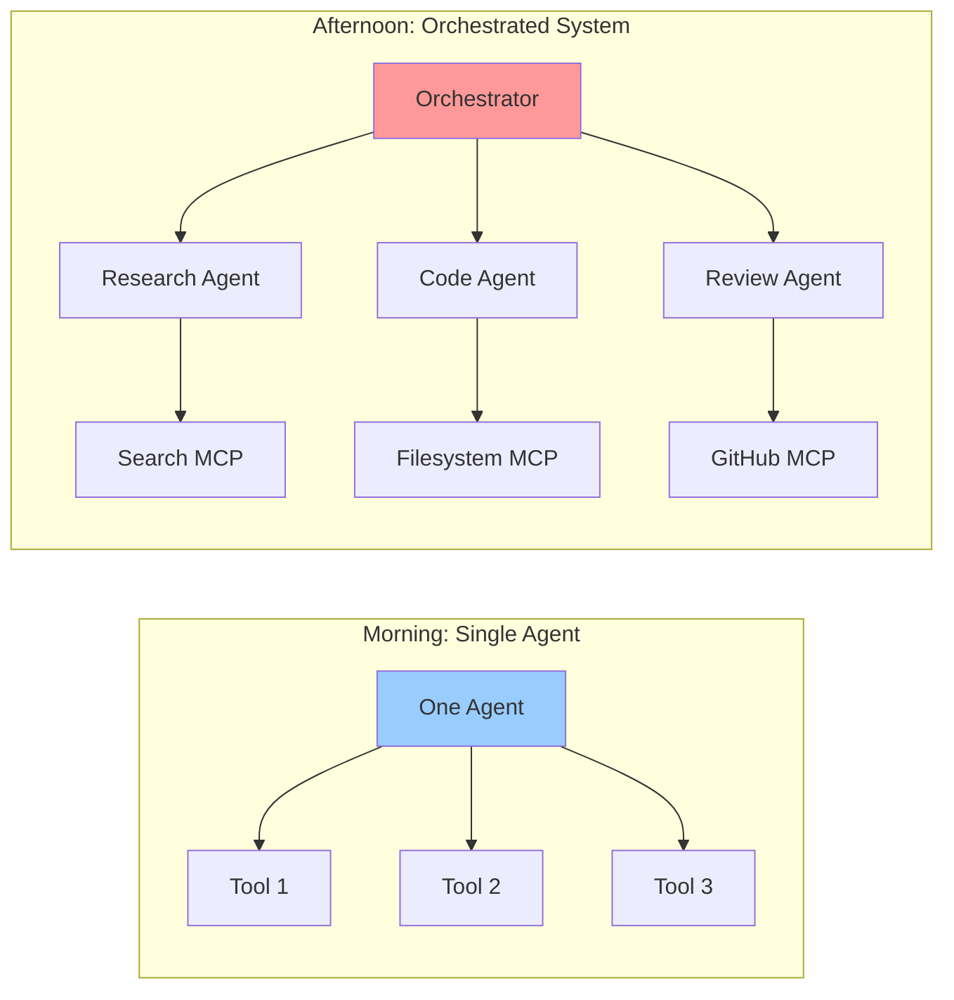
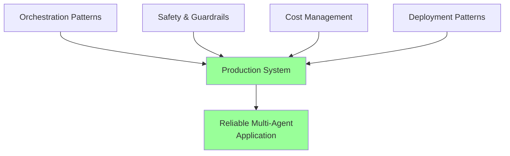
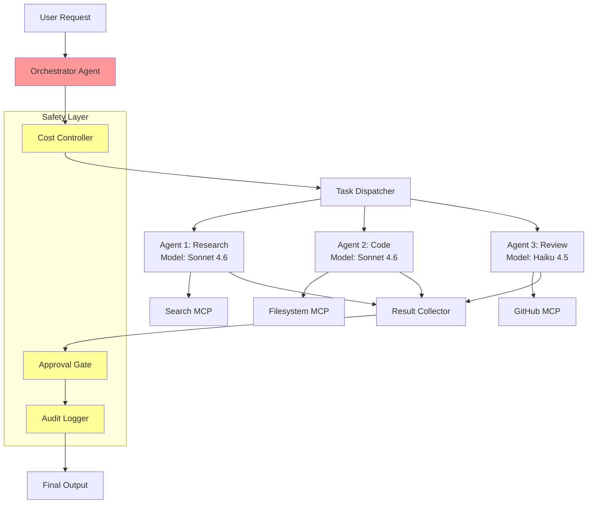

# Introduction to Agent Orchestration & Safety

## From Single Agents to Agent Systems

This morning you built individual agents that reason, use tools, and solve problems. This afternoon, we scale up: **how do you coordinate multiple agents, keep them safe, and manage costs in production?**

### The Orchestration Challenge

A single agent with a few tools works well for focused tasks. But real-world problems often require:

- **Specialisation**: Different subtasks need different expertise (research, code review, testing)
- **Parallelism**: Independent subtasks should run concurrently, not sequentially
- **Scale**: Large codebases, multi-document research, and complex workflows exceed what one agent context can handle
- **Safety**: Autonomous agents need guardrails -- cost limits, approval gates, and sandboxing

### The 2026 Orchestration Landscape

Agent orchestration has matured from experimental multi-agent frameworks into practical, production-ready patterns:

| Approach | Tool | Best For |
|----------|------|----------|
| **Subagent delegation** | Claude Code subagents | Software development, file operations |
| **Pipeline workflows** | Claude Code hooks + workflows | CI/CD integration, automated reviews |
| **Graph orchestration** | LangGraph | Complex state machines with branching |
| **Role-based teams** | CrewAI | Content creation, research teams |
| **Custom orchestration** | Anthropic Agent SDK | Domain-specific multi-agent systems |

### Why Safety Is Non-Negotiable

When agents operate autonomously, things can go wrong:

| Risk | Example | Mitigation |
|------|---------|------------|
| **Cost explosion** | Agent loops indefinitely, burning tokens | Token budgets, iteration limits |
| **Destructive actions** | Agent deletes files or force-pushes to main | Approval gates, restricted permissions |
| **Data leakage** | Agent sends sensitive data to external API | Network restrictions, audit logging |
| **Hallucinated actions** | Agent calls non-existent API endpoints | Tool validation, error handling |
| **Cascade failures** | One agent's error propagates through the system | Circuit breakers, independent error handling |

## What You'll Learn This Afternoon

### 1. Orchestration Patterns
- Subagent delegation (Claude Code's model)
- Pipeline and fan-out/fan-in patterns
- Graph-based workflows (LangGraph)
- Role-based agent teams (CrewAI)

### 2. Safety & Guardrails
- Token budgets and cost caps
- Human-in-the-loop approval gates
- Sandboxed execution environments
- Audit logging and observability

### 3. Cost Management
- Model selection strategies (Opus vs Sonnet vs Haiku)
- Prompt caching for repeated contexts
- Efficient context management
- Monitoring and alerting

### 4. Production Deployment
- Error handling and recovery
- Monitoring with LangSmith / Helicone
- Scaling patterns
- Testing multi-agent systems

## Architecture Overview

A production multi-agent system typically looks like this:

## The Afternoon's Flow

| Time | Topic | Activity |
|------|-------|----------|
| 0:00 | Introduction | This overview |
| 0:15 | Core Concepts | Orchestration patterns and safety theory |
| 1:00 | Hands-On | Build orchestrated agent systems |
| 1:45 | Exercises | Progressive challenges |
| 2:15 | Project Work | Production multi-agent system |
| 2:45 | Assessment | Knowledge validation |

## Navigation
- Next: [Core Concepts](01_concepts.md)
- [Back to Workshop Overview](README.md)
