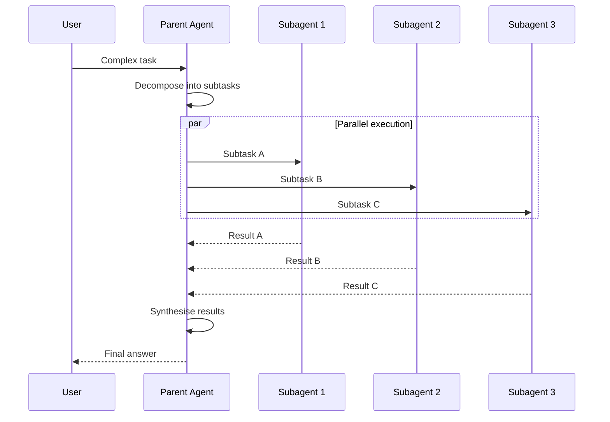
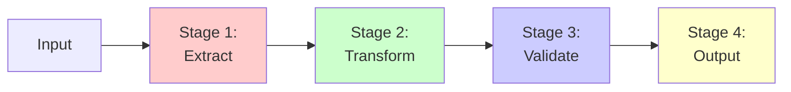
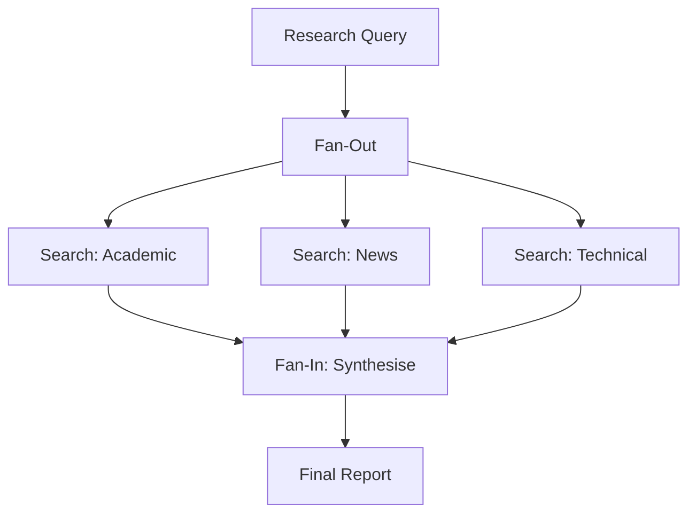

# Orchestration Concepts & Safety Patterns

> **Duration**: 45 minutes
> **Difficulty**: Advanced
> **Prerequisites**: Morning AI Agents session, Python or TypeScript

## Orchestration Pattern 1: Subagent Delegation

This is the pattern used by Claude Code internally. A parent agent breaks a complex task into focused subtasks and delegates each to a child agent (subagent).



### Implementation with Claude Code

```bash
# Parent delegates to subagents using --print
# Each subagent gets a focused context and returns text output

# Subagent 1: Research
RESEARCH=$(claude-code --print "Search for the latest benchmarks on Claude Sonnet 4.6 vs GPT-4o")

# Subagent 2: Analysis
ANALYSIS=$(echo "$RESEARCH" | claude-code --print "Analyse these benchmarks and identify key differences")

# Subagent 3: Report
echo "$ANALYSIS" | claude-code --print "Write a concise comparison report with recommendations"
```

### Implementation with the Anthropic SDK

```python
import anthropic
import concurrent.futures

client = anthropic.Anthropic()

def run_subagent(system_prompt: str, task: str, model: str = "claude-sonnet-4-6") -> str:
    """Run a focused subagent and return its text output"""
    response = client.messages.create(
        model=model,
        max_tokens=2048,
        system=system_prompt,
        messages=[{"role": "user", "content": task}]
    )
    return next(
        (b.text for b in response.content if hasattr(b, "text")),
        ""
    )

def orchestrate(task: str) -> str:
    """Parent agent that delegates to subagents"""

    # Step 1: Plan (use the parent to decompose)
    plan = run_subagent(
        system_prompt="You are a task planner. Break the given task into 2-4 independent subtasks. Return only a numbered list.",
        task=task
    )
    print(f"Plan:\n{plan}\n")

    # Step 2: Execute subtasks in parallel
    subtasks = [line.strip() for line in plan.strip().split("\n") if line.strip()]

    with concurrent.futures.ThreadPoolExecutor(max_workers=4) as executor:
        futures = {
            executor.submit(
                run_subagent,
                "You are a specialist. Complete the assigned subtask thoroughly.",
                subtask,
                "claude-sonnet-4-6"
            ): subtask
            for subtask in subtasks
        }

        results = {}
        for future in concurrent.futures.as_completed(futures):
            subtask = futures[future]
            results[subtask] = future.result()
            print(f"Completed: {subtask[:60]}...")

    # Step 3: Synthesise
    all_results = "\n\n---\n\n".join(
        f"**{task}**:\n{result}" for task, result in results.items()
    )

    synthesis = run_subagent(
        system_prompt="You are a synthesis expert. Combine the following subtask results into a coherent final answer.",
        task=f"Original task: {task}\n\nSubtask results:\n{all_results}"
    )

    return synthesis


if __name__ == "__main__":
    result = orchestrate("Compare the top 3 AI coding assistants in 2026 and recommend one for a small team")
    print("\n=== FINAL RESULT ===")
    print(result)
```

### Key Design Decisions

- **Context isolation**: Each subagent sees only what it needs -- no bloated context
- **Model selection**: Use cheaper models (Haiku 4.5) for simple subtasks, stronger models (Sonnet 4.6, Opus 4.8) for synthesis
- **Parallelism**: Independent subtasks run concurrently via `ThreadPoolExecutor` or `asyncio`
- **Failure isolation**: One subagent failing does not crash the others

## Orchestration Pattern 2: Pipeline (Sequential)

Tasks flow through a sequence of specialised stages:



```python
def pipeline(input_data: str) -> str:
    """Sequential pipeline where each stage feeds the next"""

    # Stage 1: Extract key information
    extracted = run_subagent(
        system_prompt="Extract structured data from the input. Return as JSON.",
        task=input_data,
        model="claude-haiku-4-5-20251001"  # Cheap for extraction
    )

    # Stage 2: Transform / analyse
    analysed = run_subagent(
        system_prompt="Analyse the extracted data and identify patterns.",
        task=extracted,
        model="claude-sonnet-4-6"  # Stronger for analysis
    )

    # Stage 3: Validate
    validated = run_subagent(
        system_prompt="Check this analysis for errors, inconsistencies, or unsupported claims. Return only confirmed findings.",
        task=analysed,
        model="claude-sonnet-4-6"
    )

    # Stage 4: Format output
    output = run_subagent(
        system_prompt="Format these findings into a clear, well-structured report. Use British English.",
        task=validated,
        model="claude-haiku-4-5-20251001"  # Cheap for formatting
    )

    return output
```

## Orchestration Pattern 3: Fan-Out / Fan-In

Search multiple sources in parallel, then synthesise:



```python
import concurrent.futures

def fan_out_research(topic: str) -> str:
    """Search multiple sources in parallel, then synthesise"""

    search_tasks = [
        ("Academic researcher", f"Search for academic papers about: {topic}"),
        ("News analyst", f"Search for recent news about: {topic}"),
        ("Technical reviewer", f"Search for technical blog posts and documentation about: {topic}")
    ]

    # Fan-out: parallel searches
    with concurrent.futures.ThreadPoolExecutor(max_workers=3) as executor:
        futures = {
            executor.submit(run_subagent, role, task): role
            for role, task in search_tasks
        }

        results = []
        for future in concurrent.futures.as_completed(futures):
            role = futures[future]
            results.append(f"**{role}**:\n{future.result()}")

    # Fan-in: synthesise
    all_sources = "\n\n---\n\n".join(results)
    return run_subagent(
        system_prompt="You are a research synthesiser. Combine findings from multiple sources into a coherent report with proper attribution.",
        task=f"Topic: {topic}\n\nSources:\n{all_sources}"
    )
```

## Orchestration Pattern 4: LangGraph State Machines

For complex workflows with branching, loops, and conditional logic:

```python
from langgraph.graph import StateGraph, END
from typing import TypedDict, Literal

class AgentState(TypedDict):
    task: str
    plan: str
    research: str
    draft: str
    review: str
    final: str
    iteration: int

def planner(state: AgentState) -> AgentState:
    state["plan"] = run_subagent(
        "You are a planner.", f"Plan: {state['task']}"
    )
    return state

def researcher(state: AgentState) -> AgentState:
    state["research"] = run_subagent(
        "You are a researcher.", f"Research based on plan: {state['plan']}"
    )
    return state

def writer(state: AgentState) -> AgentState:
    state["draft"] = run_subagent(
        "You are a writer.",
        f"Write based on research: {state['research']}"
    )
    return state

def reviewer(state: AgentState) -> AgentState:
    state["review"] = run_subagent(
        "You are a critical reviewer.",
        f"Review this draft: {state['draft']}"
    )
    state["iteration"] = state.get("iteration", 0) + 1
    return state

def should_revise(state: AgentState) -> Literal["revise", "publish"]:
    """Decide whether to revise or publish"""
    if state["iteration"] >= 3:
        return "publish"
    if "major issues" in state["review"].lower():
        return "revise"
    return "publish"

def publisher(state: AgentState) -> AgentState:
    state["final"] = state["draft"]
    return state

# Build the graph
workflow = StateGraph(AgentState)
workflow.add_node("plan", planner)
workflow.add_node("research", researcher)
workflow.add_node("write", writer)
workflow.add_node("review", reviewer)
workflow.add_node("publish", publisher)

workflow.set_entry_point("plan")
workflow.add_edge("plan", "research")
workflow.add_edge("research", "write")
workflow.add_edge("write", "review")
workflow.add_conditional_edges("review", should_revise, {
    "revise": "write",
    "publish": "publish"
})
workflow.add_edge("publish", END)

app = workflow.compile()

# Run
result = app.invoke({"task": "Write an article about MCP protocol", "iteration": 0})
print(result["final"])
```

## Safety & Guardrails

### 1. Token Budget Controller

```python
class TokenBudget:
    """Track and enforce token spending limits"""

    def __init__(self, max_input_tokens: int = 50000, max_output_tokens: int = 20000):
        self.max_input = max_input_tokens
        self.max_output = max_output_tokens
        self.used_input = 0
        self.used_output = 0

    def track(self, response):
        """Track usage from an API response"""
        self.used_input += response.usage.input_tokens
        self.used_output += response.usage.output_tokens

    def check(self):
        """Raise if budget exceeded"""
        if self.used_input > self.max_input:
            raise BudgetExceededError(
                f"Input token budget exceeded: {self.used_input}/{self.max_input}"
            )
        if self.used_output > self.max_output:
            raise BudgetExceededError(
                f"Output token budget exceeded: {self.used_output}/{self.max_output}"
            )

    def remaining(self) -> dict:
        return {
            "input_remaining": self.max_input - self.used_input,
            "output_remaining": self.max_output - self.used_output,
            "input_pct_used": round(self.used_input / self.max_input * 100, 1),
            "output_pct_used": round(self.used_output / self.max_output * 100, 1)
        }

class BudgetExceededError(Exception):
    pass
```

### 2. Iteration Limiter

```python
class IterationLimiter:
    """Prevent runaway agent loops"""

    def __init__(self, max_iterations: int = 20):
        self.max = max_iterations
        self.current = 0

    def tick(self):
        self.current += 1
        if self.current > self.max:
            raise MaxIterationsError(
                f"Agent exceeded {self.max} iterations -- stopping"
            )

    def reset(self):
        self.current = 0

class MaxIterationsError(Exception):
    pass
```

### 3. Human-in-the-Loop Approval

```python
class ApprovalGate:
    """Require human approval for sensitive actions"""

    SENSITIVE_TOOLS = {"delete_file", "git_push", "deploy", "send_email", "write_file"}

    @classmethod
    def check(cls, tool_name: str, tool_input: dict) -> bool:
        """Returns True if approved, raises if rejected"""
        if tool_name not in cls.SENSITIVE_TOOLS:
            return True

        print(f"\n--- APPROVAL REQUIRED ---")
        print(f"Tool: {tool_name}")
        print(f"Input: {tool_input}")
        response = input("Approve? [y/N]: ").strip().lower()

        if response != "y":
            raise ApprovalDeniedError(f"User denied {tool_name}")
        return True

class ApprovalDeniedError(Exception):
    pass
```

### 4. Audit Logger

```python
import json
from datetime import datetime
from pathlib import Path

class AuditLogger:
    """Log every agent action for review and debugging"""

    def __init__(self, log_dir: str = "./agent_logs"):
        self.log_dir = Path(log_dir)
        self.log_dir.mkdir(exist_ok=True)
        self.session_id = datetime.now().strftime("%Y%m%d_%H%M%S")
        self.log_file = self.log_dir / f"session_{self.session_id}.jsonl"
        self.entries = []

    def log(self, event_type: str, data: dict):
        entry = {
            "timestamp": datetime.now().isoformat(),
            "event": event_type,
            **data
        }
        self.entries.append(entry)

        with open(self.log_file, "a") as f:
            f.write(json.dumps(entry) + "\n")

    def log_tool_call(self, tool_name: str, tool_input: dict, result: str):
        self.log("tool_call", {
            "tool": tool_name,
            "input": tool_input,
            "result_length": len(result),
            "result_preview": result[:200]
        })

    def log_llm_call(self, model: str, input_tokens: int, output_tokens: int):
        self.log("llm_call", {
            "model": model,
            "input_tokens": input_tokens,
            "output_tokens": output_tokens
        })

    def summary(self) -> dict:
        tool_calls = [e for e in self.entries if e["event"] == "tool_call"]
        llm_calls = [e for e in self.entries if e["event"] == "llm_call"]
        return {
            "session": self.session_id,
            "total_events": len(self.entries),
            "tool_calls": len(tool_calls),
            "llm_calls": len(llm_calls),
            "total_input_tokens": sum(e.get("input_tokens", 0) for e in llm_calls),
            "total_output_tokens": sum(e.get("output_tokens", 0) for e in llm_calls)
        }
```

### 5. Sandboxed Code Execution

```python
# Option 1: E2B cloud sandbox
from e2b import Sandbox

def safe_execute(code: str) -> str:
    """Execute code in an isolated cloud sandbox"""
    sandbox = Sandbox(template="base", timeout=30)
    try:
        result = sandbox.process.start_and_wait(
            cmd=f"python -c '{code}'"
        )
        return result.stdout if result.exit_code == 0 else f"Error: {result.stderr}"
    finally:
        sandbox.close()

# Option 2: Docker container (local)
import subprocess

def docker_execute(code: str, timeout: int = 30) -> str:
    """Execute code in a disposable Docker container"""
    try:
        result = subprocess.run(
            ["docker", "run", "--rm", "--network=none",
             "--memory=256m", "--cpus=0.5",
             "python:3.12-slim", "python", "-c", code],
            capture_output=True, text=True, timeout=timeout
        )
        return result.stdout if result.returncode == 0 else f"Error: {result.stderr}"
    except subprocess.TimeoutExpired:
        return "Error: execution timed out"
```

## Cost Management Strategies

### Model Routing

Use cheaper models for simpler tasks:

```python
def choose_model(task_type: str) -> str:
    """Select the most cost-effective model for the task"""
    routing = {
        "extraction": "claude-haiku-4-5-20251001",    # Simple, fast
        "classification": "claude-haiku-4-5-20251001", # Simple, fast
        "formatting": "claude-haiku-4-5-20251001",     # Simple, fast
        "analysis": "claude-sonnet-4-6",               # Balanced
        "coding": "claude-sonnet-4-6",                 # Balanced
        "research": "claude-sonnet-4-6",               # Balanced
        "complex_reasoning": "claude-opus-4-8",        # Best quality
        "architecture": "claude-opus-4-8",             # Best quality
    }
    return routing.get(task_type, "claude-sonnet-4-6")
```

### Prompt Caching

Reuse cached system prompts to reduce costs on repeated calls:

```python
# The Anthropic API supports prompt caching.
# When the same system prompt is sent repeatedly,
# cached tokens are charged at a reduced rate.

# Structure your calls so the system prompt is stable:
response = client.messages.create(
    model="claude-sonnet-4-6",
    max_tokens=1024,
    system=[{
        "type": "text",
        "text": "You are a code reviewer. Follow these standards: ...",
        "cache_control": {"type": "ephemeral"}
    }],
    messages=messages
)
```

### Context Efficiency

Keep contexts lean to reduce token costs:

```python
def trim_context(messages: list, max_messages: int = 20) -> list:
    """Keep only the most recent messages to avoid context bloat"""
    if len(messages) <= max_messages:
        return messages
    # Always keep the first message (original task) and recent messages
    return [messages[0]] + messages[-(max_messages - 1):]
```

## Next Steps

**Continue to**: [Hands-On Practice](02_hands_on.md) -- Build orchestrated agent systems

**Key Takeaways**:
- Subagent delegation is the most practical orchestration pattern for most tasks
- Fan-out/fan-in enables parallel research and processing
- LangGraph handles complex workflows with branching and loops
- Safety is not optional: budgets, limits, approval gates, and audit logs are production requirements
- Model routing (Haiku for cheap tasks, Sonnet for main work, Opus for hard reasoning) can cut costs significantly

## Navigation
- Previous: [Introduction](00_introduction.md)
- Next: [Hands-on Practice](02_hands_on.md)
- [Back to Workshop Overview](README.md)
