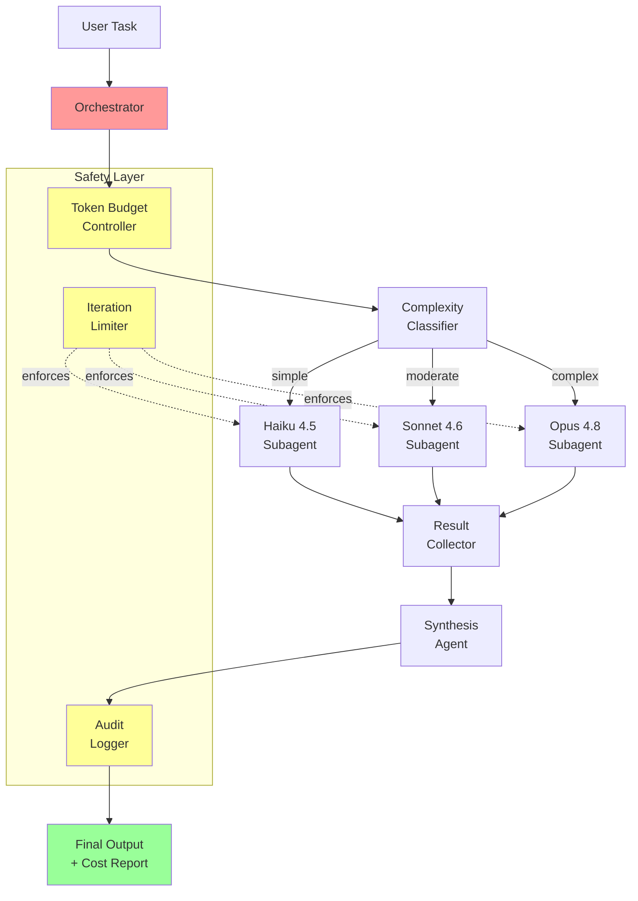

# Final Project: Production Multi-Agent System

## Project Overview

Build a complete, production-ready multi-agent system that orchestrates specialist agents to perform complex tasks with full safety controls, cost management, and observability.

## Requirements

### Core Features
1. **Orchestrator**: Parent agent that decomposes tasks and delegates to subagents
2. **Model routing**: Classify subtask complexity and route to appropriate models
3. **Safety controls**: Token budget, iteration limits, and audit logging
4. **Parallel execution**: Independent subtasks run concurrently
5. **Error recovery**: Retries with exponential backoff and model fallback
6. **Observability**: Full audit trail with cost reporting

### Technical Requirements
- Python 3.10+
- Anthropic SDK (`anthropic`)
- `concurrent.futures` for parallel execution
- `tenacity` for retry logic
- Structured logging (JSON lines)

## Architecture



## Implementation Guide

### Step 1: Project Structure

```
multi_agent_system/
    orchestrator.py      # Main orchestration logic
    safety.py            # Budget, limits, audit, approval
    router.py            # Model routing and classification
    agents.py            # Subagent implementations
    config.py            # Configuration
    main.py              # Entry point
    test_system.py       # Tests
    requirements.txt     # Dependencies
```

### Step 2: Safety Module

```python
# safety.py
import json
from datetime import datetime
from pathlib import Path
from dataclasses import dataclass, field

@dataclass
class SafetyConfig:
    max_input_tokens: int = 100000
    max_output_tokens: int = 50000
    max_iterations: int = 30
    max_parallel_agents: int = 5
    log_dir: str = "./logs"

class SafetyController:
    def __init__(self, config: SafetyConfig = None):
        self.config = config or SafetyConfig()
        self.input_tokens = 0
        self.output_tokens = 0
        self.iterations = 0
        self.audit_entries = []

        self.log_dir = Path(self.config.log_dir)
        self.log_dir.mkdir(exist_ok=True)
        self.session_id = datetime.now().strftime("%Y%m%d_%H%M%S")

    def track_usage(self, response, model: str):
        """Track token usage from an API response"""
        self.input_tokens += response.usage.input_tokens
        self.output_tokens += response.usage.output_tokens

        self.audit("llm_call", {
            "model": model,
            "input_tokens": response.usage.input_tokens,
            "output_tokens": response.usage.output_tokens
        })

        self._enforce_budget()

    def tick_iteration(self):
        """Increment iteration counter"""
        self.iterations += 1
        if self.iterations > self.config.max_iterations:
            self.audit("limit_exceeded", {"type": "iterations"})
            raise IterationLimitError(
                f"Exceeded {self.config.max_iterations} iterations"
            )

    def audit(self, event: str, data: dict):
        entry = {
            "timestamp": datetime.now().isoformat(),
            "event": event,
            **data
        }
        self.audit_entries.append(entry)

    def _enforce_budget(self):
        if self.input_tokens > self.config.max_input_tokens:
            raise BudgetError(f"Input tokens exceeded: {self.input_tokens}")
        if self.output_tokens > self.config.max_output_tokens:
            raise BudgetError(f"Output tokens exceeded: {self.output_tokens}")

    def save_audit(self):
        log_file = self.log_dir / f"audit_{self.session_id}.jsonl"
        with open(log_file, "w") as f:
            for entry in self.audit_entries:
                f.write(json.dumps(entry) + "\n")
        return str(log_file)

    def cost_report(self) -> dict:
        return {
            "session": self.session_id,
            "total_input_tokens": self.input_tokens,
            "total_output_tokens": self.output_tokens,
            "total_iterations": self.iterations,
            "total_events": len(self.audit_entries)
        }

class BudgetError(Exception):
    pass

class IterationLimitError(Exception):
    pass
```

### Step 3: Model Router

```python
# router.py
import anthropic

client = anthropic.Anthropic()

MODELS = {
    "simple": "claude-haiku-4-5-20251001",
    "moderate": "claude-sonnet-4-6",
    "complex": "claude-opus-4-8"
}

def classify_task(task: str) -> str:
    """Classify task complexity using Haiku (cheap and fast)"""
    response = client.messages.create(
        model="claude-haiku-4-5-20251001",
        max_tokens=20,
        system="Classify this task's complexity as exactly one word: simple, moderate, or complex.",
        messages=[{"role": "user", "content": task}]
    )
    classification = response.content[0].text.strip().lower()
    return classification if classification in MODELS else "moderate"

def get_model(complexity: str) -> str:
    """Get the appropriate model for a complexity level"""
    return MODELS.get(complexity, MODELS["moderate"])
```

### Step 4: Subagent Module

```python
# agents.py
import anthropic
from safety import SafetyController

client = anthropic.Anthropic()

def run_subagent(
    task: str,
    system_prompt: str,
    model: str,
    safety: SafetyController,
    max_tokens: int = 2048
) -> str:
    """Execute a focused subagent with safety tracking"""
    safety.tick_iteration()

    response = client.messages.create(
        model=model,
        max_tokens=max_tokens,
        system=system_prompt,
        messages=[{"role": "user", "content": task}]
    )

    safety.track_usage(response, model)

    return next(
        (b.text for b in response.content if hasattr(b, "text")),
        ""
    )
```

### Step 5: Orchestrator

```python
# orchestrator.py
import concurrent.futures
from agents import run_subagent
from router import classify_task, get_model
from safety import SafetyController, SafetyConfig

def orchestrate(task: str, config: SafetyConfig = None) -> dict:
    """
    Full orchestration pipeline:
    1. Decompose task
    2. Classify and route subtasks
    3. Execute in parallel
    4. Synthesise results
    """
    safety = SafetyController(config or SafetyConfig())
    safety.audit("orchestration_start", {"task": task})

    try:
        # Step 1: Decompose
        plan = run_subagent(
            task=f"Break this task into 2-5 independent subtasks. Return only a numbered list:\n\n{task}",
            system_prompt="You are a task planner. Decompose tasks into independent, parallelisable subtasks.",
            model="claude-haiku-4-5-20251001",
            safety=safety
        )

        subtasks = [
            line.strip().lstrip("0123456789.-) ")
            for line in plan.strip().split("\n")
            if line.strip() and any(c.isalpha() for c in line)
        ]

        safety.audit("decomposition", {"subtask_count": len(subtasks)})

        # Step 2: Classify and route
        routing = []
        for st in subtasks:
            complexity = classify_task(st)
            model = get_model(complexity)
            routing.append({"subtask": st, "complexity": complexity, "model": model})
            safety.audit("routing", {"subtask": st[:80], "complexity": complexity, "model": model})

        # Step 3: Execute in parallel
        results = []
        max_workers = min(len(routing), config.max_parallel_agents if config else 5)

        with concurrent.futures.ThreadPoolExecutor(max_workers=max_workers) as executor:
            futures = {
                executor.submit(
                    run_subagent,
                    task=r["subtask"],
                    system_prompt="You are a specialist. Complete the assigned task thoroughly and concisely.",
                    model=r["model"],
                    safety=safety
                ): r
                for r in routing
            }

            for future in concurrent.futures.as_completed(futures):
                r = futures[future]
                try:
                    result = future.result()
                    results.append({"subtask": r["subtask"], "result": result, "model": r["model"]})
                except Exception as e:
                    results.append({"subtask": r["subtask"], "result": f"Error: {e}", "model": r["model"]})
                    safety.audit("subtask_error", {"subtask": r["subtask"][:80], "error": str(e)})

        # Step 4: Synthesise
        results_text = "\n\n---\n\n".join(
            f"**{r['subtask']}** (via {r['model']}):\n{r['result']}"
            for r in results
        )

        final = run_subagent(
            task=f"Original task: {task}\n\nSubtask results:\n{results_text}",
            system_prompt="Combine the subtask results into a coherent final answer. Eliminate redundancy. Use British English.",
            model="claude-sonnet-4-6",
            safety=safety
        )

        safety.audit("orchestration_complete", {"status": "success"})

        return {
            "result": final,
            "cost_report": safety.cost_report(),
            "routing": [
                {"subtask": r["subtask"][:60], "model": r["model"]}
                for r in routing
            ],
            "audit_log": safety.save_audit()
        }

    except Exception as e:
        safety.audit("orchestration_error", {"error": str(e)})
        safety.save_audit()
        raise
```

### Step 6: Entry Point

```python
# main.py
from orchestrator import orchestrate
from safety import SafetyConfig
import json

if __name__ == "__main__":
    config = SafetyConfig(
        max_input_tokens=80000,
        max_output_tokens=30000,
        max_iterations=25,
        max_parallel_agents=4,
        log_dir="./logs"
    )

    result = orchestrate(
        task="Evaluate whether our team should adopt Rust for backend services. "
             "Consider: learning curve, performance benefits, ecosystem maturity, "
             "hiring availability, and migration effort from Python.",
        config=config
    )

    print("=== RESULT ===")
    print(result["result"])

    print("\n=== ROUTING ===")
    for r in result["routing"]:
        print(f"  {r['model']:40s} <- {r['subtask']}")

    print("\n=== COST REPORT ===")
    print(json.dumps(result["cost_report"], indent=2))

    print(f"\nAudit log: {result['audit_log']}")
```

### Step 7: Tests

```python
# test_system.py
import unittest
from safety import SafetyController, SafetyConfig, BudgetError, IterationLimitError

class TestSafetyController(unittest.TestCase):

    def test_iteration_limit(self):
        safety = SafetyController(SafetyConfig(max_iterations=3))
        safety.tick_iteration()
        safety.tick_iteration()
        safety.tick_iteration()
        with self.assertRaises(IterationLimitError):
            safety.tick_iteration()

    def test_audit_logging(self):
        safety = SafetyController()
        safety.audit("test_event", {"key": "value"})
        self.assertEqual(len(safety.audit_entries), 1)
        self.assertEqual(safety.audit_entries[0]["event"], "test_event")

    def test_cost_report(self):
        safety = SafetyController()
        report = safety.cost_report()
        self.assertIn("total_input_tokens", report)
        self.assertIn("total_output_tokens", report)
        self.assertEqual(report["total_input_tokens"], 0)


class TestRouter(unittest.TestCase):

    def test_classify_returns_valid_value(self):
        from router import classify_task
        result = classify_task("Format a list of names alphabetically")
        self.assertIn(result, ["simple", "moderate", "complex"])


if __name__ == "__main__":
    unittest.main()
```

## Evaluation Criteria

1. **Orchestration** (30%)
   - Task decomposition works correctly
   - Parallel execution is implemented
   - Synthesis produces coherent output

2. **Safety** (30%)
   - Token budget is enforced
   - Iteration limits work
   - Audit log captures all events
   - Error handling is robust

3. **Cost Efficiency** (20%)
   - Model routing is implemented
   - Cheaper models used for simple tasks
   - Cost report is accurate

4. **Code Quality** (20%)
   - Clean, well-structured code
   - Type hints
   - Tests pass
   - Good error messages

## Stretch Goals

1. **Prompt caching**: Implement system prompt caching for repeated subagent calls
2. **Human-in-the-loop**: Add approval gates for sensitive subtasks
3. **Streaming**: Stream subagent results as they complete
4. **Dashboard**: Build a simple terminal UI showing agent progress
5. **MCP integration**: Add MCP server tools to subagents for real-world capabilities

## Submission

Submit:
1. Complete source code (all modules)
2. `requirements.txt`
3. Sample output from a real task
4. Audit log from the run
5. Cost comparison: routed vs naive (all Sonnet) approach

## Navigation
- Previous: [Exercises](03_exercises.md)
- Next: [Assessment](05_assessment.md)
- [Back to Workshop Overview](README.md)
