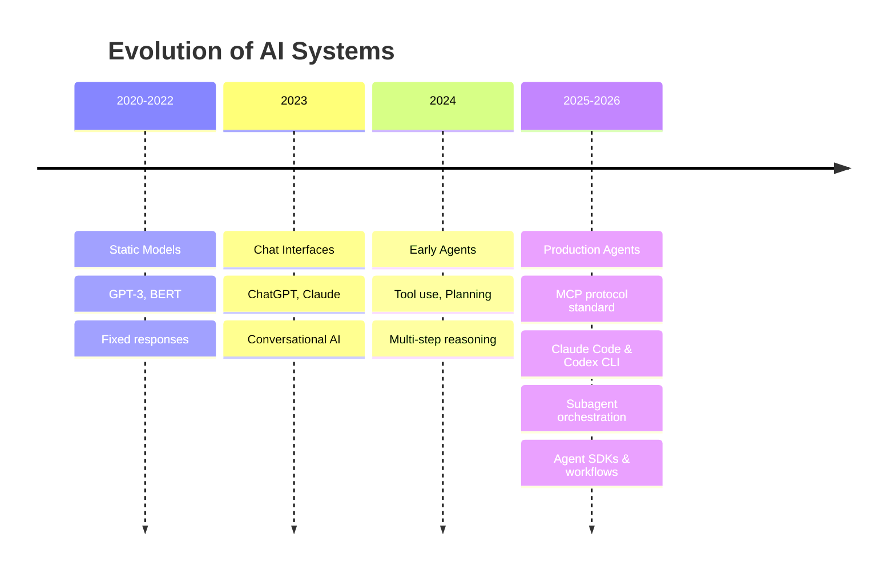
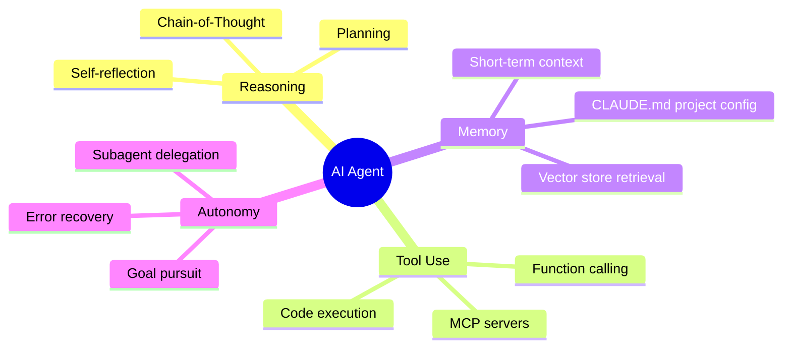
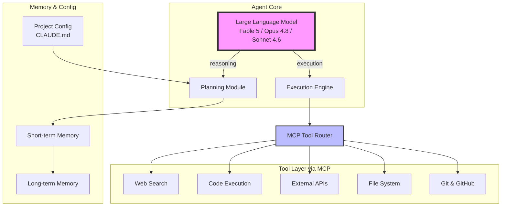
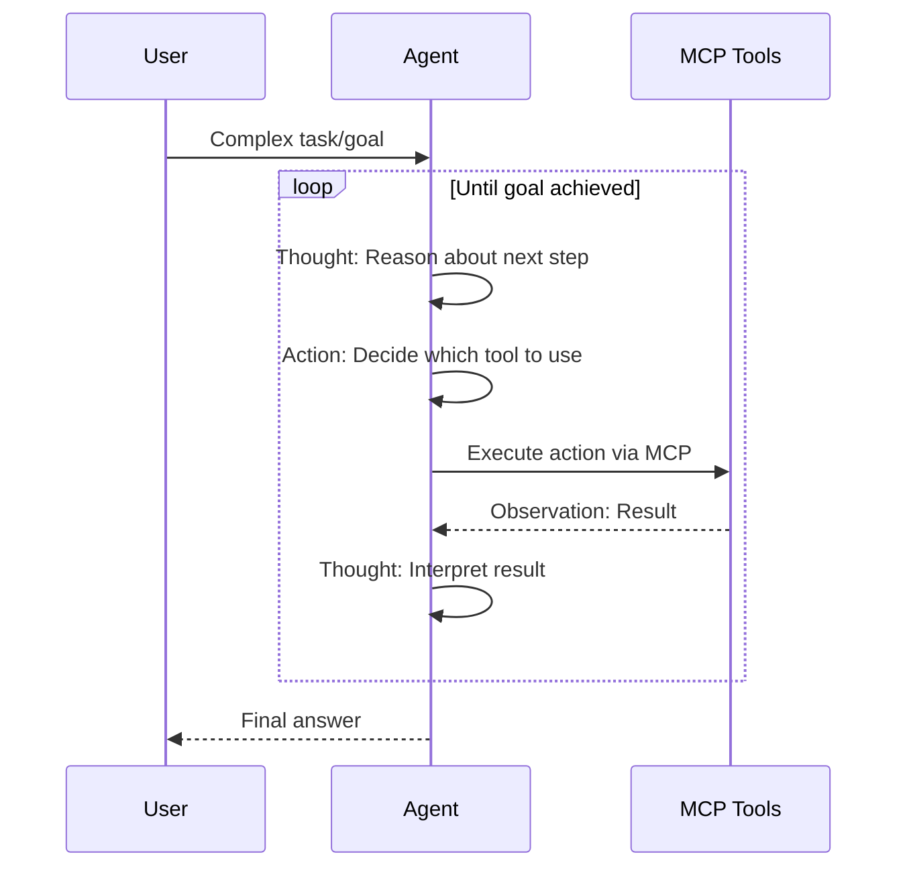
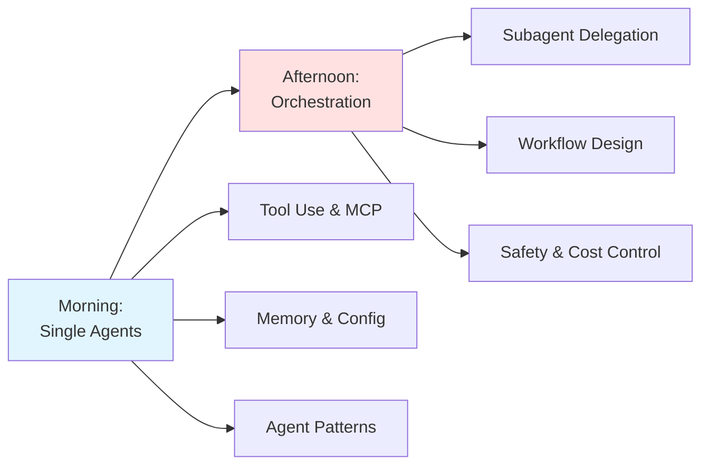

# Introduction to AI Agents

## The Age of Autonomous AI (2025-2026)

We are in the midst of a fundamental shift in how AI systems operate. Rather than simple question-answer interactions, modern AI agents can **reason, plan, use tools, and execute complex tasks autonomously** -- and in 2026, the tooling to build and deploy them has matured from experimental to production-grade.

### What Makes 2025-2026 Different?



### The Agent Revolution

**Traditional AI (Pre-2024)**:
- User asks question, AI responds
- No tool access
- No memory between sessions
- No ability to break down complex tasks

**AI Agents (2025-2026)**:
- AI receives goal, plans steps, executes autonomously
- Uses external tools via standardised protocols (MCP)
- Maintains conversation and task memory across sessions
- Decomposes complex problems into subtasks with subagents
- Self-corrects when errors occur
- Operates as full coding agents (Claude Code, OpenAI Codex CLI, Aider)

### Real-World Agent Applications

| Domain | Agent Type | Example Tools |
|--------|-----------|---------------|
| **Software Development** | Coding Agent | Claude Code, Codex CLI, Cursor, Aider |
| **Research** | Research Agent | Deep research workflows, web search MCP servers |
| **Data Analysis** | Analytics Agent | Database MCP servers, code execution sandboxes |
| **DevOps** | Operations Agent | GitHub MCP, filesystem tools, deployment pipelines |
| **Content & Docs** | Writing Agent | Multi-step workflows with review and refinement |

### Key Agent Capabilities



## The Agent Architecture Stack

Modern AI agents combine multiple components:



## Why Agents Matter Now

### 1. Foundation Models Are Production-Ready

Models like Claude Fable 5, Opus 4.8, Sonnet 4.6, GPT-4o, and o3 have:
- Strong multi-step reasoning capabilities
- Reliable structured tool use
- Extended context windows (200K+ tokens)
- Significantly reduced hallucination rates
- Native support for agent workflows

### 2. The MCP Standard Has Unified Tool Integration

The Model Context Protocol (MCP) has become the standard for connecting AI agents to tools:
- **One protocol, any tool**: filesystem, databases, GitHub, Slack, search, and hundreds more
- **Any model, any client**: Claude Code, Cursor, Windsurf, and other clients all speak MCP
- **Community ecosystem**: hundreds of open-source MCP servers available

### 3. Production Agent Tools Are Mature

The ecosystem has moved well beyond frameworks:
- **Claude Code**: Terminal-based coding agent with subagents, workflows, hooks, and CLAUDE.md configuration
- **OpenAI Codex CLI**: Open-source terminal agent for code tasks
- **Anthropic Agent SDK**: Python/TypeScript SDKs for building custom agents
- **Cursor / Windsurf**: IDE-integrated agents with MCP support
- **Aider**: Open-source terminal pair-programming agent

### 4. Production Use Cases Are Proven

Organisations are deploying agents at scale:
- **Claude Code**: Full software development workflows with subagent delegation
- **GitHub Copilot Workspace**: Autonomous coding from issues to PRs
- **Cursor AI**: IDE-native agent for refactoring and feature development
- **Custom agents**: Built with the Anthropic Agent SDK for domain-specific tasks

## The ReAct Pattern: Reasoning + Acting

The foundational pattern that powers modern agents:



**Example: "Find the latest AI research on agents and summarise"**

```
Thought: I need to search for recent AI agent research papers
Action: web_search("AI agents research 2026")
Observation: Found 5 recent papers from arXiv

Thought: I should read the abstracts of these papers
Action: read_url("https://arxiv.org/abs/2601.xxxxx")
Observation: Paper discusses multi-agent coordination...

Thought: Now I can synthesise findings
Action: create_summary([paper1, paper2, paper3])
Observation: Summary created

Thought: I have enough information to answer
Final Answer: Recent AI agent research focuses on...
```

## What You'll Build Today

By the end of this workshop, you will create:

1. **Basic Agent**: Tool-using agent with the Claude API and MCP
2. **Claude Code Workflow**: Multi-step coding agent using subagents
3. **Research Agent**: Web-searching autonomous agent with citations
4. **Multi-Tool Agent**: Agent combining multiple MCP servers

### Technologies Covered

- **Claude API**: Anthropic's tool use implementation (Sonnet 4.6, Opus 4.8)
- **Claude Code**: Terminal agent with subagents and workflows
- **MCP Servers**: Standardised tool integration protocol
- **Anthropic Agent SDK**: Building custom agents in Python and TypeScript
- **Aider / Codex CLI**: Open-source terminal agents for comparison

## The Agent Mindset

Building agents requires thinking differently:

| Traditional Programming | Agent Programming |
|------------------------|-------------------|
| Explicit control flow | Goal-directed behaviour |
| Deterministic execution | Probabilistic reasoning |
| Error handling with try/catch | Self-correction loops |
| Fixed functionality | Dynamic tool selection via MCP |
| Step-by-step instructions | High-level objectives in CLAUDE.md |

## Looking Ahead

This morning focuses on **individual agents**. This afternoon, we will explore:
- Multi-agent orchestration patterns
- Claude Code subagent workflows
- Safety, cost control, and guardrails
- Production deployment patterns



## Navigation
- Next: [Core Concepts](01_concepts.md)
- [Back to Workshop Overview](README.md)
