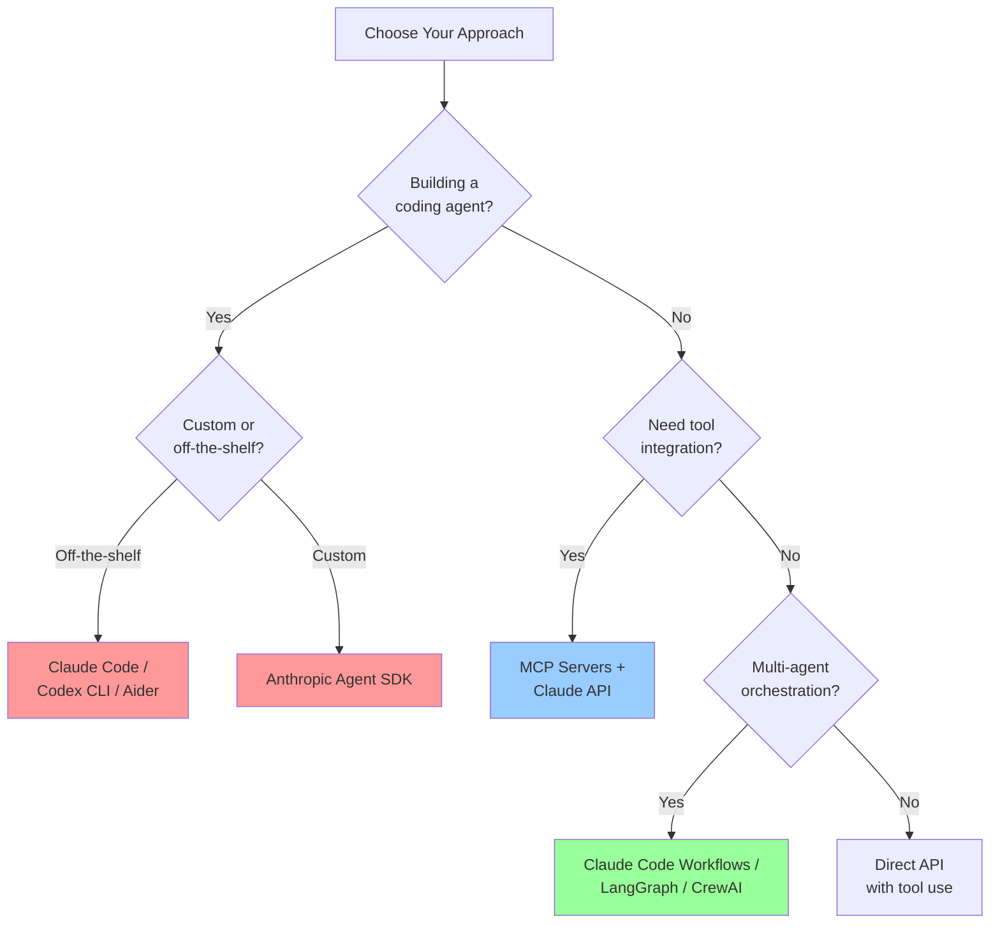
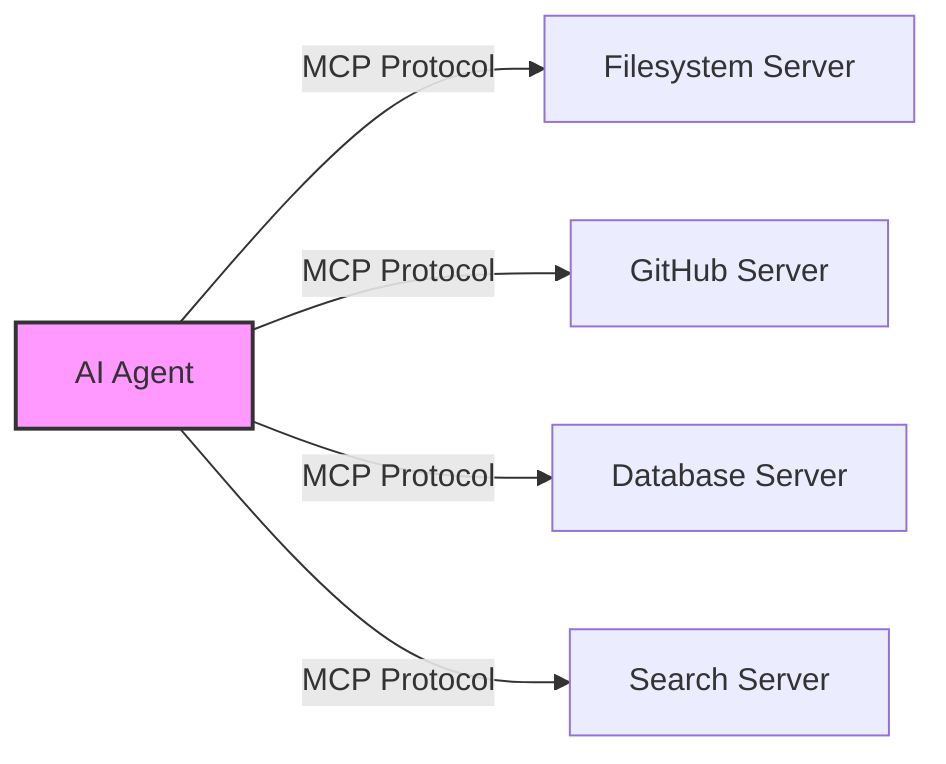

# Core Agent Concepts (2026)

> **Duration**: 45 minutes
> **Difficulty**: Intermediate
> **Prerequisites**: LLM API experience, Python or TypeScript basics

## The Agent Tooling Landscape (2026)

The AI agent ecosystem has matured from experimental frameworks into production-grade tools. Here is your decision tree:



### 1. Claude Code: The Production Coding Agent

**Best for**: Software development, refactoring, debugging, multi-file changes

Claude Code is Anthropic's standalone terminal agent. It is not a VS Code extension -- it is a full agent that runs in your terminal (and can also run inside VS Code's integrated terminal, or as a desktop/web app).

**Key capabilities**:
- Subagents: delegate subtasks to child agents running in parallel
- Workflows: multi-step pipelines defined in CLAUDE.md or via slash commands
- Hooks system: run custom scripts on events (pre-edit, post-commit, session start)
- MCP servers: connect to any tool via the Model Context Protocol
- `/fast` mode: switch to faster output when speed matters more than depth
- CLAUDE.md: project-level configuration that shapes agent behaviour

**Installation**:
```bash
npm install -g @anthropic-ai/claude-code
```

**Example -- using Claude Code as a subagent from a script**:
```bash
# Spawn a subagent to analyse a codebase
claude-code --print "Analyse src/ for security vulnerabilities and report findings"

# Pipe context into a focused task
cat error.log | claude-code --print "Diagnose the root cause of these errors"
```

**When to use**: Day-to-day development, codebase-wide refactors, CI/CD integration, any task where the agent needs to read/write files and run commands.

### 2. Anthropic Agent SDK

**Best for**: Building custom agents with full control over tool definitions, memory, and orchestration logic.

The Agent SDK provides the building blocks for creating agents in Python or TypeScript:

```python
import anthropic

client = anthropic.Anthropic()

tools = [
    {
        "name": "get_weather",
        "description": "Get current weather for a location",
        "input_schema": {
            "type": "object",
            "properties": {
                "location": {
                    "type": "string",
                    "description": "City and country, e.g. 'London, UK'"
                },
                "unit": {
                    "type": "string",
                    "enum": ["celsius", "fahrenheit"],
                    "description": "Temperature unit"
                }
            },
            "required": ["location"]
        }
    }
]

def process_tool_call(tool_name, tool_input):
    if tool_name == "get_weather":
        return f"Weather in {tool_input['location']}: 18C, Sunny"

# Agent loop
messages = [{"role": "user", "content": "What's the weather in Paris?"}]

while True:
    response = client.messages.create(
        model="claude-sonnet-4-6",
        max_tokens=1024,
        tools=tools,
        messages=messages
    )

    messages.append({"role": "assistant", "content": response.content})

    if response.stop_reason == "end_turn":
        text = next((b.text for b in response.content if hasattr(b, "text")), "")
        print(f"Answer: {text}")
        break

    if response.stop_reason == "tool_use":
        tool_results = []
        for block in response.content:
            if block.type == "tool_use":
                result = process_tool_call(block.name, block.input)
                tool_results.append({
                    "type": "tool_result",
                    "tool_use_id": block.id,
                    "content": result
                })
        messages.append({"role": "user", "content": tool_results})
```

**When to use**: Building domain-specific agents, customer-facing AI products, when you need fine-grained control over the agent loop.

### 3. MCP (Model Context Protocol)

MCP is the standardised protocol for connecting AI agents to tools. Think of it as USB for AI -- one plug, any device.

**How it works**:


**Popular MCP Servers** (2026):
- **@modelcontextprotocol/server-filesystem** -- File read/write operations
- **@modelcontextprotocol/server-github** -- Issues, PRs, repo management
- **@modelcontextprotocol/server-postgres** -- Database queries
- **@modelcontextprotocol/server-brave-search** -- Web search
- **@modelcontextprotocol/server-slack** -- Slack messaging
- **@modelcontextprotocol/server-memory** -- Persistent key-value memory
- Community servers for Jira, Notion, Google Drive, and hundreds more

**Configuring MCP in Claude Code** (`.mcp.json`):
```json
{
  "mcpServers": {
    "filesystem": {
      "command": "npx",
      "args": ["-y", "@modelcontextprotocol/server-filesystem", "/path/to/project"]
    },
    "github": {
      "command": "npx",
      "args": ["-y", "@modelcontextprotocol/server-github"],
      "env": {
        "GITHUB_TOKEN": "your-token"
      }
    }
  }
}
```

**When to use**: Whenever an agent needs to interact with external systems. MCP is now the default way to give agents tools.

### 4. OpenAI Codex CLI

**Best for**: Open-source terminal agent with OpenAI models.

```bash
# Install
npm install -g @openai/codex

# Use interactively
codex "refactor this function to use async/await"

# Autonomous mode
codex --approval-mode full-auto "add input validation to all API endpoints"
```

**When to use**: When you prefer OpenAI models, want an open-source tool, or need a second opinion alongside Claude Code.

### 5. Other Terminal Agents

**Aider** (open-source, multi-model):
```bash
pip install aider-chat
aider --model claude-sonnet-4-6  # works with Claude, GPT, local models
```

**Cursor AI** (IDE-native, $20/month):
- VS Code fork with deep AI integration
- Agent mode for multi-file edits
- Built-in MCP support

**Windsurf** (IDE-native, $10-15/month):
- Cascade agent for multi-step workflows
- Good for smaller, focused tasks

### 6. LangChain & LangGraph

**Best for**: Complex custom workflows, multi-model support, graph-based orchestration.

```python
from langchain.agents import create_react_agent, AgentExecutor
from langchain_anthropic import ChatAnthropic
from langchain_community.tools.tavily_search import TavilySearchResults
from langchain import hub

llm = ChatAnthropic(model="claude-sonnet-4-6")

search = TavilySearchResults(max_results=3)

from langchain.tools import Tool

def calculator(expression: str) -> str:
    """Evaluate math expression"""
    try:
        return str(eval(expression, {"__builtins__": {}}, {}))
    except Exception as e:
        return f"Error: {str(e)}"

tools = [
    search,
    Tool(
        name="Calculator",
        func=calculator,
        description="Perform mathematical calculations. Input: valid Python expression."
    )
]

prompt = hub.pull("hwchase17/react")
agent = create_react_agent(llm, tools, prompt)
agent_executor = AgentExecutor(
    agent=agent, tools=tools, verbose=True, max_iterations=5
)

result = agent_executor.invoke({
    "input": "What's the population of Tokyo and what's 15% of that number?"
})
print(result["output"])
```

**When to use**: When you need framework-agnostic flexibility, complex state machines (LangGraph), or integration with many different LLM providers.

## Tool Use: The Agent's Hands

### Modern Tool Calling (2026)

All major LLMs support structured tool calling. The pattern is consistent:

```python
# 1. Define tool schema (same format works with Claude, GPT, Gemini)
tool_schema = {
    "name": "search_database",
    "description": "Search product database",
    "input_schema": {
        "type": "object",
        "properties": {
            "query": {"type": "string"},
            "filters": {
                "type": "object",
                "properties": {
                    "category": {"type": "string"},
                    "min_price": {"type": "number"},
                    "max_price": {"type": "number"}
                }
            }
        },
        "required": ["query"]
    }
}

# 2. Implement tool function
def search_database(query: str, filters: dict = None):
    results = db.search(query, **(filters or {}))
    return {"results": results, "count": len(results)}

# 3. LLM chooses tool automatically based on the user's request
# 4. Your agent loop executes the tool and feeds results back
```

### Code Execution Sandboxes

For safe code execution within agents:

**E2B Sandboxes**:
```python
from e2b import Sandbox

sandbox = Sandbox(template="base")
result = sandbox.process.start_and_wait(
    cmd="python -c 'print(sum([1, 2, 3, 4, 5]))'"
)
print(result.stdout)  # "15"
sandbox.close()
```

**Modal Functions**:
```python
import modal

app = modal.App("agent-sandbox")

@app.function()
def execute_code(code: str):
    exec(code)

result = execute_code.remote("print('Hello from sandbox')")
```

## Agent Architectures

### 1. ReAct (Reasoning + Acting)

Most common pattern for general-purpose agents:

```
Loop until goal achieved:
  1. THOUGHT: Reason about current state and next action
  2. ACTION: Choose and execute a tool
  3. OBSERVATION: Process tool result
  4. [Repeat or conclude]
```

**Strengths**: Simple, interpretable, works well for most tasks
**Weaknesses**: Can waste API calls, no look-ahead planning

### 2. Plan-and-Execute

Create a complete plan first, then execute:

```
1. PLANNING PHASE:
   - Analyse goal
   - Break into subtasks
   - Order by dependencies

2. EXECUTION PHASE:
   - Execute each subtask (potentially via subagents)
   - Adapt plan if failures occur
   - Synthesise results
```

**Strengths**: More efficient, better for complex tasks, parallelisable with subagents
**Weaknesses**: Harder to implement, less flexible to mid-course changes

### 3. Subagent Delegation (Claude Code Pattern)

The parent agent delegates specialised subtasks to child agents:

```
1. PARENT receives complex goal
2. DECOMPOSE into independent subtasks
3. SPAWN subagents for each subtask (parallel)
4. COLLECT results from subagents
5. SYNTHESISE final answer
```

This is how Claude Code's `--print` flag and internal subagent system work. Each subagent gets a focused context and returns a result.

**Strengths**: Parallel execution, focused contexts, scales to large tasks
**Weaknesses**: Coordination overhead, cost of multiple agent invocations

### 4. Reflection

Agent evaluates its own work:

```
1. GENERATE: Produce initial solution
2. CRITIQUE: Identify issues
3. REFINE: Improve based on critique
4. [Repeat 2-3 until quality threshold met]
```

**Strengths**: Higher quality outputs, learns from mistakes
**Weaknesses**: More expensive (extra LLM calls), slower

## Memory Systems

### Short-term Memory (Conversation Buffer)

```python
class ConversationMemory:
    def __init__(self, max_messages=10):
        self.messages = []
        self.max_messages = max_messages

    def add(self, role, content):
        self.messages.append({"role": role, "content": content})
        if len(self.messages) > self.max_messages:
            self.messages.pop(0)

    def get_context(self):
        return self.messages
```

### Project Configuration (CLAUDE.md)

Claude Code uses `CLAUDE.md` files as persistent project memory:

```markdown
# Project: My API Server

## Build Commands
- npm run build
- npm run test

## Architecture
- Express.js REST API
- PostgreSQL via Prisma ORM
- JWT authentication

## Conventions
- British English in user-facing strings
- All endpoints return JSON
- Error responses use RFC 7807 format
```

This gives the agent context about the project without consuming conversation tokens on every turn.

### Long-term Memory (Vector Store)

```python
from langchain_community.vectorstores import Chroma
from langchain_openai import OpenAIEmbeddings

class AgentMemory:
    def __init__(self):
        self.embeddings = OpenAIEmbeddings()
        self.vectorstore = Chroma(
            embedding_function=self.embeddings,
            persist_directory="./memory"
        )

    def remember(self, content, metadata=None):
        """Store in long-term memory"""
        self.vectorstore.add_texts(
            texts=[content], metadatas=[metadata or {}]
        )

    def recall(self, query, k=5):
        """Retrieve relevant memories"""
        docs = self.vectorstore.similarity_search(query, k=k)
        return [doc.page_content for doc in docs]
```

## Error Handling & Robustness

### Retry Logic with Exponential Backoff

```python
from tenacity import retry, stop_after_attempt, wait_exponential

@retry(
    stop=stop_after_attempt(3),
    wait=wait_exponential(multiplier=1, min=4, max=10)
)
def call_tool_with_retry(tool_name, params):
    """Retry tool calls on failure"""
    try:
        return execute_tool(tool_name, params)
    except Exception as e:
        print(f"Tool call failed: {e}, retrying...")
        raise
```

### Validation and Self-Correction

```python
def execute_with_validation(agent, task):
    """Execute task with result validation"""
    max_retries = 3

    for attempt in range(max_retries):
        result = agent.run(task)
        validation = agent.validate_result(result, task)

        if validation["is_valid"]:
            return result

        correction_prompt = f"""
        Your previous result had issues:
        {validation['issues']}

        Please correct and try again.
        Previous attempt: {result}
        """
        task = correction_prompt

    raise Exception("Failed to produce valid result")
```

## Production Best Practices

### 1. Cost Control

```python
class CostController:
    def __init__(self, max_tokens=10000):
        self.tokens_used = 0
        self.max_tokens = max_tokens

    def check_budget(self, estimated_tokens):
        if self.tokens_used + estimated_tokens > self.max_tokens:
            raise Exception("Token budget exceeded")

    def track_usage(self, response):
        self.tokens_used += response.usage.total_tokens
        print(f"Tokens: {self.tokens_used}/{self.max_tokens}")
```

### 2. Model Selection for Cost Efficiency

Choose the right model for each task:

| Task | Recommended Model | Why |
|------|------------------|-----|
| Complex reasoning | Opus 4.8 | Highest accuracy |
| General agent work | Sonnet 4.6 | Best balance of speed, quality, cost |
| Simple tool routing | Haiku 4.5 | Fastest and cheapest |
| Subagent subtasks | Sonnet 4.6 or Haiku 4.5 | Keeps costs manageable at scale |

Check the [Anthropic console](https://console.anthropic.com/) for current pricing.

### 3. Monitoring and Logging

```python
import logging
from datetime import datetime

class AgentMonitor:
    def __init__(self):
        self.logger = logging.getLogger("agent")
        self.metrics = {
            "tool_calls": [],
            "errors": [],
            "token_usage": []
        }

    def log_tool_call(self, tool_name, params, result):
        entry = {
            "timestamp": datetime.now().isoformat(),
            "tool": tool_name,
            "params": params,
            "success": result is not None
        }
        self.metrics["tool_calls"].append(entry)
        self.logger.info(f"Tool: {tool_name}, Success: {entry['success']}")

    def generate_report(self):
        return {
            "total_tools": len(self.metrics["tool_calls"]),
            "success_rate": self._calculate_success_rate(),
            "most_used_tool": self._get_most_used_tool()
        }
```

## Next Steps

**Continue to**: [Hands-On Practice](02_hands_on.md) -- Build your first agents

**Key Takeaways**:
- Claude Code is the go-to production coding agent; the Agent SDK is for building custom agents
- MCP is the standard protocol for giving agents tools -- learn it well
- ReAct and subagent delegation are the two most important agent patterns
- Choose models strategically: Opus for reasoning, Sonnet for general work, Haiku for routing
- Production agents need cost control, timeouts, and monitoring from day one

## Navigation
- Previous: [Introduction](00_introduction.md)
- Next: [Hands-on Development](02_hands_on.md)
- [Back to Workshop Overview](README.md)
