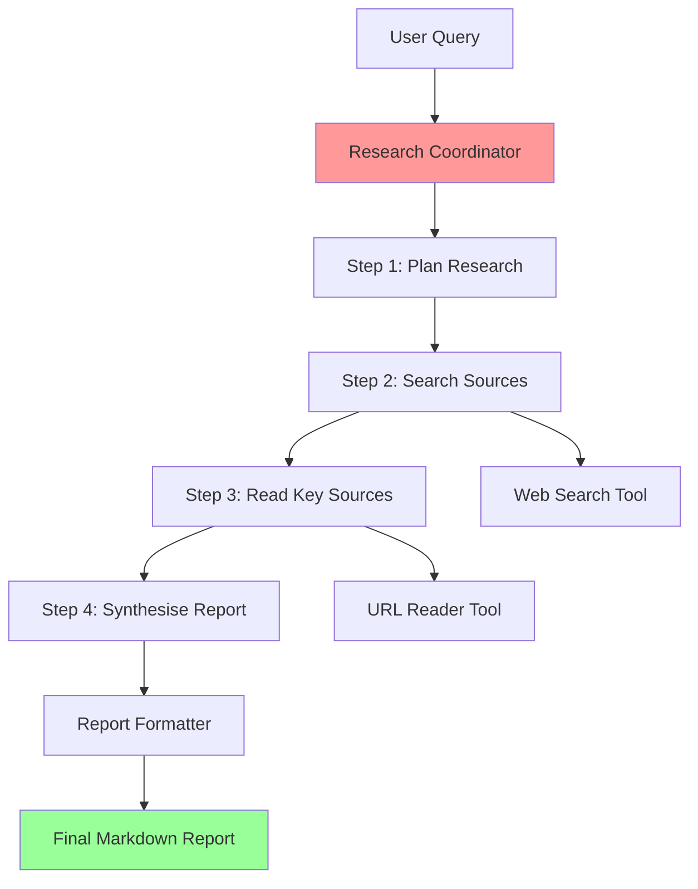

# Final Project: Production Research Agent

## Project Overview

Build a production-ready research agent that autonomously researches topics, evaluates sources, and produces comprehensive reports with citations. You will use the Claude API with tool use, following the agent patterns covered in this morning's session.

## Requirements

### Core Features
1. **Multi-Source Research**: Search the web, read specific pages, and gather information from multiple sources
2. **Source Evaluation**: Track and attribute all sources used
3. **Content Analysis**: Extract key information and identify themes
4. **Synthesis**: Combine findings into a coherent report
5. **Citation Management**: Proper inline citations and bibliography

### Technical Requirements
- Python 3.10+
- Anthropic SDK (`anthropic` package)
- Web search capability (DuckDuckGo, Brave, or Tavily)
- Structured output format (Markdown)

## Architecture


```mermaid
graph TD
    User[User Query] --> Coordinator[Research Coordinator]

    Coordinator --> PlanStep[Step 1: Plan Research]
    PlanStep --> SearchStep[Step 2: Search Sources]
    SearchStep --> ReadStep[Step 3: Read Key Sources]
    ReadStep --> SynthStep[Step 4: Synthesise Report]

    SearchStep --> Web[Web Search Tool]
    ReadStep --> Reader[URL Reader Tool]
    SynthStep --> Formatter[Report Formatter]

    Formatter --> Output[Final Markdown Report]

    style Coordinator fill:#ff9999
    style Output fill:#99ff99
```

## Implementation Guide

### Step 1: Project Structure

```
research_agent/
    agent.py           # Main agent loop
    tools.py           # Tool implementations
    citations.py       # Citation management
    config.py          # Configuration
    requirements.txt   # Dependencies
    test_agent.py      # Tests
```

### Step 2: Tool Definitions

```python
# tools.py
from duckduckgo_search import DDGS
import urllib.request
from typing import List, Dict
from datetime import datetime

class ResearchTools:
    def __init__(self):
        self.sources: List[Dict] = []

    def web_search(self, query: str, max_results: int = 5) -> str:
        """Search the web and return formatted results with source tracking"""
        with DDGS() as ddgs:
            results = list(ddgs.text(query, max_results=max_results))

        formatted = []
        for i, r in enumerate(results):
            source = {
                "index": len(self.sources) + 1,
                "title": r.get("title", ""),
                "url": r.get("href", ""),
                "snippet": r.get("body", ""),
                "accessed": datetime.now().isoformat()
            }
            self.sources.append(source)
            formatted.append(
                f"[{source['index']}] {source['title']}\n"
                f"{source['snippet']}\n"
                f"URL: {source['url']}"
            )

        return "\n\n".join(formatted) if formatted else "No results found"

    def read_url(self, url: str) -> str:
        """Read text content from a URL"""
        try:
            req = urllib.request.Request(url, headers={"User-Agent": "ResearchAgent/1.0"})
            with urllib.request.urlopen(req, timeout=10) as resp:
                content = resp.read(15000).decode("utf-8", errors="ignore")
            # Basic HTML tag stripping
            import re
            text = re.sub(r'<[^>]+>', ' ', content)
            text = re.sub(r'\s+', ' ', text).strip()
            return text[:5000]
        except Exception as e:
            return f"Error reading URL: {e}"

    def get_tool_schemas(self) -> list:
        """Return tool schemas for the Claude API"""
        return [
            {
                "name": "web_search",
                "description": "Search the web for information on a topic. Returns titles, snippets, and URLs.",
                "input_schema": {
                    "type": "object",
                    "properties": {
                        "query": {"type": "string", "description": "Search query"},
                        "max_results": {"type": "integer", "description": "Max results (default 5)"}
                    },
                    "required": ["query"]
                }
            },
            {
                "name": "read_url",
                "description": "Read the text content of a specific webpage for detailed information",
                "input_schema": {
                    "type": "object",
                    "properties": {
                        "url": {"type": "string", "description": "URL to read"}
                    },
                    "required": ["url"]
                }
            }
        ]

    def execute(self, tool_name: str, tool_input: dict) -> str:
        """Execute a tool by name"""
        if tool_name == "web_search":
            return self.web_search(
                tool_input["query"],
                tool_input.get("max_results", 5)
            )
        elif tool_name == "read_url":
            return self.read_url(tool_input["url"])
        return f"Unknown tool: {tool_name}"
```

### Step 3: Citation Management

```python
# citations.py
from typing import List, Dict

class CitationManager:
    def __init__(self, sources: List[Dict]):
        self.sources = sources

    def generate_bibliography(self) -> str:
        """Generate a numbered bibliography from tracked sources"""
        if not self.sources:
            return "No sources cited."

        lines = ["## Sources\n"]
        for s in self.sources:
            lines.append(
                f"{s['index']}. {s['title']}. "
                f"Retrieved {s['accessed'][:10]} from {s['url']}"
            )
        return "\n".join(lines)
```

### Step 4: Main Agent

```python
# agent.py
import anthropic
from tools import ResearchTools
from citations import CitationManager
from datetime import datetime

client = anthropic.Anthropic()

def research(topic: str, depth: str = "standard") -> dict:
    """
    Conduct autonomous research on a topic.

    Args:
        topic: The research topic
        depth: "quick" (3 iterations max), "standard" (10), or "deep" (20)

    Returns:
        dict with "report" (str) and "sources" (list)
    """
    max_iterations = {"quick": 5, "standard": 12, "deep": 20}.get(depth, 12)

    tools = ResearchTools()

    messages = [{
        "role": "user",
        "content": f"""You are a research analyst. Conduct thorough research on this topic:

**{topic}**

Instructions:
1. Search for recent, authoritative information from multiple angles
2. Read the most relevant sources for deeper detail
3. Synthesise your findings into a well-structured report

Your report must include:
- An executive summary (2-3 paragraphs)
- Key findings (bullet points)
- Detailed analysis (multiple sections)
- Inline citations using [number] format matching the source numbers from your searches
- A conclusion

Depth: {depth} -- {"brief overview" if depth == "quick" else "comprehensive analysis" if depth == "deep" else "balanced coverage"}"""
    }]

    for iteration in range(max_iterations):
        response = client.messages.create(
            model="claude-sonnet-4-6",
            max_tokens=4096,
            tools=tools.get_tool_schemas(),
            messages=messages
        )

        messages.append({"role": "assistant", "content": response.content})

        if response.stop_reason == "end_turn":
            report_text = next(
                (b.text for b in response.content if hasattr(b, "text")),
                "No report generated"
            )

            # Append bibliography
            citations = CitationManager(tools.sources)
            full_report = (
                f"# Research Report: {topic}\n"
                f"Generated: {datetime.now().strftime('%Y-%m-%d %H:%M')}\n\n"
                f"---\n\n"
                f"{report_text}\n\n"
                f"---\n\n"
                f"{citations.generate_bibliography()}"
            )

            return {
                "report": full_report,
                "sources": tools.sources,
                "iterations": iteration + 1
            }

        if response.stop_reason == "tool_use":
            tool_results = []
            for block in response.content:
                if block.type == "tool_use":
                    result = tools.execute(block.name, block.input)
                    tool_results.append({
                        "type": "tool_result",
                        "tool_use_id": block.id,
                        "content": result
                    })
            messages.append({"role": "user", "content": tool_results})

    return {
        "report": "Research incomplete -- iteration limit reached",
        "sources": tools.sources,
        "iterations": max_iterations
    }


if __name__ == "__main__":
    result = research(
        topic="Latest developments in AI agent frameworks and MCP protocol",
        depth="standard"
    )

    # Save report
    with open("research_report.md", "w") as f:
        f.write(result["report"])

    print(f"Research complete. {len(result['sources'])} sources, {result['iterations']} iterations.")
    print("Report saved to research_report.md")
```

### Step 5: Tests

```python
# test_agent.py
import unittest
from tools import ResearchTools
from citations import CitationManager

class TestResearchTools(unittest.TestCase):
    def setUp(self):
        self.tools = ResearchTools()

    def test_tool_schemas(self):
        """Verify tool schemas are well-formed"""
        schemas = self.tools.get_tool_schemas()
        self.assertEqual(len(schemas), 2)
        names = {s["name"] for s in schemas}
        self.assertIn("web_search", names)
        self.assertIn("read_url", names)

    def test_source_tracking(self):
        """Verify sources are tracked after search"""
        self.tools.web_search("Python programming", max_results=2)
        self.assertGreater(len(self.tools.sources), 0)
        self.assertIn("title", self.tools.sources[0])
        self.assertIn("url", self.tools.sources[0])

    def test_execute_unknown_tool(self):
        """Unknown tools return error message"""
        result = self.tools.execute("nonexistent", {})
        self.assertIn("Unknown tool", result)


class TestCitationManager(unittest.TestCase):
    def test_empty_bibliography(self):
        cm = CitationManager([])
        self.assertIn("No sources", cm.generate_bibliography())

    def test_bibliography_format(self):
        sources = [
            {"index": 1, "title": "Test Article", "url": "https://example.com", "accessed": "2026-06-22T10:00:00"}
        ]
        cm = CitationManager(sources)
        bib = cm.generate_bibliography()
        self.assertIn("Test Article", bib)
        self.assertIn("https://example.com", bib)


if __name__ == "__main__":
    unittest.main()
```

## Evaluation Criteria

Your project will be evaluated on:

1. **Functionality** (40%)
   - Agent loop works correctly with tool use
   - Research produces relevant results
   - Citations are properly tracked

2. **Code Quality** (25%)
   - Clean, readable code with type hints
   - Proper error handling
   - Tests pass

3. **Research Quality** (20%)
   - Multiple sources consulted
   - Coherent synthesis
   - Accurate citations

4. **Innovation** (15%)
   - Creative additions (e.g. source credibility scoring, parallel searches, export formats)
   - Good user experience

## Stretch Goals

1. **Model routing**: Use Haiku 4.5 for search queries and Sonnet 4.6 for synthesis to reduce cost
2. **Parallel search**: Use subagents (or async calls) to search multiple topics simultaneously
3. **Export formats**: Generate PDF or HTML alongside Markdown
4. **Fact checking**: Cross-reference claims across multiple sources
5. **Claude Code integration**: Wrap your agent as a Claude Code slash command

## Submission

Submit:
1. Complete source code
2. `requirements.txt` with dependencies
3. At least one generated research report
4. Test results

## Navigation
- Previous: [Exercises](03_exercises.md)
- Next: [Assessment](05_assessment.md)
- [Back to Workshop Overview](README.md)
