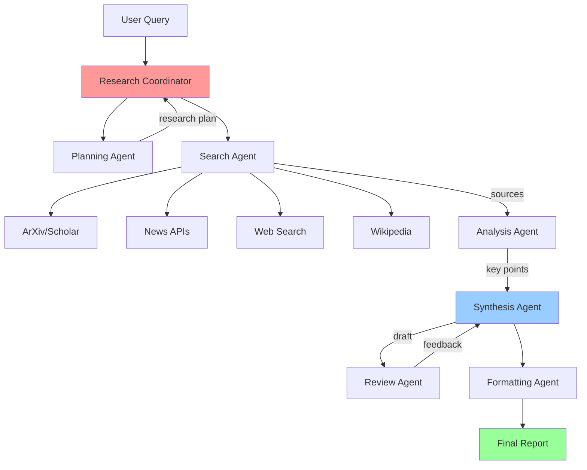

# Final Project: Advanced Research Agent

## Project Overview

Build a production-ready research agent that can autonomously research topics, analyze sources, and produce comprehensive reports with citations.

## Requirements

### Core Features
1. **Multi-Source Research**: Search academic papers, news, Wikipedia, and web
2. **Source Evaluation**: Assess credibility and relevance
3. **Content Analysis**: Extract key information from sources
4. **Synthesis**: Combine findings into coherent report
5. **Citation Management**: Proper attribution and bibliography
6. **Visual Output**: Generate charts and diagrams where appropriate

### Technical Requirements
- Python 3.10+
- Claude or OpenAI API
- LangChain framework
- Vector database for memory
- Structured output format (Markdown/PDF)

## Architecture



## Implementation Guide

### Step 1: Project Structure

```
research_agent/
├── agents/
│   ├── __init__.py
│   ├── planner.py
│   ├── searcher.py
│   ├── analyzer.py
│   ├── synthesizer.py
│   └── reviewer.py
├── tools/
│   ├── __init__.py
│   ├── search_tools.py
│   ├── analysis_tools.py
│   └── formatting_tools.py
├── utils/
│   ├── __init__.py
│   ├── citations.py
│   └── memory.py
├── main.py
├── config.py
└── requirements.txt
```

### Step 2: Core Components

#### Research Coordinator

```python
# main.py
from langchain_anthropic import ChatAnthropic
from langchain.agents import AgentExecutor
from agents.planner import create_planner
from agents.searcher import create_searcher
from agents.synthesizer import create_synthesizer
import json

class ResearchCoordinator:
    def __init__(self):
        self.llm = ChatAnthropic(
            model="claude-3-5-sonnet-20241022",
            temperature=0
        )
        self.planner = create_planner(self.llm)
        self.searcher = create_searcher(self.llm)
        self.synthesizer = create_synthesizer(self.llm)
        self.memory = {}

    def research(self, topic: str, depth: str = "comprehensive") -> dict:
        """
        Conduct research on a topic

        Args:
            topic: Research topic
            depth: "quick", "standard", or "comprehensive"

        Returns:
            dict with report, sources, and metadata
        """
        print(f"🔍 Starting research on: {topic}")

        # Step 1: Plan research strategy
        print("📋 Planning research strategy...")
        plan = self.planner.invoke({
            "input": f"Create research plan for: {topic}\nDepth: {depth}"
        })
        self.memory["plan"] = plan["output"]

        # Step 2: Execute searches
        print("🔎 Searching sources...")
        search_results = self.searcher.invoke({
            "input": f"Execute this research plan:\n{plan['output']}"
        })
        self.memory["sources"] = search_results["output"]

        # Step 3: Synthesize findings
        print("✍️  Synthesizing findings...")
        report = self.synthesizer.invoke({
            "input": f"""Create comprehensive research report:
            Topic: {topic}
            Sources: {search_results['output']}

            Include:
            - Executive summary
            - Key findings
            - Detailed analysis
            - Citations
            - Bibliography
            """
        })

        # Step 4: Format output
        print("📄 Formatting report...")
        final_report = self._format_report(report["output"], topic)

        return {
            "report": final_report,
            "metadata": {
                "topic": topic,
                "depth": depth,
                "sources_count": self._count_sources(),
                "timestamp": self._get_timestamp()
            }
        }

    def _format_report(self, content: str, topic: str) -> str:
        """Format final report with proper structure"""
        header = f"""# Research Report: {topic}
Generated: {self._get_timestamp()}

---

"""
        return header + content

    def _count_sources(self) -> int:
        """Count unique sources used"""
        # Implementation
        return len(self.memory.get("sources", []))

    def _get_timestamp(self) -> str:
        """Get current timestamp"""
        from datetime import datetime
        return datetime.now().strftime("%Y-%m-%d %H:%M:%S")


# Example usage
if __name__ == "__main__":
    coordinator = ResearchCoordinator()

    result = coordinator.research(
        topic="Latest developments in large language models",
        depth="comprehensive"
    )

    # Save report
    with open("research_report.md", "w") as f:
        f.write(result["report"])

    print("\n✅ Research complete!")
    print(f"📊 Sources analyzed: {result['metadata']['sources_count']}")
```

#### Search Tools

```python
# tools/search_tools.py
from langchain.tools import Tool
from langchain_community.utilities import DuckDuckGoSearchAPIWrapper, WikipediaAPIWrapper
import requests
from typing import List, Dict

class SearchTools:
    def __init__(self):
        self.web_search = DuckDuckGoSearchAPIWrapper()
        self.wikipedia = WikipediaAPIWrapper()
        self.sources = []

    def search_arxiv(self, query: str, max_results: int = 5) -> str:
        """Search arXiv for academic papers"""
        import arxiv

        search = arxiv.Search(
            query=query,
            max_results=max_results,
            sort_by=arxiv.SortCriterion.Relevance
        )

        results = []
        for paper in search.results():
            self.sources.append({
                "type": "academic",
                "title": paper.title,
                "authors": [a.name for a in paper.authors],
                "url": paper.entry_id,
                "published": str(paper.published),
                "summary": paper.summary
            })

            results.append(f"""
Title: {paper.title}
Authors: {', '.join([a.name for a in paper.authors])}
Published: {paper.published.year}
URL: {paper.entry_id}
Summary: {paper.summary[:500]}...
""")

        return "\n---\n".join(results)

    def search_news(self, query: str, days: int = 7) -> str:
        """Search recent news articles"""
        # Using NewsAPI (requires API key)
        # For demo, using web search filtered by date
        search_query = f"{query} news last {days} days"
        results = self.web_search.results(search_query, max_results=5)

        formatted = []
        for r in results:
            self.sources.append({
                "type": "news",
                "title": r.get("title", ""),
                "url": r.get("link", ""),
                "snippet": r.get("snippet", "")
            })

            formatted.append(f"""
Title: {r.get('title', '')}
URL: {r.get('link', '')}
Summary: {r.get('snippet', '')}
""")

        return "\n---\n".join(formatted)

    def search_wikipedia(self, query: str) -> str:
        """Search Wikipedia"""
        try:
            result = self.wikipedia.run(query)

            self.sources.append({
                "type": "encyclopedia",
                "title": query,
                "source": "Wikipedia",
                "content": result[:1000]
            })

            return result
        except Exception as e:
            return f"Wikipedia search failed: {str(e)}"

    def evaluate_source_credibility(self, source: dict) -> float:
        """
        Evaluate source credibility (0-1 score)

        Factors:
        - Source type (academic > news > web)
        - Recency
        - Author credentials
        """
        score = 0.5  # Base score

        # Type weighting
        if source["type"] == "academic":
            score += 0.3
        elif source["type"] == "news":
            score += 0.2

        # Recency (if applicable)
        if "published" in source:
            # Increase score for recent sources
            pass

        return min(score, 1.0)

    def get_all_tools(self) -> List[Tool]:
        """Return all search tools"""
        return [
            Tool(
                name="SearchArXiv",
                func=self.search_arxiv,
                description="Search academic papers on arXiv. Use for scientific research."
            ),
            Tool(
                name="SearchNews",
                func=self.search_news,
                description="Search recent news articles. Use for current events."
            ),
            Tool(
                name="SearchWikipedia",
                func=self.search_wikipedia,
                description="Search Wikipedia for general knowledge."
            ),
            Tool(
                name="WebSearch",
                func=self.web_search.run,
                description="General web search. Use for broad information gathering."
            )
        ]
```

#### Analysis Tools

```python
# tools/analysis_tools.py
from langchain.tools import Tool
from typing import List, Dict
import re

class AnalysisTools:
    def __init__(self, llm):
        self.llm = llm

    def extract_key_points(self, text: str, max_points: int = 5) -> List[str]:
        """Extract key points from text using LLM"""
        prompt = f"""Extract the {max_points} most important points from this text:

{text}

Return as a numbered list."""

        response = self.llm.invoke(prompt)

        # Parse numbered list
        points = re.findall(r'\d+\.\s*(.+)', response.content)
        return points[:max_points]

    def summarize_source(self, source: dict) -> str:
        """Create concise summary of a source"""
        content = source.get("content", source.get("summary", ""))

        prompt = f"""Summarize this source in 2-3 sentences:
Title: {source.get('title', 'Unknown')}
Content: {content}

Focus on the main findings and relevance."""

        response = self.llm.invoke(prompt)
        return response.content

    def identify_themes(self, sources: List[dict]) -> List[str]:
        """Identify common themes across sources"""
        all_content = "\n\n".join([
            s.get("content", s.get("summary", ""))
            for s in sources
        ])

        prompt = f"""Identify 3-5 major themes in this research:

{all_content[:5000]}  # Limit for context

Return themes as a list."""

        response = self.llm.invoke(prompt)

        # Parse themes
        themes = re.findall(r'[-•]\s*(.+)', response.content)
        return themes

    def detect_contradictions(self, sources: List[dict]) -> List[dict]:
        """Find contradicting information across sources"""
        # Implementation for detecting conflicts
        pass

    def get_all_tools(self) -> List[Tool]:
        """Return all analysis tools"""
        return [
            Tool(
                name="ExtractKeyPoints",
                func=lambda text: "\n".join(self.extract_key_points(text)),
                description="Extract key points from text"
            ),
            Tool(
                name="IdentifyThemes",
                func=lambda sources: "\n".join(self.identify_themes(sources)),
                description="Identify common themes across sources"
            )
        ]
```

### Step 3: Citation Management

```python
# utils/citations.py
from typing import List, Dict
from datetime import datetime

class CitationManager:
    def __init__(self):
        self.citations = []
        self.citation_count = 0

    def add_citation(self, source: dict) -> int:
        """
        Add a source and return citation number

        Returns:
            int: Citation number to use in text [1], [2], etc.
        """
        self.citation_count += 1
        citation = {
            "number": self.citation_count,
            "type": source.get("type", "web"),
            "title": source.get("title", "Unknown"),
            "authors": source.get("authors", []),
            "url": source.get("url", ""),
            "published": source.get("published", ""),
            "accessed": datetime.now().strftime("%Y-%m-%d")
        }
        self.citations.append(citation)
        return self.citation_count

    def format_inline_citation(self, citation_number: int) -> str:
        """Format inline citation [1]"""
        return f"[{citation_number}]"

    def generate_bibliography(self, style: str = "apa") -> str:
        """
        Generate bibliography in specified style

        Args:
            style: "apa", "mla", or "chicago"
        """
        if style == "apa":
            return self._format_apa()
        elif style == "mla":
            return self._format_mla()
        else:
            return self._format_apa()  # Default

    def _format_apa(self) -> str:
        """Format bibliography in APA style"""
        bib = ["## References\n"]

        for cite in sorted(self.citations, key=lambda x: x["number"]):
            if cite["type"] == "academic":
                # Author, A. A. (Year). Title. Source. URL
                authors = ", ".join(cite["authors"][:3])  # Max 3 authors
                if len(cite["authors"]) > 3:
                    authors += ", et al."

                year = cite["published"][:4] if cite["published"] else "n.d."

                entry = f"{cite['number']}. {authors} ({year}). {cite['title']}. Retrieved from {cite['url']}"

            else:
                # General web source
                entry = f"{cite['number']}. {cite['title']}. Retrieved {cite['accessed']} from {cite['url']}"

            bib.append(entry)

        return "\n\n".join(bib)

    def _format_mla(self) -> str:
        """Format bibliography in MLA style"""
        # Implementation
        pass
```

### Step 4: Main Agent

```python
# agents/synthesizer.py
from langchain.agents import create_react_agent, AgentExecutor
from langchain import hub
from langchain.tools import Tool

def create_synthesizer(llm):
    """Create synthesis agent"""

    def synthesize_findings(sources: str) -> str:
        """Synthesize research findings into report"""
        prompt = f"""You are a research analyst. Synthesize these findings into a comprehensive report:

{sources}

Structure:
1. Executive Summary (2-3 paragraphs)
2. Key Findings (bullet points)
3. Detailed Analysis (multiple sections)
4. Conclusions
5. Implications

Use proper citations [1], [2], etc."""

        response = llm.invoke(prompt)
        return response.content

    tools = [
        Tool(
            name="SynthesizeFindings",
            func=synthesize_findings,
            description="Synthesize research findings into comprehensive report"
        )
    ]

    prompt = hub.pull("hwchase17/react")
    agent = create_react_agent(llm, tools, prompt)

    return AgentExecutor(agent=agent, tools=tools, verbose=True)
```

## Testing

```python
# tests/test_research_agent.py
import unittest
from main import ResearchCoordinator

class TestResearchAgent(unittest.TestCase):
    def setUp(self):
        self.agent = ResearchCoordinator()

    def test_quick_research(self):
        """Test quick research mode"""
        result = self.agent.research(
            "Python programming",
            depth="quick"
        )
        self.assertIn("report", result)
        self.assertIn("metadata", result)

    def test_comprehensive_research(self):
        """Test comprehensive research"""
        result = self.agent.research(
            "Machine learning basics",
            depth="comprehensive"
        )
        self.assertGreater(result["metadata"]["sources_count"], 5)

    def test_citation_management(self):
        """Test that citations are properly managed"""
        result = self.agent.research("AI ethics", depth="standard")
        report = result["report"]

        # Should contain citations
        self.assertRegex(report, r'\[\d+\]')

        # Should contain bibliography
        self.assertIn("References", report)

if __name__ == "__main__":
    unittest.main()
```

## Evaluation Criteria

Your project will be evaluated on:

1. **Functionality** (40%)
   - All core features implemented
   - Agents work correctly
   - Error handling

2. **Code Quality** (25%)
   - Clean, readable code
   - Proper documentation
   - Type hints
   - Testing

3. **Research Quality** (20%)
   - Diverse sources
   - Accurate citations
   - Coherent synthesis

4. **Innovation** (15%)
   - Creative features
   - Performance optimizations
   - User experience

## Bonus Features

Add these for extra credit:

1. **Visual Analytics**: Generate charts from data
2. **Interactive Mode**: CLI for iterative research
3. **Export Formats**: PDF, HTML, LaTeX
4. **Fact Checking**: Verify claims across sources
5. **Collaboration**: Multi-user research sessions

## Submission

Submit:
1. Complete source code
2. README with setup instructions
3. Example research report
4. Test coverage report
5. (Optional) Demo video

## Navigation
- Previous: [Exercises](03_exercises.md)
- Next: [Assessment](05_assessment.md)
- [Back to Module Overview](README.md)
