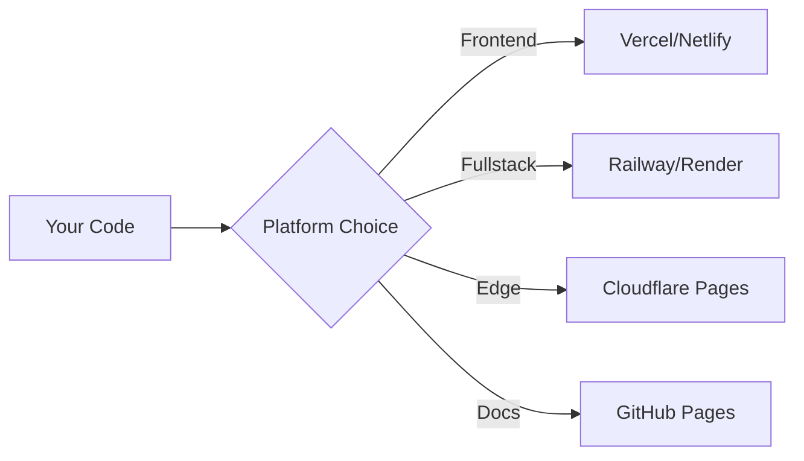

# Introduction to Modern Publishing & Deployment

> **Workshop Duration:** 3 hours
> **Difficulty:** 🟡 Intermediate
> **Last Updated:** December 2025

## Welcome to Publishing & Deployment Mastery

In this afternoon session, you'll learn how to take your applications from local development to production-ready deployments on modern cloud platforms. We'll explore automated workflows, continuous deployment, and documentation publishing strategies that professional development teams use in 2025.

---

## What You'll Build Today

By the end of this session, you will have:

1. **Automated Deployment Pipeline**
   - GitHub Actions workflows for CI/CD
   - Multi-environment deployments (staging, production)
   - Preview deployments for pull requests

2. **Production Deployments**
   - Deploy React app to Vercel
   - Deploy API to Railway/Render
   - Configure custom domains and SSL

3. **Documentation Site**
   - Build docs with MkDocs Material or Docusaurus
   - Component documentation with Storybook
   - API documentation with OpenAPI/Swagger

---

## Why This Matters

### Modern Development Reality

In 2025, deployment is no longer a manual, error-prone process. Professional teams expect:

- **Instant Previews**: Every pull request gets its own live preview URL
- **Automated Testing**: Code is tested before it reaches production
- **Zero-Downtime Deployments**: Users never experience interruptions
- **Comprehensive Documentation**: Both code and APIs are self-documenting

### Industry Standards

The tools and practices you'll learn today are used by companies like:

- **Vercel**: Edge-first deployment for Next.js and React
- **Netlify**: JAMstack pioneers with instant rollbacks
- **GitHub**: Actions-powered CI/CD for millions of projects
- **Cloudflare**: Edge computing and Pages deployment

---

## Session Overview

### Part 1: Deployment Platforms (60 minutes)

Learn the top deployment platforms and when to use each:

### Part 2: GitHub Actions CI/CD (60 minutes)

Build automated workflows that:
- Run tests on every push
- Deploy on merge to main
- Create preview deployments for PRs
- Publish documentation automatically

### Part 3: Documentation Publishing (60 minutes)

Create professional documentation sites:
- Component libraries with Storybook
- API documentation with OpenAPI
- User guides with MkDocs Material
- Interactive examples with Docusaurus

---

## Real-World Application

### Scenario: Launching a SaaS Product

You've built an AI-powered task manager. Now you need to:

1. **Deploy the frontend** to Vercel with automatic HTTPS
2. **Deploy the API** to Railway with environment variables
3. **Publish documentation** for your REST API
4. **Create component docs** for your design system
5. **Set up preview deployments** so stakeholders can review features

By the end of today, you'll be able to do all of this **in minutes, not days**.

---

## Prerequisites Check

Before we begin, ensure you have:

- ✅ GitHub account with a test repository
- ✅ Node.js 18+ installed (`node --version`)
- ✅ Git configured locally
- ✅ Code editor (VS Code recommended)
- ✅ Free accounts on deployment platforms (we'll create these together)

---

## Learning Approach

This is a **hands-on workshop**. You'll:

1. **Follow Along**: Deploy real applications step-by-step
2. **Experiment**: Modify workflows and see instant results
3. **Troubleshoot**: Learn common issues and how to fix them
4. **Apply**: Use these skills on your own projects

> **💡 Pro Tip:** Keep a deployment log of what you try today. You'll reference it constantly in future projects.

---

## What Makes 2025 Different?

If you learned deployment 3-5 years ago, here's what's changed:

| Old Way (2020) | Modern Way (2025) |
|----------------|-------------------|
| Manual FTP uploads | Git-based deployments |
| Single production environment | Multi-environment (staging, preview, prod) |
| Manual SSL certificates | Automatic HTTPS everywhere |
| Separate CI/CD tools | GitHub Actions built-in |
| Static docs only | Interactive, searchable docs sites |

---

## Success Metrics

By the end of this session, you should be able to:

- [ ] Deploy a React app to production in under 5 minutes
- [ ] Set up a GitHub Actions workflow from scratch
- [ ] Configure environment variables securely
- [ ] Create preview deployments for pull requests
- [ ] Publish documentation that updates automatically
- [ ] Troubleshoot deployment failures using logs

---

## Let's Get Started!

Ready to make your projects production-ready? Let's dive into the exciting world of modern deployment and publishing.

**Next:** [01_concepts.md](01_concepts.md) - Understanding Deployment Platforms

---

## Quick Reference

### Key Platforms We'll Use
- **Vercel**: React/Next.js deployment
- **Railway**: Backend API deployment
- **GitHub Actions**: CI/CD automation
- **MkDocs Material**: Documentation sites

### Important Links
- [Vercel Dashboard](https://vercel.com/dashboard)
- [Railway Dashboard](https://railway.app/dashboard)
- [GitHub Actions Marketplace](https://github.com/marketplace?type=actions)
- [Docusaurus Site](https://docusaurus.io)

---

*Let's ship to production!* 🚀
