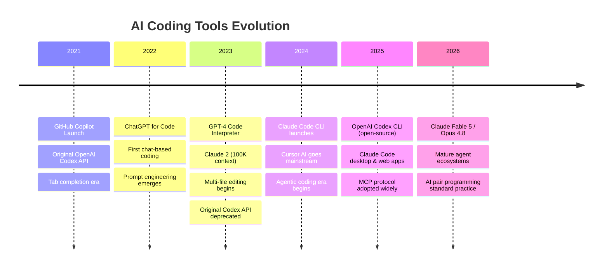
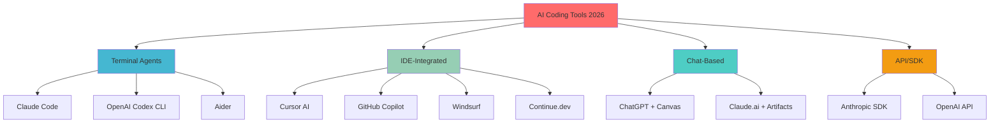
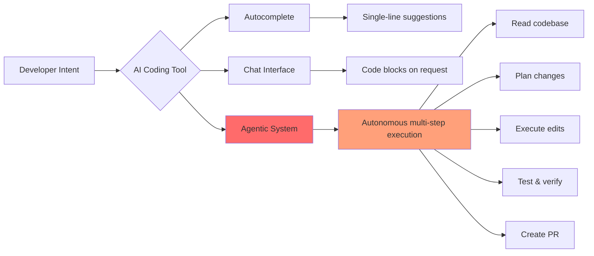
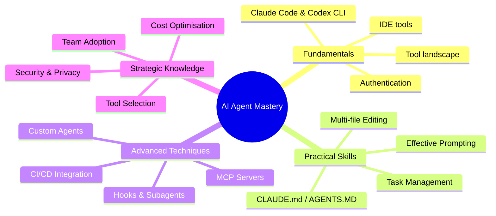
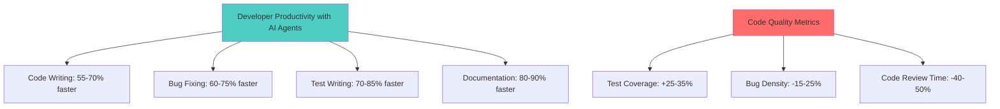

# Chapter 0: Introduction to AI-Powered Software Engineering

> **June 2026:** AI coding assistants have evolved from autocomplete tools to autonomous agentic systems. Two terminal-based agents — Claude Code and OpenAI Codex CLI — now lead the field, alongside IDE-integrated tools like Cursor and GitHub Copilot.

## The AI Coding Revolution

Software development is experiencing its most significant transformation since the introduction of high-level programming languages. AI-powered code generation, once a research curiosity, has become a production-ready technology reshaping how we build software.

### The Evolution Timeline

## The 2026 Landscape: Four Categories of AI Coding Tools

The modern AI coding ecosystem has settled into four distinct categories, each optimised for different workflows:

### 1. Terminal-Based Coding Agents

These are standalone tools that operate directly in your terminal, reading your codebase, executing commands, and making changes autonomously.

**Claude Code** (Anthropic) — The most feature-rich terminal agent, powered by Claude Opus by default. Available as a CLI tool, desktop app, web app, and IDE extensions. Its unique features include CLAUDE.md project configuration, Model Context Protocol (MCP) for tool integration, a hooks system for automation, subagents for parallel work, and an Agent SDK for building custom agents.

**OpenAI Codex CLI** — An open-source terminal agent (github.com/openai/codex) that brings agentic coding to the command line with sandboxed execution and AGENTS.MD project files. Supports multiple model providers.

**Aider** — A free, open-source, Git-native terminal tool focused on efficient token usage and automatic commits.

### 2. IDE-Integrated Tools

**Cursor AI** — A VS Code fork with deep AI integration. Its Composer feature enables multi-file editing through natural language. From $20/mo.

**GitHub Copilot** — Inline suggestions plus chat plus Copilot Workspace for multi-file planning and implementation. From $10/mo; free for students and open-source contributors.

**Windsurf** (formerly Codeium) — Flow-state coding with Cascade multi-file editing. From $10-15/mo.

**Continue.dev** — Free, open-source VS Code/JetBrains extension supporting multiple model providers.

### 3. Chat-Based Coding

**ChatGPT** — GPT-4o and o3 models via chat.openai.com, with Canvas mode for interactive code editing.

**Claude.ai** — Web-based access to Claude models with Artifacts for interactive code.

### 4. API/SDK Access

**Anthropic SDK** — Python (`anthropic`) and TypeScript (`@anthropic-ai/sdk`) libraries for building custom AI coding tools with tool use, prompt caching, and streaming.

**OpenAI API** — Programmatic access to GPT-4o, o3, and other models for custom integrations.

### The Modern AI Coding Ecosystem (2026)

### From Autocomplete to Agentic Coding

The transformation from simple autocomplete to autonomous agents represents a fundamental shift in how AI assists developers:

| Generation | Era | Capability | Example Tools |
|------------|-----|------------|---------------|
| **1.0** | Tab Completion (2021) | Single-line suggestions | GitHub Copilot, Tabnine |
| **2.0** | Chat-Based (2022-23) | Multi-line code blocks | ChatGPT, Claude |
| **3.0** | Multi-File (2023-24) | Cross-file editing | Cursor, early Claude Code |
| **4.0** | Agentic (2024-26) | Autonomous task execution | Claude Code, Codex CLI |

## Core Capabilities of Modern AI Coding Agents

### 1. Multi-File Code Generation
   - Scaffold entire projects from natural language descriptions
   - Maintain consistency across dozens of interconnected files
   - Understand architectural patterns and best practices

### 2. Intelligent Refactoring
   - Analyse codebases for improvement opportunities
   - Apply refactoring patterns safely across multiple files
   - Update dependencies and fix breaking changes

### 3. Bug Detection and Repair
   - Identify logic errors, security vulnerabilities, and performance issues
   - Propose fixes with explanations
   - Generate comprehensive test cases

### 4. Code Review and Documentation
   - Review pull requests with detailed feedback
   - Generate documentation from code
   - Explain complex algorithms in plain language

### 5. Test Generation
   - Create unit, integration, and end-to-end tests
   - Achieve high code coverage automatically
   - Generate test data and mocks

### Major Players Comparison (June 2026)

| Tool | Type | Best For | Key Strength | Pricing |
|------|------|----------|--------------|---------|
| **Claude Code** | Terminal agent | Full agentic workflows | CLAUDE.md, MCP, hooks, subagents | API usage (check console.anthropic.com) |
| **OpenAI Codex CLI** | Terminal agent (OSS) | Open-source, sandboxed | AGENTS.MD, multi-provider | API usage (check platform.openai.com) |
| **Cursor AI** | IDE fork | IDE-native experience | Composer, fast inline edits | From $20/mo |
| **GitHub Copilot** | IDE extension | GitHub integration | Workspace, enterprise features | From $10/mo |
| **ChatGPT (o3)** | Chat | Complex reasoning | Deep thinking, web access | $20-200/mo |
| **Windsurf** | IDE fork | Flow state coding | Cascade multi-file editing | From $10-15/mo |
| **Aider** | Terminal (OSS) | Git-native CLI | Efficient tokens, auto-commits | API usage only |
| **Continue.dev** | IDE extension (OSS) | Privacy, self-hosted | Model agnostic, free | Free |

### Architecture Patterns

## Who Should Use This Guide?

### Primary Audiences

1. **Software Engineers (All Levels)**
   - Junior developers seeking to accelerate learning
   - Mid-level engineers improving productivity
   - Senior engineers exploring AI-assisted architecture

2. **Technical Leaders**
   - Engineering managers evaluating AI tools
   - CTOs making strategic technology decisions
   - Team leads implementing AI workflows

3. **Specialised Developers**
   - Full-stack developers managing complexity
   - DevOps engineers automating infrastructure
   - Data scientists building ML pipelines
   - Mobile developers across platforms

### What You Will Master

### Learning Outcomes

By completing this workshop, you will be able to:

1. **Setup & Configure** — Get Claude Code and Codex CLI running with proper project configuration
2. **Prompt Effectively** — Craft prompts that generate production-quality code
3. **Configure Projects** — Write CLAUDE.md and AGENTS.MD files that guide agent behaviour
4. **Manage Tasks** — Break down complex projects into AI-executable tasks
5. **Review & Iterate** — Critically evaluate AI-generated code
6. **Compare Tools** — Make informed decisions between agents and alternatives
7. **Scale Adoption** — Roll out AI coding tools across teams

## The Agentic Mindset

Using modern AI coding tools requires a shift in how you think about development:

### Traditional vs. Agentic Approach

| Traditional Coding | Agentic Coding |
|-------------------|----------------|
| Write code line by line | Describe desired outcome |
| Manual file navigation | AI navigates codebase |
| Incremental refactoring | Wholesale transformations |
| Manual test writing | Automated test generation |
| Individual contributor | Human-AI team |

### The Delegation Framework

Think of AI coding agents as highly capable but contextually limited team members who:

- Excel at pattern recognition and boilerplate
- Never get tired of repetitive tasks
- Can process massive codebases instantly
- Need clear instructions and context (CLAUDE.md, AGENTS.MD)
- Require review and validation
- May miss subtle business logic

## Real-World Impact Metrics

### Productivity Gains (Industry Data, 2025-2026)

## What This Guide Covers

### Comprehensive Chapter Overview

1. **Chapter 1: The AI Coding Ecosystem** — Claude Code, Codex CLI, IDE tools, and how they compare
2. **Chapter 2: Getting Started** — Setup, authentication, and first steps
3. **Chapter 3: Mastering AI Agents** — Prompting, CLAUDE.md/AGENTS.MD, task management
4. **Chapter 4: Practical Applications** — 50+ real-world examples
5. **Chapter 5: Broader Landscape** — Model comparison, tool selection, future trends
6. **Chapter 6: Challenges** — Limitations, security, ethics
7. **Chapter 7: Best Practices** — Expert insights and proven patterns
8. **Chapter 8: Future Outlook** — Emerging trends and what is next

### Hands-On Exercises

Each chapter includes:

- **Code Examples** — Copy-paste ready snippets for Claude Code and Codex CLI
- **Practice Tasks** — Structured exercises with solutions
- **Comparison Tables** — Quick reference guides
- **Architecture Diagrams** — Visual understanding of concepts
- **Pro Tips** — Expert insights from real usage

## The Future is Agentic

As we move through 2026, the trend is clear: AI coding tools are becoming more autonomous, more capable, and more integrated into every aspect of software development. The developers who master these tools today will define how software is built tomorrow.

---

## Quick Start Checklist

Before diving into Chapter 1, ensure you have:

- [ ] An Anthropic account (console.anthropic.com) or OpenAI account (platform.openai.com)
- [ ] Node.js 22+ installed (for CLI tools)
- [ ] Basic understanding of Git and command-line tools
- [ ] Code editor installed (VS Code recommended)
- [ ] Open mind about AI-assisted development
- [ ] Willingness to experiment and iterate

---

**Next:** [Chapter 1: Understanding the AI Coding Ecosystem](./01_understanding_the_codex_ecosystem.md)

---

*Last Updated: June 2026 | Claude Code (Fable 5, Opus 4.8, Sonnet 4.6) | OpenAI Codex CLI | Comprehensive AI Coding Agent Guide*
