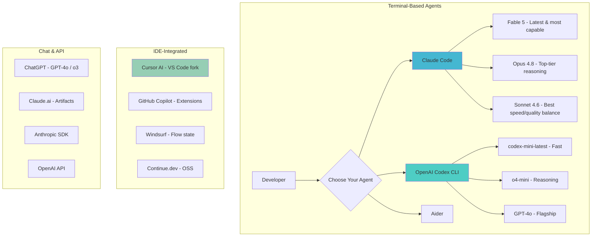
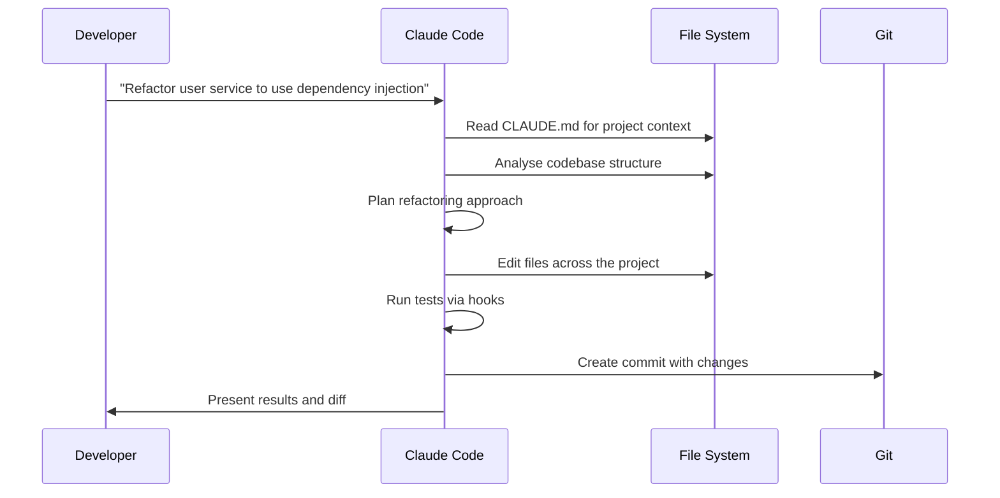
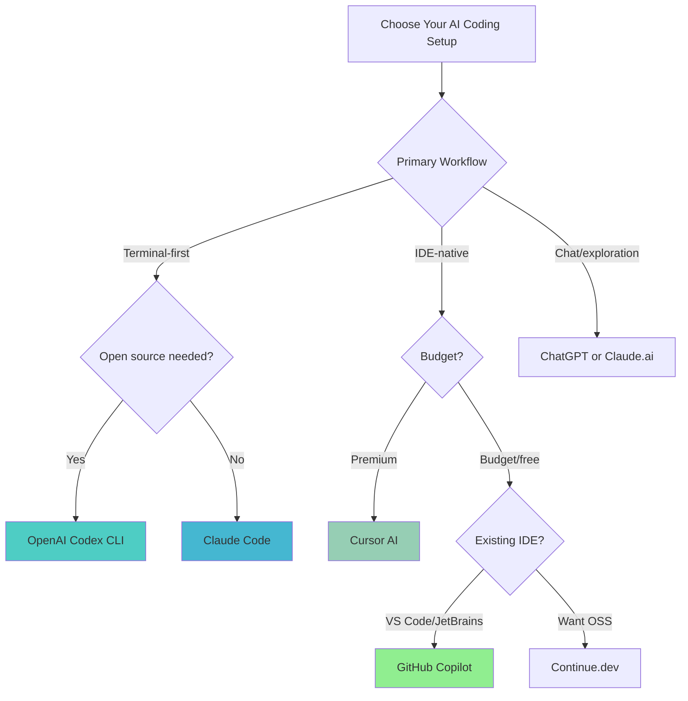

# Chapter 1: Understanding the Modern AI Coding Ecosystem

> **June 2026:** The AI coding landscape is no longer centred on a single tool. Two terminal-based agents — Claude Code and OpenAI Codex CLI — lead the agentic coding category, while Cursor, Copilot, and a rich open-source ecosystem serve different workflows. This chapter maps the full landscape and explains what makes each tool distinctive.

## The 2026 AI Coding Landscape


```mermaid
graph TB
    subgraph "Terminal-Based Agents"
        A[Developer] --> B{Choose Your Agent}

        B --> C[Claude Code]
        B --> D[OpenAI Codex CLI]
        B --> E[Aider]

        C --> F[Fable 5 - Latest & most capable]
        C --> G[Opus 4.8 - Top-tier reasoning]
        C --> H[Sonnet 4.6 - Best speed/quality balance]

        D --> I[codex-mini-latest - Fast]
        D --> J[o4-mini - Reasoning]
        D --> K[GPT-4o - Flagship]
    end

    subgraph "IDE-Integrated"
        L[Cursor AI - VS Code fork]
        M[GitHub Copilot - Extensions]
        N[Windsurf - Flow state]
        O[Continue.dev - OSS]
    end

    subgraph "Chat & API"
        P[ChatGPT - GPT-4o / o3]
        Q[Claude.ai - Artifacts]
        R[Anthropic SDK]
        S[OpenAI API]
    end

    style C fill:#45b7d1
    style D fill:#4ecdc4
    style L fill:#96ceb4
```

## A. Claude Code — Anthropic's Agentic Coding Tool

Claude Code is the most feature-rich terminal-based coding agent available in 2026. It is a standalone tool — not an IDE extension — that runs in your terminal and operates directly on your codebase.

### Installation & Access

```bash
# Install the CLI globally
npm install -g @anthropic-ai/claude-code

# Start Claude Code in your project directory
cd ~/projects/my-app
claude

# Claude Code is also available as:
# - Desktop app (Mac and Windows)
# - Web app at claude.ai/code
# - VS Code extension (runs inside terminal panel)
# - JetBrains extension
```

### Key Features

| Feature | Description | Benefit |
|---------|-------------|---------|
| **CLAUDE.md** | Project configuration file read at startup | Persistent project context, coding standards, and instructions |
| **MCP Servers** | Model Context Protocol for tool integration | Connect to databases, APIs, browsers, and custom tools |
| **Hooks System** | Pre/post hooks for automation | Run linters, tests, or custom scripts automatically |
| **Subagents** | Spawn parallel child agents | Tackle multiple tasks simultaneously |
| **Slash Commands** | Built-in commands like `/fast`, `/compact` | Quick mode switching and workflow control |
| **Agent SDK** | Build custom agents programmatically | Create specialised coding workflows |
| **200K Context** | Large context window | Handle large codebases and long sessions |
| **Git-Native** | Full Git integration | Create commits, branches, and PRs directly |

### Claude Code Models (June 2026)

| Model | ID | Use Case |
|-------|-----|----------|
| **Fable 5** | `claude-fable-5` | Latest and most capable — best for complex architecture and novel problems |
| **Opus 4.8** | `claude-opus-4-8` | Top-tier reasoning — default for Claude Code |
| **Sonnet 4.6** | `claude-sonnet-4-6` | Best balance of speed, quality, and cost — use via `/fast` |
| **Haiku 4.5** | `claude-haiku-4-5-20251001` | Fastest and cheapest — good for simple tasks and high-volume operations |

### Claude Code Workflow Example


```mermaid
sequenceDiagram
    participant Dev as Developer
    participant CC as Claude Code
    participant FS as File System
    participant Git as Git

    Dev->>CC: "Refactor user service to use dependency injection"
    CC->>FS: Read CLAUDE.md for project context
    CC->>FS: Analyse codebase structure
    CC->>CC: Plan refactoring approach
    CC->>FS: Edit files across the project
    CC->>CC: Run tests via hooks
    CC->>Git: Create commit with changes
    CC->>Dev: Present results and diff
```

### What Makes Claude Code Unique

**CLAUDE.md** — A markdown file at your project root that Claude Code reads every time it starts. It contains project-specific instructions: tech stack, coding conventions, testing procedures, forbidden actions, and architectural decisions. Unlike a README, it is specifically tailored for the AI agent, not human readers.

**MCP (Model Context Protocol)** — An open standard that lets Claude Code connect to external tools. You can configure MCP servers for databases, browser automation, Slack, GitHub, or any custom API. This transforms Claude Code from a code editor into a general-purpose development agent.

**Hooks** — Automated actions triggered before or after specific events. For example: run ESLint after every edit, execute tests before committing, or send notifications when a task completes.

**Subagents** — Claude Code can spawn child agents that work in parallel. You can delegate independent subtasks to subagents while continuing to work on the main task.

### When to Use Claude Code

**Ideal For:**
- Complex, multi-file refactoring and feature implementation
- Projects requiring deep codebase understanding
- Teams wanting consistent, configurable AI behaviour (via CLAUDE.md)
- Workflows requiring tool integration (MCP)
- Developers who prefer terminal-first workflows
- Building custom AI agents (Agent SDK)

**Less Ideal For:**
- Quick inline completions while typing (use Copilot/Cursor instead)
- Teams that need fully offline operation

## B. OpenAI Codex CLI — Open-Source Terminal Agent

The OpenAI Codex CLI is an open-source coding agent that brings agentic capabilities to the terminal. Released in 2025, it emphasises sandboxed execution and supports multiple model providers.

### Installation & Setup

```bash
# Install via npm
npm install -g @openai/codex

# Set your API key
export OPENAI_API_KEY="your-api-key-here"

# Start Codex CLI in your project
cd ~/projects/my-app
codex

# Or provide a direct prompt
codex "Add user authentication with JWT tokens"
```

### Key Features

| Feature | Details | Use Case |
|---------|---------|----------|
| **Open Source** | Full source on GitHub | Audit, fork, contribute |
| **Sandboxed Execution** | Docker/Seatbelt isolation | Safe autonomous execution |
| **AGENTS.MD Support** | Project context files | Consistent agent behaviour |
| **Multi-Provider** | OpenAI, Anthropic, Azure, Ollama | Flexible model choice |
| **Model Selection** | `--model` flag | Optimise for cost or capability |
| **Multimodal Input** | Screenshots, diagrams | Visual task specification |
| **Git-Native** | Direct repository interaction | Commit, branch, PR workflow |

### Codex CLI Approval Modes

```bash
# Suggest mode (default) — safest, shows changes for approval
codex --approval-mode suggest "Fix the login bug"

# Auto-edit — reads files and applies patches automatically
codex --approval-mode auto-edit "Refactor to TypeScript"

# Full-auto — reads, writes, and executes commands (sandboxed)
codex --approval-mode full-auto "Add comprehensive test suite"
```

### When to Use Codex CLI

**Ideal For:**
- Open-source projects wanting an auditable AI agent
- Teams using multiple model providers
- Privacy-sensitive environments needing sandboxed execution
- Developers who want to contribute to the tool itself
- CI/CD pipeline integration
- Terminal-first workflows

**Less Ideal For:**
- Workflows requiring deep tool integration (Claude Code's MCP is more mature)
- Teams wanting a full desktop/web app experience

## C. IDE-Integrated Tools

### Cursor AI

A VS Code fork with deep AI integration. Its standout feature is **Composer** — a multi-file editing interface that lets you describe changes in natural language and see them applied across your project.

```
Key Features:
- Composer for multi-file natural language editing
- Tab completion with inline suggestions
- Chat sidebar for questions and explanations
- Agent mode for autonomous task execution
- Supports Claude and GPT models as backend
```

### GitHub Copilot

The most widely adopted AI coding tool, integrated directly into VS Code and JetBrains. In 2026, it offers:

```
Key Features:
- Inline suggestions (the original tab-completion experience)
- Copilot Chat for questions and explanations
- Copilot Workspace for multi-file planning and implementation
- Enterprise features: SSO, policy controls, code referencing
- Free tier for students and open-source maintainers
```

### Windsurf (formerly Codeium)

Focuses on "flow state" coding with its Cascade feature for multi-file editing.

### Continue.dev

Free, open-source extension for VS Code and JetBrains. Connects to any model provider (OpenAI, Anthropic, Ollama, etc.). Ideal for teams wanting full control over their AI coding setup.

## D. Choosing the Right Tool

### Comprehensive Comparison Matrix

| Feature | Claude Code | Codex CLI | Cursor | Copilot |
|---------|-------------|-----------|--------|---------|
| **Interface** | Terminal + desktop + web | Terminal | IDE (VS Code fork) | IDE extension |
| **Open Source** | No | Yes | No | No |
| **Project Config** | CLAUDE.md | AGENTS.MD | .cursorrules | - |
| **Tool Integration** | MCP servers | Limited | Built-in | GitHub ecosystem |
| **Multi-File Editing** | Excellent | Excellent | Excellent (Composer) | Good (Workspace) |
| **Inline Completion** | No (use with Copilot) | No | Yes | Yes |
| **Sandboxing** | OS-level | Docker/Seatbelt | N/A | N/A |
| **Subagents** | Yes | No | No | No |
| **Hooks/Automation** | Yes (hooks system) | CI/CD integration | No | GitHub Actions |
| **Custom Agents** | Agent SDK | Fork the source | No | No |
| **Context Window** | 200K tokens | 128K tokens | Model-dependent | Model-dependent |
| **Offline Support** | No | Limited | No | Limited |
| **Mobile Access** | Yes (web app) | No | No | GitHub Mobile |

### Decision Framework


```mermaid
graph TD
    A[Choose Your AI Coding Setup] --> B{Primary Workflow}

    B -->|Terminal-first| C{Open source needed?}
    B -->|IDE-native| D{Budget?}
    B -->|Chat/exploration| E[ChatGPT or Claude.ai]

    C -->|Yes| F[OpenAI Codex CLI]
    C -->|No| G[Claude Code]

    D -->|Premium| H[Cursor AI]
    D -->|Budget/free| I{Existing IDE?}

    I -->|VS Code/JetBrains| J[GitHub Copilot]
    I -->|Want OSS| K[Continue.dev]

    style G fill:#45b7d1
    style F fill:#4ecdc4
    style H fill:#96ceb4
    style J fill:#90EE90
```

### Recommended Combinations

Many developers use multiple tools together. Common pairings:

**1. Claude Code + GitHub Copilot** (Most popular)
```yaml
Workflow:
  - Copilot for inline completions while typing
  - Claude Code for complex multi-file tasks, refactoring, and architecture
  - CLAUDE.md ensures consistent behaviour across sessions
```

**2. Codex CLI + Cursor** (Open-source focused)
```yaml
Workflow:
  - Cursor for IDE-native editing with Composer
  - Codex CLI for terminal automation and CI/CD
  - AGENTS.MD shared between both tools
```

**3. Claude Code + Cursor** (Maximum capability)
```yaml
Workflow:
  - Cursor for quick inline edits and visual feedback
  - Claude Code for deep refactoring, MCP tool integration, and agent workflows
  - Both share the same codebase context
```

### Recommended Workflows by Persona

**1. Junior Developer (Learning AI Coding)**
```yaml
Start With: ChatGPT or Claude.ai (web)
Then Add: GitHub Copilot (free for students)
Graduate To: Claude Code or Codex CLI
Monthly Cost: $0-20
```

**2. Professional Developer (Individual Contributor)**
```yaml
Primary: Claude Code (terminal agent)
Secondary: GitHub Copilot (inline completions)
Monthly Cost: API usage + $10/mo
```

**3. Engineering Team (5-10 Members)**
```yaml
Standardise: Claude Code with shared CLAUDE.md templates
Supplement: Copilot Enterprise or Cursor Business
Monthly Cost: API usage + $10-20/developer
```

**4. Enterprise (50+ Developers)**
```yaml
Evaluate: Claude Code (Agent SDK for custom workflows)
Governance: Centralised CLAUDE.md templates, usage monitoring
Integration: MCP servers for internal tools
Monthly Cost: Custom (volume API pricing + tool subscriptions)
```

## Next Steps

Now that you understand the AI coding ecosystem:

1. Choose your primary tool (Claude Code or Codex CLI recommended for this workshop)
2. Set up authentication and configuration
3. Practice with hands-on examples

The best approach is often to start with one terminal agent and one IDE tool, then expand as you discover your preferred workflow.

---

**Next:** [Chapter 2: Getting Started](./02_getting_started.md)

---

*Last Updated: June 2026 | Claude Code + OpenAI Codex CLI + Cursor + Copilot*
