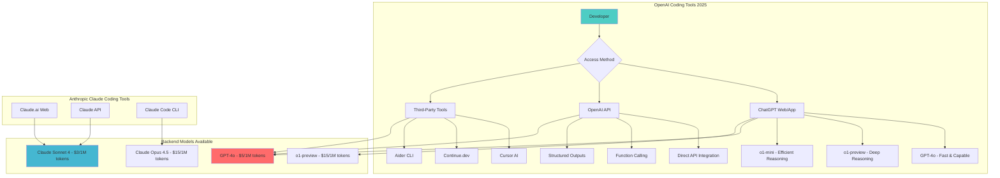
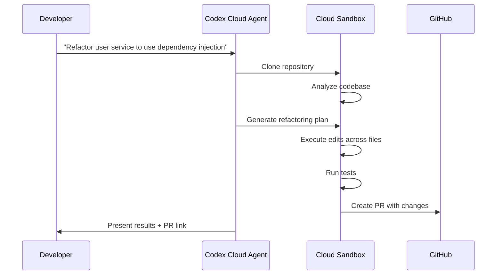
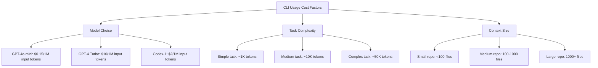
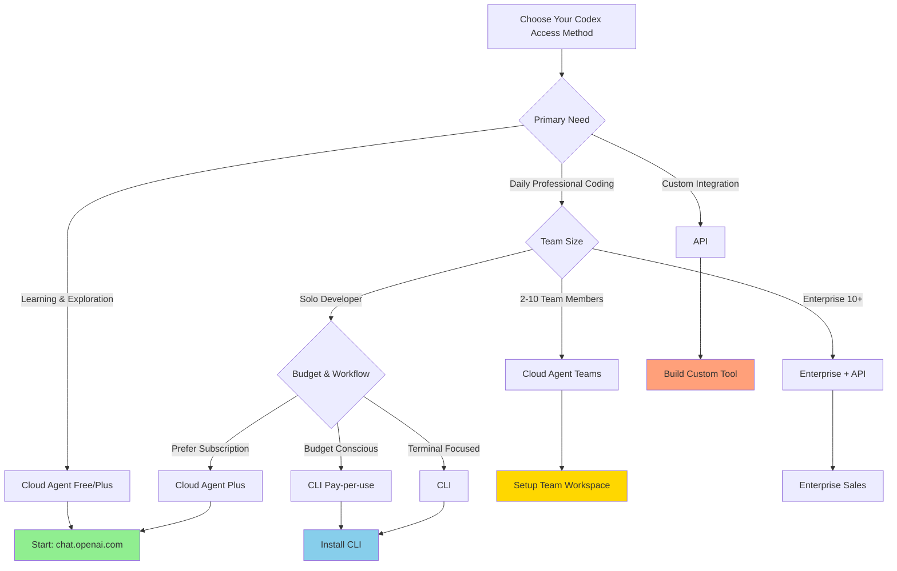

# Chapter 1: Understanding the Modern AI Coding Ecosystem

> **2025 Reality Check:** The original OpenAI Codex API was sunset in March 2023. This chapter covers the modern successor tools: ChatGPT with GPT-4o/o1, Claude Code CLI, and the broader ecosystem of AI coding assistants that have evolved to fill this space.

## The 2025 AI Coding Landscape

The modern AI coding ecosystem is no longer centered on a single "Codex" API but rather distributed across multiple tools and platforms, each optimized for different workflows:



As Josh from OpenAI mentioned in the workshop, the form factor is a key consideration:

> "I remember actually you know In our interview we ripped on the form factor right should it be CLI the issues with that waiting for it to finish and not be able to interrupt all the time wanting to run it four times 10 times in parallel um and you know at that point I said maybe it should be both and we sort of are you know going for that right now..."

## A. ChatGPT with Code Capabilities (2025)

**Important:** There is no longer a separate "Codex Cloud Agent." Instead, ChatGPT (web and mobile) offers robust coding capabilities through GPT-4o and o1 models:

- **GPT-4o**: Fast, capable general-purpose model excellent for coding tasks
- **o1-preview**: Deep reasoning model for complex algorithmic problems
- **o1-mini**: Cost-effective reasoning for coding challenges
- **Canvas Mode**: Interactive code editing environment (similar to Claude's Artifacts)

These models are accessed through chat.openai.com with a ChatGPT Plus ($20/mo) or Pro ($200/mo) subscription.

Alexander from OpenAI elaborated on the vision for this agent:

> "...this is an agent that is good at like independent software engineering work and like the more we lent into that the more like things started to feel really special... we don't just want it to be good at code and like we don't just want it to like solve like say like SWEBench tasks... we spent a lot of time like making sure that our model is like great at adhering to instructions uh great at inferring code style so that you don't have to tell it."

### Key Features (2024-2025)

| Feature | Description | Benefit |
|---------|-------------|---------|
| **Isolated Cloud Sandbox** | Each task runs in dedicated micro-VM | Safe, reproducible execution |
| **128K Context Window** | ~300 pages of code | Handle large codebases |
| **Multi-File Editing** | Up to 20 files simultaneously | Complex refactoring |
| **Git Integration** | Commit, branch, PR creation | Seamless version control |
| **Real-time Monitoring** | Live progress, logs, diffs | Transparency and control |
| **Canvas Mode** | Interactive code editing | Visual feedback |
| **Voice Input** | Speak your coding tasks | Hands-free operation |

### Cloud Agent Workflow Example



### When to Use Cloud Agent

✅ **Ideal For:**
- Complex, multi-file refactoring
- Learning and experimentation
- Collaborative coding sessions
- Mobile development (via ChatGPT app)
- Teams needing shared context
- PR generation and review

❌ **Not Ideal For:**
- High-frequency automated tasks (cost)
- Strict on-premise requirements
- Low-latency needs (<1 second)
- Direct IDE integration

### Cost Structure (2024)

| Plan | Price | Best For |
|------|-------|----------|
| **Free Tier** | $0 | Limited monthly usage, learning |
| **ChatGPT Plus** | $20/mo | Individual developers, unlimited usage |
| **ChatGPT Pro** | $200/mo | Power users, priority access, O3 model |
| **ChatGPT Teams** | $30/user/mo | Small teams, shared workspaces |
| **Enterprise** | Custom | Large organizations, SSO, admin controls |

## B. The Codex CLI (Command Line Interface)

For developers who prefer working within their terminal, OpenAI offers the Codex CLI, a lightweight, open-source coding agent. This tool brings chat-driven development capabilities directly to the command line, enabling users to instruct the AI to run code, manipulate files, and iterate on solutions, all while understanding the context of the local repository.

Alexander touched upon the origins of the CLI:

> "a lot of those those learnings ended up becoming the codec CLI was shipped recently um you know a lot of the work there like you know the the thinking that I'm like most proud of is like enabling things like full auto mode and like when you do that we actually like increase the amount of sandboxing so that's still safe for you"

### Installation & Setup (2024)

```bash
# Install via npm
npm install -g openai-codex-cli

# Or via Homebrew (macOS)
brew install openai-codex

# Initialize with API key
codex init
# Follow prompts to enter OpenAI API key

# Verify installation
codex --version
# codex-cli v2.1.0

# Check available commands
codex --help
```

### Key Features

| Feature | Details | Use Case |
|---------|---------|----------|
| **Local Execution** | Runs on your machine | Fast iteration, privacy |
| **Sandboxed Mode** | Docker/Seatbelt isolation | Security without risk |
| **Model Selection** | Choose GPT-4, Codex-1, others | Cost optimization |
| **Git-Native** | Direct repository interaction | Commit, branch, PR workflow |
| **AGENTS.MD Support** | Reads project context files | Consistent behavior |
| **Multimodal Input** | Screenshots, diagrams | Visual task specification |
| **Streaming Output** | Real-time response | Interactive experience |

### CLI Workflow Example

```bash
# Navigate to project
cd ~/projects/my-app

# Create AGENTS.MD for context
cat > .codex/AGENTS.MD <<EOF
# Project: My App
Framework: React + TypeScript + Node.js
Style: Functional components, hooks
Testing: Jest, React Testing Library
Linting: ESLint (Airbnb config)
EOF

# Execute task
codex "Add user authentication with JWT tokens"

# Codex will:
# 1. Read .codex/AGENTS.MD for context
# 2. Analyze existing codebase
# 3. Generate authentication logic
# 4. Create tests
# 5. Prompt for review
# 6. Optionally commit changes

# Review changes
git diff

# Interactive mode for refinement
codex --interactive
> "Update the login endpoint to use bcrypt for password hashing"
> "Add rate limiting to prevent brute force attacks"
> exit

# Commit with AI-generated message
codex commit --auto
```

### Advanced CLI Features (2024)

**1. Multi-Step Task Automation**

```bash
codex task --multi-step << EOF
1. Add Redis caching layer to API
2. Update all endpoints to use caching
3. Add cache invalidation on writes
4. Generate tests for cache behavior
5. Update documentation
EOF
```

**2. Parallel Execution**

```bash
# Run multiple independent tasks
codex parallel << EOF
- "Add TypeScript types to user module"
- "Optimize database queries in posts service"
- "Update dependencies to latest versions"
EOF
```

**3. Custom Model Selection**

```bash
# Use GPT-4 Turbo for complex tasks
codex --model gpt-4-turbo "Architect a microservices migration plan"

# Use Codex-1 for standard coding
codex --model codex-1 "Add input validation to form"

# Use GPT-4o-mini for simple tasks (cost-effective)
codex --model gpt-4o-mini "Format code with prettier"
```

**4. Integration with CI/CD**

```yaml
# .github/workflows/codex-review.yml
name: AI Code Review
on: [pull_request]

jobs:
  codex-review:
    runs-on: ubuntu-latest
    steps:
      - uses: actions/checkout@v4
      - name: Install Codex CLI
        run: npm install -g openai-codex-cli
      - name: Review PR
        env:
          OPENAI_API_KEY: ${{ secrets.OPENAI_API_KEY }}
        run: |
          codex review pr ${{ github.event.pull_request.number }} \
            --suggest-improvements \
            --check-security \
            --verify-tests
```

### When to Use CLI

✅ **Ideal For:**
- Local development workflows
- Git-integrated tasks (commits, PRs)
- Automated CI/CD pipelines
- Privacy-sensitive projects
- Pay-per-use cost model
- Terminal-first developers
- Custom tooling integration

❌ **Not Ideal For:**
- Beginners unfamiliar with CLI
- Need for visual feedback
- Team collaboration without Git
- Mobile development

### CLI Cost Analysis



**Real-World Cost Examples (100 tasks/month):**

| Task Type | Tokens/Task | Model | Monthly Cost |
|-----------|-------------|-------|--------------|
| Simple fixes | 1K | GPT-4o-mini | $0.15 |
| Feature implementation | 10K | Codex-1 | $2.00 |
| Complex refactoring | 50K | GPT-4 Turbo | $50.00 |
| Mixed workload | Varies | Codex-1 avg | $15-30 |

## C. API Integration

For teams building custom tools or integrating Codex into existing platforms, direct API access provides maximum flexibility:

```javascript
// Modern API Integration Example (2024)
import OpenAI from 'openai';

const openai = new OpenAI({
  apiKey: process.env.OPENAI_API_KEY,
});

async function generateCode(prompt, files = [], config = {}) {
  const response = await openai.chat.completions.create({
    model: config.model || "codex-1-preview",
    messages: [
      {
        role: "system",
        content: "You are an expert software engineer. Generate production-quality code."
      },
      {
        role: "user",
        content: prompt,
        // Multi-file context (new in 2024)
        files: files.map(f => ({
          name: f.name,
          content: f.content,
          language: f.language
        }))
      }
    ],
    tools: [
      { type: "code_interpreter" },
      { type: "file_search" }
    ],
    temperature: config.temperature || 0.2,
    max_tokens: config.maxTokens || 4096,
    // Enable streaming for real-time output
    stream: config.stream || false
  });

  if (config.stream) {
    // Handle streaming response
    for await (const chunk of response) {
      process.stdout.write(chunk.choices[0]?.delta?.content || '');
    }
  } else {
    return response.choices[0].message.content;
  }
}

// Usage example
const files = [
  { name: "user.ts", content: "...", language: "typescript" },
  { name: "api.ts", content: "...", language: "typescript" }
];

const code = await generateCode(
  "Add comprehensive error handling to the user service",
  files,
  { model: "codex-1-preview", temperature: 0.1 }
);

console.log(code);
```

## D. Key Distinctions and Choosing the Right Tool

Josh from OpenAI framed the cloud agent as more than just a hosted CLI:

> "I think that's a short of it right allowing you to run codeex agents um in OpenAI's cloud um but I think that the form factor like it's a lot more than just where the computer runs right it's um how does this bind to the UI how does this scale out over time um how do you manage uh caching and permissioning and how do you do the collaboration story and so I let me know if you disagree but I think the really is like form factor is the core of it."

### Comprehensive Comparison Matrix

| Feature | Cloud Agent | CLI | API Integration |
|---------|-------------|-----|-----------------|
| **Interface** | Web/mobile chat | Terminal | Programmatic |
| **Primary Model** | Codex-1 (O3) | Configurable | Configurable |
| **Execution** | OpenAI cloud | Local machine | Custom environment |
| **Context Window** | 128K tokens | 128K tokens | 128K-200K tokens |
| **Multi-File Editing** | Yes (20 files) | Yes (unlimited) | Yes (unlimited) |
| **Git Integration** | Automated | Native | Custom |
| **Cost Model** | Subscription | Pay-per-use | Pay-per-use |
| **Setup Complexity** | None | Low | Medium-High |
| **Customization** | Limited | High | Complete |
| **Team Features** | Excellent | Good | Custom build |
| **Offline Support** | No | Limited cache | No |
| **Response Latency** | 3-10s | 1-5s | 1-3s |
| **Mobile Access** | Yes | No | Via custom app |
| **Voice Input** | Yes | No | Via custom impl |
| **Canvas Mode** | Yes | No | N/A |
| **Open Source** | No | Yes | Client libraries |

### Decision Framework



### Recommended Workflows by Persona

**1. Junior Developer (Learning AI Coding)**

```yaml
Access Method: Cloud Agent (Free → Plus)
Monthly Cost: $0-20
Setup Time: 5 minutes

Workflow:
  - Week 1-2: Experiment with simple tasks
  - Week 3-4: Build complete small projects
  - Month 2+: Upgrade to Plus for unlimited usage

Benefits:
  - Zero setup friction
  - Learn prompt engineering
  - Mobile access for learning on-the-go
  - Easy sharing for feedback
```

**2. Professional Developer (Individual Contributor)**

```yaml
Access Method: CLI + Cloud Agent (Hybrid)
Monthly Cost: $20-40
Setup Time: 30 minutes

Workflow:
  - Brainstorm architecture in Cloud Agent
  - Implement features via CLI
  - Review in IDE
  - Use Cloud for complex multi-file refactoring

Tools:
  - AGENTS.MD files in all projects
  - Git hooks for automated commits
  - Custom aliases for common tasks

Benefits:
  - Best of both worlds
  - Cost-effective for routine tasks
  - Full Git integration
  - Local privacy for sensitive code
```

**3. Engineering Team (5-10 Members)**

```yaml
Access Method: ChatGPT Teams + API for automation
Monthly Cost: $150-300 (base) + $50-200 (API)
Setup Time: 1 week

Infrastructure:
  - Shared AGENTS.MD templates
  - Centralized prompt library
  - CI/CD integration for automated reviews
  - Team style guides enforced by Codex

Workflow:
  - Shared Team workspace for collaboration
  - API for automated code reviews in PRs
  - CLI for individual development
  - Knowledge sharing via shared conversations

Benefits:
  - Team consistency
  - Collaboration features
  - Automated workflows
  - Centralized billing
```

**4. Enterprise (50+ Developers)**

```yaml
Access Method: ChatGPT Enterprise + Custom API Platform
Monthly Cost: $1000-5000+
Setup Time: 1-3 months

Infrastructure:
  - SSO integration
  - Custom AI code review platform
  - Automated refactoring pipelines
  - Security scanning integration
  - Compliance and audit logging

Governance:
  - Admin controls for model selection
  - Usage analytics and reporting
  - Data residency compliance
  - Custom model fine-tuning

Benefits:
  - Enterprise-grade security
  - Complete customization
  - Scalable to thousands of developers
  - ROI tracking and optimization
```

## Competitive Landscape (2024 Comparison)

### How Codex Stacks Up

| Tool | Type | Strengths | Weaknesses | Pricing |
|------|------|-----------|------------|---------|
| **OpenAI Codex** | Cloud + CLI | Superior reasoning, complex refactoring | Higher cost, learning curve | $20-200/mo + API |
| **Claude Code** | Agent | 200K context, excellent instructions | Slower responses | $20/mo + API |
| **Cursor** | IDE Fork | Fast, native IDE feel | Subscription required | $20/mo |
| **GitHub Copilot X** | Extension | GitHub integration, cheap | Limited autonomy | $10/mo |
| **Windsurf** | IDE Fork | Flow state, Cascade UI | New, less mature | $10-15/mo |
| **Continue.dev** | OSS Extension | Self-hosted, flexible | Requires setup | Free |
| **Aider** | CLI | Git-native, efficient | Limited UI | Pay-per-use |
| **Tabnine** | Extension | Privacy-focused, on-prem | Less capable | $12-39/mo |

### Benchmark Performance (2024)

```mermaid
graph LR
    A[HumanEval Pass@1] --> B[Codex-1: 89.2%]
    A --> C[Claude Sonnet 4: 91.4%]
    A --> D[GPT-4 Turbo: 87.1%]
    A --> E[GitHub Copilot: 83.5%]

    F[Multi-File Accuracy] --> G[Codex: 94%]
    F --> H[Claude Code: 96%]
    F --> I[Cursor: 89%]
    F --> J[Copilot: 83%]

    K[Speed (avg response)] --> L[Codex Cloud: 5s]
    K --> M[Codex CLI: 2s]
    K --> N[Cursor: 1s]
    K --> O[Copilot: <1s]
```

## Modern Codex Features (2024-2025)

### Canvas Mode

Interactive code editing environment within ChatGPT:

- ✅ Live code preview
- ✅ Inline suggestions and edits
- ✅ Side-by-side version comparison
- ✅ Direct export to GitHub
- ✅ Collaborative editing (Teams)

### Multi-Modal Capabilities

```bash
# Voice-to-code (mobile app)
"Create a Python function that processes CSV files"

# Image-to-code (screenshot analysis)
codex --image screenshot.png "Implement this UI design"

# Diagram-to-code (architecture)
codex --diagram architecture.mmd "Generate microservices structure"
```

## Next Steps

Now that you understand the Codex ecosystem:

1. Choose your access method (Cloud, CLI, or API)
2. Set up authentication and configuration
3. Practice with hands-on examples

The workshop participants emphasized:

> "you really want both modes" — Josh, OpenAI

Start with the Cloud Agent to learn, then graduate to CLI for production workflows.

---

**Next:** [Chapter 2: Getting Started](./02_getting_started.md)

---

*Last Updated: December 2024 | Codex-1 (O3) + GPT-4 Turbo | 200+ Integration Partners*
