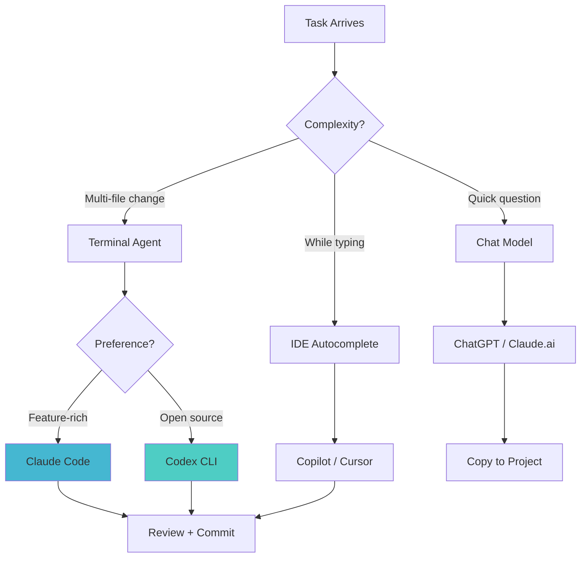

# 5.a: Agentic Tools vs. Chat Models for Coding

While both agentic coding tools (Claude Code, Codex CLI) and chat-based models (ChatGPT, Claude.ai) can generate, explain, and refactor code, they operate with fundamentally different paradigms. Understanding this distinction is key to choosing the right tool for each task.

## Agentic Tools: Active Agents in Your Environment

Agentic tools like Claude Code and Codex CLI act as **active agents** within your development environment. They:

*   **Read your codebase:** Navigate directory structures, read file contents, understand project architecture
*   **Write files:** Create new files and modify existing ones directly on disk
*   **Execute commands:** Run tests, linters, build tools, and shell commands
*   **Manage Git:** Create commits, branches, and pull requests
*   **Iterate autonomously:** If tests fail, they can analyse the failure and try a different approach
*   **Follow project configuration:** Read CLAUDE.md or AGENTS.MD for context

### When to Use Agentic Tools

- Tasks that require changes across multiple files
- Implementing features that need to integrate with existing code
- Refactoring that must maintain test coverage
- Bug fixing where the agent needs to reproduce and verify the fix
- Any task where you would otherwise need to explain your entire codebase

## Chat Models: Powerful but Passive

Chat-based interfaces (ChatGPT, Claude.ai web) function as **powerful but passive brains**. They:

*   Generate text-based code output in response to prompts
*   Cannot access your local filesystem
*   Cannot execute code on your machine (with limited exceptions like ChatGPT's Code Interpreter for Python)
*   Cannot create Git commits or pull requests
*   Require you to copy-paste code context into the conversation

### When to Use Chat Models

- Learning and exploring new concepts
- Brainstorming architecture and design decisions
- Getting explanations of complex algorithms
- Generating isolated code snippets
- Quick debugging with a pasted error message
- Mobile coding (ChatGPT app)

## The Spectrum of AI Assistance

| Level | Type | Example | Autonomy |
|-------|------|---------|----------|
| **1** | Autocomplete | GitHub Copilot inline | Suggests as you type |
| **2** | Chat-based | ChatGPT, Claude.ai | Generates code on request |
| **3** | IDE-integrated agent | Cursor Composer, Copilot Workspace | Edits multiple files with approval |
| **4** | Terminal agent | Claude Code, Codex CLI | Full codebase access, command execution |
| **5** | Autonomous agent | Claude Code with hooks + MCP | Continuous operation with tool integration |

Most developers benefit from using tools at multiple levels simultaneously: Copilot for inline suggestions (Level 1), Claude Code for complex tasks (Level 4-5), and ChatGPT for quick questions (Level 2).

## Feature Comparison

| Feature | Claude Code | Codex CLI | ChatGPT | Claude.ai | Cursor |
|---------|-------------|-----------|---------|-----------|--------|
| **Paradigm** | Active agent | Active agent | Passive chat | Passive chat | IDE agent |
| **Codebase access** | Full (local) | Full (local) | None (paste only) | None (paste only) | Full (local) |
| **File editing** | Direct on disk | Direct on disk | Copy-paste output | Copy-paste output | Direct in IDE |
| **Command execution** | Yes (shell) | Yes (sandboxed) | Python only | No | Yes (local) |
| **Git operations** | Yes | Yes | No | No | Yes |
| **Project config** | CLAUDE.md | AGENTS.MD | Custom instructions | Projects | .cursorrules |
| **Tool integration** | MCP servers | Limited | Plugins | Limited | Built-in |
| **Context window** | 200K tokens | 128K tokens | 128K tokens | 200K tokens | Model-dependent |
| **Offline capable** | No | Limited | No | No | No |
| **Open source** | No | Yes | No | No | No |

## The Hybrid Approach

The most productive developers use a combination of tools:

### Practical Example

**Morning workflow using multiple tools:**

1. **Quick question** (Claude.ai): "What's the best approach for implementing rate limiting in Express.js?"
2. **Implementation** (Claude Code): "Add rate limiting to all API endpoints following the approach we discussed. Use express-rate-limit with Redis store."
3. **Inline refinement** (Copilot): Tab-complete as you review and adjust the generated code
4. **Documentation** (Claude Code): "Update the API documentation to reflect the new rate limiting behaviour"
5. **Review** (Claude Code): "Run all tests and show me the diff summary"

## Choosing Between Claude Code and Codex CLI

For teams deciding between the two terminal agents:

| Consideration | Claude Code | Codex CLI |
|---------------|-------------|-----------|
| **Feature depth** | More features (MCP, hooks, subagents, SDK) | Simpler, focused |
| **Open source** | No | Yes (audit, fork, contribute) |
| **Sandboxing** | OS-level | Docker/Seatbelt (network-disabled) |
| **Model flexibility** | Anthropic models | Multi-provider (OpenAI, Anthropic, Azure, Ollama) |
| **Desktop/web access** | Yes (desktop app, web app, IDE extensions) | Terminal only |
| **Configuration** | CLAUDE.md (hierarchical, deep integration) | AGENTS.MD |
| **Best for** | Teams invested in Anthropic ecosystem | Teams wanting OSS or multi-provider |

Many developers maintain both and choose based on the task:
- Claude Code for complex, multi-step work requiring MCP and hooks
- Codex CLI for quick tasks or when they want sandboxed execution

---

Next: [5.b: Understanding Model & Tool Choices](./05_b_understanding_model_choices.md)
