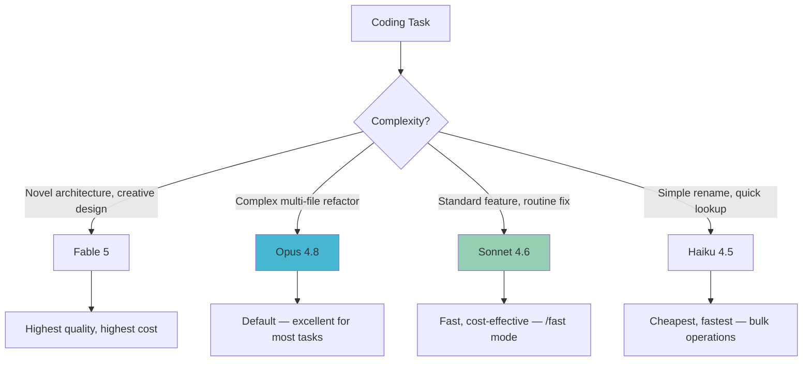
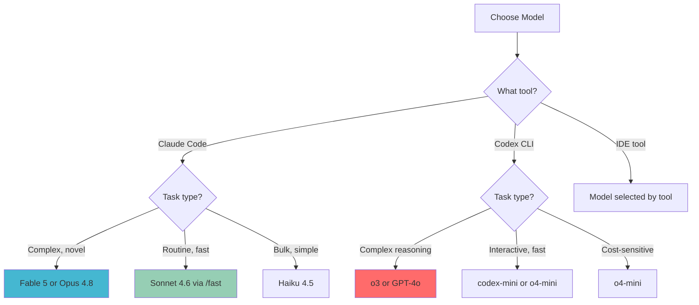

# 5.b: Understanding Model & Tool Choices (June 2026)

Choosing the right model for an AI coding task is one of the most impactful decisions you make on a daily basis. The model determines quality, speed, cost, and context capacity. In mid-2026, the two major provider families for coding agents are Anthropic's Claude models and OpenAI's GPT/o-series models.

## The Claude Model Family (Anthropic)

Claude Code defaults to Opus 4.8 but offers a full model family accessible via configuration or the `/fast` toggle.

### Claude Models for Coding (June 2026)

| Model | ID | Context | Strengths | Best For |
|-------|-----|---------|-----------|----------|
| **Fable 5** | `claude-fable-5` | 200K tokens | Latest and most capable; strongest on novel problems and creative solutions | Complex architecture, novel features, research-grade tasks |
| **Opus 4.8** | `claude-opus-4-8` | 200K tokens | Top-tier reasoning and instruction following; Claude Code default | Multi-file refactoring, complex bug fixing, code review |
| **Sonnet 4.6** | `claude-sonnet-4-6` | 200K tokens | Best balance of speed, quality, and cost | Daily coding tasks, routine refactoring, test generation |
| **Haiku 4.5** | `claude-haiku-4-5-20251001` | 200K tokens | Fastest and cheapest; still highly capable for straightforward tasks | High-volume operations, quick lookups, simple fixes |

### Model Selection in Claude Code

```bash
# Default: uses Opus 4.8
claude

# Start with a specific model
claude --model claude-sonnet-4-6

# Toggle to Sonnet mid-session for speed
# (inside a Claude Code session)
/fast

# Toggle back to Opus for a complex task
/fast
```

### Claude Model Selection Strategy



**Practical guidance:**
- Start a session with **Opus 4.8** (the default) for any non-trivial task
- Switch to **Sonnet 4.6** via `/fast` when iterating on implementation details or generating tests
- Use **Haiku 4.5** for bulk operations (e.g., adding JSDoc comments to 50 functions)
- Reserve **Fable 5** for tasks where you want the absolute best output quality

### Pricing

Model pricing changes frequently. Check [console.anthropic.com](https://console.anthropic.com) for current per-token rates. The general ordering from most to least expensive is: Fable 5 > Opus 4.8 > Sonnet 4.6 > Haiku 4.5.

Claude Code displays session costs via the `/cost` command.

## The OpenAI Model Family

OpenAI Codex CLI supports multiple models via the `--model` flag.

### OpenAI Models for Coding (June 2026)

| Model | Strengths | Best For |
|-------|-----------|----------|
| **o3** | Deep reasoning, chain-of-thought, strongest on complex logic | Algorithms, system design, debugging subtle issues |
| **GPT-4o** | Fast, capable, multi-modal (text + image) | General coding, UI implementation from screenshots |
| **o4-mini** | Fast reasoning at lower cost | Interactive CLI use, quick iterations |
| **codex-mini-latest** | Optimised for Codex CLI specifically | Default for Codex CLI terminal tasks |
| **codex-1** | Fine-tuned for software engineering (o3 architecture) | Codex Cloud Agent (within ChatGPT) |

### Model Selection in Codex CLI

```bash
# Default model (codex-mini-latest)
codex "Add input validation"

# Use GPT-4o for a more complex task
codex --model gpt-4o "Architect a caching layer for the API"

# Use o3 for a hard algorithmic problem
codex --model o3 "Optimise the pathfinding algorithm for large graphs"

# Use o4-mini for quick, cheap tasks
codex --model o4-mini "Format all files with Prettier"
```

### OpenAI Pricing

Check [platform.openai.com](https://platform.openai.com) for current per-token rates. The general ordering from most to least expensive is: o3 > GPT-4o > codex-1 > o4-mini > codex-mini.

## Open-Weight and Local Models

For privacy-sensitive work or offline use, both Codex CLI and Aider support local models via Ollama or other OpenAI-compatible APIs.

| Model | Provider | Strengths | Limitations |
|-------|----------|-----------|-------------|
| **DeepSeek Coder V3** | DeepSeek (or local) | Strong coding, open weights | Requires significant GPU for local |
| **CodeLlama** | Meta (via Ollama) | Good for common languages | Smaller context, less capable than frontier |
| **Mixtral** | Mistral (via Ollama) | Fast, decent coding | Not as strong as GPT-4o/Claude for complex tasks |

```bash
# Using a local model with Codex CLI
codex --provider ollama --model deepseek-coder-v3 "Explain this function"

# Using a local model with Aider
aider --model ollama/deepseek-coder-v3
```

Local models are best for:
- Air-gapped environments
- Reducing API costs for simple tasks
- Experimentation and learning
- Privacy-critical codebases

They are generally not recommended for complex multi-file refactoring where frontier models (Opus 4.8, o3) substantially outperform.

## Cross-Provider Comparison

### Head-to-Head: Coding Task Performance

| Task Type | Best Claude Model | Best OpenAI Model | Notes |
|-----------|------------------|-------------------|-------|
| Multi-file refactoring | Opus 4.8 | o3 | Both excellent; Claude Code's tooling gives it an edge |
| Quick bug fix | Sonnet 4.6 | GPT-4o | Fast, capable, good value |
| Test generation | Sonnet 4.6 | codex-mini | High volume, lower cost matters |
| Algorithm design | Fable 5 | o3 | Both strong at deep reasoning |
| Code review | Opus 4.8 | o3 | Long context helps (Claude's 200K advantage) |
| Documentation | Sonnet 4.6 | GPT-4o | Both produce good docs |
| Simple scripting | Haiku 4.5 | o4-mini | Cheapest options, still capable |

### Context Window Comparison

| Model | Context Window |
|-------|---------------|
| Claude Fable 5 | 200K tokens |
| Claude Opus 4.8 | 200K tokens |
| Claude Sonnet 4.6 | 200K tokens |
| Claude Haiku 4.5 | 200K tokens |
| GPT-4o | 128K tokens |
| o3 | 128K-200K tokens |
| codex-mini | 128K tokens |

The 200K context window across all Claude models is a significant advantage for large codebases where the agent needs to consider many files simultaneously.

## Practical Model Selection Framework

### Decision Matrix



### Cost Optimisation Tips

1. **Start expensive, then downgrade:** Begin a task with Opus or o3 to get the architecture right, then switch to Sonnet/o4-mini for iteration
2. **Use `/fast` mode liberally in Claude Code:** Sonnet 4.6 handles the vast majority of coding tasks well
3. **Monitor costs:** Use Claude Code's `/cost` command and OpenAI's usage dashboard
4. **Batch simple tasks:** Accumulate small fixes and run them as a batch with a cheaper model
5. **Match model to task, not to habit:** Do not use o3 for formatting code; do not use Haiku for system design

### The "Best" Model is Context-Dependent

There is no single best model. The optimal choice depends on:

- **Task complexity** — How much reasoning is needed?
- **Speed requirements** — Is this interactive or batch?
- **Cost sensitivity** — How many tokens will this consume?
- **Context needs** — How much code must the model consider?
- **Provider preference** — Which ecosystem are you invested in?

Model capabilities evolve rapidly. What holds in June 2026 may shift by September 2026. Re-evaluate your default model choice periodically and stay current with provider announcements.

---

Next: [5.c: The Evolving Toolkit](./05_c_the_evolving_toolkit.md)
