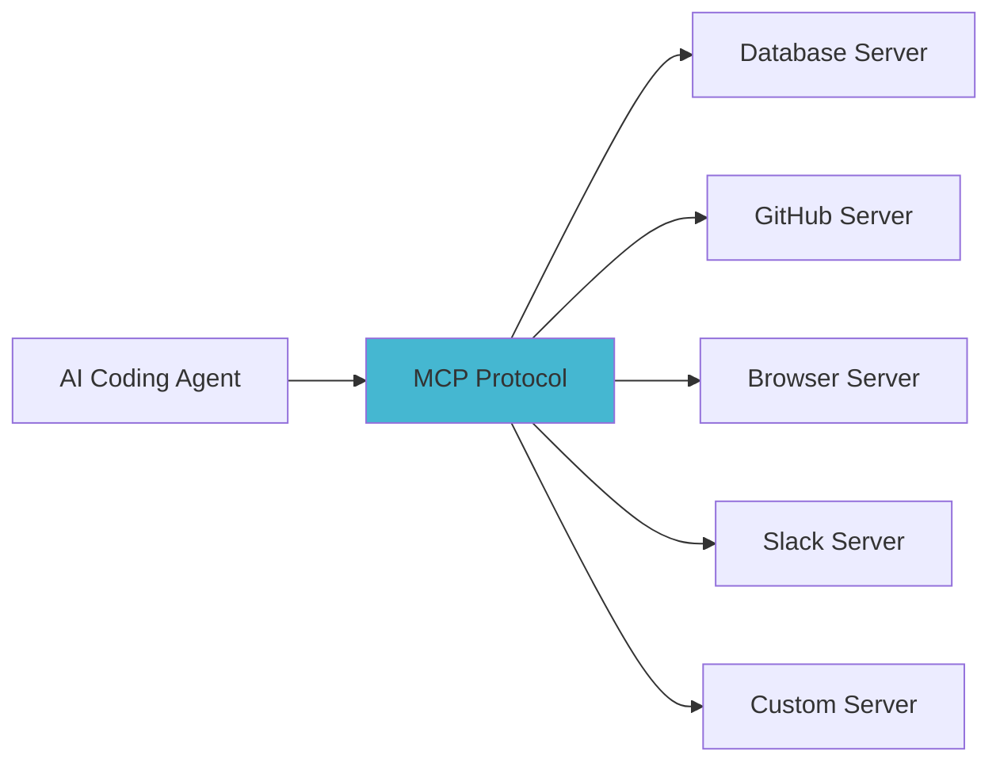

# 5.c: The Evolving Toolkit: MCP, Agent Frameworks, and What Comes Next

The AI coding landscape is evolving rapidly. Beyond the current tools, several emerging capabilities and standards are shaping the future of AI-assisted development. Understanding these trends helps you prepare for what comes next and make better decisions about your tooling investments today.

## Model Context Protocol (MCP) — The Open Standard

MCP is arguably the most important emerging standard in AI tooling. Created by Anthropic and adopted increasingly across the ecosystem, it provides a standard protocol for connecting AI models to external tools and data sources.

### Why MCP Matters

Before MCP, every tool integration was bespoke — each AI tool had its own way of connecting to databases, APIs, and services. MCP standardises this into a single protocol, similar to how HTTP standardised web communication.



### Current MCP Adoption

| Tool | MCP Support | Status |
|------|------------|--------|
| Claude Code | Full, native | Production |
| Claude Desktop | Full, native | Production |
| Cursor | Partial | Growing |
| Continue.dev | Partial | Growing |
| Codex CLI | Limited | Early |
| VS Code (GitHub) | Emerging | Preview |

### Building MCP Servers

MCP servers are straightforward to build. An MCP server exposes "tools" that AI agents can call:

```typescript
// Example: A simple MCP server that queries a database
import { McpServer } from '@modelcontextprotocol/sdk/server/mcp.js';

const server = new McpServer({ name: 'my-db' });

server.tool('query_users', { schema: { query: 'string' } }, async (args) => {
  const results = await db.query(args.query);
  return { content: [{ type: 'text', text: JSON.stringify(results) }] };
});
```

This means your team can build MCP servers for internal tools — deployment systems, monitoring dashboards, ticket trackers — and make them accessible to Claude Code or any MCP-compatible agent.

## Agent Frameworks and SDKs

Both Anthropic and OpenAI are investing heavily in agent frameworks that go beyond simple chat.

### Claude Code Agent SDK

Anthropic's Agent SDK allows building custom coding agents programmatically:

```typescript
import { Agent } from '@anthropic-ai/claude-code';

// Build a custom code review agent
const reviewer = new Agent({
  model: 'claude-sonnet-4-6',
  cwd: '/path/to/project',
  systemPrompt: 'You are a security-focused code reviewer...'
});

const findings = await reviewer.run('Review all changes since the last release tag');
```

This enables:
- Custom CI/CD review bots
- Specialised coding assistants for specific domains
- Automated maintenance workflows (dependency updates, security patches)
- Multi-agent systems where agents coordinate on complex tasks

### OpenAI Responses API and Agents SDK

OpenAI's Responses API combines the simplicity of the Chat Completions API with sophisticated tool-use capabilities. Their Agents SDK provides a framework for building multi-agent systems with handoffs and guardrails.

## Emerging Capabilities

### Computer Use and Browser Agents

AI agents are increasingly able to interact with graphical interfaces — clicking buttons, filling forms, navigating web applications. This is relevant for:

- End-to-end testing of web applications
- Automated QA workflows
- Interacting with tools that lack APIs (legacy systems, admin panels)

Both Anthropic (via Claude's computer use capability) and OpenAI (via CUA — Computer Using Agent) are developing these capabilities.

### Agentic Web Search

Agents can now search the web for current information during coding tasks:

- Finding up-to-date API documentation
- Checking for known issues with specific library versions
- Researching best practices for unfamiliar frameworks

### Multi-Agent Orchestration

Complex development tasks increasingly involve multiple specialised agents working together:

- A **planner agent** breaks down the task
- A **coder agent** implements changes
- A **reviewer agent** checks for issues
- A **tester agent** verifies the implementation

Tools like Claude Code's subagents and OpenAI's Agents SDK make this pattern practical.

## Impact on Developer Workflows

### Short-Term (2026-2027)

What to expect in the near term:

- **MCP becomes standard:** Most IDE tools will support MCP servers, creating a portable tool ecosystem
- **Deeper Git integration:** Agents will manage entire PR lifecycle — creation, responding to review comments, rebasing
- **Better project understanding:** Agents will build and maintain mental models of large codebases across sessions
- **Voice-driven coding:** Mobile and voice interfaces become viable for delegating tasks

### Medium-Term (2027-2028)

- **Autonomous maintenance:** Agents handle routine dependency updates, security patches, and deprecation migrations
- **Specification-to-implementation:** More reliable generation of working code from high-level specifications
- **Cross-repository understanding:** Agents that understand how changes in one repository affect downstream projects

### What Does Not Change

Regardless of how capable AI coding agents become, certain fundamentals remain:

- **Architecture matters more than ever:** Agents work better in well-structured codebases
- **Code review is non-negotiable:** AI output must be reviewed by humans
- **Domain knowledge is irreplaceable:** Understanding the business context is a human responsibility
- **Security is a first-class concern:** More generated code means more surface area to audit
- **Testing remains essential:** AI-generated code needs the same (or more) testing rigour as human-written code

## Preparing for the Future

### Practical Steps

1. **Adopt CLAUDE.md/AGENTS.MD now.** Even if you change tools later, the practice of formalising project conventions is permanently valuable.
2. **Invest in MCP.** Build MCP servers for your internal tools. This investment ports across any MCP-compatible agent.
3. **Modularise your codebase.** Well-structured, testable code is dramatically easier for AI agents to work with.
4. **Build review habits.** Develop systematic code review practices for AI-generated code — they are different from reviewing human code.
5. **Stay informed.** Follow Anthropic, OpenAI, and the broader AI coding community for announcements. The landscape changes quarterly.

### What to Evaluate Quarterly

- New model releases from Anthropic and OpenAI
- MCP server ecosystem growth
- IDE tool capabilities (Cursor, Copilot, Windsurf)
- Open-source alternatives (Codex CLI, Aider, Continue.dev)
- Your team's cost and productivity metrics with current tools

The direction is clear: AI coding agents are becoming more autonomous, more capable, and more deeply integrated into every aspect of software development. The developers who master these tools today will define how software is built tomorrow.

---

Next: [Chapter 6: Navigating Challenges](./06_navigating_challenges.md)
