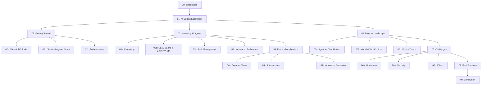
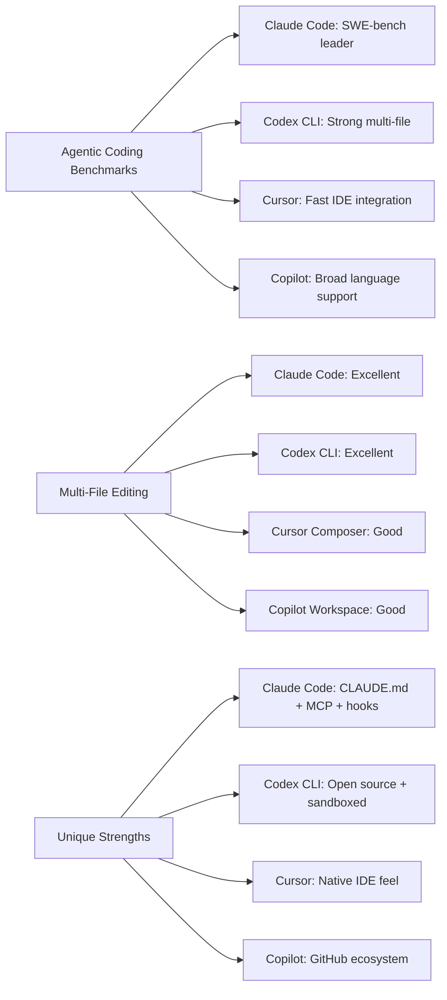

# Workshop 06: Mastering AI-Powered Coding Agents (2026 Edition)

> **Last Updated: June 2026** — Comprehensive coverage of Claude Code, OpenAI Codex CLI, GitHub Copilot, Cursor AI, and the complete AI coding agent landscape.

## Executive Summary

The AI-assisted software development landscape has undergone a generational shift. What began with single-line autocomplete in 2021 has matured into fully agentic coding systems that autonomously navigate codebases, execute multi-file refactors, run tests, and submit pull requests. By mid-2026, two categories of tool define the frontier: **terminal-based coding agents** (Claude Code and OpenAI Codex CLI) that operate with full repository context and shell access, and **IDE-integrated assistants** (Cursor, GitHub Copilot, Windsurf) that embed AI directly into the editor workflow. This workshop provides a practitioner's guide to the entire ecosystem.

### Key Learning Outcomes

By completing this workshop, you will:

- **Master Terminal-Based AI Agents** — Work fluently with Claude Code and OpenAI Codex CLI for agentic software engineering
- **Compare Tools Strategically** — Make informed decisions between Claude Code, Codex CLI, Cursor, Copilot, and open-source alternatives
- **Implement Best Practices** — Apply proven patterns for project configuration (CLAUDE.md, AGENTS.MD), prompt engineering, and task management
- **Navigate Challenges** — Address security, privacy, ethics, and technical limitations
- **Future-Proof Skills** — Understand emerging trends and prepare for the next generation of AI coding tools

### Workshop Structure

```mermaid
graph TD
    A[00: Introduction] --> B[01: AI Coding Ecosystem]
    B --> C[02: Getting Started]
    C --> D[02a: Web & IDE Tools]
    C --> E[02b: Terminal Agents Setup]
    C --> F[02c: Authentication]

    B --> G[03: Mastering AI Agents]
    G --> H[03a: Prompting]
    G --> I[03b: CLAUDE.md & AGENTS.MD]
    G --> J[03c: Task Management]
    G --> K[03d: Advanced Techniques]

    G --> L[04: Practical Applications]
    L --> M[04a: Beginner Tasks]
    L --> N[04b: Intermediate]
    L --> O[04c: Advanced Scenarios]

    B --> P[05: Broader Landscape]
    P --> Q[05a: Agent vs Chat Models]
    P --> R[05b: Model & Tool Choices]
    P --> S[05c: Future Trends]

    P --> T[06: Challenges]
    T --> U[06a: Limitations]
    T --> V[06b: Security]
    T --> W[06c: Ethics]

    T --> X[07: Best Practices]
    X --> Y[08: Conclusion]
```

### Target Audience

- **Software Engineers** seeking to multiply productivity with AI assistance
- **Tech Leads** evaluating AI coding tools for team adoption
- **Individual Developers** wanting to stay current with AI coding practices
- **CTOs/Engineering Managers** making strategic tooling decisions

### Technology Coverage (June 2026)

| Category | Tools Covered | Focus Level |
|----------|---------------|-------------|
| **Anthropic Claude** | Claude Code (CLI, desktop, web, IDE extensions), Fable 5, Opus 4.8, Sonnet 4.6, Haiku 4.5 | Deep Dive |
| **OpenAI Ecosystem** | Codex CLI (open-source), ChatGPT (GPT-4o, o3), Canvas Mode | Deep Dive |
| **IDE-Integrated** | Cursor AI, GitHub Copilot (+ Workspace), Windsurf | Comprehensive |
| **Open Source** | Continue.dev, Aider, OpenAI Codex CLI | Comprehensive |
| **Historical** | Original Codex API (deprecated 2023) | Historical Context |

### Prerequisites

- Basic programming knowledge (any language)
- Familiarity with Git and command-line tools
- An Anthropic account and/or OpenAI account
- Optional: Experience with VS Code or JetBrains IDEs

### Estimated Time Investment

- **Quick Start:** 2-3 hours (Chapters 0-2)
- **Core Mastery:** 8-10 hours (Chapters 0-4)
- **Complete Workshop:** 15-20 hours (All chapters + exercises)

### What Makes This Workshop Unique

1. **Battle-Tested Insights** — Based on real-world usage patterns across multiple tools and teams
2. **Multi-Tool Perspective** — Head-to-head comparison across the entire landscape
3. **Practical Examples** — 50+ real-world scenarios from simple fixes to complex architectures
4. **Security-First** — Enterprise-grade security and privacy considerations
5. **Future-Looking** — Trends, emerging patterns, and what to watch for next

### Key Metrics & Benchmarks (2026)

```mermaid
graph LR
    A[Agentic Coding Benchmarks] --> B[Claude Code: SWE-bench leader]
    A --> C[Codex CLI: Strong multi-file]
    A --> D[Cursor: Fast IDE integration]
    A --> E[Copilot: Broad language support]

    F[Multi-File Editing] --> G[Claude Code: Excellent]
    F --> H[Codex CLI: Excellent]
    F --> I[Cursor Composer: Good]
    F --> J[Copilot Workspace: Good]

    K[Unique Strengths] --> L[Claude Code: CLAUDE.md + MCP + hooks]
    K --> M[Codex CLI: Open source + sandboxed]
    K --> N[Cursor: Native IDE feel]
    K --> O[Copilot: GitHub ecosystem]
```

> **Note on benchmarks:** AI coding benchmarks evolve rapidly and published numbers can vary by evaluation methodology. Rather than citing specific percentages that date quickly, we recommend consulting each vendor's latest benchmark disclosures and running your own evaluations on tasks representative of your codebase.

### Quick Reference Card

**Claude Code (Anthropic):**
- **Install:** `npm install -g @anthropic-ai/claude-code`
- **Also available as:** Desktop app (Mac/Windows/Linux), web app (claude.ai/code), VS Code & JetBrains extensions
- **Models:** Opus 4.8 (default), Sonnet 4.6 via `/fast` mode, Fable 5 and Haiku 4.5 also available — check [console.anthropic.com](https://console.anthropic.com) for current rates
- **Key features:** CLAUDE.md, MCP servers, hooks, subagents, workflows, `/fast` mode, Agent SDK

**OpenAI Codex CLI:**
- **Install:** `npm install -g @openai/codex`
- **Open source:** [github.com/openai/codex](https://github.com/openai/codex)
- **Models:** Configurable (codex-mini, o4-mini, GPT-4o, o3, etc.) — check [platform.openai.com](https://platform.openai.com) for current rates
- **Key features:** AGENTS.MD, sandboxed execution, multi-provider support

**IDE-Integrated Tools:**
- **Cursor:** cursor.sh (VS Code fork, from $20/mo)
- **GitHub Copilot:** VS Code/JetBrains extensions ($10-39/mo, free for students/OSS)
- **Windsurf:** windsurf.com (from $10-15/mo)
- **Continue.dev:** marketplace extension (free, open-source)

### Workshop Navigation

**Start Here:** [Chapter 0: Introduction](./00_introduction.md)

**Complete Chapter List:**

1. [Introduction to AI-Powered Software Engineering](./00_introduction.md)
2. [Understanding the AI Coding Ecosystem](./01_understanding_the_codex_ecosystem.md)
   - Claude Code, OpenAI Codex CLI, IDE tools, and how they compare
3. [Getting Started](./02_getting_started.md)
   - [Web & IDE Tools](./02_a_accessing_the_codex_cloud_agent.md)
   - [Setting Up Terminal Agents](./02_b_setting_up_the_codex_cli.md)
   - [API Keys and Authentication](./02_c_api_keys_and_authentication.md)
4. [Mastering AI Coding Agents](./03_mastering_codex.md)
   - [Effective Prompting Strategies](./03_a_effective_prompting_strategies.md)
   - [CLAUDE.md and AGENTS.MD Configuration](./03_b_the_crucial_role_of_agents_md.md)
   - [Managing Tasks Efficiently](./03_c_managing_tasks_efficiently.md)
   - [Advanced Techniques](./03_d_advanced_techniques.md)
5. [Practical Applications](./04_practical_codex.md)
   - [Beginner Tasks](./04_a_beginner_tasks.md)
   - [Intermediate Tasks](./04_b_intermediate_tasks.md)
   - [Advanced Scenarios](./04_c_advanced_scenarios.md)
6. [The Broader Landscape](./05_the_broader_landscape.md)
   - [Agentic Tools vs. Chat Models](./05_a_codex_vs_general_gpt_models.md)
   - [Understanding Model & Tool Choices](./05_b_understanding_model_choices.md)
   - [The Evolving Toolkit](./05_c_the_evolving_toolkit.md)
7. [Navigating Challenges](./06_navigating_challenges.md)
   - [Limitations of AI Agents](./06_a_limitations_of_codex.md)
   - [Security Implications](./06_b_security_implications.md)
   - [Ethical and Legal Considerations](./06_c_ethical_and_legal_considerations.md)
8. [Best Practices for Using AI Agents](./07_best_practices_for_using_ai_agents.md)
9. [Conclusion and Next Steps](./08_conclusion.md)

### Community & Support

- **Anthropic Community:** [docs.anthropic.com](https://docs.anthropic.com), Claude Code GitHub discussions
- **OpenAI Community:** [community.openai.com](https://community.openai.com)
- **GitHub Discussions:** Share your projects and patterns
- **Twitter/X:** #ClaudeCode #AICode #CodingAgents

### Credits

This workshop is based on insights from real-world usage patterns across thousands of developers, competitive landscape analysis, and hands-on experience with every major AI coding tool as of June 2026.

---

**Ready to transform your coding workflow?** Start with [Chapter 0: Introduction](./00_introduction.md)

---

*Last Updated: June 2026 | Covers Claude Code (Fable 5, Opus 4.8, Sonnet 4.6, Haiku 4.5), OpenAI Codex CLI, Cursor, Copilot, and the full AI coding ecosystem*
