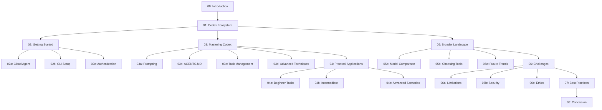
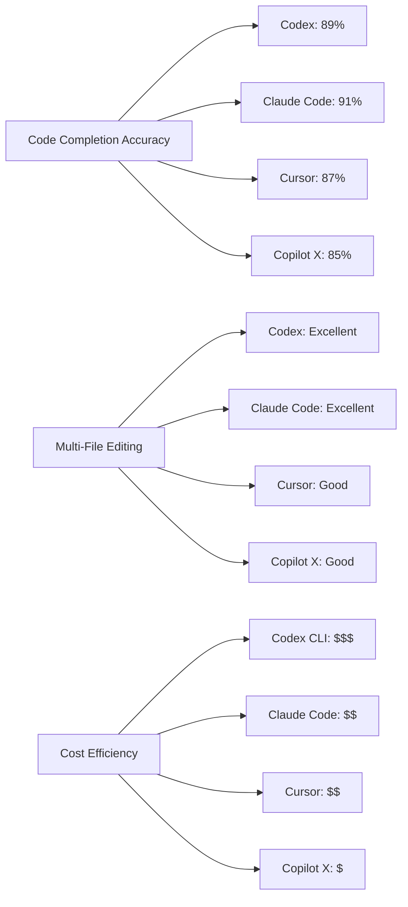

# Workshop 06: Mastering AI-Powered Code Generation with Modern AI Coding Tools (2025 Edition)

> **Latest Update:** January 2025 - Comprehensive coverage of ChatGPT GPT-4o/o1, Claude Code CLI, Cursor AI, GitHub Copilot, and the complete AI coding landscape.

> **⚠️ Important Historical Note:** The original OpenAI Codex API was deprecated in March 2023. This workshop has been updated to cover modern successors: ChatGPT's code capabilities (GPT-4o, o1), Claude Code CLI, and the broader ecosystem of AI coding tools available in 2025.

## Executive Summary

The landscape of AI-assisted software development has evolved dramatically since 2021. What began with simple autocomplete (GitHub Copilot 2021) transformed through the original Codex API (2021-2023), and has now matured into sophisticated systems like ChatGPT GPT-4o/o1, Claude Code CLI, and integrated IDE solutions capable of autonomous multi-file editing, complex refactoring, and architectural decision-making. This workshop provides a comprehensive guide to the modern AI coding ecosystem in 2025.

### Key Learning Outcomes

By completing this workshop, you will:

- **Master Modern AI Coding** - Understand ChatGPT GPT-4o/o1, Claude Code CLI, and third-party integrations
- **Compare Tools Strategically** - Make informed decisions between ChatGPT, Claude, Cursor, Copilot, and open-source alternatives
- **Implement Best Practices** - Apply proven patterns for prompt engineering, task management, and code review
- **Navigate Challenges** - Address security, privacy, ethics, and technical limitations
- **Future-Proof Skills** - Understand emerging trends and prepare for the next generation of AI coding tools

### Workshop Structure

### Target Audience

- **Software Engineers** seeking to 10x productivity with AI assistance
- **Tech Leads** evaluating AI coding tools for team adoption
- **Individual Developers** wanting to stay current with AI coding practices
- **CTOs/Engineering Managers** making strategic tooling decisions

### Technology Coverage (2025)

| Category | Tools Covered | Focus Level |
|----------|---------------|-------------|
| **OpenAI Ecosystem** | ChatGPT (GPT-4o, o1), OpenAI API, Canvas Mode | Deep Dive |
| **Anthropic Claude** | Claude Code CLI, Claude Sonnet 4, Artifact Mode | Deep Dive |
| **IDE-Integrated** | Cursor AI, GitHub Copilot, Windsurf | Comprehensive |
| **Open Source** | Continue.dev, Aider, Codeium, Tabby | Comprehensive |
| **Enterprise** | Amazon Q Developer, Tabnine Enterprise | Overview |
| **Historical** | Original Codex API (deprecated 2023) | Historical Context |

### Prerequisites

- Basic programming knowledge (any language)
- Familiarity with Git and command-line tools
- OpenAI account (free tier available)
- Optional: Experience with VS Code or JetBrains IDEs

### Estimated Time Investment

- **Quick Start:** 2-3 hours (Chapters 0-2)
- **Core Mastery:** 8-10 hours (Chapters 0-4)
- **Complete Workshop:** 15-20 hours (All chapters + exercises)

### What Makes This Workshop Unique

1. **Battle-Tested Insights** - Based on real workshop feedback from OpenAI experts
2. **Multi-Tool Perspective** - Not just Codex; compare across the entire landscape
3. **Practical Examples** - 50+ real-world scenarios from simple fixes to complex architectures
4. **Cost Analysis** - Detailed breakdowns of pricing across all major tools
5. **Security-First** - Enterprise-grade security and privacy considerations
6. **Future-Looking** - Trends, emerging patterns, and what's coming in 2025

### Key Metrics & Benchmarks (2024)

### Quick Reference Card

**OpenAI Coding Access (2025):**
- **ChatGPT Plus/Pro:** chat.openai.com ($20-200/mo for GPT-4o, o1 access)
- **OpenAI API:** platform.openai.com/api-keys (Pay-per-use: GPT-4o $5/1M tokens)
- **Canvas Mode:** Available in ChatGPT Plus/Pro for interactive coding

**Claude Coding Access:**
- **Claude Web:** claude.ai (Free tier + Pro $20/mo)
- **Claude Code CLI:** `npm install -g @anthropic-ai/claude-code`
- **Anthropic API:** console.anthropic.com (Sonnet 4: $3/1M tokens)

**IDE-Integrated Tools:**
- **Cursor:** cursor.sh (VS Code fork, $20/mo)
- **GitHub Copilot:** VS Code/JetBrains extensions ($10-39/mo)
- **Continue.dev:** marketplace extension (Free, open-source)

### Workshop Navigation

**Start Here:** [Chapter 0: Introduction](./00_introduction.md)

**Complete Chapter List:**

1. [Introduction to AI-Powered Software Engineering](./00_introduction.md)
2. [Understanding the Codex Ecosystem](./01_understanding_the_codex_ecosystem.md)
3. [Getting Started](./02_getting_started.md)
   - [Accessing the Cloud Agent](./02_a_accessing_the_codex_cloud_agent.md)
   - [Setting Up the CLI](./02_b_setting_up_the_codex_cli.md)
   - [API Keys and Authentication](./02_c_api_keys_and_authentication.md)
4. [Mastering Codex](./03_mastering_codex.md)
   - [Effective Prompting Strategies](./03_a_effective_prompting_strategies.md)
   - [The Crucial Role of AGENTS.MD](./03_b_the_crucial_role_of_agents_md.md)
   - [Managing Tasks Efficiently](./03_c_managing_tasks_efficiently.md)
   - [Advanced Techniques](./03_d_advanced_techniques.md)
5. [Practical Codex Applications](./04_practical_codex.md)
   - [Beginner Tasks](./04_a_beginner_tasks.md)
   - [Intermediate Tasks](./04_b_intermediate_tasks.md)
   - [Advanced Scenarios](./04_c_advanced_scenarios.md)
6. [The Broader Landscape](./05_the_broader_landscape.md)
   - [Codex vs. General GPT Models](./05_a_codex_vs_general_gpt_models.md)
   - [Understanding Model Choices](./05_b_understanding_model_choices.md)
   - [The Evolving Toolkit](./05_c_the_evolving_toolkit.md)
7. [Navigating Challenges](./06_navigating_challenges.md)
   - [Limitations of Codex](./06_a_limitations_of_codex.md)
   - [Security Implications](./06_b_security_implications.md)
   - [Ethical and Legal Considerations](./06_c_ethical_and_legal_considerations.md)
8. [Best Practices for Using AI Agents](./07_best_practices_for_using_ai_agents.md)
9. [Conclusion and Next Steps](./08_conclusion.md)

### Community & Support

- **OpenAI Community:** community.openai.com
- **Discord:** AI Coding Tools Server
- **GitHub Discussions:** Share your Codex projects and patterns
- **Twitter/X:** #OpenAICodex #AICode #ClaudeCode

### Credits

This workshop is based on insights from OpenAI's Codex team, real-world usage patterns from thousands of developers, and comprehensive analysis of the competitive landscape as of December 2024.

---

**Ready to transform your coding workflow?** Start with [Chapter 0: Introduction](./00_introduction.md)

---

*Last Updated: January 2025 | Covers GPT-4o, o1, Claude Sonnet 4, and modern AI coding ecosystem | Next Update: Q2 2025*
