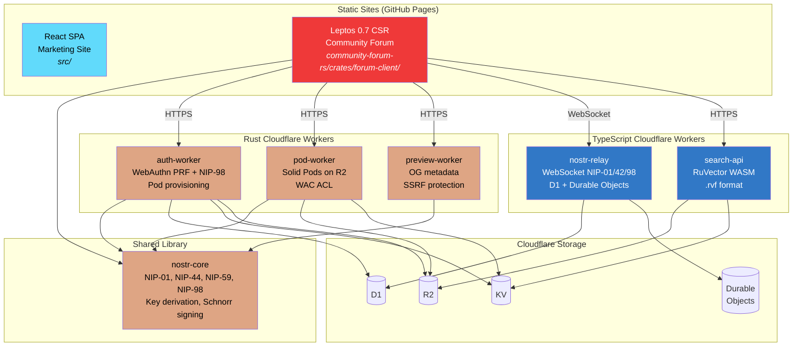
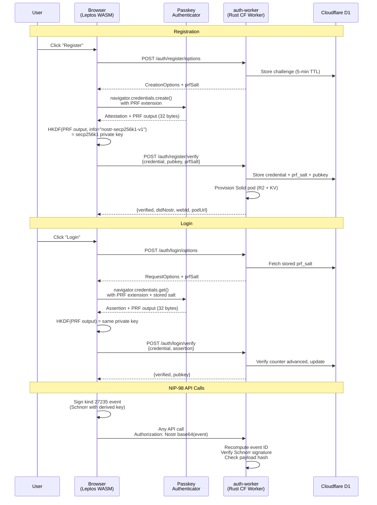
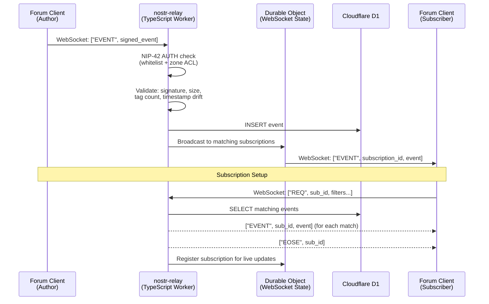
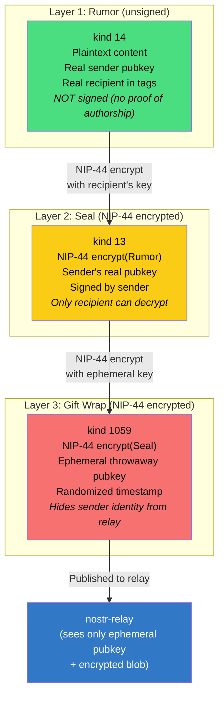
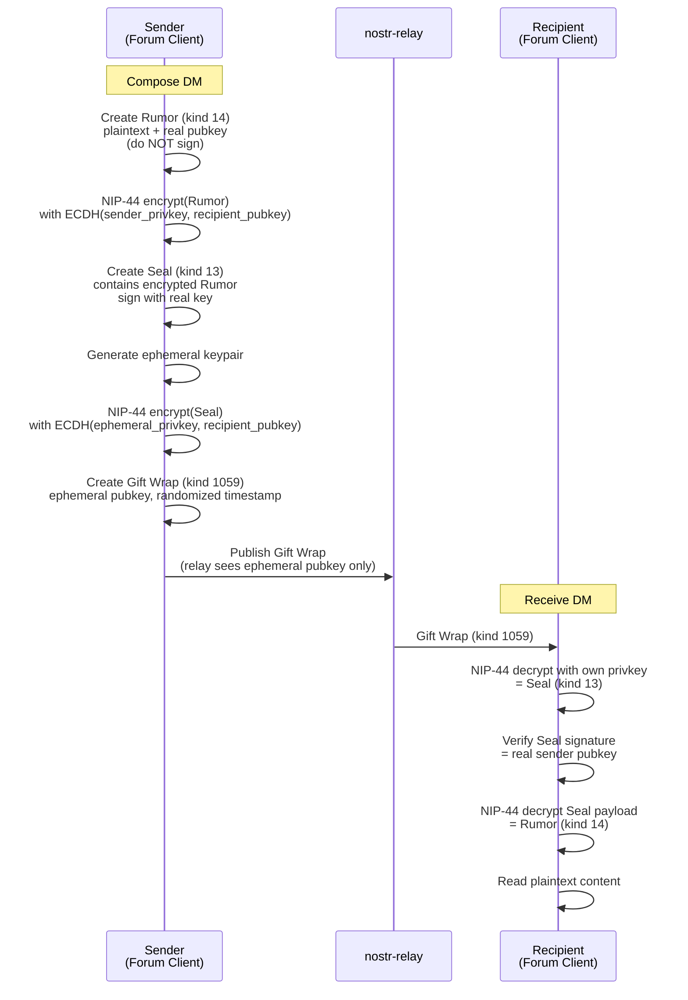
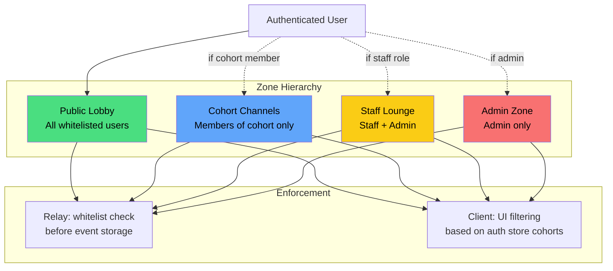
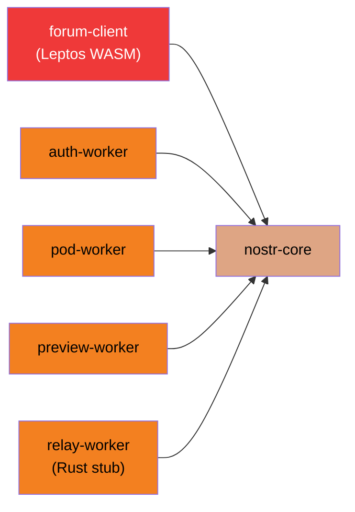

# DreamLab AI -- Documentation Hub

**Last updated:** 2026-03-08 | **Repository:** [DreamLab-AI/dreamlab-ai-website](https://github.com/DreamLab-AI/dreamlab-ai-website) | **Project README:** [../README.md](../README.md)

This documentation covers the full DreamLab AI platform: a React marketing site, a Rust/Leptos WASM community forum, and five Cloudflare Workers providing authentication, storage, relay, search, and link preview services.

---

## System Architecture

Seven services (6 Rust crates + 2 TypeScript Workers) compose the backend and forum client. The `nostr-core` crate is the shared foundation, consumed by the forum client and all three Rust Workers.



---

## Document Index

### Planning and Governance

| Document | Status | Description |
|----------|--------|-------------|
| [PRD: Rust Port v2.0.0](prd-rust-port.md) | Accepted | Architecture baseline for the Rust port. Scope, crate survey, timeline, risk register. |
| [PRD: Rust Port v2.1.0](prd-rust-port-v2.1.md) | In Progress | Refined delivery plan with tranche-based execution, governance gates, and rollback design. |

### Architecture Decision Records

Full index of all 19 ADRs. See [adr/README.md](adr/README.md) for conventions and supersession chains.

| ADR | Title | Status | Link |
|-----|-------|--------|------|
| 001 | Nostr Protocol as Foundation | Accepted | [adr/README.md](adr/README.md) |
| 002 | Three-Tier BBS Hierarchy | Accepted | [adr/README.md](adr/README.md) |
| 003 | GCP Cloud Run Infrastructure | Superseded by 010 | [adr/README.md](adr/README.md) |
| 004 | Zone-Based Access Control | Accepted | [adr/README.md](adr/README.md) |
| 005 | NIP-44 Encryption Mandate | Accepted | [adr/README.md](adr/README.md) |
| 006 | Client-Side WASM Search | Accepted | [adr/README.md](adr/README.md) |
| 007 | SvelteKit + NDK Frontend | Superseded by 013 | [adr/README.md](adr/README.md) |
| 008 | PostgreSQL Relay Storage | Superseded by 010 | [adr/README.md](adr/README.md) |
| 009 | User Registration Flow | Accepted | [adr/README.md](adr/README.md) |
| 010 | Return to Cloudflare Platform | Accepted | [adr/README.md](adr/README.md) |
| 011 | Images to Solid Pods | Accepted | [adr/README.md](adr/README.md) |
| 012 | Hardening Sprint | Accepted | [adr/README.md](adr/README.md) |
| 013 | Rust/Leptos 0.7 as Forum UI Framework | Accepted | [adr/013-rust-leptos-forum-framework.md](adr/013-rust-leptos-forum-framework.md) |
| 014 | Hybrid Validation Phase Before Full Rewrite | Accepted | [adr/014-hybrid-validation-phase.md](adr/014-hybrid-validation-phase.md) |
| 015 | Selective Workers Port Strategy (3 Rust, 2 TS) | Accepted | [adr/015-workers-port-strategy.md](adr/015-workers-port-strategy.md) |
| 016 | nostr-sdk 0.44.x as Nostr Protocol Layer | Accepted | [adr/016-nostr-sdk-protocol-layer.md](adr/016-nostr-sdk-protocol-layer.md) |
| 017 | passkey-rs for WebAuthn/FIDO2 with PRF Extension | Accepted | [adr/017-passkey-rs-webauthn-prf.md](adr/017-passkey-rs-webauthn-prf.md) |
| 018 | Testing Strategy for Rust Port | Accepted | [adr/018-testing-strategy-rust-port.md](adr/018-testing-strategy-rust-port.md) |
| 019 | Versioned Planning Governance and Tranche-Based Delivery | Accepted | [adr/019-plan-governance-and-delivery-structure.md](adr/019-plan-governance-and-delivery-structure.md) |

**Supersession chain:** ADR-003 (GCP) -> ADR-010 (Cloudflare) | ADR-007 (SvelteKit) -> ADR-013 (Rust/Leptos) | ADR-008 (PostgreSQL) -> ADR-010 (D1)

### Domain-Driven Design

Six documents defining the domain model for the Rust workspace. See [ddd/README.md](ddd/README.md) for the full overview and crate-to-context mapping.

| Document | Description |
|----------|-------------|
| [01 - Domain Model](ddd/01-domain-model.md) | Core entities: identity, authentication, community, messaging, content, storage. Includes Rust type definitions. |
| [02 - Bounded Contexts](ddd/02-bounded-contexts.md) | Maps each bounded context to a Rust crate or TypeScript Worker. Dependency graph and ACL boundaries. |
| [03 - Aggregates](ddd/03-aggregates.md) | Five aggregate roots: UserIdentity, Channel, Conversation, ForumThread, Pod. Invariants and commands. |
| [04 - Domain Events](ddd/04-domain-events.md) | Nostr protocol events vs. application domain events. Event kind registry and flow diagrams. |
| [05 - Value Objects](ddd/05-value-objects.md) | Immutable types: EventId, PublicKey, Signature, Timestamp, RoleId, Nip44Ciphertext, GiftWrap. |
| [06 - Ubiquitous Language](ddd/06-ubiquitous-language.md) | 50+ term glossary covering Nostr, DreamLab forum, authentication, and Rust/Leptos concepts. |

### API Reference

| Document | Worker | Language | Description |
|----------|--------|----------|-------------|
| [Auth API](api/AUTH_API.md) | auth-worker | Rust | WebAuthn PRF registration/login, NIP-98 verification, pod provisioning. D1 + KV + R2. |
| [Pod API](api/POD_API.md) | pod-worker | Rust | Solid pod CRUD, media upload, WAC ACL management. R2 + KV. |
| [Nostr Relay](api/NOSTR_RELAY.md) | nostr-relay | TypeScript | WebSocket NIP-01 relay with NIP-42 AUTH and NIP-98 verification. D1 + Durable Objects. |
| [Search API](api/SEARCH_API.md) | search-api | TypeScript | RuVector WASM vector search, `.rvf` format, `/embed` endpoint. R2 + KV. |

### Security

| Document | Description |
|----------|-------------|
| [Security Overview](security/SECURITY_OVERVIEW.md) | Compile-time safety (`#![deny(unsafe_code)]`), NCC-audited crypto stack, zone-based access control, CORS, SSRF protection, input validation, dependency policy. |
| [Authentication](security/AUTHENTICATION.md) | Passkey PRF key derivation flow, `PasskeyCredential` struct, NIP-98 HTTP auth, auth paths (passkey, NIP-07, nsec). |
| [QE Audit: Forum Client](security/QE_AUDIT_FORUM_CLIENT.md) | Leptos WASM forum client audit: 4 critical, 7 high, 9 medium, 6 low findings. |
| [QE Audit: nostr-core](security/QE_AUDIT_NOSTR_CORE.md) | nostr-core crate security audit: crypto, side-channel, NIP compliance, WASM/FFI findings. |
| [QE Audit: Workers](security/QE_AUDIT_WORKERS.md) | auth-worker, pod-worker, preview-worker, relay-worker audit: 4 critical, 7 high findings. |
| [QE Coverage Report](security/QE_COVERAGE_REPORT.md) | Workspace test coverage: 146 tests, ~32% line coverage, prioritized gap analysis. |

### Deployment

| Document | Description |
|----------|-------------|
| [Deployment Overview](deployment/README.md) | CI/CD pipelines, environments (production/dev), DNS records, required GitHub secrets. |
| [Cloudflare Workers](deployment/CLOUDFLARE_WORKERS.md) | Rust Worker build (`worker-build`), TypeScript Worker build (`wrangler`), wrangler.toml configuration. |

### Developer

| Document | Description |
|----------|-------------|
| [Getting Started](developer/GETTING_STARTED.md) | Prerequisites (Rust, trunk, wrangler), clone/setup, dev servers, running tests, environment variables. |
| [Rust Style Guide](developer/RUST_STYLE_GUIDE.md) | Coding standards, error handling patterns, module organization, naming conventions. |

### Benchmarks

| Document | Description |
|----------|-------------|
| [Native Benchmark Baseline](benchmarks/baseline-native.md) | nostr-core performance: NIP-44 encrypt/decrypt throughput, key generation, Schnorr sign/verify timings. |

### Migration Tracking (Tranche 1)

| Document | Description |
|----------|-------------|
| [Feature Parity Matrix](tranche-1/feature-parity-matrix.md) | Every user-facing feature mapped from SvelteKit to Rust/WASM with crypto dependencies and risk ratings. |
| [Route Parity Matrix](tranche-1/route-parity-matrix.md) | Route-by-route catalog: crypto operations, Nostr event kinds, access zones, WASM migration priority. |

---

## Authentication Flow

Passkey-first authentication with PRF key derivation. The private key is never stored -- it is derived deterministically from the authenticator's PRF output and held in a Rust closure until page unload.



---

## Data Flow: Events

How Nostr events flow from the forum client through the relay to persistent storage and back to subscribers.



---

## DM Encryption: NIP-59 Gift Wrap

Direct messages use three layers of encryption. The relay and server never see the plaintext content or the real sender identity.





---

## Zone-Based Access Control

Four access zones with relay-level and client-level enforcement.



---

## Crate Dependency Graph



---

## Quick Reference

### Key Environment Variables

| Variable | Context | Description |
|----------|---------|-------------|
| `VITE_SUPABASE_URL` | React `.env` | Supabase project URL (marketing site) |
| `VITE_SUPABASE_ANON_KEY` | React `.env` | Supabase anonymous key (marketing site) |
| `VITE_AUTH_API_URL` | Both `.env` | auth-worker URL (e.g., `https://api.dreamlab-ai.com`) |
| `RP_ID` | Worker `wrangler.toml` | WebAuthn relying party ID (`dreamlab-ai.com` or `localhost`) |
| `EXPECTED_ORIGIN` | Worker `wrangler.toml` | Allowed origin for WebAuthn ceremonies |
| `ADMIN_PUBKEYS` | Worker `wrangler.toml` | Comma-separated admin Nostr pubkeys |
| `CLOUDFLARE_API_TOKEN` | GitHub Secret | Workers deploy permissions |
| `CLOUDFLARE_ACCOUNT_ID` | GitHub Secret | Cloudflare account identifier |

### Admin Pubkey

```
11ed64225dd5e2c5e18f61ad43d5ad9272d08739d3a20dd25886197b0738663c
```

### DNS Subdomains

| Subdomain | Worker |
|-----------|--------|
| `api.dreamlab-ai.com` | auth-worker (Rust) |
| `pods.dreamlab-ai.com` | pod-worker (Rust) |
| `search.dreamlab-ai.com` | search-api (TypeScript) |
| `preview.dreamlab-ai.com` | preview-worker (Rust) |

### Development URLs

| Service | URL |
|---------|-----|
| React marketing site | `http://localhost:5173` |
| Leptos forum client | `http://localhost:8080` |
| Workers (local) | `http://localhost:8787` (per `wrangler dev`) |

---

## Document Status

| Category | Files | Status |
|----------|-------|--------|
| Planning (PRDs) | 2 | v2.0.0 accepted, v2.1.0 in progress |
| ADRs (001-019) | 8 files (013-019 present; 001-012 tracked in index) | Current |
| DDD | 7 (including README) | Aligned to v2.0.0 baseline |
| API | 4 | Current for Rust port |
| Security | 6 | Current for Rust port (2 docs + 3 QE audits + 1 coverage report) |
| Deployment | 2 | Current for Rust port |
| Developer | 2 | Current for Rust port |
| Benchmarks | 1 | Baseline established |
| Tranche 1 | 2 | Active migration tracking |
| **Total** | **34** | |

---

**Project README:** [../README.md](../README.md) | **ADR Index:** [adr/README.md](adr/README.md) | **DDD Hub:** [ddd/README.md](ddd/README.md)

*Last updated: 2026-03-08*
