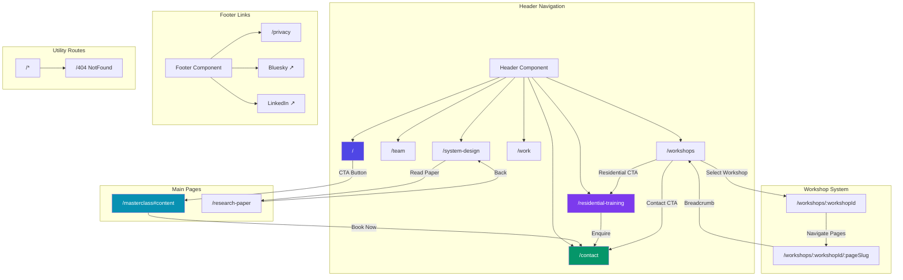
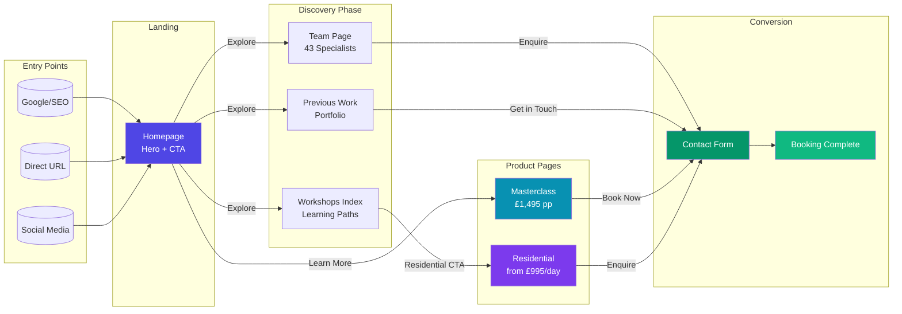
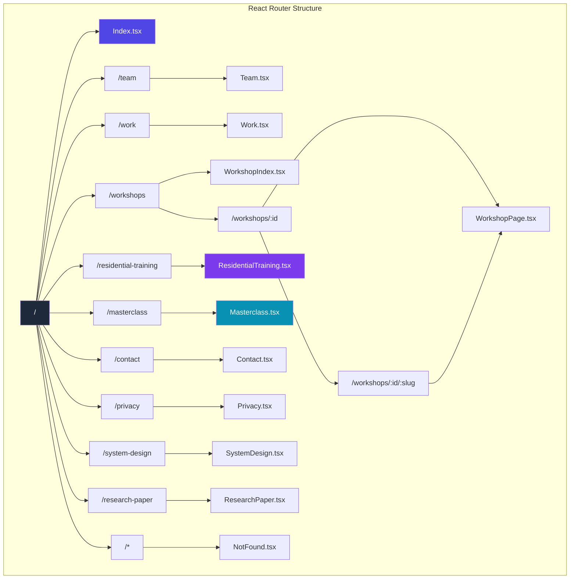
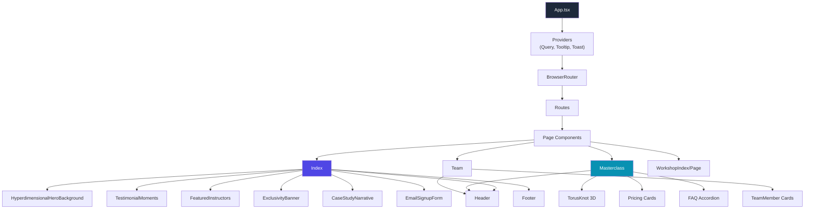

# DreamLab AI Website Architecture

## Navigation Flowchart



## User Journey Flowchart



## Route Structure



## Component Hierarchy



## Page Summary

| Route | Component | Purpose | Primary CTA |
|-------|-----------|---------|-------------|
| `/` | Index | Homepage with hero, testimonials, instructors | → `/masterclass#content` |
| `/masterclass` | Masterclass | AI Agent Masterclass details + pricing | → `/contact` |
| `/residential-training` | ResidentialTraining | Multi-day residential programme | → `/contact` |
| `/team` | Team | 43 specialists grid with selection | → `/contact?team=...` |
| `/work` | Work | Portfolio/previous projects | → `/contact` |
| `/workshops` | WorkshopIndex | Workshop catalogue & learning paths | → Workshop pages |
| `/workshops/:id/:slug` | WorkshopPage | Individual workshop content | → Next chapter |
| `/system-design` | SystemDesign | Technical architecture showcase | → `/research-paper` |
| `/research-paper` | ResearchPaper | Academic paper presentation | → `/system-design` |
| `/contact` | Contact | Enquiry/booking form | Form submission |
| `/privacy` | Privacy | Privacy policy | — |

## Key User Flows

### 1. Workshop Booking Flow
```
Homepage → Masterclass → Pricing Cards → Contact Form → Booking
```

### 2. Residential Enquiry Flow
```
Homepage → Residential Training → Programme Details → Contact Form
```

### 3. Team Selection Flow
```
Team Page → Select Members → "Enquire About Availability" → Contact (with pre-selected team)
```

### 4. Workshop Learning Flow
```
Workshops Index → Select Workshop → Navigate Chapters → Complete Workshop
```

## Technical Notes

- **Lazy Loading**: All page components are lazy-loaded via `React.lazy()`
- **Suspense**: `RouteLoader` component shown during page transitions
- **Dynamic Routes**: Workshop pages use `:workshopId` and `:pageSlug` params
- **Hash Navigation**: Masterclass uses `#content` anchor for scroll-to-section
- **Query Params**: Contact page accepts `?team=` for pre-selected team members

## File Locations

```
src/
├── App.tsx              # Router configuration
├── pages/
│   ├── Index.tsx        # Homepage
│   ├── Masterclass.tsx  # AI Agent Masterclass
│   ├── Team.tsx         # Team gallery
│   ├── Work.tsx         # Portfolio
│   ├── Contact.tsx      # Contact form
│   ├── Privacy.tsx      # Privacy policy
│   ├── WorkshopIndex.tsx    # Workshop catalogue
│   ├── WorkshopPage.tsx     # Individual workshop
│   ├── ResidentialTraining.tsx  # Residential programme
│   ├── SystemDesign.tsx     # System design showcase
│   ├── ResearchPaper.tsx    # Research paper
│   └── NotFound.tsx     # 404 page
└── components/
    ├── Header.tsx       # Navigation header
    └── ...              # Shared components
```
