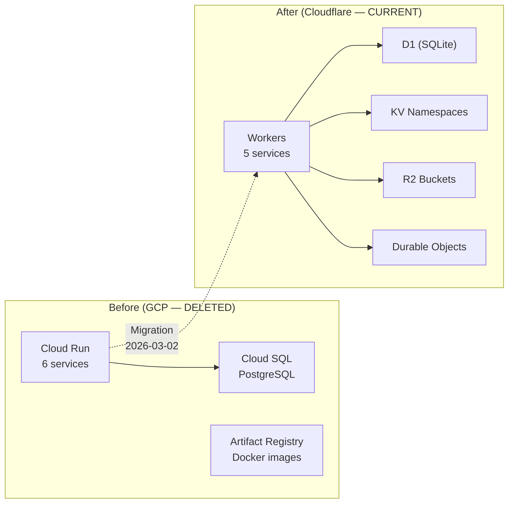

# ADR-010: Return to Cloudflare Platform

## Status

Accepted -- Migration Complete (supersedes ADR-003)

## Date

2026-02-28

## Context

DreamLab previously ran on Cloudflare Workers under the name "Nosflare" before migrating to GCP Cloud Run on 2026-01-25 (commit `7df51e1`). ADR-003 rejected Cloudflare Workers citing two primary concerns:

1. **WebSocket limitations** -- now resolved. Durable Objects support full WebSocket connections with the Hibernation API for idle cost reduction.
2. **D1 immaturity** -- now resolved. Cloudflare D1 is GA with a production SLA, supporting transactions, indexes, and databases up to 10GB.

Additional platform improvements since ADR-003:

- Workers paid tier provides 30s CPU time (up from 10ms on free tier)
- R2 provides S3-compatible object storage with 10GB free tier
- KV provides globally replicated key-value storage
- Cloudflare Pages offers unlimited bandwidth, automatic PR preview deploys, and 300+ edge PoPs
- Worker bundle size limit increased to 10MB on paid tier with WASM support
- The paa.pub project demonstrates that WebAuthn + Solid Pod storage runs entirely on Cloudflare Workers + KV + R2 with zero containers

The current GCP infrastructure costs approximately $50-100/month, requires 8 GitHub Actions workflows, a complex 8-step bootstrap sequence (SECRETS_SETUP.md), Docker builds via Artifact Registry, IAM service accounts, and Secret Manager versioning. Cold start latency ranges from 1-10 seconds on Cloud Run.

## Decision

Return to the Cloudflare platform. Migrate the majority of services to Cloudflare Workers while retaining select services on GCP Cloud Run where Cloudflare limitations remain relevant.

### Services migrated to Cloudflare Workers

| Service | Storage Backend | Rationale | Code Status |
|---------|----------------|-----------|-------------|
| **auth-api** | D1 (credentials, challenges) + KV (sessions) | WebAuthn + NIP-98 proven on Workers (paa.pub). PostgreSQL schema maps cleanly to D1 SQLite. | Deployed |
| **pod-api** (replaces JSS) | R2 (pod files) + KV (ACLs, metadata) | Replace CSS 7.x with custom Workers-native pod storage. Eliminates ephemeral storage and permissive ACL problems. | Deployed |
| **search-api** | R2 (dreamlab-vectors, .rvf files) + KV (SEARCH_CONFIG, id-to-label) | WASM-powered vector similarity search. 42KB rvf-wasm microkernel. 490K vec/sec ingest, 0.47ms p50 query. | Deployed |
| **image-api** | R2 (uploads) | Image storage on R2. Transforms via Workers paid tier (30s CPU). | Planned |
| **link-preview-api** | Stateless | Lightweight HTTP fetch + parse. Natural Workers fit. | Planned |

### Services retained on GCP Cloud Run

*None.* As of 2026-03-02, all services run on Cloudflare Workers. The nostr-relay was migrated to Workers + Durable Objects + D1 on 2026-03-01. The embedding-api was replaced by the search-api Worker's hash-based fallback embeddings (to be upgraded to ONNX WASM). The image-api was replaced by pod-api R2 storage (ADR-011).

### Frontend deployment

Deploy the existing Vite SPA to Cloudflare Pages with zero code changes. The `dist/` build output deploys directly via `wrangler pages deploy`.

### Storage architecture

| Cloudflare Service | Usage |
|--------------------|-------|
| **D1** | Structured data: `webauthn_credentials`, `challenges` tables (auth-api) |
| **KV** | Sessions, ACL documents, pod metadata, configuration |
| **R2** | Pod file storage (per-user Solid pods), uploaded media/images |

### Infrastructure Migration

### DDD bounded contexts

| Context | Runtime | Storage |
|---------|---------|---------|
| **AuthContext** | Cloudflare Workers (auth-api) | D1 + KV |
| **PodContext** | Cloudflare Workers (pod-api) | R2 + KV |
| **MediaContext** | Cloudflare Workers (pod-api) | R2 (ADR-011) |
| **SearchContext** | Cloudflare Workers (search-api) | R2 (.rvf) + KV |
| **RelayContext** | Cloudflare Workers (nostr-relay) | D1 + Durable Objects |
| **PreviewContext** | Cloudflare Workers (link-preview) | Cache API |
| **IdentityContext** | Cross-cutting | did:nostr:{pubkey} + WebID at pod URL |

## Consequences

### Positive

- **~50-60% cost reduction**: $50-100/month (GCP) to $20-40/month (Cloudflare $5/mo paid + retained Cloud Run services)
- **Sub-5ms cold starts** on Workers vs 1-10s on Cloud Run
- **300+ edge PoPs** for global low-latency responses (vs single us-central1 region on GCP)
- **Reduced deployment complexity**: no Artifact Registry, no Docker builds for migrated services, no 8-step bootstrap sequence
- **Automatic PR preview deploys** via Cloudflare Pages
- **Pod data durability**: R2 provides 99.999999999% durability vs ephemeral Cloud Run filesystem
- **Simplified secrets management**: Workers secrets are free and integrated (no Secret Manager versioning)
- **Fewer GitHub Actions workflows**: consolidate from 8 workflows to 4-5

### Negative

- **Workers CPU limit**: 30s on paid tier constrains compute-heavy operations (image transforms, ML)
- **KV write limit**: 1K writes/day on free tier requires $5/month paid plan for production
- **Split infrastructure**: relay and embedding-api remain on GCP, requiring two platforms to manage
- **D1 limitations**: SQLite semantics differ from PostgreSQL (no full-text search, different type system)
- **Migration effort**: multi-week phased migration with service-by-service cutover

### Neutral

- Cloudflare vendor lock-in replaces GCP vendor lock-in (storage APIs differ but workloads are portable)
- Durable Objects available as future option for relay WebSocket migration but not required
- JSON-LD ACL evaluator (~200 lines, custom) replaces unmaintained WAC libraries

## Alternatives Considered

### Stay on GCP Cloud Run

- Maintains current infrastructure with no migration effort
- Rejected: higher ongoing cost, cold start latency, deployment complexity, ephemeral pod storage unresolved

### Hybrid with Cloudflare CDN only (no Workers)

- Use Cloudflare as CDN/proxy in front of GCP Cloud Run
- Rejected: does not address cold starts, cost, or deployment complexity; adds another layer without eliminating GCP

### Full migration including relay to Durable Objects

- Move all services including nostr-relay to Cloudflare
- Rejected (for now): Durable Objects WebSocket + Hibernation API adds Cloudflare-specific complexity for the relay. Evaluate separately after primary migration completes.

### AWS Lambda + CloudFront

- Mature ecosystem with broad service coverage
- Rejected: higher complexity and cost than Cloudflare Workers; no advantage over current GCP setup

## Progress Update (2026-03-01)

### Completed

- **Workers code for auth-api**: Full WebAuthn registration/authentication fetch handler with D1 storage and KV sessions (`workers/auth-api/index.ts`)
- **Workers code for pod-api**: NIP-98-authenticated CRUD with WAC enforcement, R2 storage, KV metadata (`workers/pod-api/index.ts`)
- **Workers code for search-api**: WASM-powered vector similarity search using `@ruvector/rvf-wasm` microkernel (42KB). Supports 384-dim embeddings (all-MiniLM-L6-v2 compatible). Benchmarks: 490K vec/sec ingest, 0.47ms p50 query latency. R2 for `.rvf` persistence, KV for id-to-label mapping (`workers/search-api/index.ts`)
- **NIP-98 shared module consolidated**: `community-forum/packages/nip98/` with sign, verify, and types modules. Edge-compatible version at `workers/shared/nip98.ts`
- **wrangler.toml**: Complete configuration with all D1, KV, R2, and route bindings for auth-api, pod-api, and search-api
- **workers-deploy.yml**: GitHub Actions workflow for automated Workers deployment

### Deployed (2026-03-01)

- **auth-api Worker**: deployed at `https://dreamlab-auth-api.solitary-paper-764d.workers.dev`
- **pod-api Worker**: deployed at `https://dreamlab-pod-api.solitary-paper-764d.workers.dev`
- **search-api Worker**: deployed at `https://dreamlab-search-api.solitary-paper-764d.workers.dev`
- **D1 database**: `dreamlab-auth` created with schema migrated
- **KV namespaces**: SESSIONS, POD_META, CONFIG, SEARCH_CONFIG provisioned
- **R2 buckets**: `dreamlab-pods` and `dreamlab-vectors` provisioned

### Pending

- **DNS configuration**: CNAME/route records for `api.dreamlab-ai.com`, `pods.dreamlab-ai.com`, `search.dreamlab-ai.com`

### Completed (2026-03-02) -- Zero-GCP Migration

- **link-preview-api Worker**: Created and deployed (`workers/link-preview-api/index.ts`). Ports GCP Fastify service with CF Cache API, SSRF protection, Twitter oEmbed.
- **Image uploads → pod-api**: Images stored in user Solid pods on R2 (`/pods/{pubkey}/media/public/`). Client-side compression via Canvas. NIP-98 authenticated uploads. See ADR-011.
- **Search/embedding consolidation**: search-api Worker now serves `/embed` endpoint. Frontend semantic search (`ruvector-search.ts`, `embeddings-sync.ts`, `hnsw-search.ts`) updated to use search-api exclusively.
- **Agent relay routing**: VisionFlow agent DMs routed via public relay (`wss://relay.damus.io`). No bridge service needed.
- **GCP services deleted**: `services/jss/`, `services/embedding-api/`, `services/link-preview-api/`, `services/nostr-relay/`, `services/visionflow-bridge/`, `services/image-api/`
- **GCP workflows deleted**: `fairfield-embedding-api.yml`, `fairfield-image-api.yml`, `jss.yml`, `visionflow-bridge.yml`, `generate-embeddings.yml`, `SECRETS_SETUP.md`
- **Frontend environment purged**: `.env.example`, `env.d.ts`, `deploy.yml` updated to CF Worker URLs only. Zero `run.app` or `googleapis.com` references in source.

## References

- Supersedes: ADR-003 (GCP Cloud Run Infrastructure)
- Extended by: ADR-011 (Images and Media Storage in Solid Pods)
- Related: ADR-008 (PostgreSQL Relay Storage -- superseded by D1 + Durable Objects)
- PRD: `docs/prd-cloudflare-workers-migration.md`
- GCP migration history: `.github/workflows/GCP_MIGRATION_SUMMARY.md`
- paa.pub reference implementation: Cloudflare Workers + KV + R2 for WebAuthn + Solid Pod
- [Cloudflare Workers documentation](https://developers.cloudflare.com/workers/)
- [Cloudflare D1 documentation](https://developers.cloudflare.com/d1/)
- [Cloudflare R2 documentation](https://developers.cloudflare.com/r2/)
- [Cloudflare Pages documentation](https://developers.cloudflare.com/pages/)
