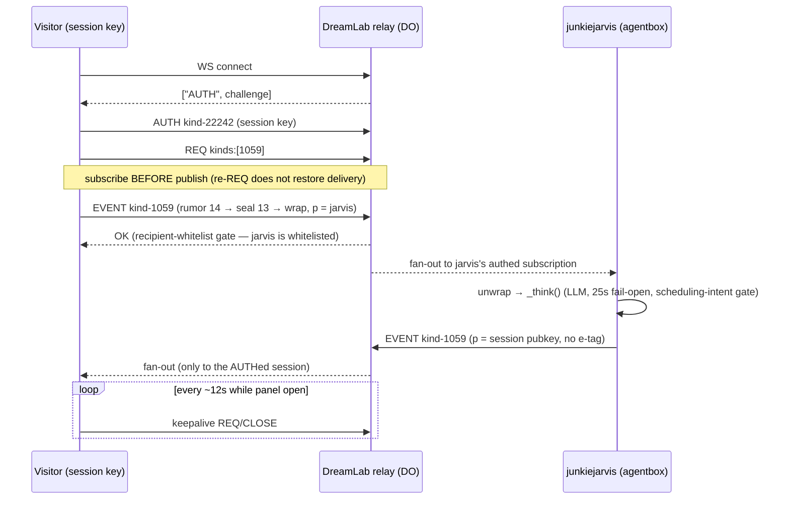

# ADR-042: Website Agent Chat Routing — "Talk to AI" as a Nostr DM Conversation with junkiejarvis

## Status: Proposed

## Date: 2026-07-14

## Context

The marketing site ships a global "Talk to AI" chat FAB
(`src/components/AIChatFab.tsx`, mounted in `App.tsx`) that POSTs each message
to `VITE_AI_CHAT_URL` (`AIChatFab.tsx:19,229`). That variable has never been
configured in any workflow or `.env.example` — it is catalogued as a dead
declaration in
[`forum-deployment-sequence.md`](../architecture/forum-deployment-sequence.md)
F-5 (line 287). Every visitor therefore receives the hardcoded "I'm not
connected yet" copy. Meanwhile a live conversational agent already exists on
the platform's own transport.

**junkiejarvis's live contract.** The agent
(pubkey `2de44d5622eef79519ac078f6e227a85aecbaefd561e4e50c5f51dfadbf916e9`) is
implemented in the agentbox repo at `management-api/lib/junkiejarvis-agent.js`
(869 lines), started from `server.js:1157-1201` on the always-on management-api
process, gated by `JUNKIEJARVIS_ENABLED` (env-wins-when-set semantics,
`server.js:1164-1170`). Its behaviour, traced at source:

- **Two invocation surfaces** (`junkiejarvis-agent.js:524-559, 597-670`): it
  subscribes `{kinds:[1059], '#p':[jj]}` (NIP-59 gift-wrapped DMs, unwrapped to
  a kind-14 rumor) and `{kinds:[42], '#p':[jj]}` (NIP-28 channel mentions).
- **DM replies carry no correlation.** `_sendDm`
  (`junkiejarvis-agent.js:638-654`) emits a rumor whose tags are only
  `[['p', recipient]]` — no e-tag back to the asker's question. Channel replies
  do thread via NIP-10 e-tags (`672-701`), but DMs do not. A client cannot
  match overlapping in-flight questions to replies; the only sound model is a
  serial conversation per key.
- **25 s LLM timeout, fail-open.** `callLlm`
  (`junkiejarvis-agent.js:316-447`) enforces a hard 25 s AbortController
  timeout; any failure returns a canned apology rather than silence, so the
  agent always replies once it receives a message.
- **Calendar-fabrication guardrail.** QA bug B5
  ([`forum-qa-bugs-2026-06-17.md`](../sprint/forum-qa-bugs-2026-06-17.md),
  lines 71-76) recorded junkiejarvis fabricating a real kind-31923 calendar
  event from chit-chat. Agentbox commit `5e626c20` added a deterministic
  `hasSchedulingIntent` gate (`junkiejarvis-agent.js:259-286, 723-745`) inside
  the shared `_think()` path, so any surface routed through the same agent
  instance inherits the fix with no site-side work.
- **Three-relay fan-out.** The agent's bridge publishes replies to the DreamLab
  relay plus `relay.damus.io` and `relay.primal.net` (agentbox `NOSTR_RELAYS`).

**The relay decides which addressing path is possible.** The kit relay's
admission gate (`nostr-bbs-relay-worker/src/relay_do/nip_handlers.rs:430-451`,
upstream kit [ADR-104]) admits kind-1059 gift wraps based solely on whether the
*recipient* (first `["p", …]` tag) is whitelisted — the ephemeral author is
deliberately unchecked, and publishing an EVENT requires no NIP-42 AUTH.
junkiejarvis **is** in the D1 whitelist (live-verified 2026-07-14 via
NIP-98-authed `GET /api/whitelist/list`; also asserted in
`scripts/seed/publish-foreign-reply.mjs:25-27`), so an anonymous visitor's
freshly minted keypair can DM it with zero provisioning. Kind-42 channel
messages fall into the author-whitelist branch (`nip_handlers.rs:454-465`), so
channel mentions are *not* usable by anonymous visitors. Reading kind-1059
requires NIP-42 AUTH, and the filter's `#p` is force-rewritten to the authed
pubkey (`gate_kind_1059_filters`, `nip_handlers.rs:1170-1199`) — any keypair
can AUTH; no whitelist entry is needed to read one's own inbox.

**Relay liveness quirks (empirical).** The Cloudflare Durable Object stops
pushing live events to an idle subscription after ~20 s without closing the
socket (agentbox `mcp/servers/nostr-bridge.js:102-113`, with a measured
example), and re-REQ does not reliably restore live delivery
(`scripts/seed/probes/probe-jj-live.mjs`). The agent's own bridge mitigates
with a 12 s keepalive. Any web client must subscribe *before* publishing its
question and keep the session warm, or replies are silently lost.

**Config gaps.** `deploy.yml` passes only `VITE_SUPABASE_*` and
`VITE_AUTH_API_URL` to the React build env block; `VITE_RELAY_URL` exists at
workflow level but is not visible to the React build, and `VITE_JARVIS_PUBKEY`
does not exist. Separately, junkiejarvis is absent from
`forum-config/dreamlab.toml` `[[agents]]` (lines 282-322 list six agents)
despite being live-whitelisted — a pre-existing roster drift, since that table
is documented in-file as "the authored source of truth" for relay whitelist
seeding.

The site's CSP already permits the relay (`index.html` `connect-src` includes
`wss://*.solitary-paper-764d.workers.dev`). Federation posture: single relay
today; federation-ready by construction (kind 1059 is already in
`federated_kinds`); the mesh transport is designed, not shipped — no
multi-node delivery exists.

## Decision

Route the "Talk to AI" box to junkiejarvis as a client-side Nostr DM
conversation. No new backend; `VITE_AI_CHAT_URL` is retired everywhere.

1. **DM-only addressing.** The client sends kind-14 rumors gift-wrapped
   (NIP-17 over NIP-59) to `VITE_JARVIS_PUBKEY` and publishes the kind-1059
   wrap directly to `VITE_RELAY_URL` over a raw WebSocket. Channel mentions
   (kind 42) are rejected as an addressing path: the relay's author-whitelist
   gate makes them unusable for anonymous visitors without an admin-provisioned
   identity.

2. **Per-session ephemeral key.** Each page load mints an in-memory secp256k1
   keypair (`nostr-tools` `generateSecretKey()`); nothing is persisted. The
   existing tier UI is retained: tiers 2/3 keep the NIP-07 sign-in as an
   identity *signal* (the greeting shows the user's pubkey), but DMs still ride
   the ephemeral session key — NIP-07 `signEvent` cannot portably perform the
   NIP-44 unwrap needed to read arbitrary gift wraps, and the session key keeps
   the read path uniform across tiers.

3. **Protocol sequence: AUTH, subscribe, then publish.** On panel open the
   client connects, answers the relay's `['AUTH', challenge]` by signing a
   kind-22242 event with the session key (NIP-42), issues
   `REQ {kinds:[1059], '#p':[sessionPubkey]}`, and only then publishes the
   wrapped question. Subscribe-before-publish is mandatory because re-REQ does
   not restore live delivery (probe-jj-live.mjs finding).

4. **Application-level keepalive, ~12 s cadence.** Browsers cannot send
   WebSocket pings, so while the panel is open the client re-issues a cheap
   `REQ`/`CLOSE` pair roughly every 12 s (mirroring the agent bridge's own
   keepalive interval) to defeat the ~20 s idle push-death. Teardown on FAB
   close/unmount.

5. **Serialised sends with a 30 s client timeout.** DM replies have no e-tag
   correlation, so the input is disabled while a reply is outstanding — one
   in-flight question at a time. The client times out at 30 s with friendly
   fallback copy; this sits above the agent's 25 s fail-open LLM timeout, so a
   slow LLM produces the agent's own apology, and only genuine transport or
   agent-down failures hit the client timeout.

6. **nostr-tools only; no NDK.** `nostr-tools` (already `^2.23.3`, byte-
   compatible `nip59.wrapEvent`/`unwrapEvent`) moves devDependencies →
   dependencies with a dedicated Vite manual chunk. `@nostr-dev-kit/ndk`
   remains an unused devDependency: adopting it would add a second client
   abstraction and duplicate the `@noble` crypto family in the bundle for no
   capability this feature needs. All DM primitives live in the shared module
   `src/lib/nostr.ts` introduced alongside
   [ADR-041](041-anonymous-contact-dm-ingress.md).

7. **Config wiring.** `VITE_JARVIS_PUBKEY` is added to the deploy/CI env
   blocks, `.env.example`, and `vite-env.d.ts`, with its value sourced from the
   `forum-config/dreamlab.toml` `[[agents]]` roster. This is a hand-synced copy
   of a `dreamlab.toml` datum — the same posture as the existing
   `admin-pubkeys-sync` mirrors, and subject to
   [ADR-037](037-config-single-source-of-truth.md)'s deferred O1/O2
   single-source generator; the pairing is recorded here so the eventual
   generator picks it up.

8. **Roster drift-close.** junkiejarvis is added to `dreamlab.toml`
   `[[agents]]` (label `junkiejarvis`, pubkey `2de44d56…16e9`, role
   "Conversational agent — website chat + forum DMs", cohorts
   `["dreamlab", "agent"]`,
   `authorised_by = "6407eed80e2a8646e41a5ddba0ae6619425fc54af40e2b30482b9623c682425a"`
   — operator-jjohare), following the
   [ADR-040](040-gap-close-edge-decisions.md) D4 roster-legibility shape. This
   closes the gap where a live-whitelisted agent was absent from the authored
   source of truth, and gives `VITE_JARVIS_PUBKEY` a canonical source.

### Alternatives considered

| Alternative | Verdict | Rationale |
|---|---|---|
| Keep the HTTP POST shape and build a chat worker that fronts junkiejarvis | Rejected | Adds a new worker surface (upstream, per the CLAUDE.md ownership rule), a service signing key, and a plaintext transit point for visitor messages that client-side wrapping avoids. The relay already admits the event; the agent already replies. Same reasoning that rejected an HTTP bridge in [ADR-041](041-anonymous-contact-dm-ingress.md). |
| Kind-42 channel mentions (`@junkiejarvis` in a public zone) | Rejected | The relay's non-1059 branch requires the *author* to be whitelisted (`nip_handlers.rs:454-465`); anonymous visitors are not, and provisioning a shared website identity would create an unattributable whitelisted key. The DM path is the only zero-provisioning route. |
| Adopt NDK as the client library | Rejected | Second Nostr abstraction alongside `nostr-tools`, `@noble` version-family duplication in the bundle, no needed capability beyond `nip59.wrapEvent`/`unwrapEvent` and a raw WebSocket — all already proven in `scripts/seed/probes/probe-agent-bridge-dm.mjs`. |
| Persistent per-browser identity (localStorage keypair) for chat continuity | Rejected for v1 | Privacy by default: a throwaway per-session key leaves no linkable identifier on the device and nothing to erase. Recorded as a future option if returning-visitor history is wanted; it is a product change, not an architectural one. |

## Consequences

### Positive

- A dead stub becomes a working feature against a live agent with **zero
  provisioning**: junkiejarvis is already whitelisted (live-verified
  2026-07-14), so — unlike ADR-041's admin-recipient path — no runbook step
  gates launch on the relay side.
- Zero upstream code changes: no kit PR, no agentbox PR, no new worker. The
  `hasSchedulingIntent` guardrail is inherited automatically because both DM
  and channel paths share `_think()`.
- Privacy by default: messages are end-to-end encrypted (NIP-44 at seal and
  wrap layers), the session key is never persisted, and the relay's AUTH +
  `#p`-rewrite read gate means no other party — authenticated or not — can
  read the visitor's inbox.
- Federation-ready by construction: kind 1059 is already in `federated_kinds`,
  so the conversation transport propagates unchanged if a mesh transport ever
  ships. Single relay today; no multi-node behaviour is claimed or depended on.

### Negative / Trade-offs

- **LLM-cost abuse surface.** Anonymous visitors can mint unlimited fresh keys,
  each entitled to LLM-triggering DMs; upstream has no per-pubkey throttle
  (only exact-event-id dedup in the agent and 10 events/sec/IP at the relay,
  `broadcast.rs:138-154`). Mitigations: serialised sends (one in-flight
  question), a client-side per-session send throttle, and the ops kill-switch
  `JUNKIEJARVIS_ENABLED=0` (agentbox env gate, `server.js:1164-1170`).
  A per-pubkey/session cooldown in `JunkieJarvisAgent` is flagged as an
  upstream agentbox ask; it is not implemented here.
- **Residual calendar-fabrication surface.** The scheduling-intent gate
  suppresses LLM-invented events, but an anonymous message that genuinely
  co-locates a date and event vocabulary ("let's meet next Friday for a demo")
  can still cause junkiejarvis to publish a real, forum-visible kind-31923
  event signed as itself. **Launch precondition:** verify the deployed agentbox
  image includes commit `5e626c20`. Upstream ask (flagged, not implemented):
  suppress `create_event` directives for non-member senders.
- **Replies also land on public relays.** The agent's bridge publishes to
  damus and primal as well as the DreamLab relay. The payload is NIP-44
  encrypted to the session key, so only ciphertext plus the throwaway `p` tag
  is exposed — accepted as metadata-only leakage.
- **No chat history across reloads.** The session key dies with the page; a
  reload starts a fresh conversation. Accepted as the price of the
  privacy-default session model (see the rejected persistence alternative).
- Strictly serial conversation: multi-turn concurrency requires an upstream
  change adding `['e', askerRumorId]` to `_sendDm`'s rumor tags — recorded as
  a future upstream ask, not a blocker.

### Neutral

- The tier selector's semantics shift slightly: with no HTTP backend, the tier
  is purely a client-side capability label plus an optional NIP-07 identity
  signal; the old NIP-98 `Authorization` token path in `AIChatFab.tsx:71-90`
  is removed with the fetch call.
- The old component's per-session `sessionId` (`AIChatFab.tsx:100-102`) is
  conceptually replaced by the ephemeral keypair — the session *is* the key.
- Whether junkiejarvis remains enabled at all stays an agentbox/ops decision
  (manifest default `false`, env-overridden `true`); the site degrades to the
  30 s-timeout fallback copy if the agent is off.

## Related Decisions

- [ADR-041](041-anonymous-contact-dm-ingress.md): sibling feature (contact
  form → admin DM). Shares the `src/lib/nostr.ts` primitives, the client-side
  direct-publish model, and the gift-wrap ingress analysis; differs in that
  its recipient (operator-jjohare) required a whitelist runbook step, whereas
  junkiejarvis needs none.
- [ADR-040](040-gap-close-edge-decisions.md): D4's `authorised_by` roster shape
  is followed by the new `[[agents]]` entry; D3 establishes operator-jjohare
  (`6407eed8…425a`) as the authorising principal cited here.
- [ADR-037](037-config-single-source-of-truth.md): `VITE_JARVIS_PUBKEY` is a
  new hand-synced mirror of a `dreamlab.toml` datum, noted for the deferred
  O1/O2 generator.
- Upstream kit `docs/adr/ADR-104-gift-wrap-recipient-admission.md`: the
  recipient-gated kind-1059 admission this design stands on.
- Upstream kit `docs/adr/ADR-101-multi-device-dm-delivery.md`: multi-device DM
  delivery (accepted, implementation deferred) — the eventual home of any
  richer DM correlation/delivery semantics.
- [PRD: Nostr Contact & Agent Chat v1.0](../prd/prd-nostr-contact-and-agent-chat-v1.0.md):
  the delivery plan, success criteria, and full risk register for both features.
- [DDD: Website Nostr Ingress context](../ddd/11-website-nostr-ingress-context.md):
  the bounded context owning the chat-session aggregate and its invariants
  (including that junkiejarvis here is the agentbox bridge agent, not the
  kit's aspirational agent-worker).

## References

- agentbox `management-api/lib/junkiejarvis-agent.js` — subscriptions
  (524-559, 597-670), `_sendDm` no-e-tag reply (638-654), channel threading
  (672-701), `callLlm` 25 s fail-open (316-447), `hasSchedulingIntent`
  (259-286, 723-745), `startJunkieJarvis` gating (788-837)
- agentbox `management-api/server.js:1157-1201` — startup wiring and
  `JUNKIEJARVIS_ENABLED` env-wins gate
- agentbox `mcp/servers/nostr-bridge.js:102-113` — ~20 s idle push-death
  observation and 12 s keepalive rationale
- Kit `nostr-bbs-relay-worker/src/relay_do/nip_handlers.rs` — gift-wrap
  admission (430-451), author-whitelist branch (454-465),
  `gate_kind_1059_filters` (1170-1199); `broadcast.rs:138-154` — per-IP limit
- `scripts/seed/probes/probe-jj-live.mjs` — re-REQ does not restore live
  delivery; `scripts/seed/probes/probe-agent-bridge-dm.mjs` — reference DM
  round-trip; `scripts/seed/test-junkiejarvis.mjs` — AUTH + REQ-before-EVENT
  sequence; `scripts/seed/publish-foreign-reply.mjs:25-27` — whitelisting
  assertion
- `src/components/AIChatFab.tsx` — current implementation being replaced
- [`forum-deployment-sequence.md`](../architecture/forum-deployment-sequence.md)
  F-5 (line 287) — `VITE_AI_CHAT_URL` never configured
- [`forum-qa-bugs-2026-06-17.md`](../sprint/forum-qa-bugs-2026-06-17.md) B5 —
  calendar-fabrication bug; fixed in agentbox commit `5e626c20`
- `forum-config/dreamlab.toml` `[[agents]]` (282-322) — the roster the new
  entry joins
