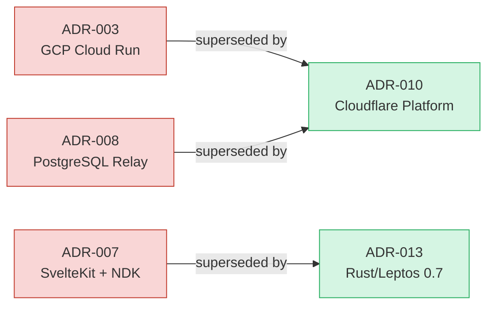
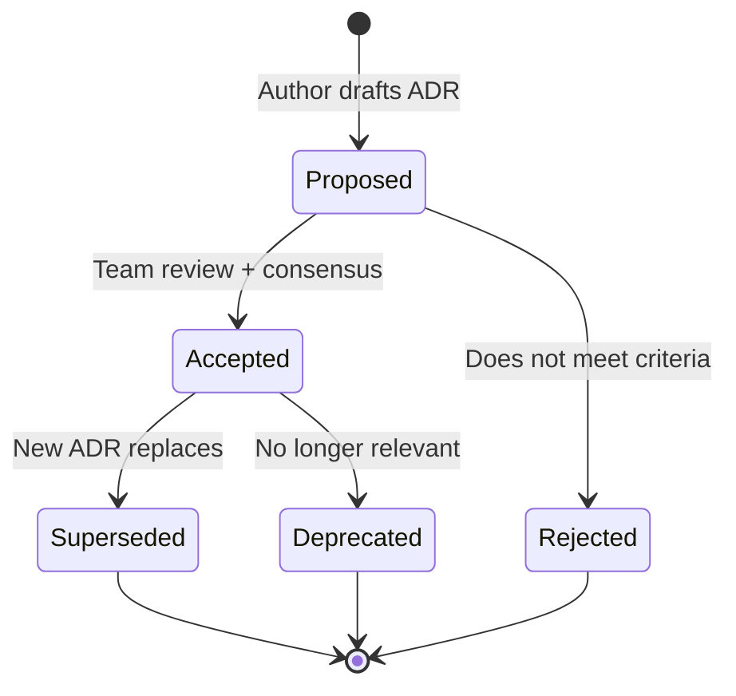

# Architecture Decision Records

**Last updated:** 2026-03-08 | [Back to Documentation Index](../README.md)

This directory contains the Architecture Decision Records (ADRs) for the DreamLab community forum Rust port. ADRs 001--012 are historical (source files not present in this tree); ADRs 013--019 have full files in this directory.

## Index

| ADR | Title | Status | File |
|-----|-------|--------|------|
| 001 | Nostr Protocol as Foundation | Accepted | historical |
| 002 | Three-Tier BBS Hierarchy | Accepted | historical |
| 003 | GCP Cloud Run Infrastructure | Superseded by 010 | historical |
| 004 | Zone-Based Access Control | Accepted | historical |
| 005 | NIP-44 Encryption Mandate | Accepted | historical |
| 006 | Client-Side WASM Search | Accepted | historical |
| 007 | SvelteKit + NDK Frontend | Superseded by 013 | historical |
| 008 | PostgreSQL Relay Storage | Superseded by 010 | historical |
| 009 | User Registration Flow | Accepted | historical |
| 010 | Return to Cloudflare Platform | Accepted | historical |
| 011 | Images to Solid Pods | Accepted | historical |
| 012 | Hardening Sprint | Accepted | historical |
| 013 | [Rust/Leptos 0.7 as Forum UI Framework](013-rust-leptos-forum-framework.md) | Accepted | present |
| 014 | [Hybrid Validation Phase Before Full Rewrite](014-hybrid-validation-phase.md) | Accepted | present |
| 015 | [Selective Workers Port Strategy (3 Rust, 2 TypeScript)](015-workers-port-strategy.md) | Accepted | present |
| 016 | [nostr-sdk 0.44.x as Nostr Protocol Layer](016-nostr-sdk-protocol-layer.md) | Accepted | present |
| 017 | [passkey-rs for WebAuthn/FIDO2 with PRF Extension](017-passkey-rs-webauthn-prf.md) | Accepted | present |
| 018 | [Testing Strategy for Rust Port](018-testing-strategy-rust-port.md) | Accepted | present |
| 019 | [Versioned Planning Governance and Tranche-Based Delivery](019-plan-governance-and-delivery-structure.md) | Accepted | present |

## Supersession Chain

## ADR Lifecycle

## Conventions

- ADRs use sequential numbering (zero-padded to 3 digits).
- Status values: `Proposed`, `Accepted`, `Superseded`, `Deprecated`, `Rejected`.
- Each ADR follows the format: Title, Status, Context, Decision, Consequences.
- Consequences are categorized as Positive, Negative, and Neutral.
- ADRs are immutable once accepted; new ADRs supersede old ones rather than editing.

## Related Documents

- [Documentation Index](../README.md)
- [PRD: Rust Port v2.0.0](../prd-rust-port.md)
- [PRD: Rust Port v2.1.0](../prd-rust-port-v2.1.md)
- [DDD Overview](../ddd/README.md)
- [Deployment Overview](../deployment/README.md)
