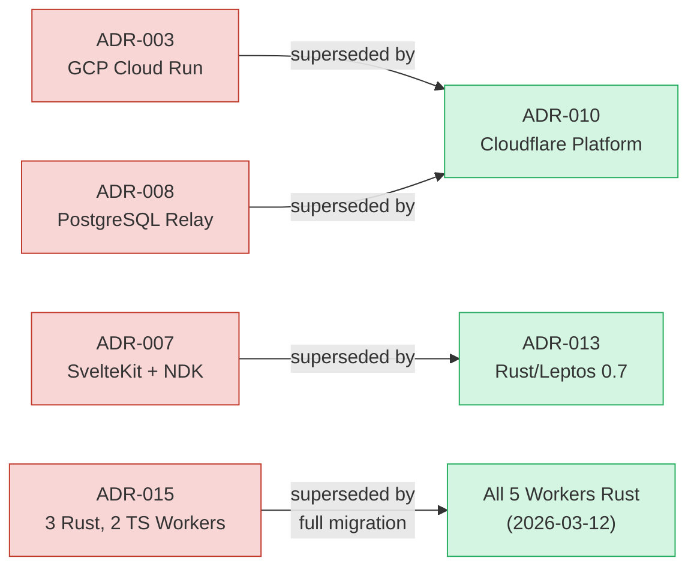
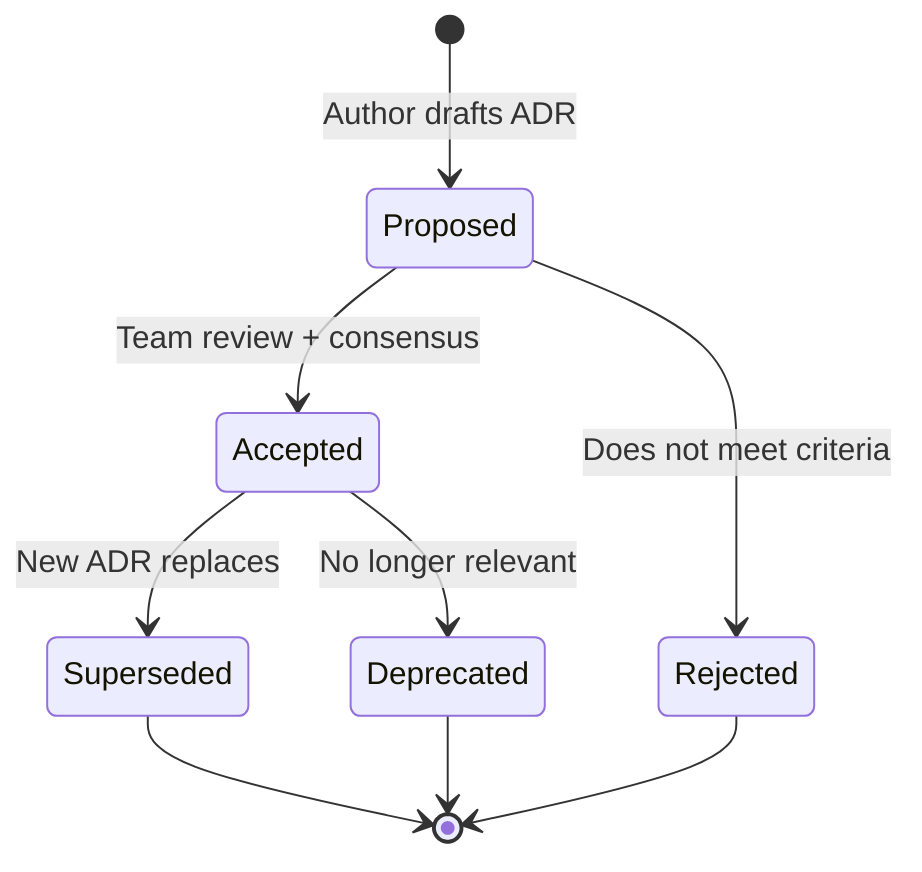

# Architecture Decision Records

**Last updated:** 2026-03-16 | [Back to Documentation Index](../README.md)

This directory contains the Architecture Decision Records (ADRs) for the DreamLab community forum Rust port. ADRs 001--012 are historical (source files not present in this tree); ADRs 013--023 have full files in this directory.

> **Migration Complete (2026-03-12):** All 5 backend workers are Rust in `community-forum-rs/crates/`. The Leptos forum client is at ~95% parity. SvelteKit `community-forum/` and TypeScript `workers/` directories have been deleted. ADRs written before 2026-03-12 may reference deleted paths — see status update notes on individual ADRs.

## Index

| ADR | Title | Status | File |
|-----|-------|--------|------|
| 001 | Nostr Protocol as Foundation | Accepted | historical |
| 002 | Three-Tier BBS Hierarchy | Accepted | historical |
| 003 | GCP Cloud Run Infrastructure | Superseded by 010 | historical |
| 004 | Zone-Based Access Control | Accepted | historical |
| 005 | NIP-44 Encryption Mandate | Accepted | historical |
| 006 | Client-Side WASM Search | Accepted | historical |
| 007 | SvelteKit + NDK Frontend | Superseded by 013 | historical |
| 008 | PostgreSQL Relay Storage | Superseded by 010 | historical |
| 009 | User Registration Flow | Accepted | historical |
| 010 | Return to Cloudflare Platform | Accepted | historical |
| 011 | Images to Solid Pods | Accepted | historical |
| 012 | Hardening Sprint | Accepted | historical |
| 013 | [Rust/Leptos 0.7 as Forum UI Framework](013-rust-leptos-forum-framework.md) | Accepted | present |
| 014 | [Hybrid Validation Phase Before Full Rewrite](014-hybrid-validation-phase.md) | Accepted (superseded by full port) | present |
| 015 | [Selective Workers Port Strategy (3 Rust, 2 TypeScript)](015-workers-port-strategy.md) | Accepted (superseded — all 5 now Rust) | present |
| 016 | [nostr-sdk 0.44.x as Nostr Protocol Layer](016-nostr-sdk-protocol-layer.md) | Accepted | present |
| 017 | [passkey-rs for WebAuthn/FIDO2 with PRF Extension](017-passkey-rs-webauthn-prf.md) | Accepted | present |
| 018 | [Testing Strategy for Rust Port](018-testing-strategy-rust-port.md) | Accepted | present |
| 019 | [Versioned Planning Governance and Tranche-Based Delivery](019-plan-governance-and-delivery-structure.md) | Accepted | present |
| 020 | [WebGPU Rendering with Progressive Fallback](020-webgpu-fallback-rendering.md) | Accepted | present |
| 021 | [Offline-First Architecture with IndexedDB](021-offline-first-indexeddb.md) | Accepted | present |
| 022 | [NIP-29 Group-Based Access Control Model](022-nip29-group-access-model.md) | Accepted | present |
| 023 | [Forum Relay Layer Hardening](023-forum-relay-hardening.md) | Accepted | present |
| 024 | [Security Hardening Sprint](024-security-hardening-sprint.md) | Accepted | present |
| 025 | [Solid Pod Infrastructure Upgrade](025-solid-pod-infrastructure-upgrade.md) | Accepted | present |
| 026 | [Forum Professionalisation](026-forum-professionalisation.md) | Accepted | present |
| 027 | [Canonical Identity Stack](027-canonical-identity-stack.md) | Accepted | present |
| 028 | [Solid Pod RS AGPL Boundary](028-solid-pod-rs-agpl-boundary.md) | Accepted | present |
| 029 | [JSON-LD Processing Strategy](029-json-ld-processing-strategy.md) | Accepted | present |
| 030 | [Authentication Signer Abstraction](030-authentication-signer-abstraction.md) | Accepted | present |
| 031 | [DM Protocol Standardisation](031-dm-protocol-standardisation.md) | Accepted | present |
| 032 | [Agent Job Marketplace (NIP-90)](032-agent-job-marketplace-nip90.md) | Accepted | present |
| 033 | [Multi-Admin Moderation Architecture](033-multi-admin-moderation-architecture.md) | Accepted | present |
| 034 | [Nostr Relay NIP Conformance](034-nostr-relay-nip-conformance.md) | Accepted | present |

> **Note:** ADR-032 (Agent Job Marketplace) established the agent interaction model. The Agent Control Surface governance feature (kinds 31400-31405, `/governance` route) builds on this foundation. See [forum-config/README.md](../../forum-config/README.md#governance-configuration) for the operator config.

## Supersession Chain

## ADR Lifecycle

## Conventions

- ADRs use sequential numbering (zero-padded to 3 digits).
- Status values: `Proposed`, `Accepted`, `Superseded`, `Deprecated`, `Rejected`.
- Each ADR follows the format: Title, Status, Context, Decision, Consequences.
- Consequences are categorized as Positive, Negative, and Neutral.
- ADRs are immutable once accepted; new ADRs supersede old ones rather than editing.

## Related Documents

- [Documentation Index](../README.md)
- [PRD: Rust Port v2.0.0](../prd/prd-rust-port.md)
- [PRD: Rust Port v2.1.0](../prd/prd-rust-port-v2.1.md)
- [DDD Overview](../ddd/README.md)
- [Deployment Overview](../deployment/README.md)
