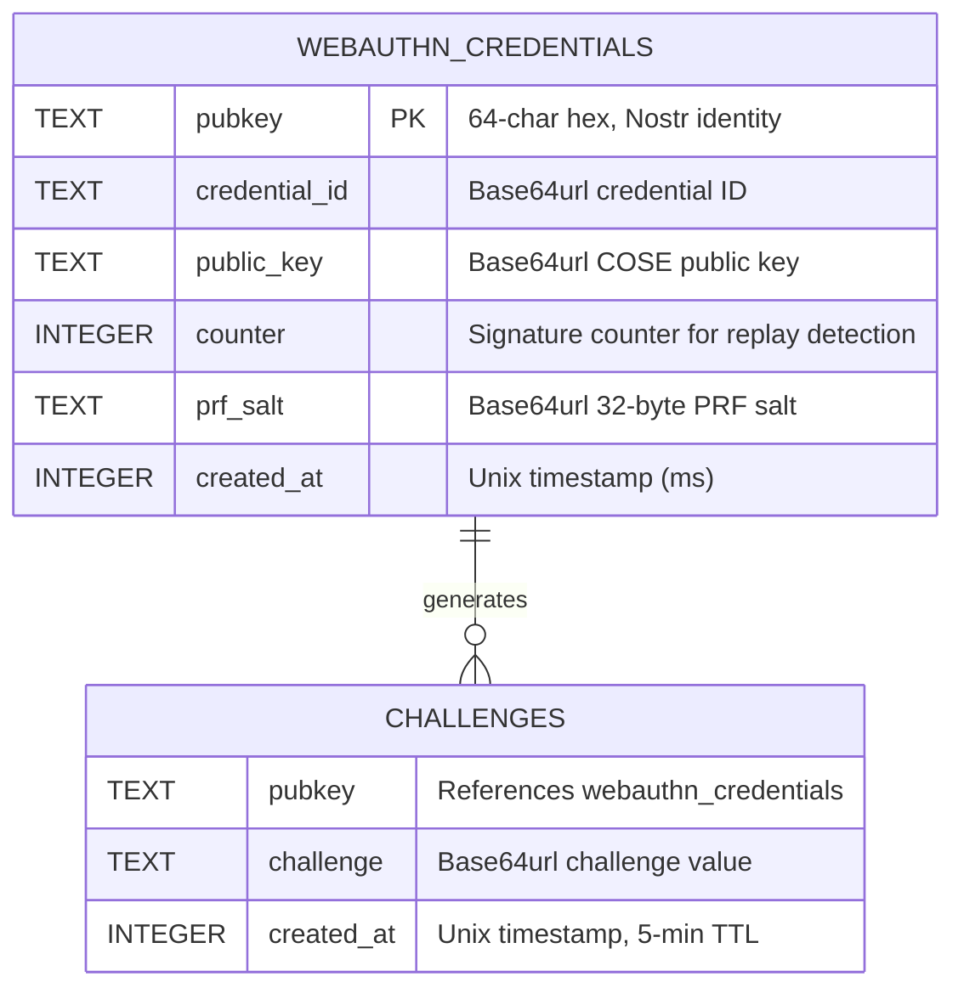

# Auth API -- auth-worker (Rust Port)

**Last updated:** 2026-03-08 | [Back to Documentation Index](../README.md)

---

## Table of Contents

- [Overview](#overview)
- [Request/Response Flow](#requestresponse-flow)
- [Endpoints](#endpoints)
- [NIP-98 Auth Header](#nip-98-auth-header)
- [D1 Schema](#d1-schema)
- [Environment Bindings](#environment-bindings)
- [Related Documents](#related-documents)

---

## Overview

WebAuthn registration/authentication with PRF extension, NIP-98 verification, and Solid pod provisioning. Rust Worker using `worker` 0.7.5 and `passkey-rs` 0.3.x.

**Base URL:** `https://api.dreamlab-ai.com`

---

## Request/Response Flow

```mermaid
flowchart LR
    subgraph "Client"
        C[Leptos WASM]
    end

    subgraph "Cloudflare Edge"
        CF[TLS + CORS]
    end

    subgraph "auth-worker"
        ROUTER[Router]
        REG_OPT[/auth/register/options]
        REG_VER[/auth/register/verify]
        LOG_OPT[/auth/login/options]
        LOG_VER[/auth/login/verify]
        LOOKUP[/auth/lookup]
        PROFILE[/api/profile]
        HEALTH[/health]
    end

    subgraph "Storage"
        D1[(D1: dreamlab-auth)]
        KV_S[(KV: SESSIONS)]
        KV_P[(KV: POD_META)]
        R2[(R2: dreamlab-pods)]
    end

    C --> CF --> ROUTER
    ROUTER --> REG_OPT & REG_VER & LOG_OPT & LOG_VER & LOOKUP & PROFILE & HEALTH
    REG_OPT --> D1
    REG_VER --> D1
    REG_VER --> KV_P
    REG_VER --> R2
    LOG_OPT --> D1
    LOG_VER --> D1
    LOG_VER --> KV_S
    LOOKUP --> D1
    PROFILE --> R2
```

---

## Endpoints

### POST /auth/register/options

Generate WebAuthn registration options with server-controlled PRF salt.

**Request:**

```json
{
  "displayName": "Alice"
}
```

**Response (200):**

```json
{
  "publicKey": {
    "rp": { "id": "dreamlab-ai.com", "name": "DreamLab AI" },
    "user": { "id": "...", "name": "...", "displayName": "Alice" },
    "challenge": "<base64url>",
    "pubKeyCredParams": [{ "type": "public-key", "alg": -7 }],
    "authenticatorSelection": {
      "residentKey": "required",
      "userVerification": "required"
    },
    "extensions": { "prf": { "eval": { "first": "<base64url salt>" } } }
  },
  "prfSalt": "<base64url 32 bytes>"
}
```

Challenge is stored in D1 with a 5-minute TTL.

### POST /auth/register/verify

Complete registration. Client sends credential attestation and PRF-derived pubkey.

**Request:**

```json
{
  "pubkey": "<64-char hex>",
  "response": {
    "id": "<credential-id>",
    "response": {
      "attestationObject": "<base64url>",
      "clientDataJSON": "<base64url>"
    }
  },
  "prfSalt": "<base64url>"
}
```

**Response (201):**

```json
{
  "verified": true,
  "pubkey": "<64-char hex>",
  "didNostr": "did:nostr:<pubkey>",
  "webId": "https://pods.dreamlab-ai.com/<pubkey>/profile/card#me",
  "podUrl": "https://pods.dreamlab-ai.com/<pubkey>/"
}
```

Side effects: Creates profile card in R2, default ACL in KV (`POD_META`), pod metadata in KV.

### POST /auth/login/options

Generate authentication options. Returns the stored PRF salt for key re-derivation.

**Request:**

```json
{
  "pubkey": "<64-char hex>"
}
```

**Response (200):**

```json
{
  "publicKey": {
    "challenge": "<base64url>",
    "rpId": "dreamlab-ai.com",
    "allowCredentials": [{ "type": "public-key", "id": "<credential-id>" }],
    "userVerification": "required",
    "extensions": { "prf": { "eval": { "first": "<base64url stored salt>" } } }
  },
  "prfSalt": "<base64url>"
}
```

**Error (404):**

```json
{
  "error": "No passkey registered",
  "code": "NO_CREDENTIAL"
}
```

### POST /auth/login/verify

Verify WebAuthn assertion and NIP-98 authorization header.

**Request Headers:** `Authorization: Nostr <base64(kind:27235 event)>`

**Request Body:**

```json
{
  "response": {
    "id": "<credential-id>",
    "response": {
      "authenticatorData": "<base64url>",
      "clientDataJSON": "<base64url>",
      "signature": "<base64url>"
    }
  }
}
```

**Verification steps:**
1. Validate NIP-98 token (kind, timestamp, URL, method, signature)
2. Match credential ID to stored credential
3. Verify clientDataJSON (type, challenge, origin)
4. Verify authenticatorData (rpIdHash, UP/UV flags)
5. Verify counter has advanced (replay detection)
6. Update counter in D1, consume challenge

**Response (200):**

```json
{
  "verified": true,
  "pubkey": "<64-char hex>",
  "didNostr": "did:nostr:<pubkey>"
}
```

### POST /auth/lookup

Look up pubkey by credential ID (discoverable credential flows).

**Request:**

```json
{
  "credentialId": "<base64url>"
}
```

**Response (200):**

```json
{
  "pubkey": "<64-char hex>"
}
```

### GET /api/profile (NIP-98 Protected)

Returns the authenticated user's Solid profile card from R2.

**Request Headers:** `Authorization: Nostr <base64(kind:27235 event)>`

**Response (200):** `Content-Type: application/ld+json`

```json
{
  "@context": "https://www.w3.org/ns/solid/terms",
  "@id": "#me",
  "name": "Alice",
  "pubkey": "<64-char hex>"
}
```

### GET /health

**Response (200):**

```json
{
  "status": "ok",
  "service": "auth-api",
  "runtime": "workers"
}
```

---

## NIP-98 Auth Header

Format: `Authorization: Nostr <base64(kind:27235 event)>`

Tags: `["u", "<url>"]`, `["method", "<HTTP method>"]`, optional `["payload", "<sha256 hex of body>"]`.

The server recomputes the event ID from NIP-01 canonical serialization `[0, pubkey, created_at, kind, tags, content]` and verifies the Schnorr signature against the recomputed ID, not the claimed `id` field.

See [Authentication](../security/AUTHENTICATION.md) for the full NIP-98 verification flow.

---

## D1 Schema



**SQL:**

```sql
CREATE TABLE webauthn_credentials (
  pubkey TEXT PRIMARY KEY,
  credential_id TEXT NOT NULL,
  public_key TEXT NOT NULL,
  counter INTEGER DEFAULT 0,
  prf_salt TEXT,
  created_at INTEGER NOT NULL
);

CREATE TABLE challenges (
  pubkey TEXT NOT NULL,
  challenge TEXT NOT NULL,
  created_at INTEGER NOT NULL
);

CREATE INDEX idx_challenges_created ON challenges(created_at);
CREATE INDEX idx_credentials_cred_id ON webauthn_credentials(credential_id);
```

---

## Environment Bindings

| Binding | Type | Purpose |
|---------|------|---------|
| `DB` | D1Database | `dreamlab-auth` -- credentials + challenges |
| `SESSIONS` | KVNamespace | Session tokens (7-day TTL) |
| `POD_META` | KVNamespace | Pod ACLs and metadata |
| `PODS` | R2Bucket | `dreamlab-pods` -- profile cards, media |
| `RP_ID` | Secret | `dreamlab-ai.com` |
| `RP_NAME` | Secret | `DreamLab AI` |
| `EXPECTED_ORIGIN` | Secret | `https://dreamlab-ai.com` |
| `ADMIN_PUBKEYS` | Secret | Comma-separated admin hex pubkeys |

---

## Related Documents

| Document | Description |
|----------|-------------|
| [Authentication](../security/AUTHENTICATION.md) | Passkey PRF flow, NIP-98, key lifecycle |
| [Security Overview](../security/SECURITY_OVERVIEW.md) | Threat model, crypto stack, CORS |
| [Pod API](POD_API.md) | Pod storage provisioned during registration |
| [Nostr Relay](NOSTR_RELAY.md) | Relay that consumes NIP-98 tokens |
| [Deployment Overview](../deployment/README.md) | CI/CD, environments, DNS |
