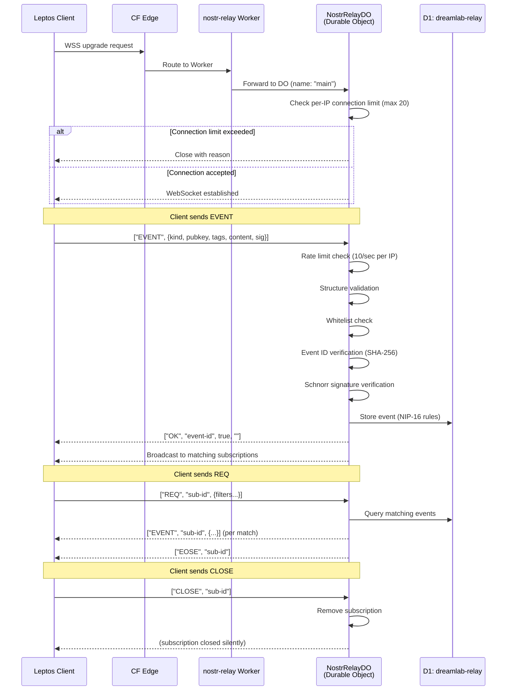
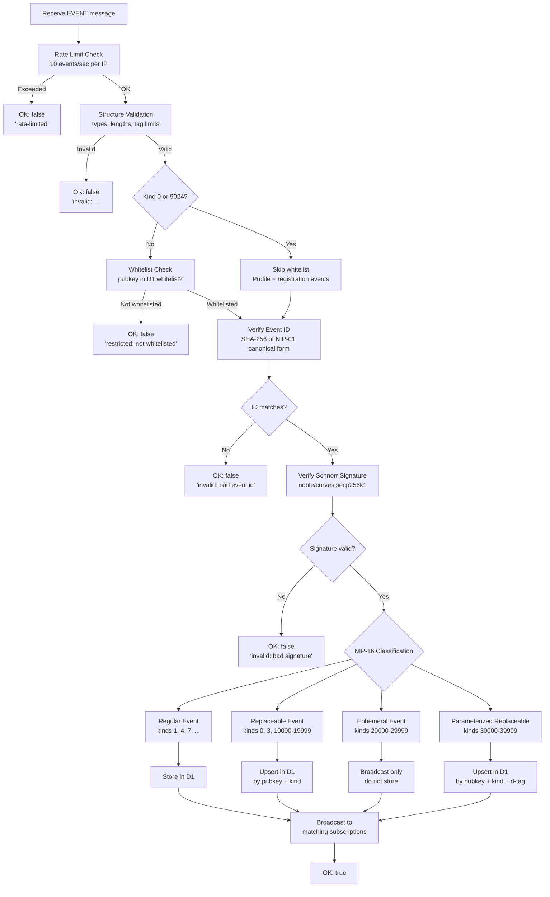
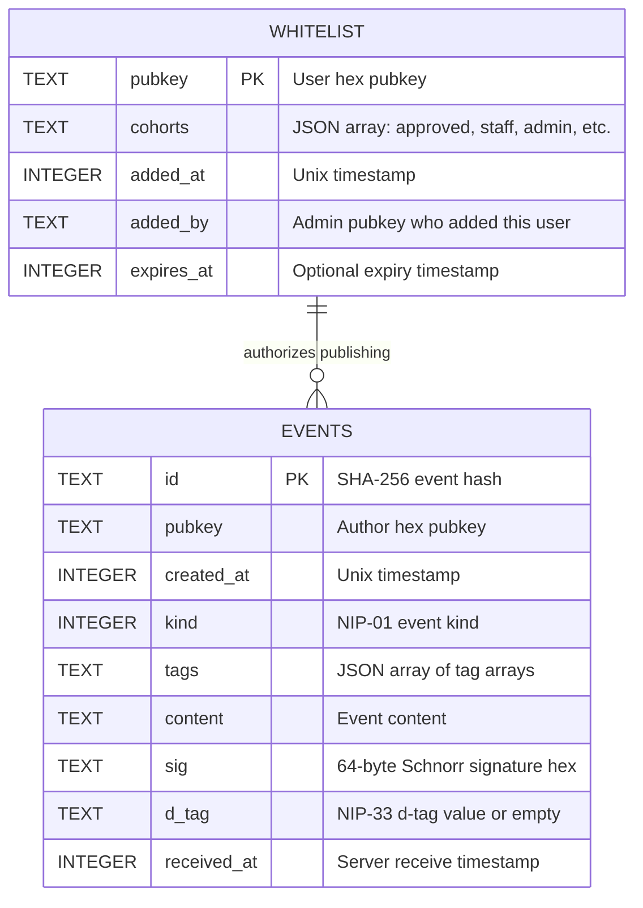
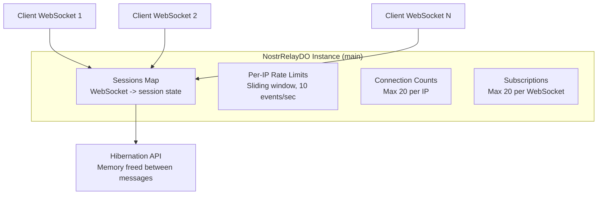

# Nostr Relay API -- nostr-relay (TypeScript, Not Ported)

**Last updated:** 2026-03-08 | [Back to Documentation Index](../README.md)

---

## Table of Contents

- [Overview](#overview)
- [WebSocket Protocol Flow](#websocket-protocol-flow)
- [Event Processing Pipeline](#event-processing-pipeline)
- [NIP-11 Relay Information](#nip-11-relay-information)
- [Admin Endpoints](#admin-endpoints)
- [D1 Schema](#d1-schema)
- [Durable Objects](#durable-objects)
- [Environment Bindings](#environment-bindings)
- [Related Documents](#related-documents)

---

## Overview

Private whitelist-only Nostr relay on Cloudflare Workers with Durable Objects for WebSocket management. Stays TypeScript due to WebSocket Hibernation API not being exposed in `workers-rs` v0.7.5.

**WebSocket:** `wss://dreamlab-nostr-relay.<account>.workers.dev` (production: DNS route via `relay.dreamlab-ai.com`)

---

## WebSocket Protocol Flow



### Message Types

**Client to Server:**

| Message | Format | Description |
|---------|--------|-------------|
| EVENT | `["EVENT", <event>]` | Publish an event |
| REQ | `["REQ", "<sub-id>", <filter>, ...]` | Subscribe with filters (max 10 filters) |
| CLOSE | `["CLOSE", "<sub-id>"]` | Unsubscribe |

**Server to Client:**

| Message | Format | Description |
|---------|--------|-------------|
| EVENT | `["EVENT", "<sub-id>", <event>]` | Event matching subscription |
| EOSE | `["EOSE", "<sub-id>"]` | End of stored events |
| OK | `["OK", "<event-id>", <bool>, "<message>"]` | Event acceptance/rejection |
| NOTICE | `["NOTICE", "<message>"]` | Human-readable notice |

---

## Event Processing Pipeline



---

## NIP-11 Relay Information

`GET /` with `Accept: application/nostr+json` returns relay metadata:

```json
{
  "name": "<RELAY_NAME>",
  "description": "DreamLab AI private community relay",
  "supported_nips": [1, 11, 16, 33, 98],
  "software": "dreamlab-nostr-relay",
  "limitation": {
    "max_message_length": 65536,
    "max_subscriptions": 20,
    "max_filters": 10,
    "max_limit": 1000,
    "max_event_tags": 2000,
    "auth_required": false,
    "payment_required": false,
    "restricted_writes": true
  }
}
```

---

## Admin Endpoints

All admin endpoints require NIP-98 authentication from a pubkey listed in `ADMIN_PUBKEYS` or with `"admin"` in their D1 whitelist `cohorts` column.

| Endpoint | Method | Body | Response |
|----------|--------|------|----------|
| `/api/whitelist/add` | POST | `{ "pubkey": "<hex>", "cohorts": ["approved"] }` | `{ "status": "added" }` |
| `/api/whitelist/list` | GET | Query: `?limit=20&offset=0&cohort=staff` | `{ "users": [...], "total": N }` |
| `/api/check-whitelist` | GET | Query: `?pubkey=<hex>` (public, no auth) | `{ "whitelisted": true, "cohorts": [...] }` |
| `/api/whitelist/update-cohorts` | POST | `{ "pubkey": "<hex>", "cohorts": ["staff", "approved"] }` | `{ "status": "updated" }` |

---

## D1 Schema



**SQL:**

```sql
CREATE TABLE events (
  id TEXT PRIMARY KEY,
  pubkey TEXT NOT NULL,
  created_at INTEGER NOT NULL,
  kind INTEGER NOT NULL,
  tags TEXT NOT NULL,
  content TEXT NOT NULL,
  sig TEXT NOT NULL,
  d_tag TEXT DEFAULT '',
  received_at INTEGER NOT NULL
);

CREATE TABLE whitelist (
  pubkey TEXT PRIMARY KEY,
  cohorts TEXT NOT NULL,
  added_at INTEGER NOT NULL,
  added_by TEXT,
  expires_at INTEGER
);
```

---

## Durable Objects

### NostrRelayDO

Single instance (named `"main"`) handles all WebSocket connections using the Hibernation API, which releases memory between messages for cost efficiency.



**Internal state per session:**
- WebSocket handle
- Client IP address
- Active subscriptions (filter sets)
- Last event timestamps (for rate limiting)

---

## Environment Bindings

| Binding | Type | Purpose |
|---------|------|---------|
| `DB` | D1Database | `dreamlab-relay` -- events + whitelist |
| `RELAY` | DurableObjectNamespace | NostrRelayDO |
| `ADMIN_PUBKEYS` | Secret | Comma-separated admin hex pubkeys |
| `RELAY_NAME` | Var | Display name for NIP-11 |
| `ALLOWED_ORIGIN` | Secret | Primary CORS origin |

---

## Related Documents

| Document | Description |
|----------|-------------|
| [Auth API](AUTH_API.md) | WebAuthn registration provisions relay whitelist entries |
| [Security Overview](../security/SECURITY_OVERVIEW.md) | Zone-based access control, input validation limits |
| [Authentication](../security/AUTHENTICATION.md) | NIP-98 token format and verification |
| [Search API](SEARCH_API.md) | Vector search over relay events |
| [Cloudflare Workers](../deployment/CLOUDFLARE_WORKERS.md) | D1 database and DO configuration |
| [Deployment Overview](../deployment/README.md) | CI/CD, environments, DNS |
