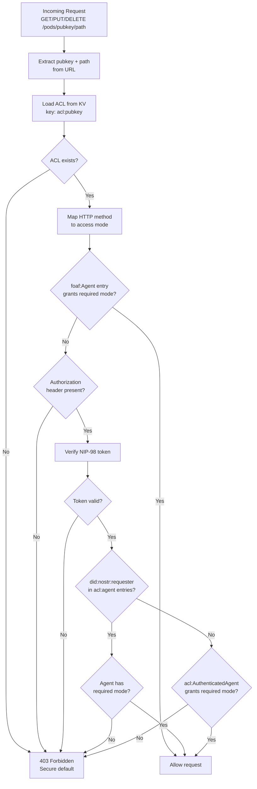

# Pod API -- pod-worker (Rust Port)

**Last updated:** 2026-03-08 | [Back to Documentation Index](../README.md)

---

## Table of Contents

- [Overview](#overview)
- [Endpoints](#endpoints)
- [WAC Access Control](#wac-access-control)
- [R2 Storage Layout](#r2-storage-layout)
- [KV Metadata](#kv-metadata)
- [Media Upload Example](#media-upload-example)
- [Environment Bindings](#environment-bindings)
- [Related Documents](#related-documents)

---

## Overview

Per-user Solid pod storage backed by Cloudflare R2 with Web Access Control (WAC). All write operations require NIP-98 authentication. Rust Worker using `worker` 0.7.5.

**Base URL:** `https://pods.dreamlab-ai.com`

---

## Endpoints

### GET /pods/{pubkey}/{path}

Read a resource. Public resources (profile, public media) need no auth. Returns raw content with `Content-Type` and `ETag` headers.

**Response (200):** Raw file content with appropriate `Content-Type`.

**Response (403):** `{ "error": "Forbidden", "code": "ACCESS_DENIED" }` -- ACL denies Read access.

**Response (404):** `{ "error": "Not found" }` -- Resource does not exist.

### HEAD /pods/{pubkey}/{path}

Headers only, no body. Used for existence checks. Returns `Content-Length`, `Content-Type`, `ETag`.

### PUT /pods/{pubkey}/{path}

Write or overwrite a resource. Requires NIP-98 header with `Write` access per WAC.

**Request Headers:** `Authorization: Nostr <base64(kind:27235 event)>`, `Content-Type: <mime>`

**Request Body:** Raw file content (max 50 MB).

**Response (201):** `{ "status": "ok" }`

**Response (403):** `{ "error": "Forbidden", "code": "ACCESS_DENIED" }` -- ACL denies Write access.

### DELETE /pods/{pubkey}/{path}

Delete a resource. Requires NIP-98 header with `Write` access per WAC.

**Request Headers:** `Authorization: Nostr <base64(kind:27235 event)>`

**Response (200):** `{ "status": "deleted" }`

**Response (403):** `{ "error": "Forbidden", "code": "ACCESS_DENIED" }` -- ACL denies Write access.

### GET /health

**Response (200):** `{ "status": "ok", "service": "pod-api" }`

---

## WAC Access Control

Web Access Control (WAC) governs all pod operations. Each pod has an ACL stored in KV at `acl:{pubkey}` in JSON-LD format. When no ACL document exists, access is denied by default (secure by default).



### HTTP Method to Access Mode Mapping

| HTTP Method | Required WAC Mode |
|-------------|------------------|
| GET | Read |
| HEAD | Read |
| PUT | Write |
| DELETE | Write |
| POST | Append |

### Agent Matching Rules

| ACL Predicate | Matches | Use Case |
|---------------|---------|----------|
| `acl:agent` + `did:nostr:{pubkey}` | Specific user by Nostr pubkey | Owner access, shared resources |
| `acl:agentClass` + `foaf:Agent` | Anyone (no auth required) | Public profile, public media |
| `acl:agentClass` + `acl:AuthenticatedAgent` | Any user with valid NIP-98 | Community-visible resources |

### Default ACL (Created at Registration)

The auth-worker creates the following ACL during pod provisioning:

| Resource Pattern | Agent | Modes |
|-----------------|-------|-------|
| `./` (everything) | `did:nostr:{owner}` | Read, Write, Control |
| `./profile/` | `foaf:Agent` | Read |
| `./media/public/` | `foaf:Agent` | Read |

---

## R2 Storage Layout

```mermaid
graph TD
    subgraph "R2 Bucket: dreamlab-pods"
        subgraph "pods/{pubkey}/"
            PROFILE[profile/card<br/>JSON-LD profile]
            PUB_MEDIA[media/public/{file}<br/>Publicly readable images]
            PRIV_MEDIA[media/private/{file}<br/>Owner-only media]
            DATA[data/{arbitrary}<br/>App-specific data]
        end
    end

    PUBLIC_REQ[Public GET request] --> PROFILE
    PUBLIC_REQ --> PUB_MEDIA
    OWNER_REQ[Owner with NIP-98] --> PROFILE
    OWNER_REQ --> PUB_MEDIA
    OWNER_REQ --> PRIV_MEDIA
    OWNER_REQ --> DATA
```

| Path | Content-Type | Visibility |
|------|-------------|------------|
| `pods/{pubkey}/profile/card` | `application/ld+json` | Public (Read) |
| `pods/{pubkey}/media/public/{file}` | `image/*`, `video/*` | Public (Read) |
| `pods/{pubkey}/media/private/{file}` | `image/*`, `video/*` | Owner only |
| `pods/{pubkey}/data/{path}` | varies | Owner only (default) |

---

## KV Metadata

Stored in the `POD_META` KV namespace (shared with auth-worker).

| Key Pattern | Value | Updated By |
|-------------|-------|------------|
| `acl:{pubkey}` | JSON-LD ACL document | auth-worker (creation), pod-worker (PATCH) |
| `meta:{pubkey}` | `{ "created": timestamp, "storageUsed": bytes }` | auth-worker (creation), pod-worker (on PUT/DELETE) |

---

## Media Upload Example

```
PUT /pods/11ed6422.../media/public/avatar.webp
Authorization: Nostr <base64(kind:27235 event with payload tag)>
Content-Type: image/webp

<binary data>
```

The uploaded file is publicly readable at:
```
https://pods.dreamlab-ai.com/11ed6422.../media/public/avatar.webp
```

This works because the default ACL grants `foaf:Agent` (anyone) Read access on `./media/public/`.

---

## Environment Bindings

| Binding | Type | Purpose |
|---------|------|---------|
| `PODS` | R2Bucket | `dreamlab-pods` -- all pod storage |
| `POD_META` | KVNamespace | ACL documents + pod metadata |
| `EXPECTED_ORIGIN` | Secret | `https://dreamlab-ai.com` |
| `ADMIN_PUBKEYS` | Secret | Comma-separated admin hex pubkeys |

---

## Related Documents

| Document | Description |
|----------|-------------|
| [Auth API](AUTH_API.md) | Registration provisions pods via this worker's storage |
| [Security Overview](../security/SECURITY_OVERVIEW.md) | CORS, input validation, threat model |
| [Authentication](../security/AUTHENTICATION.md) | NIP-98 token format and verification |
| [Cloudflare Workers](../deployment/CLOUDFLARE_WORKERS.md) | R2 bucket and KV namespace configuration |
| [Deployment Overview](../deployment/README.md) | CI/CD, environments, DNS |
