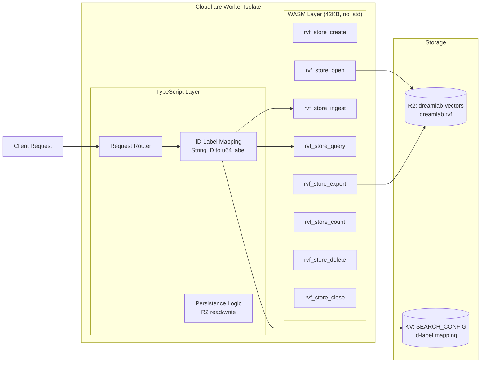
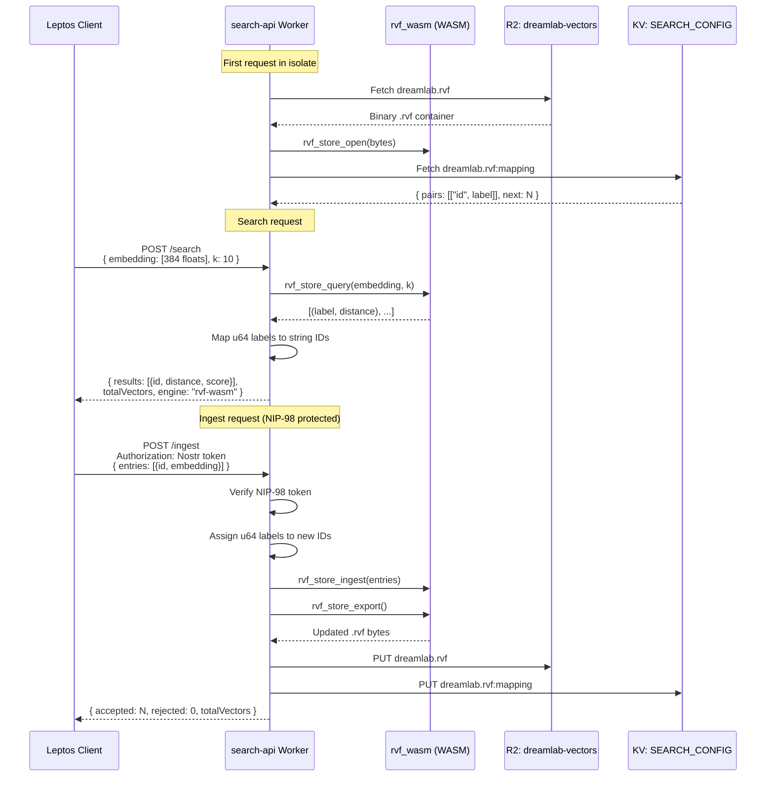

# Search API -- search-api (TypeScript, Not Ported)

**Last updated:** 2026-03-08 | [Back to Documentation Index](../README.md)

---

## Table of Contents

- [Overview](#overview)
- [WASM Architecture](#wasm-architecture)
- [RVF Search Flow](#rvf-search-flow)
- [Endpoints](#endpoints)
- [RVF WASM Functions](#rvf-wasm-functions)
- [Storage](#storage)
- [Environment Bindings](#environment-bindings)
- [Related Documents](#related-documents)

---

## Overview

WASM-powered vector similarity search over R2-stored `.rvf` indices. Uses the RuVector `rvf_wasm` microkernel (42 KB, `no_std`) for cosine search on 384-dimensional `all-MiniLM-L6-v2` embeddings. Stays TypeScript: the RVF core is already Rust WASM, and the thin TS wrapper adds no meaningful overhead.

**Base URL:** `https://search.dreamlab-ai.com`

**Performance:** 490K vec/sec throughput, 0.47ms p50 latency for 1K vectors.

---

## WASM Architecture



The WASM module is imported as an ES module and instantiated lazily on the first request. The store handle and id-label mappings persist across requests within the same Worker isolate.

---

## RVF Search Flow



---

## Endpoints

### POST /search

k-NN cosine similarity search.

**Request:**

```json
{
  "embedding": [0.123, -0.456, ...],
  "k": 10,
  "minScore": 0.5
}
```

- `embedding`: 384-dimensional float array (required)
- `k`: Number of nearest neighbors (default: 10, max: 100)
- `minScore`: Minimum cosine similarity score filter (default: 0.0)

**Response (200):**

```json
{
  "results": [
    { "id": "event-abc123", "distance": 0.15, "score": 0.85 },
    { "id": "event-def456", "distance": 0.22, "score": 0.78 }
  ],
  "totalVectors": 1500,
  "engine": "rvf-wasm"
}
```

### POST /ingest (NIP-98 Protected)

Batch ingest embeddings into the vector store. Persists updated .rvf to R2 after ingestion.

**Request Headers:** `Authorization: Nostr <base64(kind:27235 event)>`

**Request:**

```json
{
  "entries": [
    { "id": "event-abc123", "embedding": [0.123, -0.456, ...] },
    { "id": "event-def456", "embedding": [0.789, 0.012, ...] }
  ]
}
```

**Response (200):**

```json
{
  "accepted": 2,
  "rejected": 0,
  "totalVectors": 1502
}
```

Entries are rejected when they have a missing `id` or incorrect embedding dimensions.

### POST /embed

Generate embeddings from text. Currently uses hash-based fallback; planned upgrade to MiniLM ONNX inference.

**Request:**

```json
{
  "text": "search query"
}
```

Or batch mode (max 100 texts):

```json
{
  "texts": ["query one", "query two"]
}
```

**Response (200):**

```json
{
  "embeddings": [[0.123, -0.456, ...]],
  "dimensions": 384,
  "model": "hash-fallback-v1"
}
```

### GET /status

**Response (200):**

```json
{
  "totalVectors": 1500,
  "dimensions": 384,
  "metric": "cosine",
  "engine": "rvf-wasm",
  "wasmModuleSize": "42KB"
}
```

---

## RVF WASM Functions

| Function | Purpose |
|----------|---------|
| `rvf_store_create` | Create a new empty vector store |
| `rvf_store_open` | Open a store from .rvf binary data |
| `rvf_store_ingest` | Add vectors with u64 labels |
| `rvf_store_query` | k-NN cosine similarity search |
| `rvf_store_delete` | Remove vectors by label |
| `rvf_store_count` | Return total vector count |
| `rvf_store_export` | Serialize store to .rvf binary |
| `rvf_store_close` | Release store memory |

The WASM engine uses `u64` labels internally. The TypeScript wrapper translates between application string IDs (Nostr event IDs) and WASM numeric labels using a KV-backed mapping.

---

## Storage

| Resource | Location | Key | Content |
|----------|----------|-----|---------|
| Vector store | R2 (`dreamlab-vectors`) | `dreamlab.rvf` | Binary .rvf vector container |
| ID-label mapping | KV (`SEARCH_CONFIG`) | `dreamlab.rvf:mapping` | `{ "pairs": [["id", label]], "next": N }` |

---

## Environment Bindings

| Binding | Type | Purpose |
|---------|------|---------|
| `VECTORS` | R2Bucket | `dreamlab-vectors` -- .rvf storage |
| `SEARCH_CONFIG` | KVNamespace | ID-label mapping + config |
| `ALLOWED_ORIGIN` | Secret | CORS origin |
| `RVF_STORE_KEY` | Var | R2 key (default: `dreamlab.rvf`) |

---

## Related Documents

| Document | Description |
|----------|-------------|
| [Nostr Relay](NOSTR_RELAY.md) | Events indexed by this search service |
| [Security Overview](../security/SECURITY_OVERVIEW.md) | CORS, input validation |
| [Authentication](../security/AUTHENTICATION.md) | NIP-98 for protected ingest endpoint |
| [Cloudflare Workers](../deployment/CLOUDFLARE_WORKERS.md) | R2 bucket and KV namespace configuration |
| [Deployment Overview](../deployment/README.md) | CI/CD, environments, DNS |
