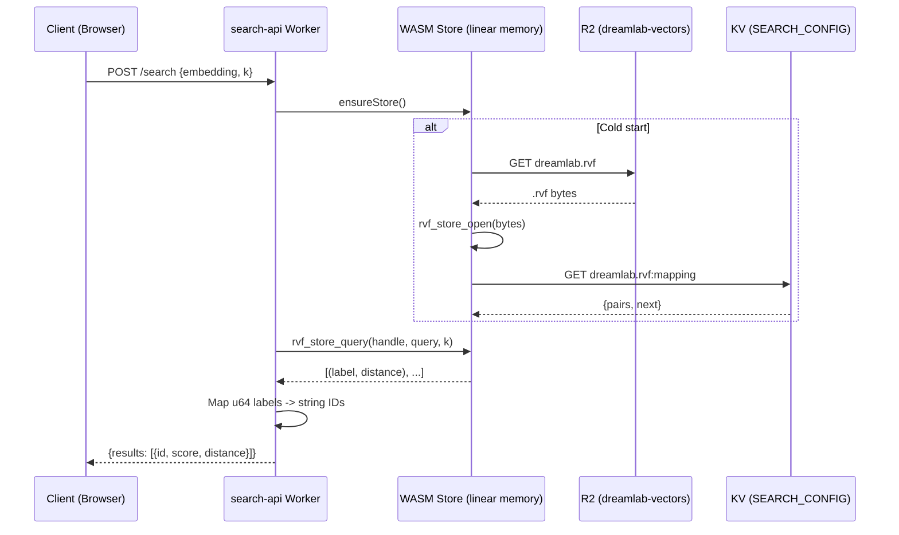
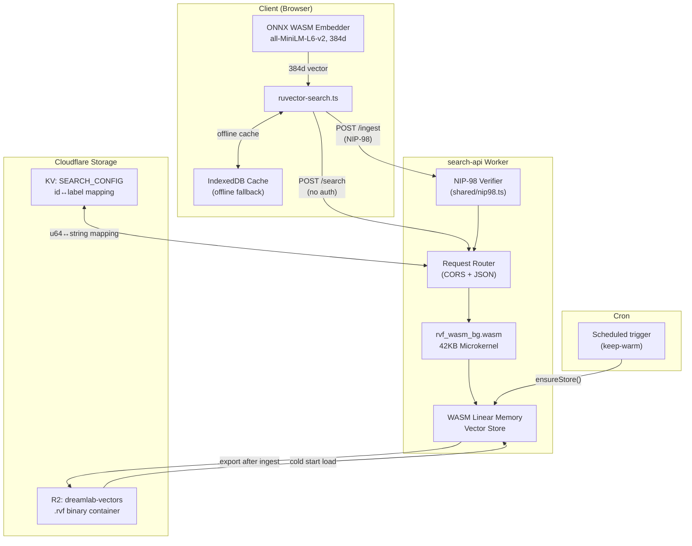

# Search API (search-api Worker)

## Overview

RuVector WASM-powered semantic search for the DreamLab AI community forum. A Cloudflare Worker backed by an R2-stored `.rvf` vector index and a 42KB `no_std` WASM microkernel that performs cosine k-NN queries in sub-millisecond time on WASM linear memory.

- **Runtime**: Cloudflare Workers (ES module format)
- **Storage**: R2 (`.rvf` binary) + KV (`id<->label` mapping)
- **Embedding model**: all-MiniLM-L6-v2 (384 dimensions, L2-normalised)
- **WASM module**: `rvf_wasm_bg.wasm` (42KB, 32 extern "C" exports)

## Endpoints

### GET /status

Health check and store metadata. No authentication required.

**Response** `200`:
```json
{
  "totalVectors": 0,
  "dimensions": 384,
  "metric": "cosine",
  "model": "all-MiniLM-L6-v2",
  "engine": "rvf-wasm",
  "wasmModuleSize": "42KB",
  "format": "rvf-wasm-v1"
}
```

---

### POST /search

k-NN cosine similarity search. No authentication required (read-only).

**Request body**:
```json
{
  "embedding": [0.012, -0.034, ...],
  "k": 10,
  "minScore": 0.5,
  "channel": "general"
}
```

| Field | Type | Required | Default | Description |
|-------|------|----------|---------|-------------|
| `embedding` | `number[]` | Yes | — | 384-dimensional query vector |
| `k` | `number` | No | 10 | Max results (clamped 1-100) |
| `minScore` | `number` | No | 0.0 | Minimum cosine similarity threshold |
| `channel` | `string` | No | — | Reserved for channel filtering (not yet implemented) |

**Response** `200`:
```json
{
  "results": [
    { "id": "note1abc...", "score": 0.87, "distance": 0.13 }
  ],
  "totalVectors": 1500,
  "engine": "rvf-wasm",
  "dimensions": 384
}
```

**Error** `400` when embedding length != 384.



---

### POST /embed

Server-side embedding generation. No authentication required.

> **Note**: This endpoint uses a deterministic hash-based fallback — it does NOT produce semantic embeddings. The client-side ONNX WASM embedder (`all-MiniLM-L6-v2`) provides real semantic vectors. This endpoint exists for graceful degradation when ONNX is unavailable.

**Request body**:
```json
{ "text": "neural network training" }
```
or batch:
```json
{ "texts": ["neural network", "deep learning", "gradient descent"] }
```

| Field | Type | Required | Constraint |
|-------|------|----------|------------|
| `text` | `string` | One of `text`/`texts` | Single text input |
| `texts` | `string[]` | One of `text`/`texts` | Max 100 texts per request |

**Response** `200`:
```json
{
  "embeddings": [[0.012, -0.034, ...]],
  "dimensions": 384,
  "model": "hash-fallback-v1",
  "note": "Hash-based fallback embedding. Replace with ONNX WASM model for semantic quality."
}
```

---

### POST /ingest

Batch ingest embeddings into the vector store. **Requires NIP-98 authentication.**

**Headers**:
```
Authorization: Nostr <base64(kind-27235-event)>
Content-Type: application/json
```

**Request body**:
```json
{
  "entries": [
    {
      "id": "note1abc123...",
      "embedding": [0.012, -0.034, ...],
      "channel": "general",
      "timestamp": 1709827200
    }
  ]
}
```

| Field | Type | Required | Description |
|-------|------|----------|-------------|
| `entries[].id` | `string` | Yes | Unique note/document identifier |
| `entries[].embedding` | `number[]` | Yes | 384-dimensional vector |
| `entries[].channel` | `string` | No | Channel tag (stored in mapping) |
| `entries[].timestamp` | `number` | No | Unix timestamp |

Entries with missing `id` or wrong-dimension embeddings are silently rejected.

**Response** `200`:
```json
{
  "accepted": 5,
  "rejected": 1,
  "totalVectors": 1505,
  "engine": "rvf-wasm"
}
```

**Side effects**: After ingest, the Worker:
1. Calls `rvf_store_ingest()` to add vectors to WASM memory
2. Calls `rvf_store_export()` to serialize the store
3. PUTs the `.rvf` binary to R2
4. PUTs the updated `id<->label` mapping to KV

**Error** `401` when `Authorization` header is missing or NIP-98 verification fails.

## Architecture



## Storage

### R2 Bucket: `dreamlab-vectors`

Single `.rvf` binary container (default key: `dreamlab.rvf`).

| Metadata field | Description |
|----------------|-------------|
| `vectorCount` | Current number of vectors |
| `dimensions` | 384 |
| `format` | `rvf-wasm-v1` |
| `updatedAt` | ISO 8601 timestamp of last export |

### KV Namespace: `SEARCH_CONFIG`

Key: `dreamlab.rvf:mapping`

```json
{
  "pairs": [["note1abc...", 1], ["note1def...", 2]],
  "next": 3
}
```

The WASM microkernel uses `u64` numeric IDs internally. The JS layer maintains a bidirectional `string<->u64` mapping persisted to KV. On cold start, the mapping is loaded before the `.rvf` store is opened.

## WASM Module

**File**: `rvf_wasm_bg.wasm` (42KB, `no_std` Rust compiled to `wasm32-unknown-unknown`)

### Key Exports

| Function | Signature | Description |
|----------|-----------|-------------|
| `rvf_store_create` | `(dim, metric) -> handle` | Create empty store |
| `rvf_store_open` | `(buf_ptr, buf_len) -> handle` | Load from `.rvf` bytes |
| `rvf_store_close` | `(handle) -> status` | Release store |
| `rvf_store_ingest` | `(handle, vecs_ptr, ids_ptr, count) -> accepted` | Batch insert |
| `rvf_store_query` | `(handle, query_ptr, k, metric, out_ptr) -> count` | k-NN cosine search |
| `rvf_store_delete` | `(handle, ids_ptr, count) -> status` | Remove vectors |
| `rvf_store_export` | `(handle, out_ptr, out_len) -> bytes_written` | Serialize to `.rvf` |
| `rvf_store_count` | `(handle) -> n` | Vector count |
| `rvf_store_dimension` | `(handle) -> dim` | Dimension size |
| `rvf_alloc` | `(size) -> ptr` | Allocate WASM memory |
| `rvf_free` | `(ptr, size) -> void` | Free WASM memory |

Additional exports include HNSW navigation (`rvf_greedy_step`, `rvf_load_neighbors`), quantization (`rvf_load_sq_params`, `rvf_pq_distances`), top-K heap management, and integrity verification (`rvf_crc32c`, `rvf_witness_verify`).

### Performance

| Metric | 100 vectors | 1000 vectors |
|--------|-------------|--------------|
| Ingest | instant | 2.1ms (486K vec/sec) |
| Query p50 | 0.47ms | 0.48ms |
| Query p95 | — | 0.79ms |
| Module size | 42KB | 42KB |

### Worker Lifecycle

1. **Cold start**: `WebAssembly.instantiate(wasmModule)` -> fetch `.rvf` from R2 -> `rvf_store_open()` -> load KV mapping
2. **Warm**: Reuse per-isolate store handle across requests (sub-millisecond queries)
3. **Ingest**: `rvf_store_ingest()` -> `rvf_store_export()` -> PUT `.rvf` to R2 + mapping to KV
4. **Keep-warm**: Scheduled cron trigger calls `ensureStore()` to prevent cold starts

## Client Integration

### ONNX Embedder (`onnx-local.ts`)

Real transformer embeddings running client-side via `ruvector`'s ONNX WASM runtime.

- **Model**: `all-MiniLM-L6-v2` (384d, ~23MB ONNX)
- **WASM runtime**: `ruvector_onnx_embeddings_wasm.js` (7.4MB)
- **Cache**: Browser Cache API (`ruvector-onnx-models`) — downloaded once, persisted across sessions
- **Config**: max_length=256, normalize=true, pooling=Mean
- **Pre-warm**: `preWarmOnnx()` fires 5s after call to hide download latency

### 3-Tier Embedding Pipeline (`ruvector-search.ts`)

`embedQuery()` uses a priority chain:

| Priority | Source | Quality | Latency |
|----------|--------|---------|---------|
| 1 | Local ONNX WASM | Semantic (384d) | ~10ms (warm) |
| 2 | Server `/embed` | Hash-based (384d) | ~100ms (network) |
| 3 | Client hash fallback | Deterministic (384d) | Instant |

### Auto-Ingest Flow

When a new forum message arrives:
1. `indexNewMessage()` calls `storeEmbedding(noteId, content, channel)`
2. `storeEmbedding()` generates an embedding via the 3-tier pipeline
3. `fetchWithNip98()` sends `POST /ingest` with signed NIP-98 authorization
4. Local IndexedDB cache is updated as a fallback store

### Offline Fallback

When the search-api is unreachable, the client falls back to brute-force cosine similarity over IndexedDB-cached embeddings.

## Authentication

Only `/ingest` requires authentication. Read endpoints (`/search`, `/embed`, `/status`) are public.

### NIP-98 (Nostr HTTP Auth)

The `Authorization` header carries a base64-encoded Nostr event:

```
Authorization: Nostr <base64(JSON)>
```

**Event structure** (kind `27235`):
```json
{
  "id": "<computed-event-id>",
  "pubkey": "<hex-pubkey>",
  "created_at": 1709827200,
  "kind": 27235,
  "tags": [
    ["u", "https://search.dreamlab-ai.com/ingest"],
    ["method", "POST"],
    ["payload", "<sha256-hex-of-request-body>"]
  ],
  "content": "",
  "sig": "<schnorr-signature>"
}
```

**Server verification** (`workers/shared/nip98.ts`):

1. Decode base64, parse JSON (max 64KB)
2. Assert `kind === 27235`
3. Assert `created_at` within 60 seconds of server time
4. Assert `pubkey` is 64-char hex
5. Assert `u` tag matches request URL (trailing slash normalized)
6. Assert `method` tag matches request method (case-insensitive)
7. Verify Schnorr signature via `nostr-tools.verifyEvent()`
8. If request body exists, assert `payload` tag equals `SHA-256(rawBody)`

**Client signing** (`nip98-client.ts`):

`fetchWithNip98()` handles signing for both passkey-derived privkeys and NIP-07 browser extensions.

## Configuration

### Environment Variables (Worker)

| Binding | Type | Description |
|---------|------|-------------|
| `VECTORS` | R2 Bucket | `.rvf` store (`dreamlab-vectors`) |
| `SEARCH_CONFIG` | KV Namespace | ID mapping + config |
| `ALLOWED_ORIGIN` | String | CORS origin (default: `https://dreamlab-ai.com`) |
| `RVF_STORE_KEY` | String | R2 object key (default: `dreamlab.rvf`) |

### Client Environment

| Variable | Default |
|----------|---------|
| `VITE_SEARCH_API_URL` | `https://search.dreamlab-ai.com` |

### Constants

| Constant | Value | Description |
|----------|-------|-------------|
| `DIM` | 384 | Embedding dimensions |
| `COSINE_METRIC` | 2 | WASM metric enum for cosine similarity |
| `RESULT_ENTRY_SIZE` | 12 | Bytes per result (u64 ID + f32 distance) |

## Known Limitations

1. **Brute-force O(n) query** — `rvf_store_query()` iterates all vectors linearly. HNSW primitives exist in the WASM module (`rvf_greedy_step`, `rvf_load_neighbors`) but are not wired into the query path.

2. **Hash-based server `/embed`** — The server endpoint produces deterministic but non-semantic vectors. Client-side ONNX provides real semantic embeddings; the server fallback is for graceful degradation only.

3. **u64 ID mapping overhead** — WASM uses numeric u64 labels internally. A JS-side bidirectional `Map<string, number>` is maintained per isolate and persisted to KV alongside the `.rvf` in R2. This adds a KV read on cold start and a KV write on every ingest.

4. **DNS pending** — Production subdomains (`search.dreamlab-ai.com`) are not yet configured. Currently uses the Workers dev URL.

5. **Channel filtering** — The `channel` field is accepted in `/search` requests but not yet used for filtering within the WASM query path.
