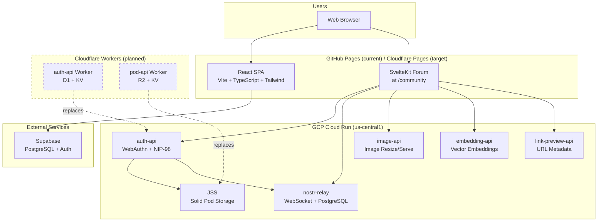
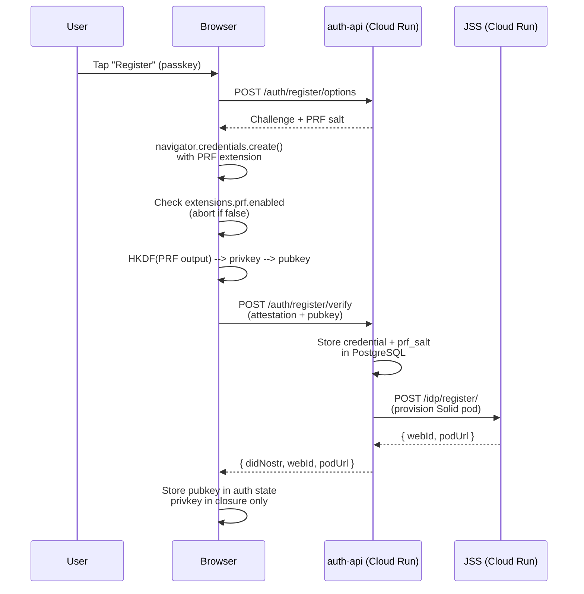
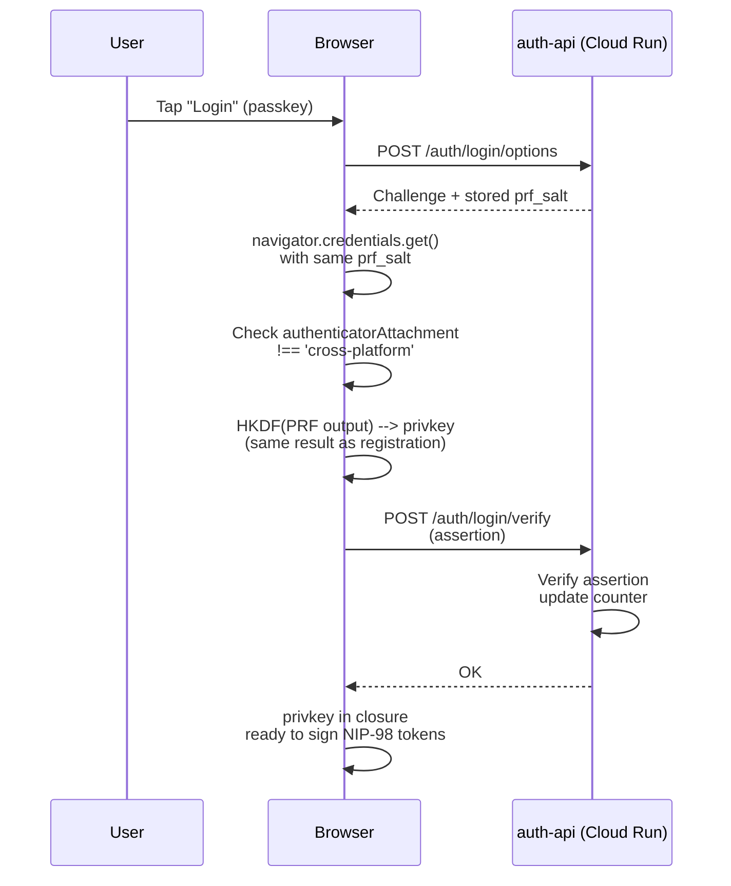
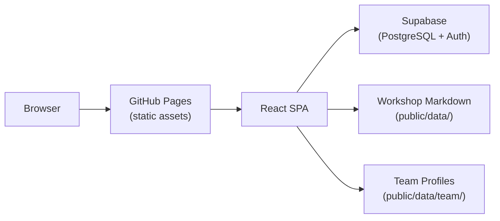
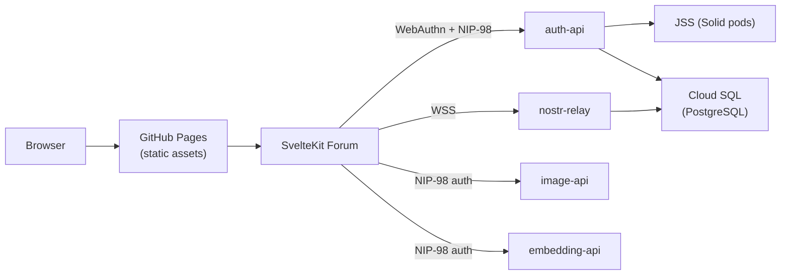
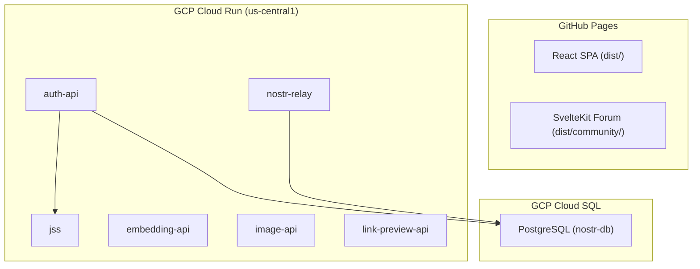
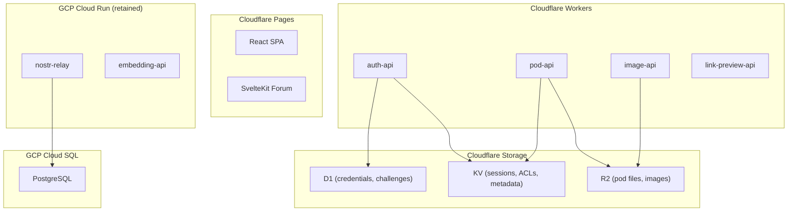

# DreamLab AI -- Architecture Overview

**Last updated:** 2026-02-28

This document describes the high-level architecture of the DreamLab AI platform. For detailed SPARC methodology documents, see the `architecture/` directory. For individual technology decisions, see the [ADR index](adr/README.md).

---

## System Context

DreamLab AI consists of three deployment targets: a static frontend on GitHub Pages (migrating to Cloudflare Pages), backend services on GCP Cloud Run, and planned Cloudflare Workers services.



*Dashed boxes indicate planned Cloudflare Workers services not yet deployed.*

---

## Frontend Architecture

The platform has two frontend applications sharing the same domain:

### React SPA (Main Site)

The main site at `dreamlab-ai.com` is a React 18.3 single-page application built with Vite 5.4.

| Concern | Implementation |
|---------|---------------|
| Routing | React Router DOM 6.26, 13 lazy-loaded routes |
| Styling | Tailwind CSS 3.4 + shadcn/ui (Radix UI primitives) |
| State | TanStack React Query 5.56 for server state |
| Forms | React Hook Form 7.53 + Zod 3.23 validation |
| 3D | Three.js 0.156 via @react-three/fiber (declarative) |
| WASM | Rust Voronoi tessellation (`wasm-voronoi/`) |
| Build | Vite SWC plugin, manual chunks (vendor, three, ui) |
| Content | Markdown in `public/data/` loaded at runtime |

**Routes:**

| Path | Page | Description |
|------|------|-------------|
| `/` | Index | Landing page with hero, featured content, CTAs |
| `/team` | Team | 44 expert profiles loaded from markdown |
| `/work` | Work | Portfolio and case studies |
| `/workshops` | WorkshopIndex | Workshop catalogue |
| `/workshops/:workshopId` | WorkshopPage | Individual workshop |
| `/workshops/:workshopId/:pageSlug` | WorkshopPage | Workshop sub-page |
| `/residential-training` | ResidentialTraining | 2-day masterclass details |
| `/masterclass` | Masterclass | AI agent training programme |
| `/contact` | Contact | Contact form (React Hook Form + Zod) |
| `/privacy` | Privacy | Privacy policy |
| `/system-design` | SystemDesign | Architecture documentation |
| `/research-paper` | ResearchPaper | Research content |
| `/testimonials` | Testimonials | Customer reviews |

### SvelteKit Forum (Community)

The community forum at `dreamlab-ai.com/community` is a SvelteKit 2.49 application with passkey-first authentication and Nostr-based messaging.

| Concern | Implementation |
|---------|---------------|
| Framework | SvelteKit 2.49, static adapter for GitHub Pages |
| Auth | WebAuthn PRF + HKDF key derivation |
| Protocol | Nostr (NDK 2.13) for messaging and identity |
| Routes | 16 Svelte routes (channels, DMs, calendar, profiles) |
| Testing | Vitest (unit) + Playwright (e2e) |

---

## Backend Services

### GCP Cloud Run (Current)

Six services deployed on Cloud Run in `us-central1`, project `cumbriadreamlab`.

| Service | Runtime | Storage | Purpose |
|---------|---------|---------|---------|
| **auth-api** | Express + @simplewebauthn/server | PostgreSQL (Cloud SQL) | WebAuthn registration/authentication, NIP-98 gating, JSS pod provisioning |
| **jss** | @solid/community-server 7.1.8 | Ephemeral filesystem | Solid pod storage per pubkey (WebID + Linked Data) |
| **nostr-relay** | Custom Node.js | PostgreSQL (Cloud SQL) | Nostr relay (NIP-01, NIP-98 verified) |
| **embedding-api** | Node.js | Stateless | Vector embeddings for semantic search |
| **image-api** | Node.js | Stateless | Image resizing and serving |
| **link-preview-api** | Node.js | Stateless | URL metadata extraction |

### Cloudflare Workers (Planned -- Code Only)

Two Workers have been written in the `workers/` directory but are not yet deployed. See [ADR-010](adr/010-return-to-cloudflare.md) for the migration decision.

| Service | Storage | Replaces |
|---------|---------|----------|
| **auth-api** (`workers/auth-api/`) | D1 + KV | Cloud Run auth-api |
| **pod-api** (`workers/pod-api/`) | R2 + KV | Cloud Run JSS |

Shared NIP-98 utilities live in `workers/shared/nip98.ts`.

### Planned Retention on Cloud Run

Per ADR-010, two services remain on Cloud Run due to Cloudflare Workers limitations:

- **nostr-relay** -- persistent WebSocket connections with Cloud SQL (Durable Objects migration evaluated separately)
- **embedding-api** -- ML inference requires CPU/memory beyond Workers limits

---

## Authentication Architecture

DreamLab uses a passkey-first authentication model where the user's cryptographic identity is derived from WebAuthn PRF output. The private key is never stored -- it lives only in a JavaScript closure and is zeroed on `pagehide`.

### Key Derivation

```
WebAuthn PRF output (32 bytes, HMAC-SHA-256 from authenticator)
  --> HKDF(SHA-256, salt=[], info="nostr-secp256k1-v1")
  --> 32-byte secp256k1 private key
  --> getPublicKey() --> hex pubkey (Nostr identity)
```

### Registration Flow



### Authentication Flow



### NIP-98 HTTP Auth

Every state-mutating API call uses NIP-98 `Authorization: Nostr <base64(event)>`:

- **Event kind:** 27235
- **Tags:** `u` (URL), `method`, optional `payload` (SHA-256 of body)
- **Signing:** Schnorr signature with privkey from auth store closure
- **Verification:** Server recomputes event ID from NIP-01 canonical form
- **Payload hash:** Uses raw body bytes (server captures via `express.raw` before JSON parsing)

A consolidated shared NIP-98 module exists at `community-forum/packages/nip98/` (sign.ts, verify.ts, types.ts), built to replace the four independent implementations across services.

### Identity Model

| Layer | Format | Example |
|-------|--------|---------|
| Nostr pubkey | Hex (32 bytes) | `a1b2c3...` |
| DID | `did:nostr:{pubkey}` | `did:nostr:a1b2c3...` |
| WebID | `{jss-url}/{pubkey}/profile/card#me` | `https://jss.../a1b2c3.../profile/card#me` |

---

## Data Flow

### Main Site



### Community Forum



---

## Technology Decisions

All major technology decisions are documented as Architecture Decision Records:

| ADR | Decision | Status |
|-----|----------|--------|
| [ADR-001](adr/001-nostr-protocol-foundation.md) | Nostr protocol as foundation for identity and messaging | Accepted |
| [ADR-002](adr/002-three-tier-hierarchy.md) | Three-tier hierarchy (Zone > Section > Forum) | Accepted |
| [ADR-003](adr/003-gcp-cloud-run-infrastructure.md) | GCP Cloud Run for backend services | **Superseded by ADR-010** |
| [ADR-004](adr/004-zone-based-access-control.md) | Zone-based cohort access control | Accepted |
| [ADR-005](adr/005-nip-44-encryption-mandate.md) | NIP-44 mandatory for new encryption | Accepted |
| [ADR-006](adr/006-client-side-wasm-search.md) | Client-side WASM semantic search | Accepted |
| [ADR-007](adr/007-sveltekit-ndk-frontend.md) | SvelteKit + NDK for forum frontend | Accepted |
| [ADR-008](adr/008-postgresql-relay-storage.md) | PostgreSQL for relay event storage | Accepted |
| [ADR-009](adr/009-user-registration-flow.md) | User registration and approval flow | Resolved |
| [ADR-010](adr/010-return-to-cloudflare.md) | Return to Cloudflare platform (Workers, D1, KV, R2) | Accepted |

---

## Deployment Architecture

### Current State



### Target State (ADR-010)



### CI/CD Workflows

| Workflow | Trigger | Deploys To |
|----------|---------|------------|
| `deploy.yml` | Push to main | GitHub Pages (SPA + forum) |
| `auth-api.yml` | Push to main (services/auth-api/) | Cloud Run: auth-api |
| `jss.yml` | Push to main (services/jss/) | Cloud Run: JSS |
| `fairfield-relay.yml` | Push to main | Cloud Run: nostr-relay |
| `fairfield-embedding-api.yml` | Push to main | Cloud Run: embedding-api |
| `fairfield-image-api.yml` | Push to main | Cloud Run: image-api |

For first-time GCP bootstrap, see `.github/workflows/SECRETS_SETUP.md`.

---

## Project Structure

```
src/                          # React SPA source
  App.tsx                     # Root: QueryClient, Router, lazy routes
  main.tsx                    # Vite entry point
  pages/                      # 13 route page components
  components/                 # Reusable components
    ui/                       # 50+ shadcn/ui primitives
    VoronoiGoldenHero.tsx     # 3D golden ratio Voronoi
    TesseractProjection.tsx   # 4D hyperdimensional visualisation
  hooks/                      # Custom React hooks
  lib/                        # Utilities, Supabase client, markdown
  data/                       # Static data (skills.json, workshop-list.json)

public/
  data/                       # Runtime-loaded content
    team/                     # 44 expert profiles (markdown + images)
    workshops/                # 15 workshop directories
    showcase/                 # Portfolio project manifests
    media/                    # Videos, thumbnails
  images/                     # Static image assets

community-forum/              # SvelteKit forum (separate package.json)
  src/routes/                 # 16 Svelte routes
  src/lib/auth/               # WebAuthn PRF + NIP-98
  src/lib/stores/             # Auth state, privkey closure
  packages/nip98/             # Consolidated NIP-98 shared module
  services/                   # Backend service source
    auth-api/                 # WebAuthn server (Express)
    jss/                      # Solid pod server (CSS 7.1.8)
    nostr-relay/              # Nostr relay
    embedding-api/            # Vector embeddings
    image-api/                # Image serving
    link-preview-api/         # URL metadata

workers/                      # Cloudflare Workers (planned)
  auth-api/                   # WebAuthn Worker (D1 + KV)
  pod-api/                    # Pod storage Worker (R2 + KV)
  shared/                     # Shared NIP-98 utilities

wasm-voronoi/                 # Rust WASM (Cargo.toml, src/lib.rs)

scripts/                      # Build and utility scripts
docs/                         # Project documentation
.github/workflows/            # CI/CD pipelines
```

---

## Related Documents

- [Feature status matrix](features/STATUS_MATRIX.md)
- [Cloudflare migration PRD](prd-cloudflare-workers-migration.md)
- [Security overview](security/SECURITY_OVERVIEW.md)
- [Domain model](ddd/01-domain-model.md)
- [Frontend architecture](architecture/FRONTEND_ARCHITECTURE.md)
- [Backend services](architecture/BACKEND_SERVICES.md)
- [Data flow](architecture/DATA_FLOW.md)

---

**Last updated:** 2026-02-28
