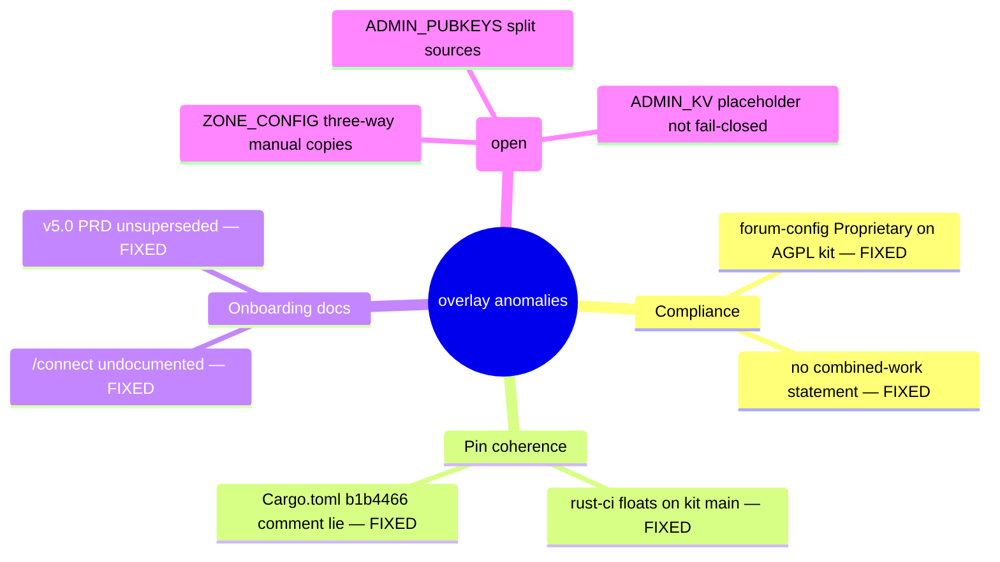

# Anomaly Register — dreamlab-ai-website (forum deployment overlay)

Ecosystem audit 2026-06-11 (diagram-driven, ruflo mesh: 1 sonnet cartographer + 1 opus auditor + 1 opus fixer, Fable queen). Ground-truth map: [forum-deployment-sequence.md](forum-deployment-sequence.md).

## Resolved in this sweep

| ID | Finding | Resolution |
|----|---------|------------|
| R1 | `forum-config/Cargo.toml` declared `license = "Proprietary"` while statically linking the AGPL-3.0-only kit crates; no LICENSE file anywhere; README claimed blanket "Proprietary" | forum-config → AGPL-3.0-only + LICENSE file; README licensing split: branded React site proprietary, forum surfaces = combined work of the AGPL kit with source pointer. (DreamLab authors the kit, so §13 against itself is moot — but the pod-worker links upstream `solid-pod-rs`, so the visible source offer stands.) |
| R2 | `rust-ci.yml` pinned `KIT_REF: 'main'` while both deploy workflows pin `25ca8a1` — CI tested a different kit than production deploys (the exact failure mode workers-deploy.yml's own comment warns against) | Pinned to the deploy SHA with a lockstep comment |
| R3 | `forum-config/Cargo.toml:13` header comment described kit "3.0.0-rc11 (b1b4466)" while every pin is `25ca8a1` | Comment corrected |
| R4 | Deployed `/connect` magic-link (ADR-098) documented nowhere; `prd-ux-onboarding-v5.0.md` (traffic-light auth picker) still `accepted` with no supersession | forum-onboarding.md §ADR-098 added; v5.0 PRD superseded-by note |
| R5 | Stale legacy-tree references: ADR index banner (`community-forum-rs/crates/` as live source), docs/README "TypeScript Worker" ×2, wrangler provenance comments, v7.0 PRD path inventory, QE audit citations against a local `project2` snapshot | Corrected/annotated as historical |
| R6 | 9 untracked one-off live-debug probes cluttering `scripts/seed/` | Moved to gitignored `scripts/seed/probes/` |

## Secret-material verdict

**Clean.** Every tracked script sources signing keys from gitignored stores (`agentbox/.env`, `scripts/seed/.test-keys.json`); all hex literals in tracked files are public keys / channel IDs. `find-admin-key.mjs` prints variable *names* only. `.test-keys.json` correctly untracked + gitignored. Recommended follow-up: `git log --all -- .nostr-identities.env` to confirm the ignored env files were never committed historically.

## Open — config synchronisation (need pipeline work, not doc edits)

| ID | Sev | Where | Finding |
|----|-----|-------|---------|
| O1 | MED | `dreamlab.toml [[zones]]` / relay `ZONE_CONFIG` `[vars]` / client `window.__ENV__.ZONE_CONFIG` | Zone config exists as three manually-synchronised copies; no build step generates the latter two from the authored source. Divergence = UI/enforcement mismatch. |
| O2 | MED | `search-worker.wrangler.toml:34` vs auth-worker secret vs `dreamlab.toml [admin].static_pubkeys` | `ADMIN_PUBKEYS` split across a 2-key plaintext `[vars]`, a 5-key CF secret, and the authored toml — unsynchronised. |
| O3 | HIGH | `auth-worker.wrangler.toml:40`, `pod-worker.wrangler.toml:22` | `ADMIN_KV` placeholder `REPLACE_WITH_NEW_ADMIN_KV_ID` is sed-substituted at deploy time; CI asserts the placeholder is *present*, not resolved — a silent KV-provision failure deploys a broken binding. Make the substitution fail-closed. |
| O4 | LOW | `set-worker-secrets.yml` vs `[vars]` | `NATIVE_POD_URL` exists as both plaintext var and CF secret (secret silently wins; the var is dead). `VITE_LINK_PREVIEW_API_URL` in `__ENV__` but absent from vite-env.d.ts/.env.example; 9 declared VITE_ vars never set anywhere. `CLOUDFLARE_PAGES_ENABLED`/`DREAMLAB_UK_TOKEN` optional deploy targets undocumented. |
| O5 | LOW | `rust-ci.yml:9` | Workflow is `workflow_dispatch` only — kit worker tests never run automatically; only the forum-config overlay crate is auto-gated. |

## Verdict

Deploy pins are mutually coherent (Cargo.toml = Cargo.lock = both deploy workflows); Pages vs Workers deploys split correctly with no duplicate-deploy conflict. Remaining debt is the three config-synchronisation gaps (O1-O3) — best solved by generating worker `[vars]` and `__ENV__` from `dreamlab.toml` in the deploy pipeline rather than hand-copying.
