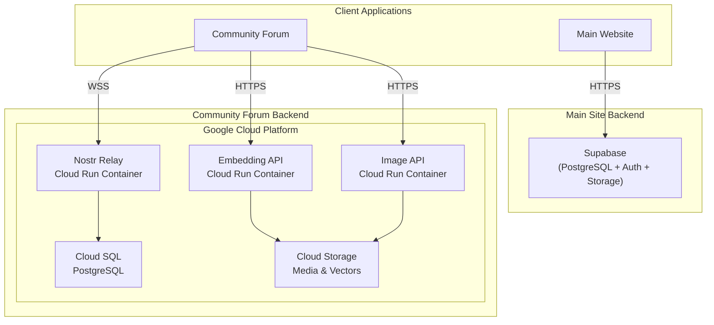
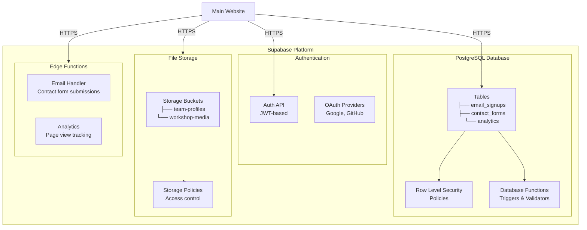
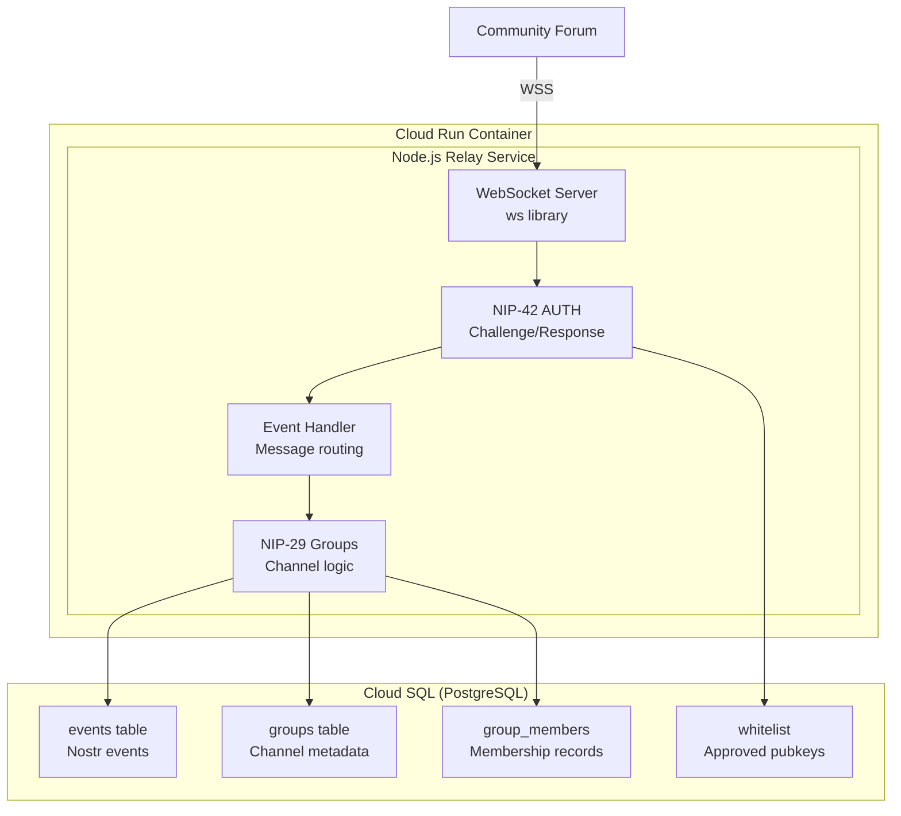
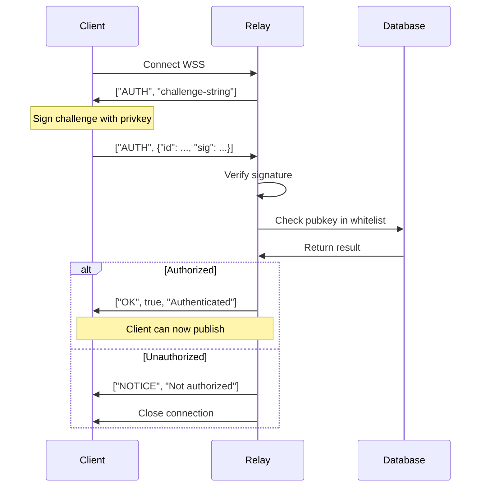
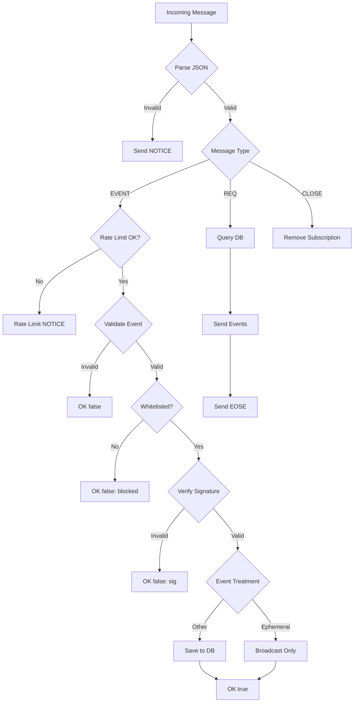
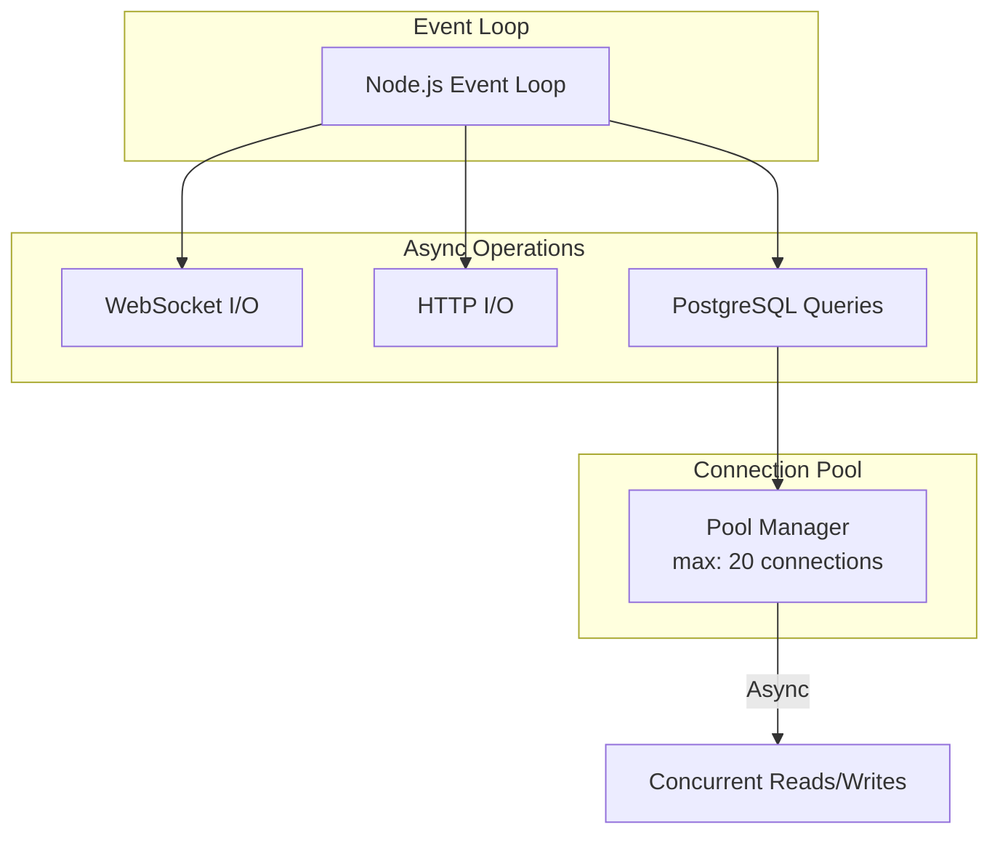
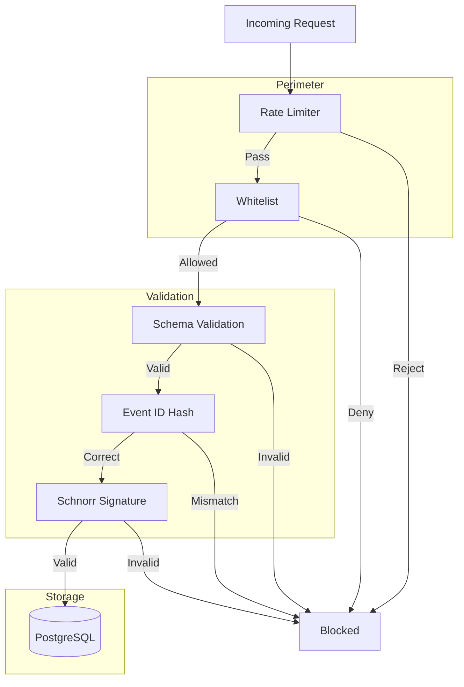
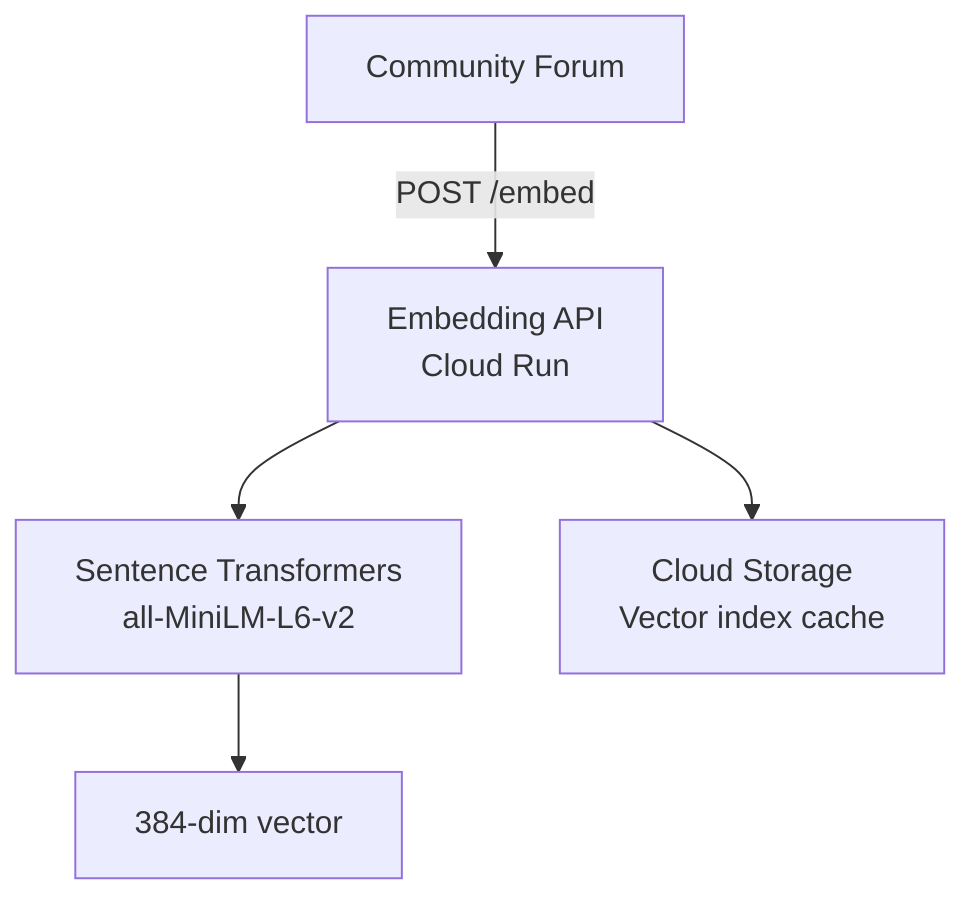
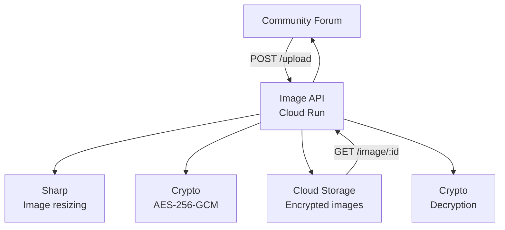

# Backend Services Architecture - DreamLab AI

**Last Updated**: 2026-01-25
**Platform**: Google Cloud Platform + Supabase
**Status**: Production

## Overview

DreamLab AI utilizes a hybrid backend architecture combining managed Supabase services for the main marketing site and custom Google Cloud Run services for the Fairfield community forum.

---

## Service Topology



---

## Service Catalog

| Service | Platform | Purpose | Protocol | Endpoint |
|---------|----------|---------|----------|----------|
| **Supabase** | Supabase Cloud | Main site database, auth | HTTPS | Managed |
| **Nostr Relay** | Cloud Run | WebSocket messaging | WSS | wss://relay.dreamlab-ai.com |
| **Embedding API** | Cloud Run | Vector generation | HTTPS | https://embed.dreamlab-ai.com |
| **Image API** | Cloud Run | Media processing | HTTPS | https://images.dreamlab-ai.com |

---

## 1. Supabase Backend (Main Site)

### Architecture



### Database Schema

**email_signups** table:

```sql
CREATE TABLE email_signups (
  id UUID PRIMARY KEY DEFAULT uuid_generate_v4(),
  email TEXT NOT NULL UNIQUE,
  name TEXT,
  source TEXT, -- 'newsletter' | 'masterclass' | 'workshop'
  created_at TIMESTAMPTZ DEFAULT NOW(),
  verified BOOLEAN DEFAULT FALSE
);

-- Row Level Security
ALTER TABLE email_signups ENABLE ROW LEVEL SECURITY;

CREATE POLICY "Public can insert emails"
  ON email_signups FOR INSERT
  WITH CHECK (true);

-- Index for fast lookups
CREATE INDEX idx_email_signups_email ON email_signups(email);
CREATE INDEX idx_email_signups_created_at ON email_signups(created_at DESC);
```

**contact_forms** table:

```sql
CREATE TABLE contact_forms (
  id UUID PRIMARY KEY DEFAULT uuid_generate_v4(),
  name TEXT NOT NULL,
  email TEXT NOT NULL,
  company TEXT,
  message TEXT NOT NULL,
  selected_team_members TEXT[], -- Array of team member IDs
  status TEXT DEFAULT 'pending', -- 'pending' | 'responded' | 'archived'
  created_at TIMESTAMPTZ DEFAULT NOW(),
  responded_at TIMESTAMPTZ
);

-- RLS: Only authenticated admins can read
CREATE POLICY "Admins can view contact forms"
  ON contact_forms FOR SELECT
  USING (auth.jwt() ->> 'role' = 'admin');

-- Public can insert
CREATE POLICY "Public can submit contact forms"
  ON contact_forms FOR INSERT
  WITH CHECK (true);
```

### Supabase Client Configuration

**Implementation** (`src/lib/supabase.ts`):

```typescript
import { createClient } from '@supabase/supabase-js';

const supabaseUrl = import.meta.env.VITE_SUPABASE_URL;
const supabaseAnonKey = import.meta.env.VITE_SUPABASE_ANON_KEY;

export const supabase = createClient(supabaseUrl, supabaseAnonKey, {
  auth: {
    autoRefreshToken: true,
    persistSession: false, // No persistent sessions for public site
    detectSessionInUrl: false
  },
  global: {
    headers: {
      'apikey': supabaseAnonKey,
      'Authorization': `Bearer ${supabaseAnonKey}`
    }
  }
});
```

**Usage Example**:

```typescript
// Email signup
async function subscribeToNewsletter(email: string, name: string) {
  const { data, error } = await supabase
    .from('email_signups')
    .insert({ email, name, source: 'newsletter' })
    .select();

  if (error) throw error;
  return data;
}

// Contact form submission
async function submitContactForm(formData: ContactForm) {
  const { data, error } = await supabase
    .from('contact_forms')
    .insert(formData)
    .select();

  if (error) throw error;
  return data;
}
```

### Security Configuration

**Row Level Security (RLS) Policies**:

| Table | Operation | Policy |
|-------|-----------|--------|
| email_signups | INSERT | Public (anyone can subscribe) |
| email_signups | SELECT | Admins only |
| contact_forms | INSERT | Public (anyone can submit) |
| contact_forms | SELECT | Admins only |
| contact_forms | UPDATE | Admins only (status changes) |

**Environment Variables**:

```bash
# Stored in GitHub Secrets
VITE_SUPABASE_URL=https://xxx.supabase.co
VITE_SUPABASE_ANON_KEY=eyJhbGciOiJIUzI1NiIsInR5cCI6IkpXVCJ9...
```

---

## 2. Nostr Relay (Cloud Run)

### Purpose

WebSocket-based messaging relay for the Fairfield community forum, implementing Nostr protocol (NIPs 01, 09, 29, 42, 44).

### Architecture



### Technology Stack

| Component | Technology | Version | Purpose |
|-----------|-----------|---------|---------|
| Runtime | Node.js | 20 LTS | JavaScript execution |
| WebSocket | ws | 8.x | WebSocket server |
| Database Driver | pg | 8.x | PostgreSQL client |
| Nostr Library | nostr-tools | 2.x | Event validation |
| Container | Docker | Latest | Deployment container |

### Configuration

**Dockerfile**:

```dockerfile
FROM node:20-alpine

WORKDIR /app

COPY package*.json ./
RUN npm ci --production

COPY . .

EXPOSE 8080

CMD ["node", "src/index.js"]
```

**Environment Variables**:

```bash
DATABASE_URL=postgresql://user:pass@/db?host=/cloudsql/project:region:instance
PORT=8080
RELAY_NAME=DreamLab Community Relay
ADMIN_PUBKEY=npub1... # Admin's Nostr public key
AUTH_ENABLED=true
```

### Database Schema (Cloud SQL)

**events** table:

```sql
CREATE TABLE events (
  id TEXT PRIMARY KEY, -- Nostr event ID (hex)
  pubkey TEXT NOT NULL, -- Author's public key
  created_at INTEGER NOT NULL, -- Unix timestamp
  kind INTEGER NOT NULL, -- Event kind (1, 9, etc.)
  tags JSONB NOT NULL, -- Event tags
  content TEXT NOT NULL, -- Event content
  sig TEXT NOT NULL, -- Event signature
  deleted BOOLEAN DEFAULT FALSE,
  deleted_at TIMESTAMPTZ
);

-- Indexes for fast queries
CREATE INDEX idx_events_pubkey ON events(pubkey);
CREATE INDEX idx_events_created_at ON events(created_at DESC);
CREATE INDEX idx_events_kind ON events(kind);
CREATE INDEX idx_events_tags ON events USING GIN(tags);
```

**groups** table (NIP-29):

```sql
CREATE TABLE groups (
  id TEXT PRIMARY KEY, -- Group identifier (hex)
  name TEXT NOT NULL,
  description TEXT,
  admin_pubkey TEXT NOT NULL, -- Group owner
  is_private BOOLEAN DEFAULT FALSE, -- Encrypted channels
  created_at TIMESTAMPTZ DEFAULT NOW()
);
```

**group_members** table:

```sql
CREATE TABLE group_members (
  group_id TEXT REFERENCES groups(id),
  pubkey TEXT NOT NULL,
  role TEXT DEFAULT 'member', -- 'admin' | 'member' | 'moderator'
  joined_at TIMESTAMPTZ DEFAULT NOW(),
  PRIMARY KEY (group_id, pubkey)
);

CREATE INDEX idx_group_members_pubkey ON group_members(pubkey);
```

**whitelist** table (NIP-42 AUTH):

```sql
CREATE TABLE whitelist (
  pubkey TEXT PRIMARY KEY,
  approved_by TEXT, -- Admin who approved
  approved_at TIMESTAMPTZ DEFAULT NOW(),
  notes TEXT
);
```

### API Endpoints

| Endpoint | Protocol | Purpose |
|----------|----------|---------|
| `/` | WSS | Main WebSocket relay |
| `/health` | HTTP GET | Health check (for Cloud Run) |

**WebSocket Protocol**:

```json
// Client sends:
["EVENT", {"id": "abc...", "pubkey": "def...", ...}]

// Relay responds:
["OK", "abc...", true, ""]

// Relay broadcasts to subscribers:
["EVENT", "subscription-id", {"id": "abc...", ...}]
```

### NIP-42 Authentication Flow



### Event Processing Pipeline

The relay processes events through multiple validation and storage stages:



### Concurrency Model

The relay uses Node.js event loop with async database operations:



### Deployment (Cloud Run)

**Configuration**:

```yaml
# .github/workflows/fairfield-relay.yml
- name: Deploy to Cloud Run
  run: |
    gcloud run deploy dreamlab-relay \
      --image gcr.io/$PROJECT_ID/dreamlab-relay:$GITHUB_SHA \
      --platform managed \
      --region us-central1 \
      --allow-unauthenticated \
      --add-cloudsql-instances $CLOUDSQL_INSTANCE \
      --set-env-vars DATABASE_URL=$DATABASE_URL,ADMIN_PUBKEY=$ADMIN_PUBKEY \
      --memory 512Mi \
      --cpu 1 \
      --max-instances 1 \
      --min-instances 1 \
      --timeout 3600 \
      --no-cpu-throttling
```

**Scaling Configuration**:

- **Min instances**: 1 (always available for reliability)
- **Max instances**: 1 (single instance for consistency)
- **CPU**: 1 vCPU
- **Memory**: 512 MB
- **Timeout**: 3600s (1 hour for long-lived WebSocket connections)
- **CPU throttling**: Disabled for consistent performance
- **Port**: 8080

### Security Architecture



---

## 3. Embedding API (Cloud Run)

### Purpose

Generate 384-dimensional embeddings for semantic search using `all-MiniLM-L6-v2` model.

### Architecture



### Technology Stack

| Component | Technology | Purpose |
|-----------|-----------|---------|
| Runtime | Python 3.11 | ML libraries |
| Framework | FastAPI | REST API |
| ML Library | sentence-transformers | Embedding generation |
| WSGI Server | Uvicorn | Production server |

### API Specification

**POST /embed**

Request:

```json
{
  "texts": [
    "What are the prerequisites for the masterclass?",
    "Tell me about the 2-day residential training"
  ]
}
```

Response:

```json
{
  "embeddings": [
    [0.123, -0.456, 0.789, ...], // 384 dimensions
    [0.234, -0.567, 0.891, ...]
  ],
  "model": "all-MiniLM-L6-v2",
  "dimension": 384
}
```

**GET /health**

Response:

```json
{
  "status": "healthy",
  "model_loaded": true,
  "uptime_seconds": 12345
}
```

### Implementation

**main.py**:

```python
from fastapi import FastAPI
from sentence_transformers import SentenceTransformer
from pydantic import BaseModel

app = FastAPI()
model = SentenceTransformer('all-MiniLM-L6-v2')

class EmbedRequest(BaseModel):
    texts: list[str]

@app.post("/embed")
async def embed(request: EmbedRequest):
    embeddings = model.encode(request.texts)
    return {
        "embeddings": embeddings.tolist(),
        "model": "all-MiniLM-L6-v2",
        "dimension": 384
    }

@app.get("/health")
async def health():
    return {"status": "healthy", "model_loaded": True}
```

**Dockerfile**:

```dockerfile
FROM python:3.11-slim

WORKDIR /app

COPY requirements.txt .
RUN pip install --no-cache-dir -r requirements.txt

# Pre-download model during build
RUN python -c "from sentence_transformers import SentenceTransformer; SentenceTransformer('all-MiniLM-L6-v2')"

COPY . .

EXPOSE 8080

CMD ["uvicorn", "main:app", "--host", "0.0.0.0", "--port", "8080"]
```

### Performance Characteristics

| Metric | Value |
|--------|-------|
| Batch size | 32 texts |
| Latency (single text) | ~50ms |
| Latency (batch of 32) | ~200ms |
| Memory usage | ~500 MB |
| Cold start | ~5s |

---

## 4. Image API (Cloud Run)

### Purpose

Handle image uploads, resizing, and encryption for the community forum.

### Architecture



### Technology Stack

| Component | Technology | Purpose |
|-----------|-----------|---------|
| Runtime | Node.js 20 | JavaScript execution |
| Framework | Express.js | REST API |
| Image Processing | sharp | Resize, optimize |
| Encryption | crypto (native) | AES-256-GCM |
| Storage Client | @google-cloud/storage | GCS integration |

### API Specification

**POST /upload**

Request (multipart/form-data):

```
Content-Type: multipart/form-data
file: <image file>
channel_id: abc123
```

Response:

```json
{
  "image_id": "img_abc123xyz",
  "url": "https://images.dreamlab-ai.com/image/img_abc123xyz",
  "thumbnail_url": "https://images.dreamlab-ai.com/image/img_abc123xyz/thumb",
  "encrypted": true
}
```

**GET /image/:image_id**

Query params:
- `channel_id` (required for encrypted images)
- `size` (optional: `thumb` | `medium` | `full`)

Response: Image binary data (JPEG/PNG)

### Implementation

**index.js**:

```javascript
const express = require('express');
const multer = require('multer');
const sharp = require('sharp');
const crypto = require('crypto');
const { Storage } = require('@google-cloud/storage');

const app = express();
const storage = new Storage();
const bucket = storage.bucket(process.env.IMAGE_BUCKET);
const upload = multer({ storage: multer.memoryStorage() });

app.post('/upload', upload.single('file'), async (req, res) => {
  const { file } = req;
  const { channel_id } = req.body;

  // Resize and optimize
  const resized = await sharp(file.buffer)
    .resize(1200, 1200, { fit: 'inside', withoutEnlargement: true })
    .jpeg({ quality: 80 })
    .toBuffer();

  // Encrypt if channel requires encryption
  const encryptionKey = await getChannelEncryptionKey(channel_id);
  const encrypted = encryptAES256GCM(resized, encryptionKey);

  // Upload to Cloud Storage
  const imageId = `img_${crypto.randomUUID()}`;
  await bucket.file(`${channel_id}/${imageId}`).save(encrypted);

  res.json({
    image_id: imageId,
    url: `/image/${imageId}`,
    encrypted: true,
  });
});

function encryptAES256GCM(data, key) {
  const iv = crypto.randomBytes(16);
  const cipher = crypto.createCipheriv('aes-256-gcm', key, iv);
  const encrypted = Buffer.concat([cipher.update(data), cipher.final()]);
  const authTag = cipher.getAuthTag();
  return Buffer.concat([iv, authTag, encrypted]);
}
```

### Security

| Mechanism | Implementation |
|-----------|----------------|
| Encryption | AES-256-GCM (industry standard) |
| Key Derivation | PBKDF2 from channel secrets |
| Access Control | Channel membership validation |
| File Validation | MIME type checking, size limits |

---

## Monitoring & Observability

### Google Cloud Monitoring

**Metrics Collected**:

| Metric | Service | Threshold |
|--------|---------|-----------|
| Request count | All | N/A |
| Request latency | All | p95 < 500ms |
| Error rate | All | < 1% |
| CPU utilization | All | < 80% |
| Memory usage | All | < 80% |
| Database connections | Cloud SQL | < 90% of max |

**Alerts**:

- Error rate > 5% for 5 minutes → PagerDuty
- Latency p95 > 1s for 10 minutes → Slack notification
- Database connections > 95% → Email alert

### Logging

**Log Aggregation**: Google Cloud Logging

**Log Levels**:
- **ERROR**: Application errors, exceptions
- **WARN**: Slow queries, rate limit hits
- **INFO**: Request logs, deployment events
- **DEBUG**: Detailed debugging (dev only)

**Example Log Entry**:

```json
{
  "severity": "INFO",
  "timestamp": "2026-01-25T10:30:00Z",
  "resource": {
    "type": "cloud_run_revision",
    "labels": { "service_name": "dreamlab-relay" }
  },
  "jsonPayload": {
    "event": "message_published",
    "pubkey": "abc...",
    "channel_id": "xyz...",
    "latency_ms": 45
  }
}
```

---

## Disaster Recovery

### Backup Strategy

| Component | Frequency | Retention | Location |
|-----------|-----------|-----------|----------|
| Cloud SQL | Daily (automated) | 30 days | Multi-region |
| Cloud Storage | Versioning enabled | 90 days | us-central1 + backup region |
| Supabase DB | Daily (managed) | 30 days | Managed by Supabase |

### Recovery Procedures

**Cloud SQL Restore**:

```bash
gcloud sql backups restore BACKUP_ID \
  --backup-instance=SOURCE_INSTANCE \
  --backup-instance-project=PROJECT_ID \
  --target-instance=TARGET_INSTANCE
```

**Cloud Run Rollback**:

```bash
gcloud run services update-traffic dreamlab-relay \
  --to-revisions=dreamlab-relay-v1234=100
```

### High Availability

**Cloud Run**:
- Multi-zone deployment (automatic)
- Health checks every 30s
- Auto-restart on failure
- Traffic routing to healthy instances only

**Cloud SQL**:
- High availability configuration (HA)
- Automatic failover < 60s
- Read replicas for scaling

---

## Cost Optimization

### Current Spend (Monthly)

| Service | Cost |
|---------|------|
| Supabase (Free tier) | $0 |
| Cloud Run (Relay) | ~$5 |
| Cloud Run (Embedding API) | ~$3 |
| Cloud Run (Image API) | ~$2 |
| Cloud SQL | ~$10 |
| Cloud Storage | ~$1 |
| **Total** | **~$21/month** |

### Optimization Strategies

1. **Keep Supabase in free tier**: Current usage well below limits
2. **Min instances = 1 for relay**: Worth the cost for availability
3. **Scale to zero for APIs**: Embedding/Image APIs rarely used
4. **Database connection pooling**: Reduce Cloud SQL costs
5. **Image compression**: Reduce storage costs by 60%

---

## Security Hardening

### Best Practices Implemented

| Practice | Implementation |
|----------|----------------|
| **Secrets Management** | Google Secret Manager, GitHub Secrets |
| **Network Security** | VPC Service Controls, Cloud Armor |
| **IAM** | Least privilege, service accounts per service |
| **Encryption** | TLS 1.3 in transit, AES-256 at rest |
| **Audit Logging** | All API calls logged to Cloud Audit Logs |
| **DDoS Protection** | Cloud Armor rate limiting |
| **Input Validation** | Zod schemas, parameterized queries |

---

## Related Documentation

- [System Overview](SYSTEM_OVERVIEW.md) - High-level architecture
- [Frontend Architecture](FRONTEND_ARCHITECTURE.md) - React component patterns
- [Data Flow](DATA_FLOW.md) - Request/response sequences
- [Deployment Guide](DEPLOYMENT.md) - CI/CD pipeline details

---

**Document Owner**: Backend Team
**Review Cycle**: Quarterly
**Last Review**: 2026-01-25
