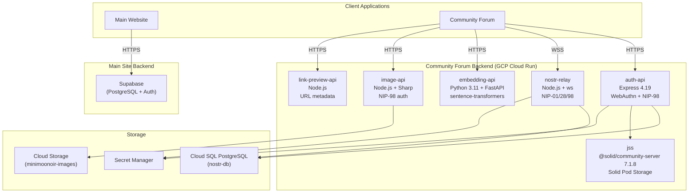
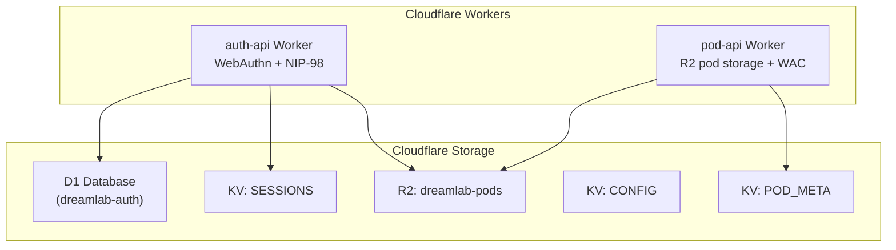
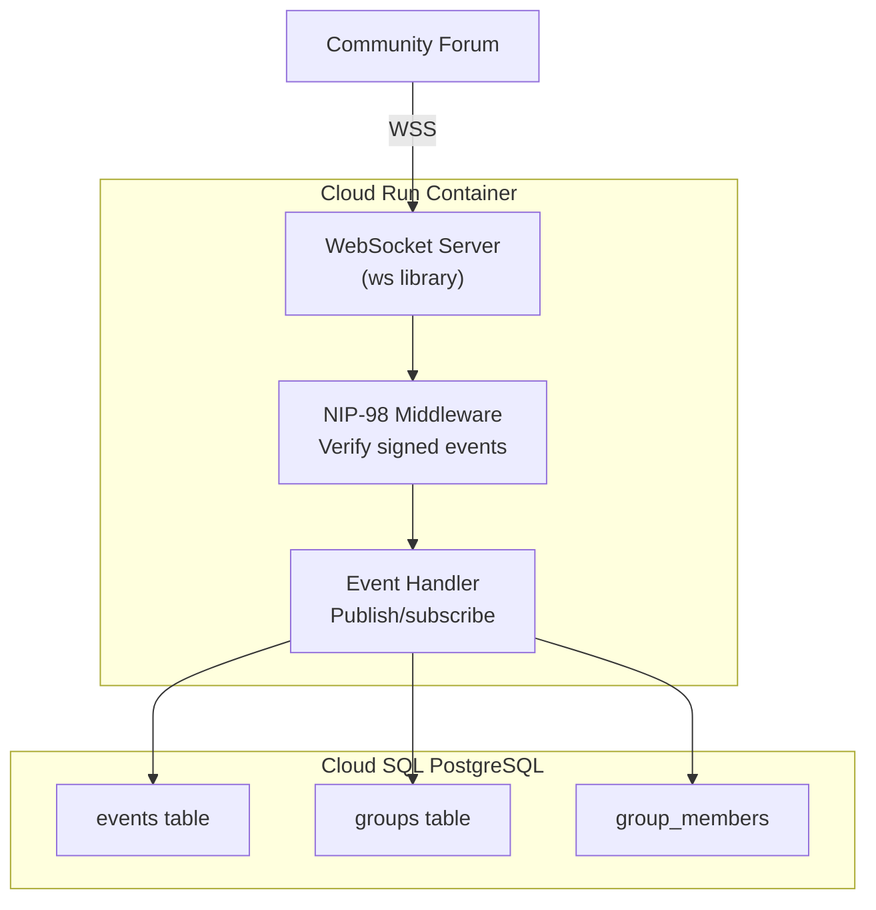

# Backend Services Architecture -- DreamLab AI

**Last Updated**: 2026-02-28
**Current Platform**: GCP Cloud Run (cumbriadreamlab project, us-central1)
**Target Platform**: Hybrid -- Cloudflare Workers + GCP Cloud Run (ADR-010)

## Overview

DreamLab AI operates a hybrid backend architecture:

- **Main marketing site**: Supabase (managed PostgreSQL + Auth) for form submissions and email signups.
- **Community forum**: Six GCP Cloud Run services providing WebAuthn authentication, Solid pod storage, Nostr relay messaging, vector embeddings, image processing, and link previews.
- **Planned migration**: Four of the six Cloud Run services are being migrated to Cloudflare Workers (auth-api, pod-api, image-api, link-preview-api). Code exists in `workers/`.

---

## Service Topology

### Current Production



### Planned Cloudflare Workers



---

## Service Catalogue

### Current GCP Cloud Run Services

| Service | Workflow | Technology | Resources | Instances |
|---------|----------|-----------|-----------|-----------|
| **auth-api** | `auth-api.yml` | Express 4.19, @simplewebauthn/server 10.0, nostr-tools 2.19.3, pg 8.12 | 512Mi, 1 CPU | 0--3 |
| **jss** | `jss.yml` | @solid/community-server 7.1.8, node:20-slim | 1Gi, 1 CPU | 0--2 |
| **nostr-relay** | `fairfield-relay.yml` | Node.js 20, ws, pg, nostr-tools | 512Mi, 1 CPU, no-cpu-throttling | 1--1 |
| **embedding-api** | `fairfield-embedding-api.yml` | Python 3.11, FastAPI, sentence-transformers (all-MiniLM-L6-v2) | 2Gi, 2 CPU | 0--5 |
| **image-api** | `fairfield-image-api.yml` | Node.js 20, Express, Sharp | 512Mi, 1 CPU | 0--10 |
| **link-preview-api** | (manual) | Node.js | 256Mi, 0.5 CPU | 0--5 |

### Planned Cloudflare Workers

| Worker | File | Replaces | Storage | Routes |
|--------|------|----------|---------|--------|
| **auth-api** | `workers/auth-api/index.ts` | Cloud Run auth-api | D1 + KV (SESSIONS) | `api.dreamlab-ai.com/*` |
| **pod-api** | `workers/pod-api/index.ts` | Cloud Run JSS | R2 (PODS) + KV (POD_META) | `pods.dreamlab-ai.com/*` |

---

## 1. auth-api (Cloud Run -- Current)

### Purpose

WebAuthn registration and authentication with PRF extension support, NIP-98 HTTP auth gating, and Solid pod provisioning via JSS.

### Endpoints

| Endpoint | Method | Purpose |
|----------|--------|---------|
| `/health` | GET | Health check |
| `/auth/register/options` | POST | Generate WebAuthn creation options + PRF salt |
| `/auth/register/verify` | POST | Verify attestation, store credential, provision pod |
| `/auth/login/options` | POST | Generate WebAuthn request options + stored PRF salt |
| `/auth/login/verify` | POST | Verify assertion, update counter |

### Key Files

| File | Role |
|------|------|
| `community-forum/services/auth-api/src/server.ts` | Express app, CORS, raw body capture |
| `community-forum/services/auth-api/src/webauthn.ts` | Registration/authentication option generators |
| `community-forum/services/auth-api/src/nip98.ts` | NIP-98 server-side verification |
| `community-forum/services/auth-api/src/db.ts` | PostgreSQL pool, schema |
| `community-forum/services/auth-api/src/jss-client.ts` | JSS pod provisioning client |
| `community-forum/services/auth-api/src/routes/register.ts` | Registration route handlers |
| `community-forum/services/auth-api/src/routes/authenticate.ts` | Authentication route handlers |

### Database Schema (Cloud SQL -- nostr-db)

```sql
-- WebAuthn credentials
CREATE TABLE webauthn_credentials (
  pubkey TEXT PRIMARY KEY,
  credential_id TEXT NOT NULL,
  public_key TEXT NOT NULL,
  counter INTEGER DEFAULT 0,
  prf_salt TEXT,                    -- Base64url PRF salt (stored at registration)
  created_at BIGINT NOT NULL
);

-- WebAuthn challenges (short-lived)
CREATE TABLE challenges (
  pubkey TEXT NOT NULL,
  challenge TEXT NOT NULL,
  created_at BIGINT NOT NULL
);

CREATE INDEX idx_challenges_pubkey ON challenges(pubkey);
```

### Configuration

| Env Var | Source | Purpose |
|---------|--------|---------|
| `DATABASE_URL` | Secret Manager (`nostr-db-url`) | PostgreSQL connection string |
| `JSS_BASE_URL` | Secret Manager (`jss-base-url`) | JSS pod server URL |
| `RP_ID` | Env var | `dreamlab-ai.com` |
| `RP_NAME` | Env var | `DreamLab Community` |
| `RP_ORIGIN` | Env var | `https://dreamlab-ai.com` (anti-SSRF) |

---

## 2. auth-api Worker (Cloudflare -- Planned)

### Purpose

Edge-native replacement for the Cloud Run auth-api. Uses D1 for structured data and KV for sessions.

### Implementation (`workers/auth-api/index.ts`)

The Worker handles the same four WebAuthn endpoints plus NIP-98-protected API routes. Key differences from the Cloud Run version:

| Aspect | Cloud Run | Cloudflare Worker |
|--------|-----------|-------------------|
| Runtime | Node.js 20 + Express | Cloudflare Workers V8 isolate |
| Database | PostgreSQL (Cloud SQL) | D1 (SQLite) |
| Sessions | In-memory / database | KV namespace |
| Pod provisioning | HTTP call to JSS | Direct R2 write + KV metadata |
| Cold start | 1--10s | <5ms |
| Secrets | GCP Secret Manager | Workers secrets (wrangler) |

### Bindings (from `wrangler.toml`)

```toml
[[d1_databases]]
binding = "DB"
database_name = "dreamlab-auth"

[[kv_namespaces]]
binding = "SESSIONS"
binding = "POD_META"
binding = "CONFIG"

[[r2_buckets]]
binding = "PODS"
bucket_name = "dreamlab-pods"

[vars]
RP_ID = "dreamlab-ai.com"
RP_NAME = "DreamLab Community"
EXPECTED_ORIGIN = "https://dreamlab-ai.com"
```

### Pod Provisioning (Workers-native)

When a user registers, the Worker provisions a Solid pod directly in R2:

1. Creates a JSON-LD ACL document in KV (`acl:{pubkey}`) granting owner full access and public read on `/profile/`.
2. Creates a `profile/card` resource in R2 with `foaf:Person` and `did:nostr:{pubkey}`.
3. Stores pod metadata in KV (`meta:{pubkey}`).

---

## 3. pod-api Worker (Cloudflare -- Planned)

### Purpose

Per-user Solid pod storage backed by R2 and KV, replacing the JSS Cloud Run service. Supports NIP-98-authenticated CRUD with WAC (Web Access Control) enforcement.

### Implementation (`workers/pod-api/index.ts`)

| Method | Operation | ACL Mode Required |
|--------|-----------|-------------------|
| `GET` / `HEAD` | Read resource from R2 | Read |
| `PUT` | Create/update resource in R2 | Write |
| `POST` | Append to resource in R2 | Append |
| `DELETE` | Delete resource from R2 | Write |

### Route Pattern

```
/pods/{pubkey}/{resource-path}
```

Where `{pubkey}` is a 64-character hex Nostr public key and `{resource-path}` is any path under the user's pod.

### WAC Evaluator (`workers/pod-api/acl.ts`)

A self-contained JSON-LD WAC evaluator (~140 lines, zero external dependencies) that:

1. Parses `@graph` array from the ACL document.
2. For each authorization entry, checks whether the requesting agent matches (`acl:agent` or `acl:agentClass`).
3. Checks whether the resource path matches (`acl:accessTo` for exact match, `acl:default` for container inheritance).
4. Checks whether the required access mode is granted (`acl:Read`, `acl:Write`, `acl:Append`, `acl:Control`).
5. Returns `false` if no ACL document exists (secure by default).

Supported agent classes:
- `foaf:Agent` -- matches everyone (public access)
- `acl:AuthenticatedAgent` -- matches any authenticated user

### Default ACL (created at registration)

```json
{
  "@graph": [
    {
      "@id": "#owner",
      "@type": "acl:Authorization",
      "acl:agent": { "@id": "did:nostr:{pubkey}" },
      "acl:accessTo": { "@id": "./" },
      "acl:default": { "@id": "./" },
      "acl:mode": ["acl:Read", "acl:Write", "acl:Control"]
    },
    {
      "@id": "#public",
      "@type": "acl:Authorization",
      "acl:agentClass": { "@id": "foaf:Agent" },
      "acl:accessTo": { "@id": "./profile/" },
      "acl:mode": ["acl:Read"]
    }
  ]
}
```

---

## 4. jss -- JavaScript Solid Server (Cloud Run -- Current)

### Purpose

Solid Community Server providing per-user WebID and pod storage. Each registered user gets a pod at `{jss-url}/{pubkey}/` with a WebID at `{jss-url}/{pubkey}/profile/card#me`.

### Technology

- `@solid/community-server` 7.1.8
- `node:20-slim` Docker image
- `entrypoint.sh`: `css --port 8080 --baseUrl $JSS_BASE_URL`
- Cloud Storage volume mount at `/data/pods` (GCS bucket: `dreamlab-pods`)

### Bootstrap Issue

JSS requires its own URL as `JSS_BASE_URL` before it can start, but that URL only exists after the first deployment. The `jss.yml` workflow includes a bootstrap guard that checks for the `jss-base-url` secret in Secret Manager and fails with instructions if missing.

---

## 5. nostr-relay (Cloud Run -- Retained)

### Purpose

WebSocket Nostr relay for real-time messaging in the community forum. Implements NIP-01 (basic protocol), NIP-28 (public channels), and NIP-98 (HTTP auth verification).

### Architecture



### Configuration

| Setting | Value | Purpose |
|---------|-------|---------|
| Memory | 512Mi | Moderate for WebSocket connections |
| CPU | 1 | Single vCPU |
| Min instances | 1 | Always-on for reliability |
| Max instances | 1 | Single instance for consistency |
| Timeout | 3600s | 1 hour for long-lived WebSocket |
| CPU throttling | Disabled | Consistent performance for real-time messaging |

### Database Schema

```sql
-- Nostr events
CREATE TABLE events (
  id TEXT PRIMARY KEY,          -- Nostr event ID (hex)
  pubkey TEXT NOT NULL,
  created_at INTEGER NOT NULL,
  kind INTEGER NOT NULL,
  tags JSONB NOT NULL,
  content TEXT NOT NULL,
  sig TEXT NOT NULL,
  deleted BOOLEAN DEFAULT FALSE
);

CREATE INDEX idx_events_pubkey ON events(pubkey);
CREATE INDEX idx_events_created_at ON events(created_at DESC);
CREATE INDEX idx_events_kind ON events(kind);
CREATE INDEX idx_events_tags ON events USING GIN(tags);
```

### Retention on Cloud Run (ADR-010)

The relay remains on Cloud Run because persistent WebSocket connections benefit from Cloud Run's 3600s timeout and always-on instance. A future migration to Cloudflare Durable Objects with Hibernation API is under evaluation.

---

## 6. embedding-api (Cloud Run -- Retained)

### Purpose

Generate 384-dimensional vector embeddings for semantic search using the `all-MiniLM-L6-v2` model.

### Technology

| Component | Technology |
|-----------|-----------|
| Runtime | Python 3.11 |
| Framework | FastAPI |
| ML Library | sentence-transformers |
| WSGI Server | Uvicorn |
| Build | Cloud Build (`cloudbuild.yaml`) |

### Endpoints

| Endpoint | Method | Request | Response |
|----------|--------|---------|----------|
| `/embed` | POST | `{ "texts": ["..."] }` | `{ "embeddings": [[...]], "model": "...", "dimension": 384 }` |
| `/health` | GET | - | `{ "status": "healthy", "model_loaded": true }` |

### Performance

| Metric | Value |
|--------|-------|
| Single text latency | ~50ms |
| Batch of 32 | ~200ms |
| Memory usage | ~500MB |
| Cold start | ~5s (model loading) |

### Retention on Cloud Run (ADR-010)

ML inference requires more CPU and memory than Cloudflare Workers provide (30s CPU limit, no GPU).

---

## 7. image-api (Cloud Run -- Current)

### Purpose

Image upload, resizing, and serving with NIP-98 authentication for the community forum.

### Technology

| Component | Technology |
|-----------|-----------|
| Runtime | Node.js 20 |
| Framework | Express |
| Image Processing | Sharp |
| Storage | Google Cloud Storage (minimoonoir-images) |

### Endpoints

| Endpoint | Method | Purpose |
|----------|--------|---------|
| `/upload` | POST | Upload image (multipart, NIP-98 auth) |
| `/image/:id` | GET | Retrieve processed image |
| `/image/:id/thumb` | GET | Retrieve thumbnail |
| `/health` | GET | Health check |

---

## 8. link-preview-api (Cloud Run -- Current)

### Purpose

URL metadata extraction (title, description, Open Graph tags, favicon) for link previews in forum messages.

---

## 9. Supabase Backend (Main Site)

### Purpose

Managed PostgreSQL database for the main marketing site's form submissions, email signups, and analytics.

### Client Configuration (`src/lib/supabase.ts`)

```typescript
import { createClient } from '@supabase/supabase-js';

const supabaseUrl = import.meta.env.VITE_SUPABASE_URL;
const supabaseAnonKey = import.meta.env.VITE_SUPABASE_ANON_KEY;

export const supabase = createClient(supabaseUrl, supabaseAnonKey, {
  auth: {
    autoRefreshToken: true,
    persistSession: false,
    detectSessionInUrl: false
  }
});
```

### Database Schema

```sql
CREATE TABLE email_signups (
  id UUID PRIMARY KEY DEFAULT uuid_generate_v4(),
  email TEXT NOT NULL UNIQUE,
  name TEXT,
  source TEXT,           -- 'newsletter' | 'masterclass' | 'workshop'
  created_at TIMESTAMPTZ DEFAULT NOW(),
  verified BOOLEAN DEFAULT FALSE
);

CREATE TABLE contact_forms (
  id UUID PRIMARY KEY DEFAULT uuid_generate_v4(),
  name TEXT NOT NULL,
  email TEXT NOT NULL,
  company TEXT,
  message TEXT NOT NULL,
  selected_team_members TEXT[],
  status TEXT DEFAULT 'pending',
  created_at TIMESTAMPTZ DEFAULT NOW(),
  responded_at TIMESTAMPTZ
);
```

### Row Level Security

| Table | INSERT | SELECT | UPDATE |
|-------|--------|--------|--------|
| `email_signups` | Public | Admins only | - |
| `contact_forms` | Public | Admins only | Admins only |

---

## NIP-98 Shared Module (`community-forum/packages/nip98/`)

### Purpose

Consolidated NIP-98 HTTP authentication module shared across all consumers, replacing four independent implementations.

### Module Structure

| File | Exports | Purpose |
|------|---------|---------|
| `sign.ts` | `createNip98Token()`, `createSigner()`, `hashRawBody()` | Client-side token creation wrapping `nostr-tools/nip98` `getToken()` |
| `verify.ts` | `verifyNip98()`, `hasNostrAuth()` | Server-side verification with DreamLab hardening |
| `types.ts` | `VerifyOptions`, `VerifyResult`, `Nip98Event` | Shared type definitions |
| `index.ts` | Barrel re-exports | Package entry point |

### Consumers

| Consumer | File | Uses |
|----------|------|------|
| SvelteKit client | `community-forum/src/lib/auth/nip98-client.ts` | `createNip98Token` via `fetchWithNip98()` |
| auth-api server | `community-forum/services/auth-api/src/nip98.ts` | `verifyNip98` |
| nostr-relay | `community-forum/services/nostr-relay/` | `verifyNip98` |
| image-api | `community-forum/services/image-api/` | `verifyNip98` |
| Workers (shared) | `workers/shared/nip98.ts` | Separate edge-compatible verify (uses `atob`, Web Crypto) |

### DreamLab Hardening (beyond standard NIP-98)

| Feature | Implementation |
|---------|----------------|
| 64KB event size limit | Reject events > 64KB before parsing |
| +-60s timestamp tolerance | `Math.abs(now - created_at) > 60` |
| URL prefix matching | `allowUrlPrefix` option for sub-path matching |
| Method wildcard | `allowMethodWildcard` for `method: '*'` tokens |
| Basic nostr: fallback | `allowBasicNostr` for `Basic nostr:` auth header format |
| Payload hash verification | SHA-256 of raw body bytes matched against `payload` tag |
| Cross-platform base64 | `Buffer.from()` (Node) / `atob()` (Workers/browser) |

### Edge-Compatible Version (`workers/shared/nip98.ts`)

A separate, lighter implementation for Cloudflare Workers that:

- Uses `atob()` instead of `Buffer.from()` for base64 decoding
- Uses `crypto.subtle.digest()` for SHA-256 (Web Crypto API)
- Imports `verifyEvent` directly from `nostr-tools`
- Omits `allowBasicNostr` and `allowUrlPrefix` (not needed at edge)

---

## Cloud Run Shared Configuration

### GCP Project

| Setting | Value |
|---------|-------|
| Project ID | `cumbriadreamlab` |
| Region | `us-central1` |
| Artifact Registry | `minimoonoir` repository |
| Cloud SQL Instance | `nostr-db` |
| Service Account | `fairfield-applications@cumbriadreamlab.iam.gserviceaccount.com` |

### Secret Manager Secrets

| Secret | Used By |
|--------|---------|
| `nostr-db-url` | auth-api, nostr-relay |
| `admin-pubkey` | nostr-relay |
| `jss-base-url` | auth-api, jss |

---

## Cost Profile

### Current Monthly Costs (Approximate)

| Service | Cost |
|---------|------|
| Supabase (free tier) | $0 |
| Cloud Run (auth-api, 0--3 instances) | ~$3 |
| Cloud Run (jss, 0--2 instances) | ~$5 |
| Cloud Run (nostr-relay, 1 always-on) | ~$15 |
| Cloud Run (embedding-api, scale-to-zero) | ~$3 |
| Cloud Run (image-api, scale-to-zero) | ~$2 |
| Cloud Run (link-preview-api) | ~$1 |
| Cloud SQL (nostr-db) | ~$10 |
| Cloud Storage | ~$1 |
| Artifact Registry | ~$1 |
| **Total** | **~$41/month** |

### Projected Cloudflare Costs (Post-Migration)

| Service | Cost |
|---------|------|
| Cloudflare Workers paid plan | $5/month |
| D1 (included in paid plan) | $0 |
| KV (included in paid plan) | $0 |
| R2 (10GB free, then $0.015/GB) | ~$1 |
| Cloud Run (relay, 1 always-on) | ~$15 |
| Cloud Run (embedding-api) | ~$3 |
| Cloud SQL | ~$10 |
| **Projected Total** | **~$34/month** |

---

## Related Documentation

- [System Overview](SYSTEM_OVERVIEW.md) -- High-level architecture
- [Frontend Architecture](FRONTEND_ARCHITECTURE.md) -- React and SvelteKit patterns
- [Data Flow](DATA_FLOW.md) -- Auth, request, event, and storage flows
- [Deployment Guide](DEPLOYMENT.md) -- CI/CD pipeline details
- [ADR-010](../adr/010-return-to-cloudflare.md) -- Return to Cloudflare decision

---

**Document Owner**: Backend Team
**Review Cycle**: Quarterly
**Last Review**: 2026-02-28
