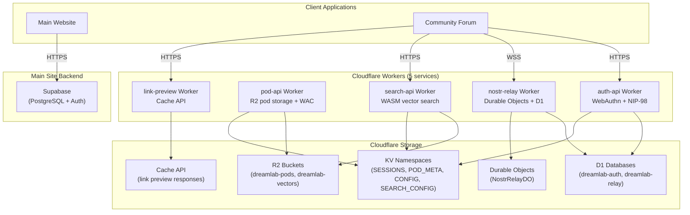
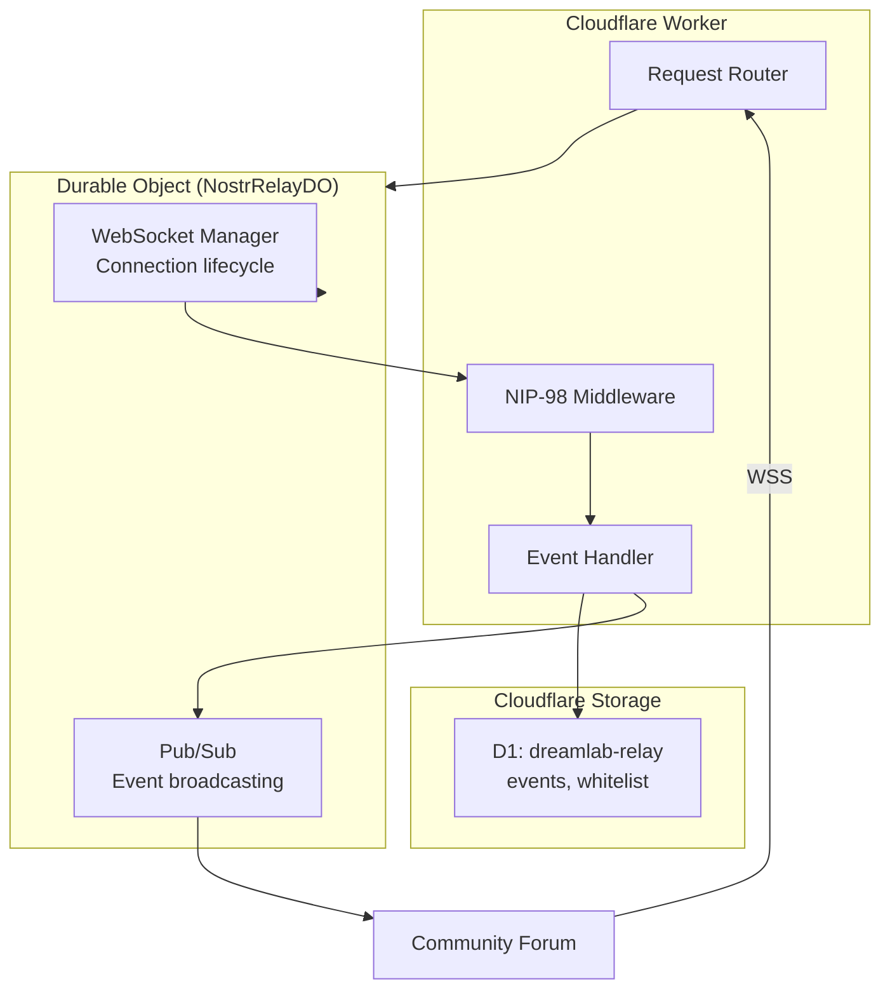

# Backend Services Architecture -- DreamLab AI

**Last Updated**: 2026-03-02
**Platform**: Cloudflare Workers (zero GCP)

## Overview

DreamLab AI operates a fully edge-native backend architecture:

- **Main marketing site**: Supabase (managed PostgreSQL + Auth) for form submissions and email signups.
- **Community forum**: Five Cloudflare Workers providing WebAuthn authentication, pod storage, vector search, Nostr relay messaging, and link previews. All deployed at `*.solitary-paper-764d.workers.dev`.
- **Storage**: D1 (structured data), KV (sessions, ACLs, config), R2 (pods, images, vectors), Durable Objects (WebSocket relay state), Cache API (link preview caching).
- **GCP**: All GCP Cloud Run services, Cloud SQL, Artifact Registry, and Secret Manager resources have been deleted as of 2026-03-02.

---

## Service Topology

### Production Architecture (as of 2026-03-02)


```mermaid
graph TB
    subgraph Main["Main Site Backend"]
        Supabase["Supabase<br/>(PostgreSQL + Auth)"]
    end

    subgraph CF["Cloudflare Workers (5 services)"]
        CFAuth["auth-api Worker<br/>WebAuthn + NIP-98"]
        CFPod["pod-api Worker<br/>R2 pod storage + WAC"]
        CFSearch["search-api Worker<br/>WASM vector search"]
        CFRelay["nostr-relay Worker<br/>Durable Objects + D1"]
        CFLink["link-preview Worker<br/>Cache API"]
    end

    subgraph CFStorage["Cloudflare Storage"]
        D1["D1 Databases<br/>(dreamlab-auth, dreamlab-relay)"]
        KV["KV Namespaces<br/>(SESSIONS, POD_META, CONFIG, SEARCH_CONFIG)"]
        R2["R2 Buckets<br/>(dreamlab-pods, dreamlab-vectors)"]
        DO["Durable Objects<br/>(NostrRelayDO)"]
        Cache["Cache API<br/>(link preview responses)"]
    end

    subgraph Clients["Client Applications"]
        MainSite["Main Website"]
        ForumApp["Community Forum"]
    end

    MainSite -->|HTTPS| Supabase
    ForumApp -->|HTTPS| CFAuth
    ForumApp -->|WSS| CFRelay
    ForumApp -->|HTTPS| CFSearch
    ForumApp -->|HTTPS| CFLink
    CFAuth --> D1
    CFAuth --> KV
    CFPod --> R2
    CFPod --> KV
    CFSearch --> R2
    CFSearch --> KV
    CFRelay --> D1
    CFRelay --> DO
    CFLink --> Cache
```

---

## Service Catalogue

### Cloudflare Workers (Production)

| Worker | File | Storage | Routes | Purpose |
|--------|------|---------|--------|---------|
| **auth-api** | `workers/auth-api/index.ts` | D1 (dreamlab-auth) + KV (SESSIONS) | `api.dreamlab-ai.com/*` | WebAuthn registration/authentication, NIP-98 gating, pod provisioning |
| **pod-api** | `workers/pod-api/index.ts` | R2 (dreamlab-pods) + KV (POD_META) | `pods.dreamlab-ai.com/*` | Per-user Solid pod storage with WAC enforcement |
| **search-api** | `workers/search-api/index.ts` | R2 (dreamlab-vectors) + KV (SEARCH_CONFIG) + WASM (42KB) | `search.dreamlab-ai.com/*` | WASM-powered vector similarity search (490K vec/sec, 0.47ms p50) |
| **nostr-relay** | `workers/nostr-relay/index.ts` | D1 (dreamlab-relay) + Durable Objects (NostrRelayDO) | `relay.dreamlab-ai.com/*` | WebSocket Nostr relay (NIP-01, NIP-28, NIP-42, NIP-98) |
| **link-preview** | `workers/link-preview-api/index.ts` | Cache API | `preview.dreamlab-ai.com/*` | URL metadata extraction with edge caching |

---

## 1. auth-api Worker

### Purpose

WebAuthn registration and authentication with PRF extension support, NIP-98 HTTP auth gating, and pod provisioning via R2.

### Endpoints

| Endpoint | Method | Purpose |
|----------|--------|---------|
| `/health` | GET | Health check |
| `/auth/register/options` | POST | Generate WebAuthn creation options + PRF salt |
| `/auth/register/verify` | POST | Verify attestation, store credential, provision pod |
| `/auth/login/options` | POST | Generate WebAuthn request options + stored PRF salt |
| `/auth/login/verify` | POST | Verify assertion, update counter |

### Key Files

| File | Role |
|------|------|
| `workers/auth-api/index.ts` | Worker entry point, routing, CORS |

### Implementation (`workers/auth-api/index.ts`)

| Aspect | Value |
|--------|-------|
| Runtime | Cloudflare Workers V8 isolate |
| Database | D1 (SQLite) |
| Sessions | KV namespace |
| Pod provisioning | Direct R2 write + KV metadata |
| Cold start | <5ms |
| Secrets | Workers secrets (wrangler) |

### Bindings (from `wrangler.toml`)

```toml
[[d1_databases]]
binding = "DB"
database_name = "dreamlab-auth"

[[kv_namespaces]]
binding = "SESSIONS"
binding = "POD_META"
binding = "CONFIG"

[[r2_buckets]]
binding = "PODS"
bucket_name = "dreamlab-pods"

[vars]
RP_ID = "dreamlab-ai.com"
RP_NAME = "DreamLab Community"
EXPECTED_ORIGIN = "https://dreamlab-ai.com"
```

### Pod Provisioning (Workers-native)

When a user registers, the Worker provisions a Solid pod directly in R2:

1. Creates a JSON-LD ACL document in KV (`acl:{pubkey}`) granting owner full access and public read on `/profile/`.
2. Creates a `profile/card` resource in R2 with `foaf:Person` and `did:nostr:{pubkey}`.
3. Stores pod metadata in KV (`meta:{pubkey}`).

---

## 3. pod-api Worker (Cloudflare -- Deployed)

### Purpose

Per-user Solid pod storage backed by R2 and KV, replacing the JSS Cloud Run service. Supports NIP-98-authenticated CRUD with WAC (Web Access Control) enforcement.

### Implementation (`workers/pod-api/index.ts`)

| Method | Operation | ACL Mode Required |
|--------|-----------|-------------------|
| `GET` / `HEAD` | Read resource from R2 | Read |
| `PUT` | Create/update resource in R2 | Write |
| `POST` | Append to resource in R2 | Append |
| `DELETE` | Delete resource from R2 | Write |

### Route Pattern

```
/pods/{pubkey}/{resource-path}
```

Where `{pubkey}` is a 64-character hex Nostr public key and `{resource-path}` is any path under the user's pod.

### WAC Evaluator (`workers/pod-api/acl.ts`)

A self-contained JSON-LD WAC evaluator (~140 lines, zero external dependencies) that:

1. Parses `@graph` array from the ACL document.
2. For each authorization entry, checks whether the requesting agent matches (`acl:agent` or `acl:agentClass`).
3. Checks whether the resource path matches (`acl:accessTo` for exact match, `acl:default` for container inheritance).
4. Checks whether the required access mode is granted (`acl:Read`, `acl:Write`, `acl:Append`, `acl:Control`).
5. Returns `false` if no ACL document exists (secure by default).

Supported agent classes:
- `foaf:Agent` -- matches everyone (public access)
- `acl:AuthenticatedAgent` -- matches any authenticated user

### Default ACL (created at registration)

```json
{
  "@graph": [
    {
      "@id": "#owner",
      "@type": "acl:Authorization",
      "acl:agent": { "@id": "did:nostr:{pubkey}" },
      "acl:accessTo": { "@id": "./" },
      "acl:default": { "@id": "./" },
      "acl:mode": ["acl:Read", "acl:Write", "acl:Control"]
    },
    {
      "@id": "#public",
      "@type": "acl:Authorization",
      "acl:agentClass": { "@id": "foaf:Agent" },
      "acl:accessTo": { "@id": "./profile/" },
      "acl:mode": ["acl:Read"]
    }
  ]
}
```

---

## 10. search-api Worker (Cloudflare -- Deployed)

### Purpose

WASM-powered vector similarity search service using the `@ruvector/rvf-wasm` microkernel. Provides cosine similarity search over 384-dimensional embeddings (all-MiniLM-L6-v2 compatible) with R2-backed persistence and KV-backed configuration.

### Implementation (`workers/search-api/index.ts` + `rvf_wasm_bg.wasm`)

The Worker loads a 42KB WASM module (`rvf_wasm_bg.wasm`) that implements the RuVector Format (`.rvf`) vector store with HNSW indexing. On cold start, the Worker loads the `.rvf` index file from R2 into the WASM store. Warm queries execute entirely in WASM with sub-millisecond latency.

### Endpoints

| Endpoint | Method | Purpose |
|----------|--------|---------|
| `/search` | POST | Cosine similarity search over ingested vectors |
| `/ingest` | POST | Ingest new vectors into the WASM store, persist to R2 |
| `/status` | GET | Health check, vector count, index stats |

### Storage

| Backend | Resource | Purpose |
|---------|----------|---------|
| **R2** | `dreamlab-vectors` bucket, `.rvf` files | Persistent vector index storage |
| **KV** | `SEARCH_CONFIG` namespace | Configuration, id-to-label mapping |

### Architecture

```
Cold start:
  1. Load .rvf file from R2 (dreamlab-vectors bucket)
  2. Deserialize into WASM store via rvf-wasm module
  3. Ready for queries

Warm query path (sub-ms):
  POST /search { "vector": [...384 floats...], "k": 10 }
  -> WASM cosine similarity search
  -> Return top-k results with scores

Ingest path:
  POST /ingest { "id": "...", "vector": [...], "label": "..." }
  -> Insert into WASM store
  -> Persist updated .rvf to R2
  -> Store id<->label mapping in KV
```

### Performance

| Metric | Value |
|--------|-------|
| WASM module size | 42KB (`rvf_wasm_bg.wasm`) |
| Vector dimensions | 384 (all-MiniLM-L6-v2 compatible) |
| Ingest throughput | 490K vec/sec |
| Query latency (p50) | 0.47ms |
| Cold start | Load .rvf from R2 + WASM init |
| Warm queries | Sub-millisecond |

### Bindings (from `wrangler.toml`)

```toml
[[r2_buckets]]
binding = "VECTORS"
bucket_name = "dreamlab-vectors"

[[kv_namespaces]]
binding = "SEARCH_CONFIG"
```

---

## 4. nostr-relay Worker

### Purpose

WebSocket Nostr relay for real-time messaging in the community forum. Implements NIP-01 (basic protocol), NIP-28 (public channels), NIP-42 (authentication), and NIP-98 (HTTP auth verification).

### Architecture


```mermaid
graph TB
    subgraph CFWorker["Cloudflare Worker"]
        Router["Request Router"]
        NIP98MW["NIP-98 Middleware"]
        EventHandler["Event Handler"]
    end

    subgraph DO["Durable Object (NostrRelayDO)"]
        WSServer["WebSocket Manager<br/>Connection lifecycle"]
        PubSub["Pub/Sub<br/>Event broadcasting"]
    end

    subgraph Storage["Cloudflare Storage"]
        D1DB["D1: dreamlab-relay<br/>events, whitelist"]
    end

    Client["Community Forum"] -->|WSS| Router
    Router --> DO
    DO --> WSServer
    WSServer --> NIP98MW
    NIP98MW --> EventHandler
    EventHandler --> D1DB
    EventHandler --> PubSub
    PubSub --> Client
```

### Key Files

| File | Role |
|------|------|
| `workers/nostr-relay/index.ts` | Worker entry point, Durable Object binding |

### Performance

| Metric | Value |
|--------|-------|
| Cold start | <5ms (Worker) |
| WebSocket state | Durable Objects with Hibernation API |
| Event storage | D1 (SQLite) |

---

## 5. link-preview Worker

### Purpose

URL metadata extraction (title, description, Open Graph tags, favicon) for link previews in forum messages. Responses cached via Cloudflare Cache API.

### Key Files

| File | Role |
|------|------|
| `workers/link-preview-api/index.ts` | Worker entry point, fetch + parse + cache |

---

## 9. Supabase Backend (Main Site)

### Purpose

Managed PostgreSQL database for the main marketing site's form submissions, email signups, and analytics.

### Client Configuration (`src/lib/supabase.ts`)

```typescript
import { createClient } from '@supabase/supabase-js';

const supabaseUrl = import.meta.env.VITE_SUPABASE_URL;
const supabaseAnonKey = import.meta.env.VITE_SUPABASE_ANON_KEY;

export const supabase = createClient(supabaseUrl, supabaseAnonKey, {
  auth: {
    autoRefreshToken: true,
    persistSession: false,
    detectSessionInUrl: false
  }
});
```

### Database Schema

```sql
CREATE TABLE email_signups (
  id UUID PRIMARY KEY DEFAULT uuid_generate_v4(),
  email TEXT NOT NULL UNIQUE,
  name TEXT,
  source TEXT,           -- 'newsletter' | 'masterclass' | 'workshop'
  created_at TIMESTAMPTZ DEFAULT NOW(),
  verified BOOLEAN DEFAULT FALSE
);

CREATE TABLE contact_forms (
  id UUID PRIMARY KEY DEFAULT uuid_generate_v4(),
  name TEXT NOT NULL,
  email TEXT NOT NULL,
  company TEXT,
  message TEXT NOT NULL,
  selected_team_members TEXT[],
  status TEXT DEFAULT 'pending',
  created_at TIMESTAMPTZ DEFAULT NOW(),
  responded_at TIMESTAMPTZ
);
```

### Row Level Security

| Table | INSERT | SELECT | UPDATE |
|-------|--------|--------|--------|
| `email_signups` | Public | Admins only | - |
| `contact_forms` | Public | Admins only | Admins only |

---

## NIP-98 Shared Module (`community-forum/packages/nip98/`)

### Purpose

Consolidated NIP-98 HTTP authentication module shared across all consumers, replacing four independent implementations.

### Module Structure

| File | Exports | Purpose |
|------|---------|---------|
| `sign.ts` | `createNip98Token()`, `createSigner()`, `hashRawBody()` | Client-side token creation wrapping `nostr-tools/nip98` `getToken()` |
| `verify.ts` | `verifyNip98()`, `hasNostrAuth()` | Server-side verification with DreamLab hardening |
| `types.ts` | `VerifyOptions`, `VerifyResult`, `Nip98Event` | Shared type definitions |
| `index.ts` | Barrel re-exports | Package entry point |

### Consumers

| Consumer | File | Uses |
|----------|------|------|
| SvelteKit client | `community-forum/src/lib/auth/nip98-client.ts` | `createNip98Token` via `fetchWithNip98()` |
| auth-api server | `community-forum/services/auth-api/src/nip98.ts` | `verifyNip98` |
| nostr-relay | `community-forum/services/nostr-relay/` | `verifyNip98` |
| image-api | `community-forum/services/image-api/` | `verifyNip98` |
| Workers (shared) | `workers/shared/nip98.ts` | Separate edge-compatible verify (uses `atob`, Web Crypto) |

### DreamLab Hardening (beyond standard NIP-98)

| Feature | Implementation |
|---------|----------------|
| 64KB event size limit | Reject events > 64KB before parsing |
| +-60s timestamp tolerance | `Math.abs(now - created_at) > 60` |
| URL prefix matching | `allowUrlPrefix` option for sub-path matching |
| Method wildcard | `allowMethodWildcard` for `method: '*'` tokens |
| Basic nostr: fallback | `allowBasicNostr` for `Basic nostr:` auth header format |
| Payload hash verification | SHA-256 of raw body bytes matched against `payload` tag |
| Cross-platform base64 | `Buffer.from()` (Node) / `atob()` (Workers/browser) |

### Edge-Compatible Version (`workers/shared/nip98.ts`)

A separate, lighter implementation for Cloudflare Workers that:

- Uses `atob()` instead of `Buffer.from()` for base64 decoding
- Uses `crypto.subtle.digest()` for SHA-256 (Web Crypto API)
- Imports `verifyEvent` directly from `nostr-tools`
- Omits `allowBasicNostr` and `allowUrlPrefix` (not needed at edge)

---

## Cloudflare Configuration

### Account Resources

| Resource | Type | Purpose |
|----------|------|---------|
| `dreamlab-auth` | D1 Database | WebAuthn credentials and challenges |
| `dreamlab-relay` | D1 Database | Nostr events and whitelist |
| `SESSIONS` | KV Namespace | Session metadata |
| `POD_META` | KV Namespace | Pod ACL metadata cache |
| `CONFIG` | KV Namespace | Application configuration |
| `SEARCH_CONFIG` | KV Namespace | Search index configuration |
| `dreamlab-pods` | R2 Bucket | Pod file storage |
| `dreamlab-vectors` | R2 Bucket | Vector index persistence |
| `NostrRelayDO` | Durable Object | WebSocket connection state |

### Worker Secrets (via `wrangler secret put`)

| Secret | Used By |
|--------|---------|
| `ADMIN_PUBKEYS` | nostr-relay |

---

## Cost Profile

### Monthly Costs (Approximate)

| Service | Cost |
|---------|------|
| Supabase (free tier) | $0 |
| Cloudflare Workers paid plan | $5/month |
| D1 (included in paid plan, 5GB) | $0 |
| KV (included in paid plan) | $0 |
| R2 (10GB free, then $0.015/GB) | ~$1 |
| Durable Objects (included in paid plan) | $0 |
| **Total** | **~$6/month** |

---

## Related Documentation

- [System Overview](SYSTEM_OVERVIEW.md) -- High-level architecture
- [Frontend Architecture](FRONTEND_ARCHITECTURE.md) -- React and SvelteKit patterns
- [Data Flow](DATA_FLOW.md) -- Auth, request, event, and storage flows
- [Deployment Guide](DEPLOYMENT.md) -- CI/CD pipeline details
- [ADR-010](../adr/010-return-to-cloudflare.md) -- Return to Cloudflare decision

---

**Document Owner**: Backend Team
**Review Cycle**: Quarterly
**Last Review**: 2026-03-02
